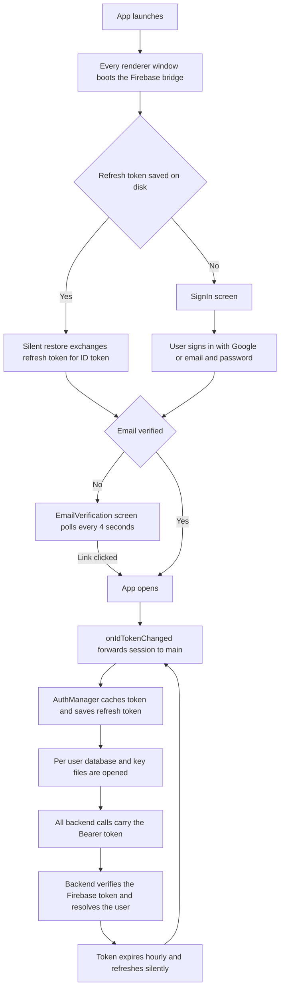
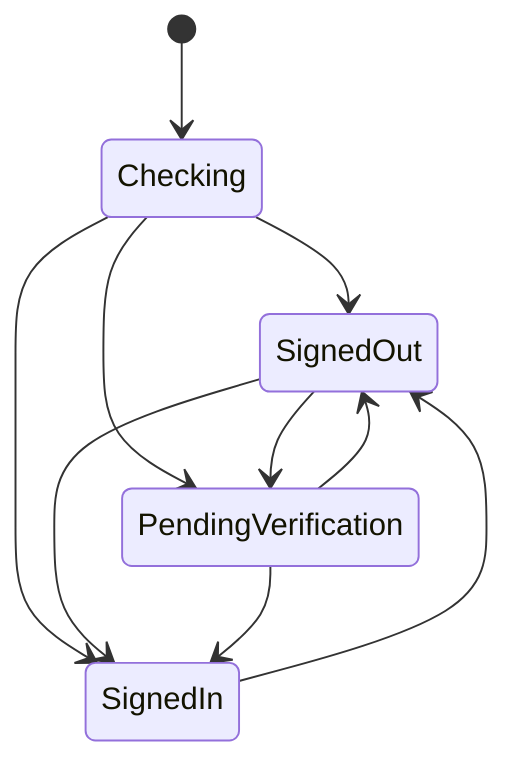
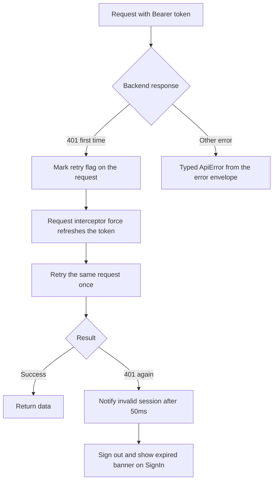
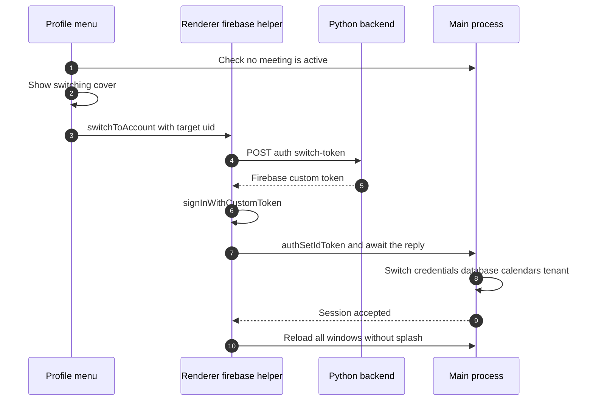

# Authentication Flow — Developer Documentation

Everything about **signing in, staying signed in, tokens, account switching, and signing out** in GoDojo: the sign-in UI, the Firebase session, how every backend call is authenticated, how multiple accounts are isolated on one machine, and every cleanup path.

Written for a developer who is new to this codebase. Every technical term is explained the first time it appears.

---

## 1. What This Feature Does

GoDojo is an Electron + React desktop app with a Python (FastAPI) backend. Before the app can do anything useful it must answer one question: **who is the user?** The authentication layer answers it end to end:

1. **Sign-in** — a single screen handles sign-in, sign-up (with a mandatory full name), Google login, and password reset.
2. **Email verification gate** — accounts created with email + password must click a verification link before the app opens.
3. **Staying signed in** — a short-lived Firebase *ID token* proves who you are on every API call; a long-lived *refresh token* is stored encrypted on disk so the app can restore your session on the next launch without asking you to sign in again.
4. **Token refresh** — the ID token expires every hour, so it is silently refreshed in the background, with retry logic so a dropped Wi-Fi connection never logs you out by accident.
5. **Authenticated API calls** — every request to the Python backend (and to Supabase, the hosted Postgres database) carries the Firebase token as a `Bearer` header. The backend verifies it and resolves the user.
6. **Multi-account** — several accounts can be signed in on the same machine over time. Each account gets its own local SQLite database file, its own encrypted API-key file, and its own calendar tokens. One click switches between accounts.
7. **Sign-out and deletion** — sign out clears the live session; stronger paths remove one account's local data, or (dev-only) delete the whole server-side account.

Key vocabulary:

- **Firebase Auth** — Google's identity service. The app does not store passwords; Firebase does. The app only ever holds *tokens* issued by Firebase.
- **ID token** — a short-lived (1 hour) signed JSON Web Token (JWT) that proves "I am user X" to any server that can verify it. Sent as the `Authorization: Bearer <token>` header.
- **Refresh token** — a long-lived secret that can be exchanged for new ID tokens. This is the only auth secret stored on disk, and it is encrypted.
- **Renderer** — the React side (`src/` folder) of Electron. There are several renderer windows (Launcher, Overlay, Settings, Model Selector); each loads its own copy of the app bundle.
- **Main process** — the Node.js side (`electron/` folder). It owns the local database, API keys, and a cached copy of the current ID token.
- **IPC channel** — how a renderer asks the main process to do something (example: `auth:set-id-token`).
- **RLS** — Row Level Security, Supabase's way of letting each user read/write only their own rows, keyed off the Firebase token.
- **uid** — Firebase's unique, permanent user id. All per-account files and rows are keyed by it.

## 2. Simple Mental Model

Think of the auth layer as a **handshake between three parties**:

```
Firebase (Google)  ←→  Renderer (React, owns the SDK)  →  Main process (Electron, caches token)
                                    ↓ Bearer header
                     Python backend (verifies token)  →  Supabase (RLS-scoped data)
```

- The **renderer** owns the Firebase SDK: it shows the sign-in UI, produces tokens, and refreshes them hourly.
- Every time a fresh token appears, the renderer **pushes it to the main process** (IPC `auth:set-id-token`). The main process caches it, saves the refresh token encrypted to disk, and points the local database at that user's file.
- Every HTTPS call out of the app — renderer to Python backend, or main process to Supabase — **reads the current token** and attaches it.
- The **backend never trusts anything but the token**: it verifies the JWT signature and derives the user from it on every request.

Two clocks keep the session alive: Firebase refreshes the ID token roughly every hour (about 5 minutes before expiry), and the renderer forwards each refresh to main.

## 3. Big-Picture Diagram



One important discovery: **the sign-in screen is not a separate window.** The Launcher window itself swaps its content between `SignIn`, `EmailVerification`, and the app, based on auth state in `App.tsx`. The only extra window in the auth flow is the small Google consent popup.

---

## 4. Stage 1 — The Sign-In UI

Files:

- `src\pages\SignIn.tsx` — the sign-in / sign-up / reset screen (rendering only).
- `src\hooks\useSignIn.ts` — all state and Firebase calls for that screen.
- `src\features\auth\AuthChrome.tsx` — shared visuals: background gradient, logo, page shell.
- `src\features\auth\AuthFormField.tsx` — the icon-prefixed input + `PasswordField` with show/hide toggle.
- `src\features\auth\GoogleIcon.tsx` — the multicolor "G" SVG on the Google button.
- `src\features\auth\AuthToastHost.tsx` + `src\lib\authToastBus.ts` — the toast system for auth feedback.
- `src\lib\firebase.ts` — the actual Firebase calls (`signInWithGoogle`, `signInWithEmail`, `signUpWithEmailExtended`, `resetPassword`, `getAuthErrorMessage`).

### 4.1 One card, three modes

`SignIn.tsx` renders a single card whose content depends on `mode` (`"sign-in" | "sign-up" | "reset"`, state in `useSignIn`). There are no separate routes. `posthogAnalytics.trackPageView('registration')` fires once on mount regardless of mode. A `bannerMessage` prop renders an amber, dismissible banner at the top of the card — this is where the **"your session expired"** message appears after a forced sign-out (see Stage 2). `AuthPageShell` adds minimize/close `WindowControls` on Windows/Linux (macOS uses native traffic lights), because the normal app header does not exist yet on auth screens.

Fields per mode (`fieldsForMode` in `useSignIn.ts`):

| Mode | Fields above the password box |
| --- | --- |
| sign-in | email |
| sign-up | Full name (required), email (required), Phone number (optional) |
| reset | email |

The password field (with visibility toggle) is hidden in reset mode. "Forgot password?" (sign-in mode only) fires PostHog `forgot_password_clicked` and switches to reset mode.

### 4.2 Google login

`handleGoogle` in `useSignIn.ts` calls `signInWithGoogle()` in `firebase.ts`:

1. `signInWithPopup` with a `GoogleAuthProvider`, `prompt: 'select_account'` (always show the account picker so users can switch), and `profile` + `email` scopes.
2. **Electron must allow the popup.** `WindowHelper.ts` installs a `setWindowOpenHandler` on the launcher window that only allows strict-URL-parsed `https:` pages on `accounts.google.com`, `www.google.com/accounts/...`, `*.firebaseapp.com/__/auth...`, and `accounts.google.com/o/oauth2...`. The popup is 500 x 650, centered on whichever display the launcher is currently on, and runs in its own Chromium partition `persist:google-auth` (its own cookies, so the Google session survives restarts separately from the app's session). Anything else opens in the system browser or is denied.
3. **The close-notification backstop.** `signInWithPopup`'s own "user closed the popup" detection polls the child window and can hang forever for Electron-created popups. So `WindowHelper` listens for `did-create-window`, and when that Google popup truly closes, it sends the `google-signin-popup-closed` IPC event to the renderer. `signInWithGoogle` races the SDK promise against this signal, so cancelling always resolves promptly as `auth/popup-closed-by-user` (treated as a non-error: "user cancelled" messages are never surfaced as toasts).
4. On success, `getAdditionalUserInfo(result).isNewUser` decides the analytics event: `user_registered` (method `google`) + toast "Account created — welcome to GoDojo!", or `user_signed_in` (method `google`) + toast "Signed in successfully."

### 4.3 Email + password, and the mandatory full name

`handleSubmit` in `useSignIn.ts`:

- **sign-up**: refuses with "Please enter your full name." if `displayName` is empty (this is the mandatory username), then calls `signUpWithEmailExtended({ email, password, displayName, phoneNumber })` in `firebase.ts`:
  1. `createUserWithEmailAndPassword` creates the Firebase account.
  2. `updateProfile(user, { displayName })` sets the name, then `user.getIdToken(true)` **force-refreshes the token** so the new display name flows through the token bridge immediately (otherwise the first forwarded token still carries a null name).
  3. The phone number is stashed best-effort in `localStorage` under `godojo_signup_phone_<uid>` (Firebase email/password auth has no phone field).
  4. Fires `user_registered` (method `email`) and a toast: "Account created — check your inbox to verify your email." The hook does **not** navigate anywhere — Firebase's `onAuthStateChanged` fires with `emailVerified = false`, and `App.tsx`'s gate (Stage 2) shows the verification screen.
- **sign-in**: `signInWithEmail` → `user_signed_in` (method `email`) + toast. Same no-navigation rule; the auth-state listener flips the gate.
- **reset**: `resetPassword` → `sendPasswordResetEmail`. Success shows "Password reset email sent." and returns to sign-in mode. Firebase error codes for bad/expired reset links (`auth/expired-action-code`, `auth/invalid-action-code`) are mapped by `getAuthErrorMessage`.

### 4.4 Error handling and toasts

`getAuthErrorMessage(err)` in `firebase.ts` maps about twenty Firebase error codes to plain language ("Incorrect email or password. Please try again.", "Too many failed attempts. Please wait a few minutes and try again.", "This account has been disabled. Please contact support.", and so on); unknown codes get the raw message with the `Firebase: Error (auth/...)` wrapper stripped. Errors are shown via `authToast.error(...)` — a tiny pub/sub bus (`src\lib\authToastBus.ts`) that `AuthToastHost` (mounted once at the App root in `App.tsx`) listens on. Toasts appear bottom-right and auto-dismiss after 3.2 seconds. The Google/email buttons show spinners via `busy` / `googleBusy` state and are disabled while busy.

### 4.5 The email verification gate

Files: `src\pages\EmailVerification.tsx` (rendering) and `src\hooks\useEmailVerification.ts` (logic).

Shown when the user exists but `emailVerified` is false (email/password sign-ups only — Google accounts arrive verified). Behavior:

- **Sends the verification email once on mount** (`sendVerificationEmail` → Firebase `sendEmailVerification`), and arms a 60-second resend cooldown.
- **Polls Firebase every 4 seconds** with `reloadAndCheckVerified` (Firebase `reload(user)` then read `user.emailVerified`). Network errors during polling are swallowed — polling continues.
- When verified: shows a green "Email verified!" state, waits 1.2 seconds so the user sees it, then calls `onVerified`. This calls `completeEmailVerification(user)` in `useFirebaseAuth`, which **manually** clears the pending gate and sets `authUser` — necessary because `reload()` does not re-fire `onAuthStateChanged`.
- **Resend button** with live cooldown ("Resend in Ns"), success/error messages inline and as toasts.
- **"Use a different account"** signs the user out and returns to `SignIn`.

## 5. Stage 2 — Firebase Auth State and the App Gate

Files:

- `src\lib\firebase.ts` — SDK init, the ID-token bridge, silent restore, token retry, session guard.
- `src\hooks\useFirebaseAuth.ts` — the React state that decides what `App.tsx` renders.
- `src\App.tsx` — the gate itself.
- `src\main.tsx` — boots the bridge in every window.

### 5.1 App init and the ID-token bridge

`getFirebaseAuth()` in `firebase.ts` lazily initializes Firebase with the public web config from `VITE_FIREBASE_*` build-time env vars (this config is not a secret, per Firebase docs) and installs the bridge exactly once per window:

`installIdTokenBridge` subscribes to Firebase's **`onIdTokenChanged`** — it fires at sign-in, at sign-out (with `null`), and on every hourly token refresh. On each fire with a user it builds the session payload:

```ts
{ idToken, refreshToken, uid, email, displayName, photoURL, expiresAt }
```

(`expiresAt` comes from `getIdTokenResult().expirationTime`) and forwards it to the main process via `window.electronAPI.authSetIdToken(session)` (IPC channel `auth:set-id-token`). On `null` (signed out) it calls `authClear()` (channel `auth:clear`).

`src\main.tsx` runs `bootFirebaseAuthBridge()` in **every window** that loads the bundle (launcher, overlay, settings, model selector). All bridges forward the same token; the main process de-duplicates them (Stage 3).

### 5.2 Silent restore — why you rarely see the sign-in screen

On every window load, `main.tsx` calls `trySilentRestore()` (`firebase.ts`):

1. Asks main for the persisted refresh token (IPC `auth:get-persisted-refresh-token` → `AuthManager.getPersistedIdentity()` → `CredentialsManager.getFirebaseIdentity()`).
2. If one exists, POSTs it to Firebase's public token endpoint `https://securetoken.googleapis.com/v1/token?key=<apiKey>` with `grant_type=refresh_token`, receiving `{ id_token, refresh_token, user_id, expires_in }`.
3. **Decodes the fresh ID token's own claims** (`decodeIdTokenClaims` — a plain base64 decode of the JWT payload, no signature check needed since Google just minted it) to read `email` / `name` / `picture`. This is deliberate: the SDK's local `auth.currentUser` cache may not be hydrated yet at this moment, and that race is what used to produce **NULL email/displayName** when a uid was first mirrored into a database that did not have the user yet (see the users-upsert guard in Stage 3). The decoded claims are the primary source; `currentUser` only fills gaps.
4. Pushes the session to main via `authSetIdToken` with `expiresAt = now + expires_in seconds`, and returns true.

Any failure returns false and the window simply shows the `SignIn` screen. There is no offline sign-in: without network access to Firebase the session cannot be restored (though once signed in, network blips do not sign you out — see 5.4).

### 5.3 The gate in `App.tsx`

`useFirebaseAuth(isLauncherWindow, isDefault, isOverlayWindow)` owns four pieces of state: `authUser`, `authChecked`, `pendingVerificationUser`, and `sessionExpiredMessage`. **Only the launcher/default window** runs the `subscribeAuthState` (Firebase `onAuthStateChanged`) subscription; other windows set `authChecked = true` immediately and skip the gate (their UI never shows sign-in). The listener's decisions:

| Firebase user | Result |
| --- | --- |
| `null` (signed out / revoked) | `authUser = null`, `authChecked = true`, PostHog `resetIdentity()`, and **`queryClient.clear()`** — the React Query cache is a module-scope singleton that outlives the signed-out user; without this clear, "Add another account" (which does NOT reload the window) would serve the previous account's cached meetings/tenants to the next account. |
| signed in, `emailVerified = false` | `pendingVerificationUser = user`, `authUser = null` → `EmailVerification` screen. The app never opens unverified. |
| signed in, verified | `authUser = user`, PostHog `identifyUser(uid, { email, name })`. |

`App.tsx` then renders (launcher/default only): `!authChecked` → blank (or a "Switching account…" loader when the page load is an account-switch reload — see `src\lib\splash.ts`); `pendingVerificationUser` → `EmailVerification`; `!authUser` → `SignIn` (with `sessionExpiredMessage` as the banner); else the app, playing the full-screen startup splash on first sign-in. The splash **re-arms whenever the user becomes signed out**, so every subsequent sign-in plays it again.

A best-effort **backend readiness probe** runs once per sign-in: `apiFetch("/auth/me")`. It confirms the Python backend is reachable and accepts the forwarded token. Failures are logged, never fatal.

### 5.4 Staying signed in: token refresh, retries, and the auto-logout fix

`getIdTokenWithRetry(user)` in `firebase.ts` force-refreshes the ID token (`user.getIdToken(true)`) with an **exponential backoff retry only for network-class errors** (`auth/network-request-failed`, `auth/internal-error`, `auth/timeout`): up to 3 attempts, delays 2 s → 4 s → 8 s (capped). Fatal errors (`auth/user-disabled`, revoked, deleted) throw immediately. This retry is the core of the "no random auto-logout" fix: a laptop waking from sleep with no Wi-Fi yet no longer kills the session.

Three consumers build on it:

- `verifySessionIsActive()` — returns true if the forced refresh succeeds. If the failure is still `auth/network-request-failed` after all retries it returns **true anyway** ("bad hotel Wi-Fi must not block a meeting start"). Any other failure returns false. Used as the hard gate before every meeting start (`useMeetingSession.handleStartMeetingRaw` — a deleted/disabled/revoked account cannot start a recording; on false it silently signs the user out).
- `guardSession()` — same check, but on a fatal failure it **signs the user out locally** and returns `{ valid: false, message }` with a friendly message. Called before LLM-backed IPC work: company intel (`useCompanyIntel`), follow-up email (`useFollowUpEmail`), meeting-details chat (`useMeetingDetails`), the floating in-call chat panel (`FloatingChatPanel`).
- `installSessionGuard(onInvalidSession)` — a global guard installed by `useFirebaseAuth` in the **launcher, default, and overlay windows**. It hooks `onIdTokenChanged`: every token cycle it attempts the retrying force-refresh. Network-class failures are ignored ("Wi-Fi dropped during a background refresh" is not a logout). A fatal refresh failure — account disabled, deleted, or session revoked server-side — calls `onInvalidSession(errorCode)`. Because Firebase refreshes roughly hourly (about 5 minutes early), a disabled account is caught at the next refresh cycle at the latest, or immediately if the token already expired.

`handleInvalidSession` (in `useFirebaseAuth`) turns any of these into the same UX: map the code through `getAuthErrorMessage`, store it in `sessionExpiredMessage` (the amber banner on `SignIn`), and call Firebase `signOut()`. The token bridge then forwards `null` to main and everything tears down (Stage 3).

A second, HTTP-side trigger feeds the same handler: `setInvalidSessionHandler(...)` registers it with `apiClient` (Stage 4), so a **terminal 401** from the backend drives the identical session-expired flow. One nuance verified in the code: the apiClient path passes the code `'auth/session-expired'`, which is *not* one of the cases in `getAuthErrorMessage`'s switch — it falls through to the generic default text ("Something went wrong. Please try again."). The sign-out and banner still happen; only the wording is generic.

Finally, `useFirebaseAuth` subscribes to the main process's `auth:state-changed` broadcast: if main says `signedIn: false` (e.g. main-side cleanup cleared the session), the renderer mirrors it with a Firebase `signOut()`. This keeps all windows consistent when sign-out is initiated elsewhere.

### 5.5 Lifecycle state diagram



`Checking` = `authChecked` false (blank screen). `SignedIn` → `SignedOut` happens via: user sign-out, fatal token-refresh failure (session guard), terminal backend 401, meeting-start session check, invite-email mismatch, or main-initiated clear. `PendingVerification` → `SignedIn` only via the 4-second poll finding `emailVerified = true`.

## 6. Stage 3 — The Main-Process Session (Electron side)

Files:

- `electron\services\AuthManager.ts` — singleton holding the current session.
- `electron\services\CredentialsManager.ts` — encrypted storage (identity + per-user API keys).
- `electron\db\DatabaseManager.ts` — per-user SQLite files, `switchUser`.
- `electron\db\SupabaseClient.ts` — Supabase client wired to the token.
- `electron\db\SupabaseMirrorService.ts` — offline outbox + the users-row upsert.
- `electron\ipcHandlers.ts` — all auth IPC handlers + the user-switched reset.
- `electron\main.ts` — startup wiring.

### 6.1 IPC channels (renderer ⇄ main)

| Channel | Direction | Purpose |
| --- | --- | --- |
| `auth:set-id-token` | renderer → main | Forward the live session (`AuthManager.setSession`). Returns `{ success, error? }`. |
| `auth:clear` | renderer → main | Sign-out (`AuthManager.clearSession`). |
| `auth:get-state` | renderer → main | Read `AuthManager.snapshot()`. |
| `auth:get-persisted-refresh-token` | renderer → main | Get last-active account's refresh token for silent restore. |
| `auth:list-accounts` | renderer → main | All local accounts for the switcher (no tokens leave main). |
| `auth:get-refresh-token-for-uid` | renderer → main | Refresh token of one account (exposed; no renderer caller today). |
| `auth:remove-account` | renderer → main | Remove one account from the local identity store (exposed; renderer uses the wipe flow instead). |
| `auth:state-changed` (event) | main → all windows | Broadcast on `signed-in` / `signed-out` / `auth-changed`. |
| `google-signin-popup-closed` (event) | main → launcher | The Google popup was really closed (cancel backstop). |

### 6.2 `AuthManager.setSession` — fingerprint, switching, persistence

`setSession(session)` is called on every forwarded token (sign-in, hourly refresh, restore). Steps:

1. **Fingerprint de-duplication.** The fingerprint is all mutable session fields — `uid`, `idToken`, `refreshToken`, `email`, `displayName`, `photoURL` — joined with a NUL character (a separator that cannot appear inside a field). Every open window forwards the *same* hourly refresh, and `auth-changed` is an expensive event (it re-fetches backend fallback API keys over HTTPS, re-syncs LLM/STT clients, re-upserts the Supabase users row, drains the mirror outbox, and broadcasts to every window). An identical fingerprint is treated as "the same session described twice" and ignored; a genuine rotation or profile edit has a different fingerprint and flows through. `expiresAt` is deliberately excluded (it is derived from the token).
2. **Uid change → re-scope everything.** If the uid changed (including first sign-in), it calls `CredentialsManager.switchUser(uid)` and `DatabaseManager.switchUser(uid)` **before** anything else reacts, then emits `user-switched` (see 6.5).
3. **Persist for next launch.** `CredentialsManager.setFirebaseIdentity({ refreshToken, uid, email, displayName, photoURL })` writes to the machine-level identity store. The **ID token is never persisted** — it expires in an hour and is re-minted from the refresh token at every launch.
4. Emits `auth-changed` (and `signed-in` on first sign-in), which `ipcHandlers.ts` broadcasts to all windows as `auth:state-changed`.

Other accessors: `getIdToken()` (synchronous, for the Supabase `accessToken` callback — if the cached token is briefly stale, Supabase rejects and the next request picks up the fresh one), `getUid()`, `getRefreshToken()`, `isSignedIn()`, `snapshot()` (the `{ signedIn, uid, email, displayName, photoURL }` shape sent to renderers), `getPersistedIdentity()`, `listAccounts()`, `getRefreshTokenForUid(uid)`.

`clearSession()` (sign-out): remembers the previous uid, nulls the session, calls `switchUser(null)` on Credentials + Database managers (back to the anonymous files), emits `user-switched`, `auth-changed`, `signed-out`.

### 6.3 Where secrets live (`CredentialsManager`)

Two separate encrypted stores under the OS `userData` folder (e.g. `C:\Users\<you>\AppData\Roaming\godojo-ai`):

| File | Scope | Contents |
| --- | --- | --- |
| `identity.enc` | machine-level (all accounts) | A map of every local account: `uid → { firebaseRefreshToken, email, displayName, photoURL, updatedAt }` plus `lastUid` (the active account). This is what silent restore and the account switcher read. Never holds API keys. |
| `credentials-<uid>.enc` | per account (`credentials-anon.enc` when signed out) | That account's API keys (Gemini, Groq, OpenAI, Claude, Deepgram, Tavily, STT keys, ...), model prefs, Supabase URL/anon key, audio settings. |

Encryption uses Electron **`safeStorage`** (OS keychain / DPAPI). If `safeStorage` is unavailable, both stores fall back to a plaintext `.json` file next to the encrypted one (logged as a warning). Writes are atomic (write `.tmp`, rename).

Two safety systems prevent the historical "my keys reset themselves" bug:

- **Load states are honest.** A file that exists but cannot be decrypted (a macOS case: the Keychain item is bound to the app's code signature, which changes on unsigned builds) is marked `failed`, never treated as "empty". A background save then refuses to overwrite the real file with the empty in-memory map, and instead moves the unreadable file aside as `credentials-<uid>.enc.unreadable-<ts>` so it stays recoverable.
- **Scrubbed memory is not authoritative.** On app quit, `scrubMemory()` overwrites keys in memory and sets `memoryTrusted = false`; if the quit is vetoed and something saves later, the empty map cannot erase the stored keys.

`switchUser(uid)` deliberately does **not** save before switching — flushing on switch is exactly how one account's keys got written over another's. It clears in-memory credentials and the (per-user, token-fetched) backend fallback keys, re-points at the target file, and loads it. Keys typed while signed out stay in `credentials-anon.enc` (counted by telemetry as orphaned, never migrated).

**Backend fallback keys**: on sign-in (and every `auth-changed`), `main.ts` calls `CredentialsManager.fetchFallbackKeys(idToken)` → `GET /api/v1/api-keys/` with the Bearer token; the returned AES-256-GCM-encrypted keys are decrypted in memory with the `API_ENCRYPTION_KEY` env secret and used when the user has no key of their own for a provider (resolution order: user key → backend fallback → bundled `.env` key). On sign-out the fallback keys are cleared.

### 6.4 Per-user databases and Supabase

- `DatabaseManager.resolveDbPath(uid)` → `godojo-<uid>.db` (uid sanitized to `[A-Za-z0-9_-]`; `godojo-anon.db` when signed out). A separate physical SQLite file per account is what guarantees User A and User B on the same machine never see each other's meetings/transcripts. `switchUser(uid)` WAL-checkpoints and closes the old handle, resets per-connection caches, opens the target file, and re-runs migrations. At cold start the anon DB is opened first; `switchUser` re-points it the moment auth resolves.
- `SupabaseClientManager` builds the supabase-js client with `accessToken: async () => AuthManager.getIdToken()` — supabase-js calls this before every request, so Supabase verifies the Firebase JWT and applies RLS as that uid. supabase-js's own session persistence is disabled (Firebase owns the session). The service-role key is deliberately never shipped; the anon key + RLS is the security boundary.
- `SupabaseMirrorService` (local SQLite → Supabase outbox) reacts to auth: on `signed-in` it runs `_verifyThenUpsertCurrentUserRow()` — it first **re-verifies the refresh token against Firebase's token endpoint** (a silently-restored session from a stale refresh token can fire `signed-in` even though the account was since disabled/deleted; better to skip than create a users row for a dead session) — and on `auth-changed` it re-upserts and drains the queue (this also catches a `displayName` set *after* the first token during sign-up). The users-row upsert itself refuses to write when `email` is null (`_upsertCurrentUserRow` guard) — combined with the claim-decoding in `trySilentRestore`, this is the pair of fixes that stopped NULL email/displayName on cross-database user upserts. `rebind(db)` re-points the outbox at the new user's SQLite file on account switch, dropping the in-memory queue (rows persist in the old account's outbox table and replay when that account is active again — never pushed under the wrong token).

### 6.5 The `user-switched` reset (what actually happens on switch/sign-out)

`ipcHandlers.ts` listens to AuthManager's `user-switched` (fires on sign-in to a different uid, account switch, and sign-out) and synchronously resets every per-user main-process singleton, **before** `auth-changed` lets anything act on the new identity:

1. **Tenant cache** — `currentTenantId = null`, `tenantContext.set(null)`, broadcast `tenant:state-changed: null` (otherwise the reloaded UI starts on the previous account's tenant).
2. **Supabase mirror** — `SupabaseMirrorService.rebind(DatabaseManager.getDb())` (its old handle was just closed by `switchUser`).
3. **RAG / knowledge** — `appState.rebindUserScopedServices()` (the vector store and its worker hold their own connections to the old file).
4. **LLM / STT clients** — `syncLlmKeysFromCredentials('user_switched')` + `syncSttCredentials` (they cache keys at construction; without this the new user's requests are billed to the old user's key).
5. **Calendars** — `CalendarManager.switchUser(uid)` and `ZoomCalendarManager.switchUser(uid)`: clear all reminder timers, drop in-memory tokens/events, load the new user's `calendar_tokens-<uid>.enc`, and emit `connection-changed` + `events-updated` so the UI re-fetches. This is the calendar reset on account switching — without it the first account's calendar stuck around for every user.

## 7. Stage 4 — Authenticating API Calls

Files:

- `src\lib\apiClient.ts` — the shared HTTP client (axios) for the Python backend.
- `src\lib\queryClient.ts` — React Query caches + the 401 → session-expired bridge.
- `godojo-apis\app\api\deps.py` — `get_current_user`, bearer parsing, token verification.
- `godojo-apis\app\core\security.py` — Firebase Admin SDK init + `verify_id_token`.
- `godojo-apis\app\api\tenant_deps.py` — `X-Tenant-Id` resolution.
- `godojo-apis\app\core\exceptions.py` — the error envelope (`{"error":{code,message}}`).

### 7.1 Attaching the token (renderer)

`apiClient.ts` creates one axios instance: base `VITE_API_BASE_URL` (default `http://127.0.0.1:8000`) + `/api/v1`, 60-second timeout. A **request interceptor** runs before every request:

1. Reads `getFirebaseAuth().currentUser` directly — the renderer owns the Firebase user, so no IPC round-trip. No user → immediate typed `ApiError(401, "unauthorized")`.
2. `user.getIdToken(forceRefresh)` — the SDK returns its cached token, or refreshes if expired; force-refresh only on the retry pass (below).
3. Sets `Authorization: Bearer <token>`.
4. Sets **`X-Tenant-Id`** from the main-process cache (`getCurrentTenantId` IPC, best-effort — a missing tenant header just means the backend falls back to owner-only access).

`getAuthHeaders()` exposes the same two headers for raw `fetch` callers that need streaming responses (the chat SSE endpoints).

### 7.2 What happens on a 401

The **response interceptor** implements a single-retry policy:



The terminal-401 path calls `notifyInvalidSession('auth/session-expired')` (after a 50 ms delay so the promise rejection propagates cleanly) — the bridge function that `useFirebaseAuth` registered via `setInvalidSessionHandler`. So an HTTP auth failure produces the exact same UX as the Firebase session guard. Independently, `queryClient.ts` installs `QueryCache`/`MutationCache` `onError` handlers that route any 401 `ApiError` through the same bridge — covering React Query calls that never see the raw axios error.

Non-401 failures become a typed `ApiError(status, code, message, details)` parsed from the backend envelope; requests with no HTTP status at all are distinguished as `499 request_aborted` (caller cancelled), `504 client_timeout` (the 60 s ceiling fired), or `503 service_unavailable` (nothing listening) using the elapsed time as the tiebreaker.

### 7.3 Backend verification (Python)

Every protected route depends on `get_current_user` (`deps.py`):

1. `_bearer_token` parses the `Authorization: Bearer ...` header; missing/malformed → `UnauthorizedError` (HTTP 401).
2. `verify_id_token(token)` (`security.py`) initializes the Firebase Admin SDK once (service-account file from settings, or Application Default Credentials) and calls `firebase_auth.verify_id_token(token, clock_skew_seconds=10)`. Note `check_revoked=False` — verification stays offline (no per-request Firebase call), so a *revoked or disabled* account is not detected here per-request; it surfaces as the specific 401 messages below only when Firebase itself rejects the token, and reliably via the client-side session guard cycle.
3. Specific failures map to distinct 401 messages the client can show: `ExpiredIdTokenError` → "Authentication token has expired", `RevokedIdTokenError` → "has been revoked", `UserDisabledError` → "account is disabled", `InvalidIdTokenError`/`ValueError` → "Invalid authentication token".
4. The uid is taken from the token's `sub` claim (falling back to `uid`); a `CurrentUser(uid, email, email_verified, claims)` object is handed to the route. `get_user_db` additionally builds a Supabase client scoped to that same raw token, so RLS applies.

### 7.4 Auth endpoints (`godojo-apis\app\api\v1\auth.py`)

| Endpoint | Purpose |
| --- | --- |
| `GET /api/v1/auth/me` | Probe: returns `{ uid, email, email_verified }` from the verified token. Used by `useFirebaseAuth`'s readiness probe and as the cheapest "is the token accepted" check. |
| `POST /api/v1/auth/switch-token` | Account switching (Stage 5): verifies the caller's own token, checks the target uid exists via the Admin SDK, then mints a `custom_token` for the target account. |
| `DELETE /api/v1/auth/me` | Token-authenticated self-delete: Supabase rows (via the dynamic `delete_user_data_cascade` RPC) then the Firebase Auth user. |
| `POST /api/v1/auth/dangerous/delete-user` | Dev/internal tool: token-free deletion gated by a `DANGEROUS_KEY` proof (must be unset in production). See Stage 6. |

### 7.5 The tenant header, resolved from the authenticated user

The renderer resolves the tenant once per sign-in: `useTenant` (launcher/default window only) calls `tenantsApi.listMine()` after `authUser` appears, then publishes the id to main via `tenant:set-current` — main caches it and broadcasts `tenant:state-changed` to every window (the overlay window has its own renderer and could never see it otherwise). `apiClient` stamps that cached value as `X-Tenant-Id`. On sign-out (`authUser → null` after having seen a uid), `useTenant` actively clears the cached tenant so the next account's first meeting is not stamped with the previous tenant.

Server-side, `get_tenant_context` (`tenant_deps.py`) **never trusts the header alone**: it looks up `tenant_members` in the DB and rejects non-members with 403. If the header is missing, it falls back to the caller's single active membership. Role guards (`RequireTenant`, `RequireTenantAdmin`) build on it.

## 8. Stage 5 — Multi-Account and Session Storage

Files:

- `src\features\tenant\UserProfileButton.tsx` — the avatar menu with the account switcher.
- `src\lib\firebase.ts` (`switchToAccount`) + `src\lib\splash.ts`.
- `electron\ipcHandlers.ts` (`reload-all-windows`, `user-switched` wiring).
- `electron\services\AuthManager.ts` + `CredentialsManager.ts` (identity store, `listFirebaseAccounts`, `getRefreshTokenForUid`).

### 8.1 The account switcher UI

`UserProfileButton` (header avatar) lists accounts from `auth:list-accounts` — `CredentialsManager.listFirebaseAccounts()` returns every account in `identity.enc` sorted by last-used, with `isActive`, and **no tokens** ever leave the main process. The menu offers: **Switch account** (other accounts), **Add another account** (signs out to the SignIn screen — the next sign-in lands in the same renderer without a reload, which is why the query-cache and tenant clears in Stage 2 matter), and **Sign out**.

### 8.2 The switch handshake, step by step

`handleSwitch(uid)` in `UserProfileButton`:

1. **Refuse while a meeting is live** (`get-meeting-active` IPC) — `DatabaseManager.switchUser()` closes the SQLite handle mid-write otherwise. Error: "Finish the current meeting before switching accounts."
2. Paint a full-screen "Switching account…" cover **before** awaiting anything — `signInWithCustomToken` flips Firebase's current user, which re-renders the whole tree with the new identity while tenant/meetings/cache still hold the old account's data; the cover hides that half-switched frame.
3. `switchToAccount(uid)` in `firebase.ts`:
   - `POST /auth/switch-token` with `{ uid }` (authenticated by the *current* user's token) → backend mints a Firebase **custom token** for the target account.
   - `signInWithCustomToken(auth, customToken)` flips the renderer's Firebase user.
   - Then it does **not** rely on the fire-and-forget token bridge: it fetches the new `getIdTokenResult` and calls `authSetIdToken` itself, **awaiting the reply**. Because `AuthManager.setSession` (including `CredentialsManager.switchUser` + `DatabaseManager.switchUser`, both synchronous better-sqlite3 work) completes before the IPC returns, this is a real handshake — a reload can never race it and restore the previous account.
4. On success: `markSkipSplashOnNextLoad()` (a sessionStorage marker, 15 s max age — see `splash.ts`) so the reload shows the plain loader, not the full startup splash; then `reloadAllWindows` (IPC `reload-all-windows` reloads **every** window — surviving overlay/settings renderers each run their own Firebase listener and could push a stale token back into `AuthManager`; falls back to single-window `hard-refresh` on older preloads). On failure the cover is replaced by an explicit "Could not switch account" error (previously indistinguishable from success).



During the switch, the full `user-switched` reset from section 6.5 runs inside `setSession` — including the calendar re-scope.

### 8.3 How the windows share the session

- Every window loads `src\main.tsx`, so every window runs `bootFirebaseAuthBridge` → its own `onIdTokenChanged` → forwards tokens (de-duplicated in `AuthManager` by fingerprint).
- Only the launcher/default window runs the sign-in gate (`subscribeAuthState`); the overlay additionally runs the session guard; the model-selector window runs neither — they just forward tokens and receive broadcasts.
- `auth:state-changed` and `tenant:state-changed` broadcasts keep every window's view of "who is signed in / which tenant" in sync; `reload-all-windows` is the sledgehammer used after account switches.

## 9. Stage 6 — Sign-Out and Cleanup

### 9.1 Ordinary sign-out

The **renderer** owns sign-out (there is no separate sign-out IPC): `UserProfileButton` → `onSignOut` → `useFirebaseAuth.signOut` → Firebase `signOut()` (`fbSignOut`). The consequences cascade automatically:

1. Firebase fires `onAuthStateChanged(null)` → the gate clears `authUser` → `posthogAnalytics.resetIdentity()` → `queryClient.clear()` → `SignIn` renders (splash re-armed for the next sign-in).
2. The token bridge's `onIdTokenChanged(null)` → IPC `auth:clear` → `AuthManager.clearSession()`: session nulled, `CredentialsManager.switchUser(null)` + `DatabaseManager.switchUser(null)` (back to the anon files), `user-switched` reset (tenant cleared, mirror rebound, calendars re-scoped to anon), then `signed-out` → `auth:state-changed` broadcast → every other window's `onAuthStateChanged` listener mirrors the Firebase sign-out.
3. Main clears the backend fallback keys (`auth-changed` with `signedIn: false`).

Note what sign-out does **not** do: the account stays in `identity.enc` (it still appears in the switcher), and its local databases, credentials, and calendar tokens are kept. One quirk verified in the code: `clearSession()` never touches `identity.enc`, so `lastUid` still points at the signed-out account. On the **next app launch**, `trySilentRestore` still finds that refresh token and pushes a session to the **main process** (per-user DB/credentials are re-scoped to that account) — but the renderer's Firebase SDK was signed out, so `onAuthStateChanged` fires `null` and the window still shows the `SignIn` screen. Main-side state and the renderer gate simply re-align the moment the user signs in (as the same or a different account).

### 9.2 Forced sign-outs (error paths)

- Session guard fatal refresh (disabled/deleted/revoked) → banner + sign-out.
- Terminal backend 401 (both retries failed) → same.
- `guardSession` before LLM work → same.
- Meeting-start `verifySessionIsActive` false → silent sign-out, meeting blocked.
- Team-invite email mismatch (Stage 10) → banner + sign-out.
- Main-initiated `auth:state-changed { signedIn: false }` → renderer mirrors sign-out.

### 9.3 Chat session deletion (global chat)

The global chat sidebar's delete (`useGlobalChat.deleteSession` → `chatApi.deleteSession` → `DELETE /api/v1/chat/sessions/{id}`, backend `delete_chat_session` scoped to `user.uid`) is an ordinary authenticated API call: the same Bearer token applies, removal is optimistic in the sidebar, and a failure rolls the entry back into the list. It deletes a *chat* session, not the auth session.

### 9.4 Local data wipe and account deletion (dev-only "Delete My Account")

`src\features\settings\GeneralTab.tsx` (visible only in dev builds) offers four scopes behind a native confirm dialog (IPC `confirm-delete-account`, wording per scope):

- **supabase-delete / firebase-delete / full-delete** — call `POST /auth/dangerous/delete-user` directly (token-free by design), authorized by an **encrypted proof-of-possession** of `VITE_DANGEROUS_KEY` built in `src\lib\dangerousKey.ts` (AES-256-GCM over a freshness timestamp; the raw secret never travels; the backend must have `DANGEROUS_KEY` set and the timestamp is checked against a 60 s window). The backend's route must never be reachable in production (the key defaults to unset there).
- **local / the local half of full-delete** — IPC `dev:wipe-local-account-data` → `wipeCurrentUserLocalDataAndRelaunch` in `ipcHandlers.ts`, strictly scoped to the signed-in uid: destroy the RAG worker's sqlite handle (Windows file-lock), `deleteCurrentUserDatabaseFiles()` (deletes `godojo-<uid>.db` + `-wal` + `-shm`), `deleteCurrentUserCredentialsFile()` (`credentials-<uid>.enc` + plaintext fallback), `removeFirebaseAccount(uid)` (drops only this account from `identity.enc`), `clearSession()`, then `app.relaunch()` + `app.exit(0)`. The shared Chromium partitions (including `persist:google-auth`) are deliberately *not* cleared here — they are shared by all accounts on the device.
- A full-userData wipe helper (`wipeLocalUserDataAndRelaunch`) also exists in `ipcHandlers.ts` — it deletes the entire userData directory (all accounts) after clearing both Chromium partitions — but no IPC handler currently invokes it; its comment references a "Reset app data" action that does not exist as a channel. See section 13.

### 9.5 Window closing and quit

The sign-in UI lives inside the launcher window, so there is no separate "close sign-in window" IPC; the only close-related auth channel is `google-signin-popup-closed` (Stage 1). On app quit, `CredentialsManager.scrubMemory()` overwrites key material in memory; the `memoryTrusted` write guard ensures a vetoed quit can never persist that emptiness over the stored files.

## 10. Stage 7 — Everything Auth-Adjacent

- **Open-at-login + auto-start.** In production builds the app registers itself as a login item **once** (default ON; `openAtLoginDefaultApplied` marker in `SettingsManager`, plus a backfill for upgraded installs whose OS getter misreported). The toggle (Settings → General) uses `set-open-at-login` / `get-open-at-login`; the getter trusts the persisted record because `app.getLoginItemSettings()` misreports in packaged builds. Interaction with auth: an auto-started app runs the same silent-restore path, so the user lands signed-in without any prompt.
- **Deep-link team invitations.** `godojo://invite?token=...` (and the future `https://app.godojo.ai/invite?token=...`) is registered via `setAsDefaultProtocolClient`. macOS delivers it through `open-url`; Windows/Linux through `second-instance` argv (warm) or process argv (cold start, stashed as `pendingInviteToken` and flushed on `did-finish-load`). Main relays it to the renderer as `invite-deep-link`; `useTeamInvite` (with `authUser` present) calls `tenantsApi.previewInvitation(token)` — if the invited email does not match the signed-in account, it shows the `InviteAccountMismatchBanner` and **forces a sign-out** (the prompt must never be shown to the wrong person); on match it opens Settings → Roles & Permissions with the token. With nobody signed in, the token waits for a sign-in.
- **PostHog identity events.** On verified sign-in: `identifyUser(uid, { email, name })` — uid is the PostHog `distinct_id`, matching `AuthManager.getUid()` in main so renderer and main events merge into one person. On tenant resolution: `identifyTenant` (PostHog groups). On sign-out: `resetIdentity()` so the next user in the same window does not inherit the identity. Funnel events: `user_registered` / `user_signed_in` (method google or email), `forgot_password_clicked`, page view `registration`. Main-process side, `CredentialsManager` emits key-source telemetry (`api_key_resolved`, `api_keys_snapshot`, `credentials_scope_switched`) with scope user/anon.
- **Expired token mid-call.** The ID token lives one hour; Firebase refreshes ~5 minutes early and the bridge forwards it. If a request still hits 401 mid-flight, `apiClient` retries once with a force-refreshed token; a terminal failure triggers the session-expired path (banner + sign-out) — but a live recording is not torn down by the token layer; the hard gate is at meeting *start* (`verifySessionIsActive`).
- **Revoked / disabled / deleted accounts.** Caught by: the renderer session guard (next token cycle), `guardSession`/`verifySessionIsActive` (before LLM work / meeting start), the backend's 401 messages, and — before writing a Supabase users row — `_verifyThenUpsertCurrentUserRow`'s refresh-token check.
- **Offline.** Network-class failures never sign anybody out (optimistic `true` in `verifySessionIsActive`/`guardSession`; ignored in `installSessionGuard`; retried with backoff in `getIdTokenWithRetry`). A launch with no network cannot silently restore (the token exchange fails → SignIn screen), and queued Supabase writes simply wait in the local outbox until the next `signed-in`/`auth-changed` drains them.
- **Password reset.** Exists (reset mode → `sendPasswordResetEmail`); the reset *link* itself is handled by Firebase's hosted page in the browser, not by the app — the app has no action-code handler, so after resetting the user signs in normally.

## 11. Timers, Intervals, and Storage Summary

| Timer / interval | Where | Value |
| --- | --- | --- |
| ID-token refresh | Firebase SDK (`onIdTokenChanged`) | ~hourly, ~5 min before expiry |
| Token refresh retry backoff | `getIdTokenWithRetry` (`src\lib\firebase.ts`) | 2 s, 4 s, 8 s (cap), max 3 attempts |
| Email-verification poll | `useEmailVerification` | every 4 s |
| Verification resend cooldown | `useEmailVerification` | 60 s |
| Verified → app transition | `useEmailVerification` | 1.2 s delay |
| Auth toast auto-dismiss | `AuthToastHost` | 3.2 s |
| Backend request timeout | `apiClient` | 60 s |
| Terminal-401 handler delay | `apiClient` | 50 ms |
| Skip-splash marker max age | `splash.ts` | 15 s |
| Backend readiness probe | `useFirebaseAuth` | once per sign-in (`GET /auth/me`) |
| Mirror outbox retry | `SupabaseMirrorService` | 4 attempts, 1.5 s base backoff |

| Secret / data | Where | How protected |
| --- | --- | --- |
| Firebase refresh tokens (all accounts) + profiles + lastUid | `identity.enc` in userData | `safeStorage` encrypted (plaintext fallback `.json` if unavailable) |
| Per-account API keys and settings | `credentials-<uid>.enc` in userData | `safeStorage` encrypted; write guards protect unreadable files; memory scrubbed at quit |
| Per-account meetings/transcripts | `godojo-<uid>.db` SQLite | filesystem only (per-account isolation, not encrypted) |
| Google sign-in browser session | Chromium partition `persist:google-auth` | OS-level Chromium profile |
| Firebase ID token | memory only (`AuthManager` + renderer SDKs) | never written to disk (1 h expiry) |
| Firebase web config | `VITE_FIREBASE_*` build env | public by design |
| Fallback-key decryption key / dangerous-delete key | `API_ENCRYPTION_KEY` (main env) / `DANGEROUS_KEY` (backend env) | must be absent in production for the dangerous route |

## 12. File Inventory

Total relevant files: 44

### Renderer — pages, hooks, lib (26)

| File | Responsibility | Important functions / components |
| --- | --- | --- |
| `src\main.tsx` | Boots the Firebase bridge in every window | `bootFirebaseAuthBridge` |
| `src\App.tsx` | Auth gate: SignIn vs EmailVerification vs app | gate on `authChecked` / `pendingVerificationUser` / `authUser`; mounts `AuthToastHost` |
| `src\pages\SignIn.tsx` | Sign-in / sign-up / reset screen | `SignIn` |
| `src\pages\EmailVerification.tsx` | Verification gate screen | `EmailVerification` |
| `src\hooks\useSignIn.ts` | Sign-in state + all auth form calls | `useSignIn`, `handleGoogle`, `handleSubmit`, `fieldsForMode` |
| `src\hooks\useEmailVerification.ts` | Verification poll / resend / sign-out | `useEmailVerification`, `handleResend` |
| `src\hooks\useFirebaseAuth.ts` | Auth gate state + global session guard | `useFirebaseAuth`, `handleInvalidSession`, `completeEmailVerification`, `signOut` |
| `src\hooks\useTenant.ts` | Tenant resolution + broadcast + admin check | `useTenant`, `useAutoOpenDashboardForAdmins` |
| `src\hooks\useTeamInvite.ts` | Invite deep link + account-mismatch sign-out | `useTeamInvite` |
| `src\hooks\useMeetingSession.ts` | Session gate before meeting start | `handleStartMeetingRaw` (`verifySessionIsActive`) |
| `src\hooks\useGlobalChat.ts` | Global chat incl. session delete | `deleteSession` |
| `src\features\auth\AuthChrome.tsx` | Auth screen shell, background, logo, window controls | `AuthPageShell`, `AuthBackground`, `AuthLogo` |
| `src\features\auth\AuthFormField.tsx` | Form inputs | `AuthFormField`, `PasswordField` |
| `src\features\auth\AuthToastHost.tsx` | Auth toast renderer | `AuthToastHost` |
| `src\features\auth\GoogleIcon.tsx` | Google "G" mark | `GoogleIcon` |
| `src\features\tenant\UserProfileButton.tsx` | Avatar menu, account switcher | `handleSwitch` |
| `src\features\settings\GeneralTab.tsx` | Dev-only Delete My Account | `handleDeleteScope`, `callDangerousDelete` |
| `src\lib\firebase.ts` | SDK init, token bridge, restore, guards | `getFirebaseAuth`, `installIdTokenBridge`, `trySilentRestore`, `decodeIdTokenClaims`, `getIdTokenWithRetry`, `verifySessionIsActive`, `guardSession`, `installSessionGuard`, `signInWithGoogle`, `signUpWithEmailExtended`, `switchToAccount`, `getAuthErrorMessage`, `signOut` |
| `src\lib\apiClient.ts` | HTTP client, Bearer + tenant headers, 401 retry | `apiFetch`, `getAuthHeaders`, `setInvalidSessionHandler`, `notifyInvalidSession` |
| `src\lib\queryClient.ts` | React Query caches + 401 bridge | `queryClient`, `handleApiError` |
| `src\lib\authToastBus.ts` | Auth toast pub/sub | `authToast`, `subscribeAuthToast` |
| `src\lib\splash.ts` | Skip-splash marker for account-switch reload | `markSkipSplashOnNextLoad`, `skipSplashThisLoad` |
| `src\lib\dangerousKey.ts` | DANGEROUS_KEY proof-of-possession | `encryptDangerousKey` |
| `src\lib\analytics\posthog.service.ts` | Identity events | `identifyUser`, `identifyTenant`, `resetIdentity`, `trackUserRegistered`, `trackUserSignedIn` |
| `src\api\chatApi.ts` | Chat REST incl. delete session | `deleteSession` |
| `src\electron.d.ts` | Renderer-side IPC typing | `authSetIdToken`, `authListAccounts`, `onAuthStateChanged`, ... |

### Electron main process (12)

| File | Responsibility | Important functions |
| --- | --- | --- |
| `electron\services\AuthManager.ts` | Session cache, fingerprint, events | `setSession`, `clearSession`, `fingerprint`, `snapshot`, `getIdToken`, `getPersistedIdentity`, `listAccounts` |
| `electron\services\CredentialsManager.ts` | Encrypted identity + per-user keys | `init`, `switchUser`, `setFirebaseIdentity`, `getFirebaseIdentity`, `listFirebaseAccounts`, `getRefreshTokenForUid`, `removeFirebaseAccount`, `fetchFallbackKeys`, `scrubMemory`, `deleteCurrentUserCredentialsFile`, write guards |
| `electron\db\DatabaseManager.ts` | Per-user SQLite | `resolveDbPath`, `switchUser`, `deleteCurrentUserDatabaseFiles`, `close` |
| `electron\db\SupabaseClient.ts` | Token-wired Supabase client | `configure` (`accessToken` callback), `init`, `isConfigured` |
| `electron\db\SupabaseMirrorService.ts` | Outbox + users-row upsert | `init`, `_verifyThenUpsertCurrentUserRow`, `_upsertCurrentUserRow`, `rebind` |
| `electron\ipcHandlers.ts` | Auth IPC + user-switched reset + wipes | handlers for `auth:*`; `user-switched` listener; `reload-all-windows`; `wipeCurrentUserLocalDataAndRelaunch`; `wipeLocalUserDataAndRelaunch` (unwired) |
| `electron\preload.ts` | IPC bridge | `authSetIdToken`, `authClear`, `onAuthStateChanged`, `onGoogleSignInPopupClosed`, `reloadAllWindows`, `wipeLocalAccountData` |
| `electron\main.ts` | Startup wiring, deep links, fallback keys | `handleInviteDeepLink`, `extractInviteToken`, startup sequence, fallback-key fetch on `signed-in`/`auth-changed` |
| `electron\WindowHelper.ts` | Google popup allowlist + close backstop | `setWindowOpenHandler` block, `did-create-window` → `google-signin-popup-closed` |
| `electron\services\CalendarManager.ts` | Calendar re-scope on switch | `switchUser` |
| `electron\services\ZoomCalendarManager.ts` | Zoom calendar re-scope | `switchUser` |
| `electron\services\SettingsManager.ts` | openAtLogin persistence | `openAtLogin`, `openAtLoginDefaultApplied` keys |

### Python backend (6)

| File | Responsibility | Important functions |
| --- | --- | --- |
| `godojo-apis\app\api\deps.py` | Auth gate for every protected route | `get_current_user`, `_bearer_token`, `get_user_db` |
| `godojo-apis\app\core\security.py` | Firebase Admin init + verify | `verify_id_token`, `_ensure_firebase_app` |
| `godojo-apis\app\api\v1\auth.py` | Auth routes | `get_me`, `switch_token`, `delete_me`, `dangerous_delete_user`, `_delete_supabase_data`, `_delete_firebase_user` |
| `godojo-apis\app\api\tenant_deps.py` | Tenant header validation | `get_tenant_context`, role guards |
| `godojo-apis\app\core\exceptions.py` | Error envelope | `UnauthorizedError` → 401 |
| `godojo-apis\app\api\v1\chat.py` | Chat session delete (authenticated) | `delete_chat_session` |

## 13. Identified Gaps / Serious Issues

One security-relevant design gap, plus two dormant-code observations:

1. **`POST /auth/switch-token` lets any authenticated user mint a sign-in token for ANY account.**
   - What: `switch_token` in `godojo-apis\app\api\v1\auth.py` verifies only that the *caller* holds a valid Firebase session and that the *target uid exists*. It never checks that the target account belongs to the caller (e.g. is present in the caller's device identity store, or shares a tenant). It then returns a Firebase custom token for that target uid, which `switchToAccount` consumes to become that user.
   - Why it matters: anyone with any valid GoDojo account can, knowing (or brute-forcing/guessing) another user's uid, request a custom token and fully impersonate that user — their meetings, transcripts, and tenant data. uids are not meant to be public but do appear in tenant membership data, dashboards, and mirrored rows.
   - Evidence: the route's own docstring documents the model as "caller must already hold a valid Firebase session; the target uid must be a real Firebase user" — no ownership check exists in the function body. Notably, the main process *does* have a possession-proof alternative (`auth:get-refresh-token-for-uid` reads the device's own `identity.enc`), but the live switch flow uses the backend route instead.
   - Impact: cross-account impersonation if the backend is reachable and any uid leaks. The route should verify the caller also controls the target (e.g. accept a proof derived from the target's refresh token, or restrict to uids in the caller's device identity store).
2. **Dormant: the full-userData wipe is unreachable.** `wipeLocalUserDataAndRelaunch` in `electron\ipcHandlers.ts` (delete the entire userData directory for all accounts) is defined but no IPC handler invokes it; its comment points at a "Reset app data" action that does not exist as a channel. Harmless today, but misleading when reading the code.
3. **Dormant: `auth:get-refresh-token-for-uid` and `auth:remove-account` have no renderer callers.** Both are exposed via `preload.ts` and typed in `src\electron.d.ts`; the switcher uses the backend custom-token route and the wipe flow calls `CredentialsManager` directly from main. Harmless dead surface area.

No other serious gaps were identified. The defensive work is notably thorough: token-refresh retry with network-only backoff, optimistic network-failure handling, fingerprint de-duplication, per-user DB/credentials/calendar isolation, query-cache and tenant clears on sign-out, an awaited switch handshake, write guards that refuse to overwrite unreadable credential files, and a users-upsert guard plus token-claim decoding that fixed the NULL email/displayName problem.

## 14. Common Questions

**Q: Why am I still signed in after restarting the app?**
At window load, `trySilentRestore` exchanges the refresh token stored (encrypted) in `identity.enc` for a fresh ID token and pushes it to main. No sign-in screen needed.

**Q: Where is the password stored?**
Nowhere in this codebase. Firebase Auth holds it. The app only ever sees tokens.

**Q: What happens when the ID token expires after an hour?**
Firebase's SDK refreshes it about 5 minutes early, `onIdTokenChanged` fires, and the renderer forwards the new token to the main process. If a request still slips through with a stale token, the backend returns 401 and `apiClient` force-refreshes and retries once.

**Q: Why did I get signed out with an amber banner?**
Either Firebase rejected a forced token refresh (account disabled/deleted/session revoked — the session guard), or a backend request returned 401 twice (terminal 401 bridge). Both route through the same `handleInvalidSession` → banner on `SignIn`.

**Q: Does bad Wi-Fi log me out?**
No. Network-class errors are retried with backoff (2/4/8 s) and then treated optimistically. Only Firebase *fatal* rejections trigger sign-out.

**Q: How do two accounts on one machine not see each other's data?**
Three per-uid namespaces: `godojo-<uid>.db` (meetings), `credentials-<uid>.enc` (API keys), and `calendar_tokens-<uid>.enc` (calendars) — all re-pointed synchronously by the `user-switched` reset. The machine-level `identity.enc` only holds login tokens/profiles.

**Q: What happens to the query cache when I switch accounts?**
The switch reloads every window (fresh cache). The "Add another account" path does not reload, which is why `useFirebaseAuth` explicitly calls `queryClient.clear()` on sign-out.

**Q: Can I switch accounts during a call?**
No — the switcher checks `get-meeting-active` first and refuses ("Finish the current meeting..."), because switching closes the SQLite handle the live meeting is writing to.

**Q: What does the backend actually verify?**
Every protected route runs `get_current_user`: parse the `Bearer` header, verify the JWT with the Firebase Admin SDK (10 s clock skew, revocation not checked per-request), and derive the uid from the `sub` claim. Supabase access is separately scoped by the same token (RLS).

**Q: Is the Google sign-in popup a security hole?**
The popup opener allowlists only Google/Firebase auth origins via strict URL parsing; everything else opens in the system browser or is denied. The popup lives in its own `persist:google-auth` partition and is cleared only by the (currently unwired) full wipe.

**Q: Does signing out delete anything?**
No. It clears the live session and re-points to the anonymous files, but the account stays in the switcher, and its DB/keys/calendar tokens remain on disk. Deletion paths are the dev-only Delete My Account scopes.

**Q: Why does the sign-in screen appear when the backend is down?**
It should not — the auth gate depends on Firebase, not the backend. The `/auth/me` probe after sign-in is best-effort and never blocks. If you see SignIn with the backend down, it is Firebase/network reachability (silent restore needs `securetoken.googleapis.com`).

## 15. Quick Reference

- Feature entry points: `SignIn` screen (gate in `src\App.tsx`), `bootFirebaseAuthBridge` in `src\main.tsx` (every window), `useFirebaseAuth` (state), `AuthManager.setSession` (main process).
- Primary flow: Firebase SDK in renderer → `onIdTokenChanged` → IPC `auth:set-id-token` → `AuthManager.setSession` (fingerprint → user-switched → identity persisted) → per-user DB/credentials opened → Bearer token on every call (`apiClient` renderer / `SupabaseClient` main) → backend `get_current_user` verifies → 401 → one forced-refresh retry → terminal 401 → session-expired banner + sign-out.
- Account switch: `UserProfileButton.handleSwitch` → `POST /auth/switch-token` → `signInWithCustomToken` → awaited `authSetIdToken` handshake → `user-switched` reset (tenant, mirror, RAG, keys, calendars) → `reload-all-windows` (no splash).
- Relevant files: 44 (26 renderer, 12 Electron main, 6 backend).
- Primary IPC channels: `auth:set-id-token`, `auth:clear`, `auth:get-state`, `auth:get-persisted-refresh-token`, `auth:list-accounts`, `auth:get-refresh-token-for-uid` (dormant), `auth:remove-account` (dormant), events `auth:state-changed`, `google-signin-popup-closed`, `invite-deep-link`; plus `tenant:set-current` / `tenant:get-current` / `tenant:state-changed`, `reload-all-windows`, `get-meeting-active`, `confirm-delete-account`, `dev:wipe-local-account-data`.
- Backend endpoints: `GET /auth/me`, `POST /auth/switch-token`, `DELETE /auth/me`, `POST /auth/dangerous/delete-user`, `GET /api-keys/`, `DELETE /chat/sessions/{id}`.
- Most important functions: `installIdTokenBridge`, `trySilentRestore`, `decodeIdTokenClaims`, `getIdTokenWithRetry`, `verifySessionIsActive`, `guardSession`, `installSessionGuard`, `useFirebaseAuth`, `AuthManager.setSession` / `clearSession` / `fingerprint`, `CredentialsManager.switchUser` / `setFirebaseIdentity` / `listFirebaseAccounts`, `DatabaseManager.switchUser`, `SupabaseMirrorService._verifyThenUpsertCurrentUserRow`, `apiClient` interceptors, `queryClient`, `switchToAccount`, `UserProfileButton.handleSwitch`, `get_current_user`, `verify_id_token`, `switch_token`.
- Current serious issues: one — `/auth/switch-token` performs no ownership check on the target account (impersonation risk); plus two dormant-code observations (unwired full wipe, two unused auth IPC channels).
