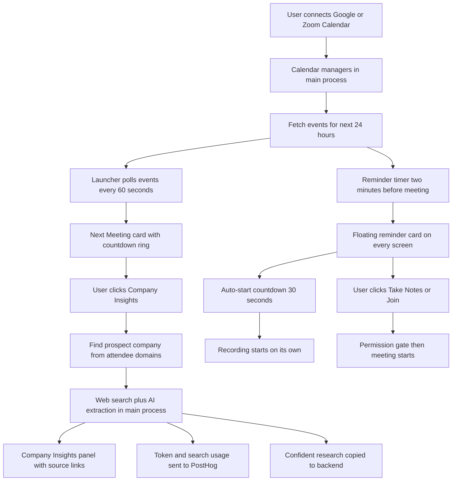
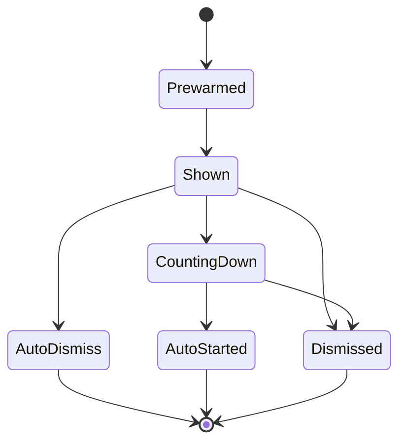
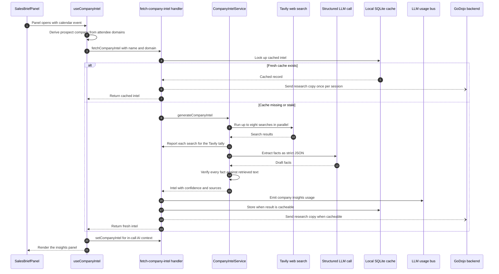
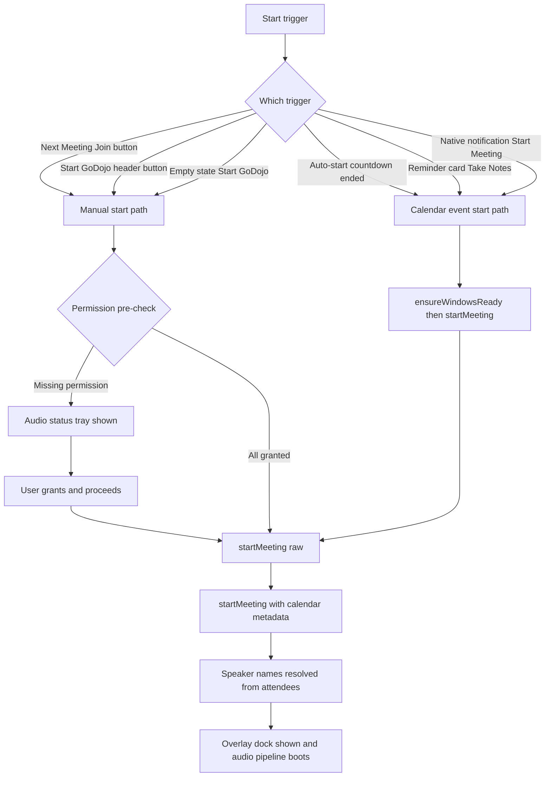

# Pre-Call Flow — Developer Documentation

Everything that happens in GoDojo **BEFORE a call starts**: calendar detection, the Next Meeting card, company intel, the Company Insights panel, and the pre-join / auto-join path.

Written for a developer who is new to this codebase. Every technical term is explained the first time it appears.

---

## 1. What This Feature Does

GoDojo is an Electron + React desktop app for sales people. Before every call, the app quietly does four things:

1. **Reads your calendar** (Google Calendar and/or Zoom Calendar) to know which meetings are coming up in the next 24 hours.
2. **Shows you the next meeting** on the home screen (called the *Launcher*), with a live countdown and participant list.
3. **Researches the other person's company** — it looks at the email domains of the people invited, figures out which company is the "prospect" (the company you are selling to), and fetches public facts about it (funding, products, news, competitors).
4. **Gets ready to record** — 2 minutes before a meeting it shows a floating reminder card, and (by default) it can start recording by itself after a 30-second countdown.

Key vocabulary:

- **Main process** — the Node.js side of Electron (`electron/` folder). It talks to Google, Zoom, the local database, and the AI providers.
- **Renderer** — the React side (`src/` folder). It draws the UI. There are several renderer windows: the Launcher (home screen), the Overlay (in-call dock), and the Meeting Popup (the small reminder card).
- **IPC channel** — how the renderer asks the main process to do something. Example: the renderer calls `get-upcoming-events`, the main process answers with a list of meetings.
- **Launcher** — the main home screen of the app (`src/features/common/Launcher.tsx`).
- **Company intel** — a structured record of facts about the prospect company (industry, revenue, news, and so on).
- **Ghost mode** — hides the app from screen sharing and recording. On by default in production builds.

## 2. Simple Mental Model

Think of the pre-call phase as a small assembly line:

```
Calendar (Google / Zoom)
   → list of upcoming events (next 24h, at least 5 min long)
   → Next Meeting card (countdown, attendees, Join button)
   → Company detection (attendee email domains → prospect company)
   → Company Insights panel (web search + AI extraction, cached 7 days)
   → Reminder card (2 min before start) → optional auto-record (30 s countdown)
   → Meeting starts (permission check → recording begins)
```

Two independent "clocks" drive everything:

- The **renderer** polls for calendar events every 60 seconds (so the Next Meeting card stays fresh).
- The **main process** sets timers per event: a pre-warm 30 seconds before the reminder, the reminder 2 minutes before the meeting start, and (if armed) the auto-start 30 seconds after the card appears.

## 3. Big-Picture Diagram



Important discovery about the Python backend: **the pre-call phase does not need the Python backend to work.** Calendar reading, company research, and the brief are all produced locally inside Electron, using Tavily (a web-search API) and the user's own AI keys. There is one **fire-and-forget write**: once a confident, cacheable company-intel result exists, the app sends a copy to the backend (`PUT /api/v1/companies/intel`) so global chat can use the research later. That call never blocks or fails the brief. Details in section 5.6.

Every fresh research run also reports how many AI tokens and Tavily searches it spent (PostHog event `llm_generation_usage`, plus a dev-only chip in the panel). Details in section 5.7.

---

## 4. Stage 1 — Calendar Integration and Meeting Detection

### 4.1 Connecting a calendar (one-time setup)

Files:

- `src\hooks\useCalendarConnections.ts` — renderer state for the Connect button.
- `electron\services\CalendarManager.ts` — Google Calendar (singleton class).
- `electron\services\ZoomCalendarManager.ts` — Zoom Calendar (singleton class).
- `electron\ipcHandlers.ts` — IPC handlers `calendar-connect`, `zoom-calendar-connect`, and friends.
- `electron\main.ts` — function `notifyCalendarConnectionResult` shows a native toast.

Steps:

1. On the Launcher, the right-hand **CalendarConnectCard** contains a **ConnectCalendarButton**. Clicking it opens a small picker with Google and Zoom.
2. `handleConnect(provider)` in `useCalendarConnections` calls IPC channel `calendar-connect` (Google) or `zoom-calendar-connect` (Zoom). It also fires PostHog event `calendar_connect_clicked`.
3. The main process runs `CalendarManager.getInstance().startAuthFlow()` (or the Zoom twin). This is a classic OAuth loopback flow:
   - A tiny local HTTP server starts. Google listens on port **11111**, Zoom on **11113**.
   - A small Electron window (520 x 680, always-on-top, centered on the app's current display) opens the provider's consent page.
   - When the user approves, the provider redirects to `http://localhost:11111/auth/callback` (Google) or `http://localhost:11113/auth/callback` (Zoom) with a one-time code.
   - The code is exchanged for an access token and a refresh token. Zoom uses HTTP Basic auth for the exchange; Google posts the client secret directly.
4. Tokens are encrypted with Electron `safeStorage` and written to a **per-user file** in the OS user-data folder: `calendar_tokens-<uid>.enc` for Google and `zoom_calendar_tokens-<uid>.enc` for Zoom. Per-user files matter: a shared file used to leak one account's calendar into another account's app session.
5. On success the manager emits `connection-changed`, saves tokens, and immediately fetches events. Zoom additionally calls `fetchCurrentUserEmail()` (`GET https://api.zoom.us/v2/users/me`) once so it can mark which attendee is "you".
6. Success or failure is surfaced with a native toast via `appState.notifyCalendarConnectionResult(...)`. Failures get a friendly message from `calendarAuthErrorMessage(...)` in `ipcHandlers.ts`, which maps `AUTH_TIMEOUT`, `access_denied`, `EADDRINUSE` (a second connect attempt while one is running), and network errors to plain-English text.

Edge cases:

- Closing the auth window before finishing rejects immediately with `AUTH_CANCELLED` instead of waiting for the 3-minute `AUTH_TIMEOUT`.
- On app restart, `loadTokens()` decrypts the file, marks the calendar connected, and refreshes the access token if it has expired. If a refresh fails (for example the grant was revoked), the manager calls `disconnect()` and clears everything.
- When the signed-in app account changes (AuthManager `user-switched` event, handled in `ipcHandlers.ts`), both managers run `switchUser(uid)`: they drop tokens and reminder timers, then load the new user's token file and emit `connection-changed` + `events-updated`. `switchUser` does **not** fetch events itself.
- Note: no main-process code currently subscribes to the managers' `connection-changed` or `events-updated` events. The renderer learns about changes only through its own calls (the 60-second poll, connect/disconnect handlers, Refresh).

Disconnect IPC channels: `calendar-disconnect` and `zoom-calendar-disconnect`.

### 4.2 How events are fetched and how often

Both managers expose `getUpcomingEvents(force)`:

- **Google** (`CalendarManager.fetchEventsInternal`): `GET https://www.googleapis.com/calendar/v3/calendars/primary/events` with `timeMin` = now, `timeMax` = now + 24 hours, `singleEvents`, `orderBy=startTime`. Scope is read-only (`calendar.readonly`).
- **Zoom** (`ZoomCalendarManager.fetchEventsInternal`): `GET https://api.zoom.us/v2/users/me/meetings?type=upcoming&page_size=50`. Only *scheduled* meetings (type 2) come back. For the earliest **8** meetings (`MAX_MEETINGS_TO_ENRICH`), it also calls `GET /v2/meetings/{id}/invitees` to get the invited emails; results are cached per meeting for 5 minutes (`REGISTRANT_CACHE_TTL`). 404 means "no invitees", 401/403 means missing OAuth scope — both are cached as an empty list so the API is not hammered. The host email is always added to the attendee list.

Common filtering (both providers):

- Only events starting within the next 24 hours. (Google's `timeMin` and Zoom's own filter both keep a meeting that is already in progress but has not ended yet.)
- Only events at least **5 minutes** long.
- All-day events are dropped (Google all-day events have a `date` instead of `dateTime`).

Refresh cadence — there are exactly three triggers:

1. **Renderer poll, every 60 seconds.** `useLauncher` sets `setInterval(fetchEvents, 60000)`. `fetchEvents()` invokes IPC `get-upcoming-events`, which runs **both** managers in parallel with `Promise.all`, merges the two arrays, and sorts by start time.
2. **Manual refresh.** The Refresh button calls `handleRefresh()` → IPC `calendar-refresh` → `CalendarManager.refreshState()`: clears all reminder timers, forces a re-fetch, and emits `events-updated`. The Launcher then calls `fetchEvents()` again (which is what actually refreshes Zoom too). There is a matching `zoom-calendar-refresh` handler, whose `refreshState()` also clears the Zoom invitee cache, but the Launcher's Refresh button does not call it. A toast shows for 3 seconds and the spinner stops 500 ms after the refresh finishes, so the click always gives visible feedback.
3. **After connect** — `handleTokenResponse` fires an immediate fetch. (`refreshAccessToken` also goes through `handleTokenResponse`, so a token refresh triggers one extra fetch as a side effect.) After an **account switch**, nothing fetches in main; the Launcher's next poll picks up the new user's events.

Notably, there is **no background polling timer in the main process** and **no event cache**: every `get-upcoming-events` call hits the Google and Zoom APIs again (only Zoom invitee lists are cached, for 5 minutes). `CalendarManager` declares an `updateInterval` field, but it is never used. If the Launcher window is closed, the calendar is only refreshed when a renderer asks; already-armed reminder timers still fire.

Access-token refresh is proactive: `getUpcomingEvents` refreshes the token whenever it is within 60 seconds of expiry, before calling the API.

### 4.3 The calendar event data shape

Both managers return the same `CalendarEvent` shape (defined in `CalendarManager.ts`, mirrored in `src/types/index.tsx`):

```ts
{
  id: string;              // provider event id
  title: string;           // falls back to "(No Title)"
  startTime: string;       // ISO
  endTime: string;         // ISO (Zoom computes it from duration)
  link?: string;           // meeting URL — see below
  source: 'google' | 'zoom';
  attendees?: Array<{ email, name?, displayName?, organizer?, self? }>;
  organizer?: string;      // organizer email (Zoom: host email)
  description?: string;
  location?: string;       // Google only
}
```

Attendee names are resolved aggressively in `extractNameFromEmail`: `raj.rao99@acme.com` becomes "Raj Rao" (split camelCase, strip digits, capitalize). If the attendee list is empty, the organizer's or creator's email is used as the single attendee.

Meeting-link resolution (`resolveMeetingLink`): Google Meet's `hangoutLink` wins; otherwise the description is scanned for zoom.us, teams.microsoft.com, meet.google.com, or webex.com URLs. Generic URLs are deliberately ignored so random docs links are not mistaken for meeting links.

Where the event ends up later: when a meeting is started from a calendar event, the full event object travels through `startMeeting(metadata)` and is persisted by `electron/MeetingPersistence.ts` into the meetings table as `calendar_event_id` plus `calendar_event_metadata` (an array wrapping the full event). During the call, the overlay window can read it back with the `get-meeting-metadata` IPC channel. There is also a `get-calendar-attendees` IPC channel that re-fetches attendees for one Google event id.

### 4.4 Reminders and the floating popup card

Files:

- `electron\MeetingPopupWindowHelper.ts` — the popup window manager.
- `src\meeting-popup\MeetingPopup.tsx` — the popup's tiny React app (own bundle: `meeting-popup.html`).
- `electron\main.ts` — function `wireCalendarReminders` wires both managers identically.

Timer chain per event (both managers run `scheduleReminders` after every fetch):

| When | What happens |
| --- | --- |
| 30 s before the reminder (so, 2 min 30 s before start) | `reminder-prewarm` event → `MeetingPopupWindowHelper.prewarm(event)` creates the popup windows hidden, off-screen, so the later show is instant. **Skipped on low-memory machines** (8 GB RAM or less, via `isLowMemoryMachine` in `utils/performanceClassification.ts`): pre-warming means one idle renderer per display, so on those machines `showReminder` creates the windows on demand and the first show is slightly slower. |
| 2 min before start | `reminder-due` event → `showReminder(event)` displays the card. |
| 30 s after the card shows (if auto-start armed) | `auto-start-due` → recording starts automatically. |
| Up to 90 s after the card shows (if auto-start NOT armed) | Card dismisses itself (`armAutoDismiss`: the smaller of `AUTO_DISMISS_MS` = 90 s and "meeting start + 30 s", but never less than 10 s). |

The card:

- One small always-on-top window **per connected display** (380 px wide), placed top-right, shown with `showInactive()` so it never steals focus, plus a system beep so you notice it even on another monitor. On macOS it is an NSPanel that joins every Space, so it shows over full-screen Zoom calls.
- Loading the tiny dedicated bundle keeps it cheap; the window is **destroyed** on dismissal, so nothing stays resident between meetings.
- Duplicate suppression (`recentlyShown` map): the same meeting from both Google and Zoom calendars fires only one card. Keys are `source:id` and `title|startTime`, kept for 10 minutes.
- If the popup cannot be shown on any display, `main.ts` falls back to a **native OS notification** with "Start Meeting" / "Dismiss" buttons, so a reminder is never silently lost.
- Ghost mode (content protection) applies to the popup too, including a brief opacity shield on Windows so no frame leaks into a screen share.

What the card shows (`MeetingPopup.tsx`): time + "In N minutes" label (recomputed on minute boundaries, not every second), title, provider chip or location, up to 3 attendee avatar initials with stable colors derived from hashing the email, a **one-line company blurb** (see section 5 and the note below), and buttons **Join** (opens the meeting link in the browser via `meeting-popup:join`) and **Take Notes** (via `meeting-popup:take-notes` → dismiss card → `appState.startMeetingFromCalendarEvent(event)`). Escape or the X button calls `meeting-popup:dismiss`, which also **cancels** any armed auto-start timer.

Company blurb note: one animation frame after the card paints, `MeetingPopup` runs `deriveCompanyCandidates(event)` (without the user's email, so "our side" comes only from `self` attendees or the organizer), takes the candidate with the most invitees, and calls the same `fetch-company-intel` IPC as the Company Insights panel. Usually this is a cache hit. On a cache miss it runs the **full research pipeline** (Tavily searches plus the LLM call). That run reports usage (section 5.7), may sync to the backend (section 5.6), and replaces the in-call intel slot (section 5.4), exactly as if the panel had asked.

The renderer never decides when to record: main owns the authoritative auto-start timer and only pushes the deadline (`meeting-popup:auto-start`) for drawing. A renderer that mounts late picks the event and deadline up through the `meeting-popup:ready` handshake channel.

Auto-start arming rules (`armAutoStart`), all must hold:

- At least one card is actually visible on screen (the user always had a chance to cancel).
- The `autoStartMeetings` setting is ON — **default ON** (IPC: `get-auto-start-meetings` / `set-auto-start-meetings`, stored in `SettingsManager`; changes broadcast `auto-start-meetings-changed`).
- No meeting is already running.
- On macOS, microphone permission is already `granted` (an unattended start must never pop an OS dialog nobody can answer).

When the countdown ends, `fireAutoStart` re-validates everything before recording: card still exists, no meeting active, the timer fired within a 2-minute staleness tolerance (a laptop that slept can fire timers minutes late), and the meeting has not already ended. Any failure dismisses the card with a logged reason. If all pass, it emits `auto-start-due`, which `main.ts` turns into `startMeetingFromCalendarEvent(event)`.



Prewarmed = hidden window created 30 s early (this state is skipped on machines with 8 GB RAM or less; the card goes straight to Shown). CountingDown = auto-start armed. Dismissed = user cancelled/closed. AutoDismiss = ignored card cleaned up.

### 4.5 How events reach the renderer

IPC channels (all declared in `electron/preload.ts`):

| Channel | Direction | Purpose |
| --- | --- | --- |
| `get-upcoming-events` | renderer → main | Merged Google + Zoom events, sorted by start time. |
| `get-calendar-status` / `get-zoom-calendar-status` | renderer → main | Is each provider connected? |
| `get-zoom-upcoming-events` | renderer → main | Zoom-only list (the Launcher uses the merged channel above). |
| `calendar-refresh` / `zoom-calendar-refresh` | renderer → main | Force re-sync. |
| `calendar-connect` / `zoom-calendar-connect` / `calendar-disconnect` / `zoom-calendar-disconnect` | renderer → main | Connect or disconnect a provider. |
| `get-calendar-attendees` | renderer → main | Attendees of one Google event. |
| `fetch-company-intel` / `set-company-intel` | renderer → main | Company research and the in-call intel slot (section 5). |
| `company-intel-updated` | main → all windows | Broadcast after `set-company-intel`. |
| `llm-usage` | main → all windows | Token and Tavily usage of each generation (section 5.7). |
| `meeting-popup:ready` / `:event` / `:auto-start` / `:take-notes` / `:join` / `:dismiss` / `:debug-show` | popup ↔ main | Reminder card lifecycle. `debug-show` is dev-only and injects a fake event 2 minutes away. |

Inside `src/hooks/useLauncher.ts`, the relevant state is:

- `upcomingEvents` — the raw merged list (updated by `fetchEvents`).
- `isCalendarConnected` — true if Google **or** Zoom is connected (checked once on mount via both status channels).
- `nextMeeting` — `upcomingEvents.find(...)`: the first event whose start is between **5 minutes ago** and **24 hours away**.
- `focusedMeetingId` / `focusedMeeting` — the meeting shown in the detail card. Defaults to `nextMeeting`; the user can select another via the timeline strip.
- `salesBriefEvent` — the event whose Company Insights panel is open (see Stage 3).

Two quality-of-life behaviors: `handleCalendarConnected` re-fetches events immediately on connect (so the card does not wait for the next 60-second poll), and `handleCalendarDisconnected` clears `upcomingEvents` immediately (so no ghost meeting lingers). PostHog `calendar_events_fetched` is sent only when the *set* of event ids actually changes, so the 60-second poll does not spam analytics.

### 4.6 The Next Meeting UI

Files (all under `src\features\meetings\`):

- `NextMeetingDetails.tsx` — the main "next meeting" card.
- `NextMeetingChips.tsx` — provider chip (Google Meet / Zoom / Teams / generic, via `detectProviderOrOther`) and the avatar stack (up to 4 initials avatars with stable colors hashed from email, `+N` overflow, real photos if present).
- `NextMeetingCountdownRing.tsx` — SVG ring; the full circle represents a 60-minute window and drains as the meeting approaches; turns green and shows "NOW" when the start time passes.
- `useNextMeetingCountdown.ts` (`src/hooks/`) — recomputes hours/minutes/seconds every 1 second.
- `NextMeetingEmptyState.tsx` — shown when there is no upcoming meeting: animated calendar icon, "No upcoming meetings", and a Start GoDojo button (PostHog `start_godojo_clicked` with source `empty_state`).
- `MeetingTimeline.tsx` — a horizontal strip of upcoming-meeting pills, only when there is more than one event; clicking a pill sets `focusedMeetingId`.

What the card shows:

- Status badge: **Up next** (blue) → **Starting soon** (green, within 15 minutes) → **Starting now** (green, start time passed, with a pinging dot).
- Title, organizer (name derived from the organizer email), participant count (excluding `self` attendees), avatar stack.
- Date/time chip and provider chip.
- The countdown ring.
- Two buttons:
  - **Join Meeting** — fires PostHog `meeting_joined`, opens the meeting link in the system browser, and calls `onStart(meeting)` which flows to `handleStartMeeting(calendarEvent)` (the meeting event is passed through so its attendees/organizer/title tag the recording).
  - **Company Insights** — fires PostHog `company_insights_clicked`, then `onSalesBrief(meeting)` → `setSalesBriefEvent(meeting)` in `useLauncher`, which makes the Launcher render the `SalesBriefPanel` (Stage 3).

The whole hero section lives in `src/features/common/Launcher.tsx`; layout-only widgets live in `src/features/common/LauncherWidgets.tsx`.

---

## 5. Stage 2 — Company Detection and Intel (Pre-Call)

### 5.1 Finding the prospect company from the invite (pure logic)

File: `src\lib\companyCandidates.ts` (deliberately dependency-free so both the Launcher and the tiny reminder popup can share it).

`deriveCompanyCandidates(event, { userEmail })` decides who the prospect is:

1. Figure out which email domains are **"our side"**: the signed-in user's own Firebase email (authoritative), plus the domain of every attendee the calendar flagged as `self`. If neither is known, fall back to the organizer's domain (legacy behavior for old cached events). Everyone on those domains is dropped — teammates who join to coach are not the prospect.
2. Drop **generic consumer domains** (gmail.com, yahoo.com, outlook.com, hotmail.com, icloud.com, aol.com, protonmail.com, mail.com, live.com, me.com, msn.com) and Google Calendar system addresses (`*.calendar.google.com` — meeting rooms and subscribed calendars are not people).
3. Group the remaining attendees by **registrable domain** (`eu.acme.com` → `acme.com`, `mail.acme.co.uk` → `acme.co.uk`), producing candidates `{ companyName, domain, attendeeCount }`, sorted by most invitees first.

`resolveActiveCompany(...)` then picks:

- **0 candidates** → guess the company from the meeting title (`companyNameFromTitle`, matches patterns like "Demo with Acme"). Marked low confidence later.
- **1 candidate** → use it, no question asked.
- **2+ candidates** → `awaitingSelection = true`: nothing is fetched until the user picks one in a chooser. A guess must never pre-empt the user's choice.

### 5.2 The renderer fetch flow

Files:

- `src\hooks\useCompanyIntel.ts` — data layer for the panel.
- `src\features\meetings\SalesBriefPanel.tsx` — the UI (Stage 3).

Flow inside `useCompanyIntel(eventData)`:

1. Derive candidates once per event (memoized). Resolve the active company as above.
2. If awaiting selection, show the chooser and fetch nothing.
3. Otherwise run `fetchIntel()`:
   - `guardSession()` verifies the Firebase session is still live.
   - `getStoredCredentials` IPC checks whether a **Tavily API key** exists (Tavily is the paid web-search service used for research). If missing, the error becomes the special string `no_tavily_key` and PostHog `company_insights_failed` fires.
   - Calls IPC `fetch-company-intel` with `{ companyName, domain, forceRefresh }`.
   - A request sequence number makes sure a slow older response can never overwrite a newer one when the user switches companies quickly.
   - While loading, a stage label cycles every 1.8 s ("Searching company data...", "Fetching latest news...", ...).
4. On success the panel displays the intel, and a **best-effort** `setCompanyIntel` IPC call hands the intel to the main process so the in-call AI can use it as context. Low-confidence intel is passed as `null` (it must not reach the AI as fact).
5. `selectCandidate(index)` lets the user switch companies in a multi-company invite; `copyToClipboard` builds a plain-text summary of everything.

### 5.3 The main-process intel pipeline

Files:

- `electron\ipcHandlers.ts` — handler for channel `fetch-company-intel`.
- `electron\services\CompanyIntelService.ts` — the whole research pipeline (unit-tested offline in `electron\__tests__\companyIntelService.test.ts`).
- `electron\services\CredentialsManager.ts` — stores the Tavily key (`getTavilyApiKey`).
- `electron\utils\backendCompanyIntel.ts` — fire-and-forget copy of the result to the backend (`syncCompanyIntel`), unit-tested in `electron\__tests__\backendCompanyIntel.test.ts`.
- `electron\utils\llmUsageBus.ts` — usage reporting (section 5.7).

IPC handler steps:

1. Read the Tavily key from `CredentialsManager`. No key → return a helpful error.
2. **Cache lookup** in the local SQLite database (`DatabaseManager` app-state table) under key `company_intel:<domain or name>`. A cache hit is served only if it is fresh: produced by the *current* pipeline (`_schema === 4`) and younger than **7 days** (`INTEL_CACHE_TTL_MS`). Old-pipeline or corrupt entries are deleted or regenerated. An expired-but-current entry is remembered as a possible fallback. A fresh cache hit also calls `syncCompanyIntel(..., { onlyOncePerSession: true })`, so research cached before the backend sync existed still reaches the backend once per app session.
3. Generate fresh intel with `generateCompanyIntel(...)`:
   - **Search plan** (`buildSearchPlan`): up to **8 parallel Tavily searches**:
     - With a domain: two `advanced` searches restricted to the company's own website (what it does; about/team/locations).
     - Then two `advanced` third-party searches: company profile, and funding and financials.
     - Then four `basic` searches: dated news (topic `news`, last year), leadership announcements (news, last year), competitors, and a LinkedIn company-page lookup (restricted to linkedin.com).
     - Without a domain, the two own-website searches are dropped, leaving 6.
     - Third-party queries search for the exact quoted **domain** (`"godojo.ai"`), not the brand name, so same-named companies do not leak in. The name is used only when there is no domain.
     - Third-party queries ask for full page text (`include_raw_content`) only when a domain is known; `include_answer` is always off.
   - **Tavily client** (`createTavilySearch`): 25-second timeout; retries with backoff (600 ms, then 1800 ms) on 429/5xx/network errors; fails immediately on other 4xx (a bad key cannot be fixed by retrying). An optional `onSearch` callback is called once per logical search (after all retries) with its depth, whether it got a response, and how many HTTP attempts it took. The IPC handler uses this to tally Tavily usage (section 5.7). The callback can never break a search.
   - If **every** search fails, the run returns an error. If searches succeed but nothing usable survives filtering, it returns an empty, non-cacheable record **without calling the LLM**.
   - **Identity check**: every third-party result must be hosted on, mention, or link to the target domain (checked in URL, title, excerpt, and full page text).
   - **LLM extraction**: one structured-output call (`llmHelper.generateContentStructured`) with a strict prompt: extract only what the sources say, never use background knowledge, return strict JSON. This deliberately bypasses the chat assistant persona. `generateContentStructured` walks the chain of providers the user has configured: OpenAI, Gemini Pro, Gemini Flash, Claude, Groq, Ollama, custom/cURL, Natively; it makes up to 3 rotations. It reports the provider that answered to a usage callback.
   - **Code-side verification**: every number, name, and phrase the model returned is checked against the retrieved text; a mismatched field becomes `null`. Company age is computed in code, never by the model. News items (max 3, max age 365 days) and leadership changes (max 2, max age 730 days) are rebuilt from the dated source articles so headline, link, and date always belong together.
   - **Source links**: each displayed field gets a `_fieldSources` link to the single retrieved page that best supports it (tier preference plus context bonus), so a rep can click through and verify.
   - **Confidence**: `high` (domain known, own site read, identity confirmed), `medium` (no site access or uncertain identity — shown with a warning), `low` (company guessed from the title — shown with a warning but never cached and never given to the AI).
4. **Report usage** in a `finally` block, so it is reported whether the run succeeded, failed, or was rejected (section 5.7).
5. Persist to the cache **only** when `cacheable` (not low confidence, at most 1 failed search, at least 3 filled fields). Sparse results are shown but retried next time. The same bar gates the backend copy: a cacheable result is also passed to `syncCompanyIntel(intel, domain)` (section 5.6).
6. Push the intel into `appState.setCompanyIntel(...)` (or `null` when low confidence) — see below. If generation fails but an expired current entry exists, it is served with a "showing results saved on <date>" warning.

### 5.4 Feeding the intel to the AI

- `AppState._companyIntel` (in `electron/main.ts`) is a single slot holding the current prospect intel. Cleared on every `startMeeting()` so the previous company's data never leaks into the next call.
- The `set-company-intel` IPC handler stores it and broadcasts `company-intel-updated` to **all** windows; `src/hooks/useGodojoInterface.ts` (the overlay) listens and keeps its own copy for in-call chat.
- Prompt builders turn it into text blocks: `buildCompanyContextBlock` in `electron/utils/salesBriefUtils.ts` renders the "PROSPECT COMPANY INTELLIGENCE" block (skipped entirely for low confidence) used by chat, follow-up email, and post-call summary prompts.

### 5.5 Own-company context (the knowledge orchestrator)

This is the seller's **own** company knowledge, separate from prospect intel.

- On startup, `initializeRAGManager` in `electron/main.ts` creates the `KnowledgeOrchestrator` and hydrates it from the local database via `hydrateOrchestratorFromContext` (`electron/utils/companyKnowledge.ts`) — the persisted context becomes the single in-memory source of truth from the first request onward. It is re-hydrated on every account switch (`rebindUserScopedServices`) and on every save (`company:saveContext` IPC).
- The renderer's Company Context settings tab (`src/hooks/useCompanyContext.tsx`) edits it (identity, value proposition, assets, personas, competitors) and saves to the backend plus the local DB.
- `buildOwnCompanyContextBlock` renders the "OWN COMPANY CONTEXT" prompt block (value proposition, mapped knowledge assets, buyer personas when the persona engine is on, known competitors with win rates).

### 5.6 What the Python backend does — and does not do — pre-call

Verified against `godojo-apis`:

- **The backend is not needed to produce anything pre-call.** Company intel and the brief are generated entirely inside Electron (Tavily + the user's AI keys). If the backend is down, pre-call features still work (the meetings *list* falls back to local SQLite).
- **One write does happen: the research copy.** `syncCompanyIntel` in `electron/utils/backendCompanyIntel.ts` sends the intel to `PUT <VITE_API_BASE_URL>/api/v1/companies/intel`.
  - Auth: Firebase ID token as Bearer, plus `X-Tenant-Id` when a tenant is set. Timeout: 15 s.
  - `toBackendIntel` maps the record to the backend body: domain, name, industry, size, revenue, funding stage, business model, a composed description, products, competitors, and recent news/leadership as text. Each field is length-capped.
  - It is skipped for low-confidence intel, for a record with no usable domain, and (in the cache-hit path) for a domain already sent this session.
  - It never throws; a failure is only logged.
  - On the backend, `app/api/v1/companies.py` (`upsert_company_intel`) stores it per (domain, user). `app/services/agent_v2/company_pack.py` reads it back into global chat as "research, not said on the calls".
- `app/services/company_profile.py` — a backend port of `buildOwnCompanyContextBlock`, used to ground backend chat/analysis with the seller's profile. Chat-time, not pre-call.
- `app/services/competitive_intel.py` — aggregates competitor mentions across *stored* meetings. Chat-time.
- `app/services/briefing.py` (`fetch_overdue_briefing`) — despite the name, this is **not** the pre-call sales brief. It collects overdue reminders and follow-ups from memory tables and injects them into the chat synthesis prompt. In-chat feature.
- `app/services/calendar_sync.py` — a `CalendarSyncService` background job that would sync Google Calendar into the backend DB every 15 minutes. Inspecting `app/main.py`'s lifespan shows it is **never started**; the Electron app owns all calendar reading.



In the diagram, "Report each search" is the `onSearch` callback passed to `createTavilySearch`. "Emit company insights usage" is `emitLLMUsage` with `kind: 'company_insights'`; it runs in a `finally`, so it also fires when generation fails. The open-arrow messages to the backend are `syncCompanyIntel` calls that are not awaited.

### 5.7 AI token and Tavily usage reporting

Every **fresh** research run reports what it cost. A cache hit spends nothing and reports nothing.

Files:

- `electron/utils/llmUsageBus.ts` — the bus: `emitLLMUsage(payload)` and `onLLMUsage(fn)`; types `LLMUsageCall`, `LLMUsagePayload`, `LLMUsageKind`, `TavilyUsage`.
- `electron/ipcHandlers.ts` — the two pre-call emitters (`fetch-company-intel` and the legacy `stream-sales-brief`).
- `electron/LLMHelper.ts` — `generateContentStructured(message, usageSink)` reports the call that answered.
- `electron/services/CompanyIntelService.ts` — `createTavilySearch(apiKey, { onSearch })` reports each search.
- `electron/services/PostHogMainService.ts` — the main-process PostHog client (`posthogMain.capture`).
- `electron/main.ts` — forwards every payload to all windows on the `llm-usage` channel.
- `electron/preload.ts` — `onLLMUsage` subscription for the renderer.
- `src/lib/llmUsageStore.ts` — renderer session store keyed by `meetingId` (`useLLMUsage`, `getLLMUsageHistory`); subscribes as soon as the module loads, so a run that finishes before the panel renders is not missed.
- `src/features/meetings/LLMUsageChip.tsx` — the dev-only chip.

How a Company Insights run is measured (`fetch-company-intel` handler):

1. **LLM tokens.** The handler passes a sink to `generateContentStructured`, which pushes one `LLMUsageCall` for the provider that answered. The call records `provider`, `model`, `inputTokens`, `outputTokens`, and `estimated`. Gemini Pro and Flash use real counts from `usageMetadata`. All other providers use a chars/4 estimate and are marked `estimated: true`.
2. **Tavily searches.** The `onSearch` callback keeps a tally of `searches`, `advanced`, `basic`, `failed` and `retries`, plus `creditsEstimated`.
   - The credit figure is an **estimate**: 2 credits per answered `advanced` search, 1 per answered `basic` search. Failed or retried requests are assumed unbilled.
   - A full domain-anchored run is 4 advanced plus 4 basic searches, so about 12 credits.
3. **Emit.** In a `finally`, `emitLLMUsage` is called with these fields:
   - `kind: 'company_insights'`
   - `meetingId: 'company:<domain or name, lower-cased>'` (a synthetic key, because there is no meeting yet)
   - `company`, `calls`, token totals, `durationMs`, and `tavily` (only when at least one search ran)
   - It is skipped only when there were no LLM calls **and** no searches. A run whose searches found nothing usable ends before the LLM, but still reports its Tavily spend.

The legacy `stream-sales-brief` handler has its own emitter (`kind: 'sales_brief'`, `meetingId` = calendar event id, chars/4 estimates, provider suffixed "(stream)" or `electron_native (gemini→groq)` for the fallback). In practice it never fires; see section 12.

What the bus does with a payload (`emitLLMUsage`):

- **PostHog** — captures `llm_generation_usage` from the main process. Properties:
  - `kind`, `meeting_id`, `providers` (comma-joined), `model` (of the last call)
  - `input_tokens`, `output_tokens`, `total_tokens`, `any_estimated`, `llm_calls`
  - `attempts`, `confidence`, `duration_ms`, `call_type`, `company`
  - `tavily_searches`, `tavily_advanced`, `tavily_basic`, `tavily_failed`, `tavily_retries`, `tavily_credits_estimated`
  - Fields that do not apply are sent as `null`. For company insights, `attempts`, `confidence` and `call_type` are always `null`.
  - The client adds `process: 'main'` and the tenant group, and uses the signed-in uid as distinct id. Nothing is sent when `VITE_POSTHOG_KEY` is unset.
- **`llm-usage` broadcast** — `main.ts` subscribes with `onLLMUsage` at module load and sends the payload to every live `BrowserWindow`.
- A console line (`[llmUsageBus] company_insights usage: ...`). Listener and PostHog failures are caught and logged; usage reporting can never break a generation.

The dev-only usage chip in pre-call UI:

- The Company Insights panel header renders `LLMUsageChip` with `meetingId` set to `company:<domain or name>` (the same key the handler emits) and `kinds` set to `company_insights` only.
- It renders only when `import.meta.env.DEV` is true, and only once a payload for that company has arrived this session. It shows input and output tokens, the estimated Tavily credits, and a count when there were several runs.
- Hover shows the per-call breakdown, totals, duration, company, and the Tavily line.
- Production builds never show it. No other pre-call surface (Next Meeting card, reminder popup) renders the chip, and nothing renders a `sales_brief` chip.

The same bus also carries post-call kinds (`summary_initial`, `summary_regenerate`, `followup_email`). See `docs/4_End-Call-Flow.md` section 6.4 and `docs/5_Post-Call-Flow.md` section 5.10.

---

## 6. Stage 3 — The Company Insights Panel (the "sales brief" UI)

Entry point: the **Company Insights** button on the Next Meeting card sets `salesBriefEvent` in `useLauncher`; `Launcher.tsx` then renders `SalesBriefPanel` as a centered modal (z-index 300) with the full calendar event as `eventData`. Closing it sets `salesBriefEvent` back to `null`.

What the panel displays (in order):

1. **Company chooser** — when the invite spans several external companies and none is picked yet, a list to choose from (with domain and attendee count). After a pick, a compact switcher at the top.
2. **Loading state** — skeleton plus the rotating stage pill.
3. **Error states** —
   - `no_tavily_key`: "Tavily API key required" with a pointer to Settings → AI Providers.
   - any other error: the message plus a **Try again** button (forces a refresh).
4. **Empty intel** — a "no reliable public information" placeholder with retry.
5. **Accuracy banner** — any `_warnings` (low confidence, partial lookups, stale fallback data) are shown as an amber note, never hidden.
6. **Company header** — logo, name, clickable website, HQ pill. The **logo** comes from Google's free favicon service (`https://www.google.com/s2/favicons?sz=128&domain=...`) derived from the company website, falling back to a colored initial if the image fails.
7. **Two-column profile** — left: industry, employees, revenue, valuation, funding stage, latest funding, investors, founders; right: key products, competitors, business model, geographic presence, top customers. Nearly every row has a small "verify this" source link.
8. **Recent news** (max 3, each clickable to the article), **leadership changes** (max 2), **LinkedIn** link, and a **sources footer** listing the retrieved sites plus the generation date.
9. **Footer** — "Cached intelligence — click refresh" vs "AI-generated intelligence", "Powered by GoDojo". Top bar has a force-refresh button and a **Copy** button that copies the whole brief as formatted text. In dev builds only, the top bar also shows the amber `LLMUsageChip` (tokens and estimated Tavily credits behind this company's research; section 5.7).

Note on the legacy "streamed brief": there is an older IPC handler `stream-sales-brief` in `ipcHandlers.ts` that asked an LLM for a markdown brief (`SALES_MEETING_BRIEF_PROMPT` / `GROQ_SALES_MEETING_BRIEF_PROMPT` in `electron/llm/prompts.ts`) with in-memory caching and token streaming. The current renderer **never calls it** (no call sites for `streamSalesBrief` outside its type declaration), and the handler imports a helper `buildSalesBriefContext` that does not exist in `salesBriefUtils.ts` — so it is dead code that would also fail if invoked. It now also contains a `sales_brief` usage emitter (section 5.7), but the missing helper throws before the reporting block is reached, so that emitter cannot fire either. The Company Insights panel described above is the live path. See section 12.

---

## 7. Stage 4 — Pre-Join and Auto-Join

### 7.1 All the ways a meeting can start



### 7.2 The manual path and the permission gate

File: `src\hooks\useMeetingSession.ts` (wired in `src/App.tsx`: Launcher's `onStartMeeting` → `handleStartMeeting`).

1. `handleStartMeeting(calendarEvent?)` first calls the `check-permissions` IPC. On Windows/Linux this always reports everything granted (no OS gate). On macOS it returns the real tri-state for microphone and screen recording (`systemAudio` and `screenCapture` are both tied to the Screen Recording permission).
2. If microphone, system audio, or screen capture is missing, the start is **paused**: `showPermissionTray` opens the **AudioStatusTray** (`src/features/common/AudioStatusTray.tsx`, rendered at the App root so it sits above every screen). The pending calendar event is remembered. When the tray reports all granted (`onAllGranted` → `proceedWithMeeting`), the start resumes with the remembered event.
3. `handleStartMeetingRaw` then:
   - Verifies the Firebase session is live server-side (a deleted/revoked account cannot start).
   - Resolves audio devices and the system-audio backend (ScreenCaptureKit vs default) from saved preferences.
   - Builds `meetingMetadata`: audio device ids, plus — when started from a calendar event — `title`, `calendarEventId`, `source: 'calendar'`, `attendees`, `organizer`, and the full raw `calendarEvent`.
   - Invokes the `start-meeting` IPC.
4. The `start-meeting` handler (ipcHandlers.ts) first awaits `WindowHelper.ensureOverlayIfDeferred()`. On low-memory machines (8 GB RAM or less) the overlay window is not created at launch; this creates it, so it is listening before `session-reset` is sent. The handler then calls `appState.startMeeting(metadata)` and additionally computes `_tavilyAllowedCompanies` from the attendee list — the list of prospect companies the in-call Tavily intent detector is allowed to search for.

### 7.3 What `startMeeting` does in the main process

Function `startMeeting(metadata)` in `electron/main.ts`:

- **Idempotency guard** — a duplicate call (double-click, auto-join racing a manual start) is a no-op, protecting the session clock.
- **Permission gates** — a denied microphone is fatal (broadcasts `meeting-audio-error`); missing Screen Recording is *not* fatal: the meeting continues mic-only with a warning.
- Marks the meeting active, bumps the meeting generation (so late async results from a previous call are dropped), **clears `_companyIntel`** and the live-analysis slot, resets the session timer, and broadcasts `meeting-state-changed`.
- Passes the metadata to `IntelligenceManager.setMeetingMetadata`, which hands it to **`SessionTracker.setMeetingMetadata`** (`electron/SessionTracker.ts`) — this is where attendee data becomes speaker labels:
  - The `self` attendee becomes the "You" side.
  - A single other attendee becomes "Name (Company)" — the company derived from the email domain, with the same consumer-domain exclusions (gmail etc. return just the person's name).
  - Multiple other attendees become the honest shared label "Other Party" (system audio cannot tell them apart).
  - No attendees at all → try to extract a person/company from the meeting title.
  - The resolved names are broadcast to the renderer as `speaker-names-resolved` ~100 ms after start.
- Emits `session-reset` with the new generation, then boots the audio pipeline asynchronously so the UI switches to the overlay instantly (audio setup takes seconds; that part is documented in `docs/AUDIO-PIPELINE.md`).

### 7.4 The calendar start path

`startMeetingFromCalendarEvent(event)` (main.ts) is the shared entry for: the reminder popup's Take Notes button, the auto-start countdown, and the native-notification action. It ensures both windows exist first (`WindowHelper.ensureWindowsReady()`, which also un-hides the app on macOS) (this path can run with no UI at all — e.g. the app is hidden in the tray), starts the meeting with the full calendar metadata, then switches the window to overlay mode. On failure it centers and shows the main window so the user sees why nothing happened.

### 7.5 Ghost mode defaults pre-call

Ghost mode (`isUndetectable`) is ON by default **in production builds only**; dev builds default OFF so windows are not hidden from screen shares during development. It is read once in the `AppState` constructor from `SettingsManager`, applied via `setContentProtection` to every window (including the reminder popup), toggled from the Launcher's GhostModeToggle (`toggleDetectable` → `setUndetectable` IPC, with PostHog `ghost_mode_on` / `ghost_mode_off`), and signalled app-wide by a soft glow overlay.

---

## 8. Stage 5 — Everything Else Pre-Call

- **Header logo click** — the GoDojo logo in `LauncherHeader` is a button that closes any open Dashboard/Settings overlay and calls `onBack()`, landing the user back on the Launcher list. (There is no external redirect.)
- **Top search pill** — `TopSearchPill.tsx` + `useTopSearchPill.ts`: a Spotlight-style search over **past** meetings (title, summary, company, attendees) with filters (source, date, call type). It opens past meeting details; it does not search upcoming events. Keyboard: Cmd/Ctrl+K to open, arrows + Enter to select, Escape to close. The query doubles as the persistent filter for the meetings list.
- **Refresh button / hard refresh** — besides the calendar refresh described earlier, the header has a Hard Refresh button (`hardRefresh` IPC, essentially Ctrl+Shift+R for the renderer).
- **Telemetry (PostHog)** — events fired during the pre-call phase:
  - Renderer (`src/lib/analytics/posthog.service.ts`):
    - `$pageview` with `$current_url: 'launcher'`, sent by `trackPageView('launcher')` in `Launcher.tsx`
    - `calendar_connect_clicked`, `calendar_connected`, `calendar_events_fetched` (deduped)
    - `launcher_refresh`, `ghost_mode_on` / `ghost_mode_off`
    - `start_godojo_clicked` (sources: `launcher_header`, `empty_state`)
    - `meeting_joined`, `company_insights_clicked`, `company_insights_failed` (with `reason`, `company_name`)
    - `meeting_start_failed`, `audio_tray_clicked` (sent from `AudioStatusTray.tsx`), plus exception capture
  - Main process (`electron/services/PostHogMainService.ts`): `llm_generation_usage` with `kind: 'company_insights'` for every fresh research run (section 5.7).
- **Edge cases**:
  - *No calendar connected* — NextMeetingEmptyState plus the Connect card; nothing else breaks.
  - *No attendees* — company falls back to a title guess (low confidence, warning shown, not cached, not given to the AI).
  - *Consumer email domains* (gmail etc.) — excluded from company candidates on both the renderer side and the speaker-label side.
  - *Offline / API down* — calendar fetch failures return an empty list and log; the UI simply shows no upcoming events; company-intel refresh failures fall back to a fresh-pipeline cached entry with a warning, or show an error with retry.
  - *Backend down* — irrelevant to the pre-call brief (all local). The research copy (`syncCompanyIntel`) fails silently with a log line and is retried on a later open of the brief. The meetings list falls back to local SQLite rows.
  - *Low-memory machine (8 GB RAM or less)* — no reminder pre-warm, and the overlay window is created at meeting start instead of at launch.
  - *Zoom meetings beyond the first 8* — attendee enrichment is skipped (logged); the meeting still shows, just without invitee details.
  - *Machine sleeps* — a late-firing auto-start is refused if more than 2 minutes stale or if the meeting already ended.
- **Supporting docs in the repo** — the flow series `docs/1_Auth-Flow.md`, `docs/3_Live-Call-Flow.md`, `docs/4_End-Call-Flow.md`, `docs/5_Post-Call-Flow.md`; `docs/AUDIO-PIPELINE.md` (the call-time audio path that the pre-call flow hands off to); `docs/Auto-Join-Flow-Architecture.docx` (binary Word document describing the auto-join design); `docs/GoDojo-Setup-Guide.docx` (setup guide; binary); plus `docs/RELEASE.md`, `docs/SECRET-ROTATION.md`, and `docs/TESTING-UPDATES.md`.

### Timer / interval summary (all pre-call)

| Timer | Where | Value |
| --- | --- | --- |
| Event poll | `useLauncher` | every 60 s |
| Countdown ring | `useNextMeetingCountdown` | every 1 s |
| Loading stage cycle | `useCompanyIntel` | every 1.8 s |
| Popup "In N minutes" | `MeetingPopup` `useMinuteTick` | on minute boundaries |
| Popup auto-start clock | `MeetingPopup` `useSecondsRemaining` | every 1 s while armed |
| Popup window sizing settle | `MeetingPopup` | every 150 ms for 1.5 s |
| Reminder pre-warm | both calendar managers | reminder time − 30 s (window creation skipped at 8 GB RAM or less) |
| Reminder due | both calendar managers | meeting start − 2 min |
| Auto-start countdown | `MeetingPopupWindowHelper` | 30 s after card shows |
| Auto-dismiss | `MeetingPopupWindowHelper` | 10 s to 90 s |
| Auto-start staleness tolerance | `MeetingPopupWindowHelper` | 2 min |
| Card dedupe TTL | `MeetingPopupWindowHelper` | 10 min |
| Zoom invitee cache | `ZoomCalendarManager` | 5 min |
| Company intel cache | `CompanyIntelService` / DB | 7 days |
| Tavily request timeout / retries | `createTavilySearch` | 25 s; 600 ms then 1800 ms |
| Structured LLM rotations | `generateContentStructured` | 3 passes, 1 s then 2 s backoff |
| Backend research-copy timeout | `putCompanyIntel` | 15 s |
| OAuth timeout | both managers | 3 min |
| Refresh toast / spinner | `useLauncher` | 3 s / min 500 ms |

---

## 9. File Inventory

Total relevant files: 56

### Electron main process (21)

| File | Responsibility | Important functions |
| --- | --- | --- |
| `electron\services\CalendarManager.ts` | Google Calendar OAuth, event fetch, reminders | `startAuthFlow`, `getUpcomingEvents`, `fetchEventsInternal`, `scheduleReminders`, `refreshState`, `switchUser` |
| `electron\services\ZoomCalendarManager.ts` | Zoom Calendar OAuth, meetings + invitees, reminders | `startAuthFlow`, `getUpcomingEvents`, `fetchMeetingInvitees`, `fetchCurrentUserEmail`, `scheduleReminders` |
| `electron\MeetingPopupWindowHelper.ts` | Floating reminder card, auto-start countdown | `prewarm`, `showReminder`, `armAutoStart`, `fireAutoStart`, `dismiss` |
| `electron\main.ts` | App state, reminder wiring, meeting start | `startMeeting`, `startMeetingFromCalendarEvent`, `wireCalendarReminders`, `setCompanyIntel`, `notifyCalendarConnectionResult`, `initializeRAGManager` |
| `electron\ipcHandlers.ts` | All IPC channels (calendar, intel, permissions, start) | handlers for `get-upcoming-events`, `fetch-company-intel`, `stream-sales-brief` (legacy), `check-permissions`, `start-meeting`, `company:saveContext`, `set-company-intel` |
| `electron\preload.ts` | Bridge exposing IPC to the renderer | typed wrappers for every channel above |
| `electron\SessionTracker.ts` | Attendees → speaker names | `setMeetingMetadata`, `getSpeakerNameMap` |
| `electron\IntelligenceManager.ts` | Session facade over SessionTracker | `setMeetingMetadata`, `getSpeakerNameMap` |
| `electron\services\CompanyIntelService.ts` | Research pipeline: search, extract, verify, cache | `generateCompanyIntel`, `createTavilySearch`, `isCachedIntelFresh`, `mentionsDomain` |
| `electron\utils\salesBriefUtils.ts` | Domain → company helpers, prospect prompt block | `extractCompanyFromEmail`, `classifyAttendees`, `inferMeetingType`, `buildCompanyContextBlock` |
| `electron\utils\companyKnowledge.ts` | Own-company context hydration + prompt block | `hydrateOrchestratorFromContext`, `buildOwnCompanyContextBlock`, `buildOwnCompanyBlockFromOrchestrator` |
| `electron\llm\prompts.ts` | Legacy sales-brief prompts | `SALES_MEETING_BRIEF_PROMPT`, `GROQ_SALES_MEETING_BRIEF_PROMPT` |
| `electron\services\CredentialsManager.ts` | API key storage incl. Tavily | `getTavilyApiKey`, `setTavilyApiKey` |
| `electron\services\SettingsManager.ts` | Persisted settings | `autoStartMeetings`, `isUndetectable` |
| `electron\MeetingPersistence.ts` | Saves calendar metadata with the meeting | `calendar_event_id`, `calendar_event_metadata` write path |
| `electron\utils\llmUsageBus.ts` | Usage bus: PostHog capture plus in-process subscribers | `emitLLMUsage`, `onLLMUsage`, `TavilyUsage`, `LLMUsagePayload` |
| `electron\utils\backendCompanyIntel.ts` | Fire-and-forget research copy to the backend | `syncCompanyIntel`, `toBackendIntel`, `putCompanyIntel`, `bareDomain` |
| `electron\services\PostHogMainService.ts` | Main-process PostHog client | `posthogMain.capture` |
| `electron\LLMHelper.ts` | Structured-output provider chain with usage sink | `generateContentStructured` |
| `electron\WindowHelper.ts` | Window existence before a meeting starts | `ensureWindowsReady`, `ensureOverlayIfDeferred`, `setWindowMode` |
| `utils\performanceClassification.ts` | Low-memory detection (supporting) | `isLowMemoryMachine`, `readTotalRamGB` |

### Renderer (26)

| File | Responsibility | Important functions / components |
| --- | --- | --- |
| `src\hooks\useLauncher.ts` | Launcher state machine | `fetchEvents`, `handleRefresh`, `nextMeeting` / `focusedMeeting` derivation, `onStartMeetingClick` |
| `src\hooks\useMeetingSession.ts` | Start/end meeting IPC + permission gate | `handleStartMeeting`, `handleStartMeetingRaw`, `proceedWithMeeting` |
| `src\hooks\useCompanyIntel.ts` | Company intel data layer | `useCompanyIntel`, `fetchIntel`, `selectCandidate`, `buildClipboardText` |
| `src\hooks\useNextMeetingCountdown.ts` | 1-second countdown | `useNextMeetingCountdown` |
| `src\hooks\useCalendarConnections.ts` | Connect button state | `handleConnect`, `readConnectionStatus` |
| `src\hooks\useGodojoInterface.ts` | Overlay state, intel + calendar metadata in-call | `onCompanyIntelUpdated` listener, `refreshCalendarEventMetadata` |
| `src\hooks\useCompanyContext.tsx` | Own-company settings tab | context save/normalize |
| `src\features\common\Launcher.tsx` | Home screen layout | composes NextMeetingDetails / EmptyState / Timeline / SalesBriefPanel |
| `src\features\common\LauncherWidgets.tsx` | Header, logo button, Start button, Connect card | `LauncherHeader`, `StartMeetingButton`, `GhostModeToggle` |
| `src\features\common\AudioStatusTray.tsx` | Pre-call readiness / audio status panel | permission rows, `onAllGranted` flow |
| `src\features\common\TopSearchPill.tsx` | Meeting search pill | search + filters UI |
| `src\hooks\useTopSearchPill.ts` | Search pill logic | `searchMeetings`, keyboard handling |
| `src\features\meetings\NextMeetingDetails.tsx` | Next meeting card | Join Meeting + Company Insights buttons |
| `src\features\meetings\NextMeetingChips.tsx` | Provider chip, avatar stack | `NextMeetingProviderChip`, `NextMeetingAvatarStack` |
| `src\features\meetings\NextMeetingCountdownRing.tsx` | Countdown ring | SVG arc |
| `src\features\meetings\NextMeetingEmptyState.tsx` | No-meeting state | Start GoDojo button |
| `src\features\meetings\MeetingTimeline.tsx` | Upcoming events strip | pill selection |
| `src\features\meetings\SalesBriefPanel.tsx` | Company Insights modal | `SalesBriefPanel`, `CompanyLogo`, `AccuracyBanner`, `SourcesNote` |
| `src\lib\companyCandidates.ts` | Prospect detection (pure) | `deriveCompanyCandidates`, `resolveActiveCompany`, `companyNameFromTitle` |
| `src\lib\analytics\posthog.service.ts` | Analytics | all pre-call track methods |
| `src\meeting-popup\MeetingPopup.tsx` | Reminder card renderer | `useMinuteTick`, `useSecondsRemaining`, company blurb effect |
| `src\App.tsx` | Window routing, wires Launcher ↔ meeting session | `onStartMeeting`, `AudioStatusTray` mount |
| `src\types\index.tsx` | Shared types | `CalendarEvent`, `Attendee`, `UpcomingMeeting` |
| `src\electron.d.ts` | Renderer-side IPC typing | `streamSalesBrief`, `fetchCompanyIntel`, `onLLMUsage`, `LLMUsagePayload`, etc. |
| `src\lib\llmUsageStore.ts` | Session store of usage payloads | `useLLMUsage`, `getLLMUsageHistory` |
| `src\features\meetings\LLMUsageChip.tsx` | Dev-only usage chip in the Company Insights header | `LLMUsageChip`, `tooltipText` |

### Tests (2)

| File | Responsibility | Important cases |
| --- | --- | --- |
| `electron\__tests__\companyIntelService.test.ts` | Offline tests of the research pipeline | search plan, domain anchoring, grounding, news/leadership, confidence, `createTavilySearch`, cache freshness |
| `electron\__tests__\backendCompanyIntel.test.ts` | Backend research copy | once-per-session gating, low-confidence skip, never throws |

### Python backend (7)

The first two are on the pre-call path (they receive the research copy). The other five are context only.

| File | Responsibility | Notes |
| --- | --- | --- |
| `godojo-apis\app\api\v1\companies.py` | `PUT /api/v1/companies/intel` | `upsert_company_intel` route, receives `syncCompanyIntel` |
| `godojo-apis\app\services\agent_v2\company_pack.py` | Stores the research per (domain, user) and reads it into global chat | `upsert_company_intel`, prospect "research" block |
| `godojo-apis\app\services\briefing.py` | Overdue reminders injected into chat prompts | `fetch_overdue_briefing` — chat-time, not the pre-call brief |
| `godojo-apis\app\services\company_profile.py` | Seller profile prompt block for backend chat | port of the Electron own-company block |
| `godojo-apis\app\services\competitive_intel.py` | Competitor mentions across stored meetings | chat-time |
| `godojo-apis\app\services\calendar_sync.py` | 15-minute Google sync background job | never started in `app/main.py` |
| `godojo-apis\app\main.py` | Backend startup | confirms no calendar/brief service on the pre-call path |

---

## 10. Important Functions (quick walkthrough)

`CalendarManager.getUpcomingEvents()` — `electron/services/CalendarManager.ts`
Purpose: refresh the Google token if needed, fetch the next 24 hours of events, and re-arm reminder timers. Called by the `get-upcoming-events` IPC handler every 60 seconds.

`ZoomCalendarManager.fetchEventsInternal()` — `electron/services/ZoomCalendarManager.ts`
Purpose: list upcoming Zoom meetings, enrich the first 8 with invitees, add the host, mark "you". Called by `getUpcomingEvents`.

`scheduleReminders(events)` — both calendar managers
Purpose: for every event, set two timers — a 30-second pre-warm and the 2-minutes-before reminder. Cleared and re-armed on every fetch and account switch.

`MeetingPopupWindowHelper.showReminder(event)` — `electron/MeetingPopupWindowHelper.ts`
Purpose: show the reminder card on every display, beep, dedupe, and arm auto-start (or auto-dismiss). Emits `auto-start-due` when the countdown elapses. (Its sibling `prewarm(event)` creates the windows 30 s early, except on machines with 8 GB RAM or less.) Called by main's `reminder-due` wiring.

`deriveCompanyCandidates(event, opts)` — `src/lib/companyCandidates.ts`
Purpose: pure function that turns attendee emails into prospect-company candidates, excluding "our side" and consumer domains. Called by `useCompanyIntel` and the reminder popup.

`generateCompanyIntel(input, deps)` — `electron/services/CompanyIntelService.ts`
Purpose: run up to 8 Tavily searches, verify identity, extract with the LLM, verify every fact in code, attach per-field source links, and score confidence/cacheability. Called by the `fetch-company-intel` IPC handler.

`createTavilySearch(apiKey, opts)` — `electron/services/CompanyIntelService.ts`
Purpose: the Tavily client (timeout, retry policy) used by `generateCompanyIntel`; its `onSearch` option reports each search's depth, outcome and attempt count so the handler can tally Tavily usage. Called by the `fetch-company-intel` handler.

`emitLLMUsage(payload)` — `electron/utils/llmUsageBus.ts`
Purpose: report one generation's token (and Tavily) usage: notify in-process subscribers (main.ts broadcasts `llm-usage`) and capture PostHog `llm_generation_usage`. Never throws. Called by the `fetch-company-intel` handler (`company_insights`) and the dead `stream-sales-brief` handler (`sales_brief`).

`syncCompanyIntel(intel, domain, opts)` — `electron/utils/backendCompanyIntel.ts`
Purpose: fire-and-forget copy of confident research to the backend for global chat. Skips low-confidence or domain-less intel; once per session per domain on cache hits. Called by the `fetch-company-intel` handler.

`useCompanyIntel(eventData)` — `src/hooks/useCompanyIntel.ts`
Purpose: renderer data layer for the Company Insights panel: candidate resolution, fetch, stale-response guard, clipboard text. Called by `SalesBriefPanel`.

`useLauncher.fetchEvents()` — `src/hooks/useLauncher.ts`
Purpose: poll `get-upcoming-events`, store `upcomingEvents`, and fire deduped analytics. Runs on mount and every 60 seconds.

`useMeetingSession.handleStartMeeting(calendarEvent?)` — `src/hooks/useMeetingSession.ts`
Purpose: pre-start permission gate + session check, then `start-meeting` IPC with full calendar metadata. Called by the Launcher's start buttons.

`AppState.startMeeting(metadata)` — `electron/main.ts`
Purpose: idempotent meeting boot: permission gates, state reset, speaker-name resolution via `SessionTracker`, session-reset broadcast, async audio pipeline. Called by the `start-meeting` IPC handler and `startMeetingFromCalendarEvent`.

`startMeetingFromCalendarEvent(event)` — `electron/main.ts`
Purpose: the calendar-origin start path (popup button, auto-start, native notification): ensures windows exist, starts with full metadata, shows the overlay.

`SessionTracker.setMeetingMetadata(metadata)` — `electron/SessionTracker.ts`
Purpose: turn attendees into speaker labels ("You", "Name (Company)", "Other Party", title fallback). Called by `IntelligenceManager.setMeetingMetadata` at meeting start.

`hydrateOrchestratorFromContext(orchestrator, ctx)` — `electron/utils/companyKnowledge.ts`
Purpose: load the seller's own company context into the in-memory knowledge orchestrator. Called at startup, on account switch, and on `company:saveContext`.

## 11. Module Connections

```
Launcher UI (NextMeetingCard, Connect button, SalesBriefPanel)
        ↓ IPC: get-upcoming-events / calendar-connect / fetch-company-intel
Calendar managers + CompanyIntelService (main process)
        ↓ HTTPS
Google Calendar API · Zoom API · Tavily search
        ↓
Local SQLite (tokens are files; intel cache in app_state table)
        ├─ fresh research run → llmUsageBus → PostHog llm_generation_usage
        │                                   └─ llm-usage broadcast → llmUsageStore → LLMUsageChip (dev only)
        └─ confident research → syncCompanyIntel → backend PUT /api/v1/companies/intel (fire-and-forget)
        ↓ events / timers
MeetingPopupWindowHelper  →  MeetingPopup renderer (reminder card)
        ↓ auto-start-due / take-notes
AppState.startMeeting  →  SessionTracker (speaker names)  →  audio pipeline (call begins)
```

In plain words: the renderer asks, the main process fetches and decides, the database remembers, and the reminder card is the bridge between "meeting detected" and "recording started". On the side, every fresh research run reports its cost (PostHog, plus a dev-only chip), and confident research is copied to the backend so global chat can use it later.

## 12. Identified Gaps / Serious Issues

One genuine issue was found, plus one observation:

1. **The legacy `stream-sales-brief` IPC handler is dead code and is broken.**
   - What: the handler in `electron/ipcHandlers.ts` (channel `stream-sales-brief`) imports `buildSalesBriefContext` from `electron/utils/salesBriefUtils.ts` and calls it, but that function is not exported by that file (its only exports are `extractCompanyFromEmail`, `classifyAttendees`, `inferMeetingType`, `buildCompanyContextBlock`).
   - Impact today: none for users — no renderer code invokes `streamSalesBrief` (only its type declaration exists), and the live Company Insights path uses `fetch-company-intel` instead. But any future caller would receive an immediate stream error ("buildSalesBriefContext is not a function" surfaced as `sales-brief-stream-error`).
   - Evidence: the `require` destructure in the handler versus the export list of `salesBriefUtils.ts`; repository-wide search finds no definition and no renderer call sites.
   - Consequence for observability: the handler's new `sales_brief` usage emitter sits after the failing `buildSalesBriefContext` call, so `llm_generation_usage` events with `kind: 'sales_brief'` cannot currently be produced. Do not expect them in PostHog; all live pre-call usage arrives as `company_insights`.
2. **Observation (not a bug):** `main.ts` registers listeners for `start-meeting-requested` and `open-requested` events from the calendar managers, but neither manager currently emits them. In the other direction, the managers emit `connection-changed` and `events-updated`, but nothing subscribes to those. The wiring is harmless, but worth knowing when reading the code.

No other serious gaps were identified in the inspected flow. The auto-start path is deliberately defensive (visible-card requirement, staleness tolerance, ended-meeting refusal, permission pre-check), the intel pipeline fails closed (null instead of a guess), and caches expire.

## 13. Common Questions

**Q: How often is the calendar refreshed?**
Every 60 seconds by the Launcher renderer, plus on connect and on manual Refresh. After an account switch, the next poll picks up the new user's events. There is no main-process background poll and no event cache.

**Q: What happens if I have both Google and Zoom connected and the same meeting is on both?**
Both event lists are merged and sorted; the reminder popup dedupes by event id and by title-plus-start-time, so you only see one card.

**Q: Why does my Next Meeting card show no company sometimes?**
Either the invite has no external attendees (only your own domain / consumer emails), or there are several external companies and the Company Insights panel is waiting for you to pick one.

**Q: Does the app call the GoDojo backend to build the pre-call brief?**
No. The brief is built entirely in the desktop app with Tavily search plus your configured AI key. Afterwards, confident results are copied to the backend (`PUT /api/v1/companies/intel`, fire-and-forget) so global chat can cite the research. Otherwise the backend only handles post-call processing and chat.

**Q: How do I see what a Company Insights run cost?**
In PostHog, filter `llm_generation_usage` by `kind = company_insights`. It shows token counts, provider and model, and the Tavily search counts with an estimated credit total. In a dev build, hover the amber chip in the panel header. Token counts from Gemini are real; all others (and every Tavily credit figure) are estimates. Cache hits cost nothing and report nothing.

**Q: When does recording start by itself?**
If the `autoStartMeetings` setting is ON (default), no meeting is running, the card is visible, and (on macOS) the microphone is already granted — then 30 seconds after the 2-minutes-before reminder card appears. Closing the card or pressing Cancel stops it.

**Q: Where is company intel cached?**
In the local SQLite database under the app-state key `company_intel:<domain or name>`, for 7 days, and only when the result was confidently produced by the current pipeline.

**Q: What does low-confidence intel mean?**
The company was guessed from the meeting title rather than an attendee domain, or the search results matched a different company. It is shown with a warning but never cached and never handed to the AI as fact.

**Q: Why did auto-start not fire after my laptop slept?**
If the timer fires more than 2 minutes late, or the meeting already ended, `fireAutoStart` refuses and dismisses the card.

## 14. Quick Reference

- Feature entry points: Launcher home screen (`src/features/common/Launcher.tsx`), the reminder popup (`src/meeting-popup/MeetingPopup.tsx`), and the Company Insights button on the Next Meeting card.
- Primary flow: Calendar managers → `get-upcoming-events` IPC → `useLauncher` → Next Meeting card → `companyCandidates` → `fetch-company-intel` → `CompanyIntelService` → SalesBriefPanel; in parallel: reminder timers → `MeetingPopupWindowHelper` → auto-start → `startMeetingFromCalendarEvent` → `startMeeting`.
- Relevant files: 56 (21 main process, 26 renderer, 2 tests, 7 backend of which 2 receive the research copy).
- Primary IPC channels: `calendar-connect`, `zoom-calendar-connect`, `get-upcoming-events`, `calendar-refresh`, `get-calendar-status`, `get-zoom-calendar-status`, `meeting-popup:*`, `fetch-company-intel`, `set-company-intel`, `company-intel-updated`, `llm-usage`, `check-permissions`, `start-meeting`, `get-auto-start-meetings`, `set-auto-start-meetings`, `company:saveContext`.
- External services on the pre-call path: Google Calendar API, Zoom API, Tavily search, the user's configured LLM providers, Google favicon service (logos), PostHog (renderer analytics plus main-process `llm_generation_usage`), and one fire-and-forget backend write (`PUT /api/v1/companies/intel`). The backend is not needed for anything pre-call to work.
- Most important functions: `CalendarManager.getUpcomingEvents`, `ZoomCalendarManager.fetchEventsInternal`, `scheduleReminders` (both managers), `MeetingPopupWindowHelper.prewarm` / `showReminder` / `armAutoStart`, `deriveCompanyCandidates`, `generateCompanyIntel`, `createTavilySearch`, `emitLLMUsage`, `syncCompanyIntel`, `useCompanyIntel.fetchIntel`, `useLauncher.fetchEvents`, `useMeetingSession.handleStartMeeting`, `AppState.startMeeting`, `startMeetingFromCalendarEvent`, `SessionTracker.setMeetingMetadata`.
- Current serious issues: one dormant one — the legacy `stream-sales-brief` handler references a non-existent `buildSalesBriefContext` (dead code; nothing calls it today). As a result, its `sales_brief` usage reporting can never fire.
