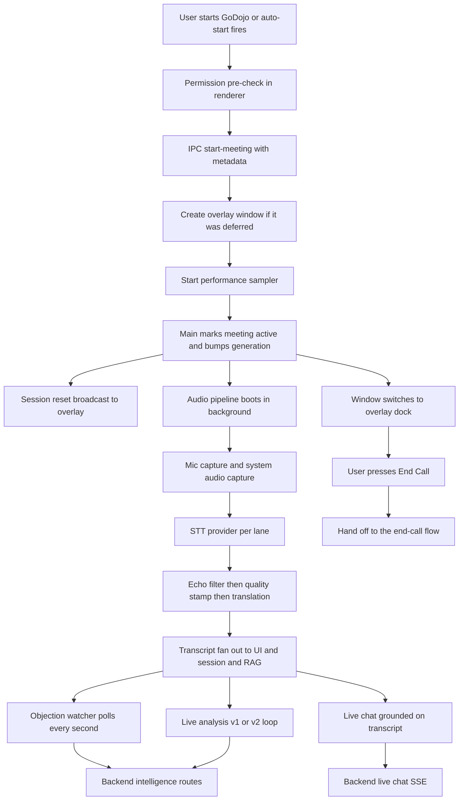
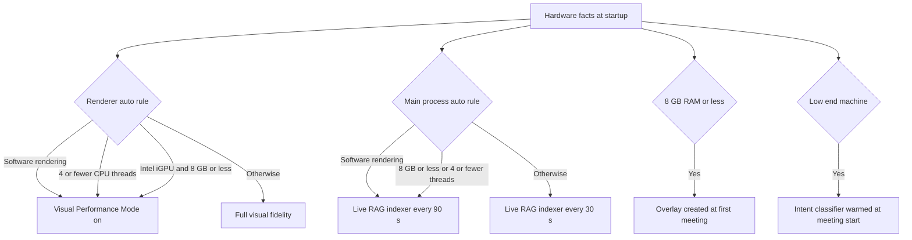

# Live Call Flow — Developer Documentation

Everything that happens in GoDojo **DURING a live call**: from the moment the user starts GoDojo (or a calendar auto-start fires) to the moment they press End Call and the app hands off to the end-call flow.

Written for a developer who is new to this codebase. Every technical term is explained the first time it appears.

Related docs (read in order):

- `docs/2_Pre-Call-Flow.md` — how the meeting got detected, researched, and started (that doc ends exactly where this one begins).
- `docs/4_End-Call-Flow.md` — **the authoritative description of what End Call does**: stopping the pipeline, the local placeholder save, the end-of-call analysis (including the live analysis v2 `/v2/end` pass), the company prompt, and background summary processing. This doc stops at the End button and hands off to it (section 11).
- `docs/5_Post-Call-Flow.md` — meeting details, regeneration, follow-up email, and linking in-call chat turns to the saved meeting.
- `docs/AUDIO-PIPELINE.md` — the deep dive into capture, the Rust native module, Deepgram, watchdogs, and device hot-swap. This doc summarizes it at the level you need to follow the live-call flow.

---

## 1. What This Feature Does

GoDojo is an Electron + React desktop app for sales people, with a Python (FastAPI) backend. The live call phase turns an ordinary video call into a real-time sales copilot:

1. **Records both sides of the conversation** — your microphone ("you") and the system audio ("the other party") — using a Rust native module, and streams both to a speech-to-text (STT) provider.
2. **Shows a floating, always-on-top dock** over the call window with live transcript, pause/resume, ghost mode, and an End Call button.
3. **Runs live intelligence** — objections detected every few seconds, and a BANT/MEDDIC/signals analysis refreshed on a timer (v1) or on settled prospect speech (v2, behind a build flag) — plus an in-call chat assistant grounded in the live transcript and calendar metadata.
4. **Keeps itself alive** — watchdogs restart dead audio captures, follow device changes (headset plugged in mid-call), survive provider failures, and drop results that arrive after the call has ended.
5. **Scales itself down on weak machines** — Performance Mode drops blur and decorative animation, slows the audio meter and the live RAG indexer, and keeps PostHog session replay off; low-memory machines defer the overlay window and heavy model warmups until a meeting actually starts.
6. **Hands off cleanly** — one End Call press triggers the end-call flow (documented in `docs/4_End-Call-Flow.md`).

Key vocabulary:

- **Main process** — the Node.js side of Electron (`electron/` folder). It owns audio capture, STT, the local database, and the meeting clock.
- **Renderer** — the React side (`src/` folder). The live call uses two renderer windows: the **Launcher** (home screen, hidden during a call) and the **Overlay** (the small in-call dock window).
- **IPC channel** — how a renderer asks the main process to do something (example: `start-meeting`).
- **Lane** — one audio path. The **client lane** is system audio (the prospect); the **user lane** is the microphone (the rep).
- **Generation** — a number that increments on every `startMeeting()`. Every asynchronous result (live analysis, late transcripts) is stamped with it so results from a previous call can never leak into the next one.
- **Final vs interim transcript** — a *final* is text the STT provider has committed to; an *interim* (partial) is a live guess that will be replaced. Only finals are stored.
- **Diarization** — splitting the client lane into "Speaker 1 / Speaker 2" (a Deepgram add-on, client lane only).
- **Ghost mode** — hides every app window from screen sharing/recording. ON by default in production builds.
- **Performance Mode** — a reduced-fidelity mode for weak hardware (section 10.5). `auto` by default; the user can force it `on` or `off`.
- **Live analysis v1 / v2** — two implementations of the BANT/MEDDIC/signals loop. v1 is the default; v2 is selected at build time by `VITE_LIVE_ANALYSIS_V2=true` (section 8.7).

## 2. Simple Mental Model

Think of a live call as three loops running at once, all feeding one transcript:

```
Start button or calendar auto-start
   → permission gate → IPC start-meeting
   → (low-memory: create the deferred overlay window) → start performance sampler
   → main marks meeting active and bumps the generation
   → audio pipeline boots in background (mic lane + system lane → STT sockets)
   → window switches to overlay mode (the floating dock)

During the call:
   Audio loop:      OS → Rust (clean, echo-cancel, 16 kHz) → STT → echo filter
                        → quality stamp → translate → fan out (UI + session + RAG)
   Objection loop:  1 s poll → POST /intelligence/objection-handler
   Analysis loop:   v1: countdown deadline (default 1 min) + urgent triggers
                        → POST /intelligence/live-analysis
                    v2: 1 s settled-speech check → SSE POST /intelligence/live-analysis/v2
                        plus a 2 s Deal Optimizer poll on negotiation calls
   Chat (on demand): SSE POST /chat/live with live transcript + calendar metadata
   Housekeeping:    live RAG indexer (30 s, or 90 s in Performance Mode),
                    60 s performance sampler

End Call:
   → handed to the end-call flow (docs/4_End-Call-Flow.md)
```

One important architectural fact, verified in the code: **the audio and transcript machinery lives entirely in the desktop app.** The Python backend only receives analysis requests during the call. The meeting row itself is persisted locally (SQLite) and mirrored to the cloud after the call ends (see section 12 for the backend's live-meeting contract, which exists but is not wired into the desktop path).

## 3. Big-Picture Diagram



Everything after node R is documented in `docs/4_End-Call-Flow.md`.

---

## 4. Stage 1 — Starting a Call

Files:

- `src/hooks/useMeetingSession.ts` — renderer start/end logic and the permission gate.
- `src/lib/systemAudioBackend.ts` — resolves the macOS system-audio backend.
- `electron/ipcHandlers.ts` — the `start-meeting` IPC handler.
- `electron/main.ts` — `AppState.startMeeting`, `startMeetingFromCalendarEvent`.
- `electron/SessionTracker.ts` — turns attendees into speaker names.
- `electron/IntelligenceManager.ts` — the facade over SessionTracker and persistence.

### 4.1 Two ways a call starts

- **Manual (quick meeting, no calendar):** the *Start GoDojo* button on the Launcher header or empty state calls `handleStartMeeting()` with no event. Only audio-device preferences are attached.
- **Calendar-scheduled:** the *Join Meeting* button on the Next Meeting card (and the pre-call reminder popup / auto-start / native notification, which run in the main process) attach the full calendar event. The renderer path builds `meetingMetadata` in `handleStartMeetingRaw`; the main-process path uses `startMeetingFromCalendarEvent(event)` directly.

### 4.2 The renderer path, step by step

`handleStartMeeting(calendarEvent?)` in `src/hooks/useMeetingSession.ts`:

1. **Duplicate-start guard** — `isStartingRef` blocks a second concurrent start (double-click, or auto-join racing a manual click). The main process has its own matching guard (below), so both sides are covered.
2. **Permission pre-check** — IPC `check-permissions`. On Windows/Linux this always reports granted; on macOS it returns the real tri-state for microphone, system audio, and screen capture. If any is missing, the start is *paused*: the **AudioStatusTray** appears (rendered at the app root), the pending calendar event is remembered, and `proceedWithMeeting()` resumes the start once the tray reports all granted. A failing permission check is never worse than proceeding — on error the code falls through and lets the main-process gates (which re-check) decide.
3. `handleStartMeetingRaw(calendarEvent?)`:
   - **Session check** — `verifySessionIsActive()` forces a Firebase token refresh server-side. A deleted/disabled/revoked account silently signs out and the start aborts. (Network errors are treated optimistically — bad Wi-Fi must not block a meeting.)
   - Records `godojo_last_meeting_start` in localStorage (used later for the profile toaster threshold at end of call).
   - Reads the preferred mic (`preferredInputDeviceId`) and resolves the **system-audio backend** with `resolveSystemAudioBackend` — on macOS this decides between **ScreenCaptureKit** (the modern, default backend, selected by preference key `SCK_BACKEND_PREF_KEY`) and the platform default (CoreAudio process tap), and returns the `outputDeviceId` to bind.
   - Builds `meetingMetadata`:
     ```ts
     {
       audio: { inputDeviceId, outputDeviceId },
       // calendar-only additions:
       title, calendarEventId, source: 'calendar',
       attendees, organizer, calendarEvent  // the full raw event, verbatim
     }
     ```
   - Invokes IPC `start-meeting`. On success it calls `setWindowMode("overlay", undefined, true)` — the third argument (`freshMeetingStart`) skips the stale-size floor so the dock opens straight at its collapsed height with no flicker. On failure it fires PostHog `meeting_start_failed`.

### 4.3 What the `start-meeting` IPC handler does

In `electron/ipcHandlers.ts`: first awaits `WindowHelper.ensureOverlayIfDeferred()` — on a low-memory machine the overlay window does not exist yet (section 10.5), and it must be created *and* subscribed before `startMeeting` emits `session-reset`, or that signal would be dropped. On every other machine this is an immediate no-op. Then it calls `appState.startMeeting(metadata)`, then computes `_tavilyAllowedCompanies` from the attendee list (the companies the in-call Tavily intent detector may search for), and returns `{ success: true }` or `{ success: false, error }`.

### 4.4 What `AppState.startMeeting(metadata)` does (electron/main.ts)

Before anything else it starts the **performance sampler** (`meetingPerformanceSampler.start()`, section 10.5) — ahead of every guard; a second call is a no-op while it is already sampling, and `endMeeting()` stops it. Then, in order (each step exists to close a specific race):

1. **Idempotency guard** — if a meeting is already active, the call is a no-op with a warning. Without it, `resetSessionTimer()` would re-anchor the clock of the running meeting and wipe its pause history.
2. **Microphone gate (fatal on macOS)** — `ensureMacMicrophoneAccess`. Denied → broadcast `meeting-audio-error` and throw (the calendar path catches this and shows the main window so the user sees why).
3. **Screen Recording gate (not fatal)** — `ensureSystemAudioCapability`. A mic-only meeting is still worth having; the app warns and continues without system audio. It never re-prompts or opens System Settings here (a denied grant cannot be re-requested, and hijacking focus on every start would be hostile).
4. **State reset** — `isMeetingActive = true`; the meeting generation is incremented (stale async results become identifiable); `_currentLiveAnalysis = null`; `_companyIntel = null` (previous company's research must not leak into this call); the live-analysis in-flight flag, echo filter, `_clientSpeakerIndicesSeen`, and the transcript-quality state (turn counter, language tracker, recent original finals) are all reset. Note: `_pendingLiveAnalysisMeetingId` is deliberately *not* cleared — a late result belonging to the previous meeting may still legitimately arrive and patch that meeting's saved row.
5. **Clock** — `intelligenceManager.resetSessionTimer()` runs synchronously at the same instant the meeting is marked active, so a fast stop→restart can never compute duration against a stale start time.
6. **Speaker names** — `intelligenceManager.setMeetingMetadata(metadata)` → `SessionTracker.setMeetingMetadata` (section 7.3). ~100 ms later the resolved names are broadcast as `speaker-names-resolved` (the delay lets the renderer's `session-reset` handler fire first).
7. **Session reset broadcast** — `session-reset` with the new generation goes to the meeting surfaces (launcher + overlay). This is the floating dock's *only* "a call started" signal, and it is fire-and-forget — which is why the overlay renderer announces itself via the `overlay:ready` handshake (section 5.1) so a recreated or deferred overlay cannot miss it.
   - **Deferred intent-classifier warmup** — right after this broadcast, on low-end hardware (`deferHeavyWarmups`, section 10.5) the zero-shot intent classifier was not preloaded at launch, so it is warmed here: `warmupIntentClassifier()`, fire-and-forget and idempotent.
8. **Async audio boot** — the IPC response returns immediately; a `setTimeout(0)` callback then boots the pipeline (audio setup takes seconds, especially ScreenCaptureKit's 5–7 s):
   - **BUG-02 guard:** if the meeting was ended before this callback ran (`isMeetingActive` false), boot is aborted — otherwise the pipeline would run forever with no stop signal.
   - `reconfigureAudio(inputDeviceId, outputDeviceId)` when metadata carries audio prefs: destroys and rebuilds both captures bound to the chosen devices (falls back to the OS default per device on failure).
   - `setupSystemAudioPipeline()` creates anything still missing (captures, STT instances, the transcript translator).
   - **Loopback-input guard** (warn only): a virtual/loopback device selected as the mic would transcribe the far end as "you"; the app warns via `meeting-audio-warning` but never blocks or auto-switches.
   - **STT starts BEFORE captures** — `DeepgramStreamingSTT.write()` silently drops chunks while inactive, so starting captures first would lose the first seconds of the call. STT starts with a 16 kHz fallback rate; a settle poll (every 100 ms, 2 s timeout) then reads the real hardware rates and calls `setSampleRate`, which reconnects with the correct rate while preserving buffered audio.
   - `ragManager.startLiveIndexing('live-meeting-current', isPerformanceModeActive())` — just-in-time retrieval indexing of the live transcript (a local-only transient meeting id). The second argument picks the indexer cadence: 30 s normally, 90 s when main-process Performance Mode is active (section 10.5). Skipped entirely when the embedding pipeline is not ready.
   - Starts echo-pipeline telemetry polling, a main-thread loop-delay monitor (only when verbose logging is on), and the device watcher (in that order — the watcher's baseline must be taken *after* our own captures grab their endpoints).
   - On failure: `isMeetingActive = false`, state re-broadcast, and `meeting-audio-error` so the UI can explain.

### 4.5 The calendar start path

`startMeetingFromCalendarEvent(event)` (main.ts) is shared by the reminder popup's *Take Notes* button, the auto-start countdown, and the native-notification action. It runs with no user interaction, so it:

1. `await windowHelper.ensureWindowsReady()` FIRST — on macOS closing the main window destroys both windows while the app keeps running, and on a low-memory machine the overlay may never have been created; either way the overlay must exist (and be subscribed) before `session-reset` fires, or the dock would sit with live analysis never armed.
2. Calls `startMeeting` with the full calendar metadata.
3. Calls `setWindowMode('overlay', undefined, true)` — `startMeeting` only boots the session; it does not show the dock.
4. On failure, `centerAndShowWindow()` surfaces the app so the error (e.g. mic permission) is visible instead of nothing happening.

### 4.6 Second meeting attempted while one is active

Every entry point refuses: the renderer's `isStartingRef`, the main process's idempotency guard, the account switcher (`get-meeting-active` check — "Finish the current meeting before switching accounts"), and the auto-start arming rules (which require no meeting to be running). An auto-join racing a manual start resolves harmlessly: whichever wins first marks the meeting active; the loser is a logged no-op.

## 5. Stage 2 — The Overlay Window (the in-call UI)

Files:

- `electron/WindowHelper.ts` — overlay window creation, `setWindowMode`, always-on-top watchdog.
- `src/App.tsx` — the overlay window branch (renders the dock + permission banner).
- `src/features/common/GodojoInterface.tsx` — the overlay root component (rendering only).

### 5.1 What the overlay window is

`WindowHelper.createOverlayWindow()` builds a second `BrowserWindow`: ~430 px wide (the dock's real content width), frameless, fully transparent, **always-on-top** at a high Z-order level, visible on all workspaces (so it survives full-screen Zoom calls on macOS), hidden from Mission Control, and skipped from the taskbar/dock for stealth. It loads the same app bundle with `?window=overlay`, and `App.tsx` branches on that to render the meeting UI instead of the Launcher. The window is created **once and reused** (hidden between meetings, never destroyed on purpose) — this is why hooks like `useFloatingDock` are written to reset state on `session-reset` rather than on mount.

**When it is created:** normally at app launch, hidden. On a **low-memory machine** (8 GB RAM or less, `isLowMemoryMachine` in `utils/performanceClassification.ts`) `WindowHelper` sets `deferOverlay` and skips that launch-time creation, saving a whole hidden renderer process until it is needed. `ensureOverlayIfDeferred()` then creates it on first use — from the `start-meeting` handler, from `set-window-mode` when the mode is `overlay`, and implicitly via `ensureWindowsReady()` on the calendar path. Once created it is kept and reused like everywhere else.

Reliability details:

- **`ensureWindowsReady()`** recreates either window if it was destroyed, waits for the overlay renderer's `overlay:ready` IPC (sent by an effect in `App.tsx` after the dock's own listeners are registered), with a timeout backstop.
- **Always-on-top watchdog** — the OS can silently drop the always-on-top flag; an `always-on-top-changed` listener and a periodic `reassertOverlayPinned` re-assert it.
- **Unexpected-hide guard** — some GPU drivers hide the overlay during OS screen-capture passes; a `hide` listener re-shows it immediately with `showInactive()` unless the app hid it on purpose.

### 5.2 Switching to overlay mode

`setWindowMode("overlay", undefined, freshMeetingStart)` → `switchToOverlay` (the renderer reaches it through the `set-window-mode` IPC, which creates a deferred overlay first):

- Shows the overlay **first**, hides the Launcher second.
- On a fresh meeting start it sizes the window straight to the collapsed dock height (52 px) and **snaps to the top-right** of the Launcher's current display (24 px margin) — top-right so the dock's panels can grow downward into free space. Later shows keep the user's manual position.
- On Windows with content protection, an *opacity shield* shows the window at opacity 0 for ~60 ms while the protection flag settles, so no frame leaks into a screen share.
- `setWindowMode("launcher")` reverses the swap and re-arms the corner snap for the next call.

The meeting popup (pre-call reminder card) is a *different* window. During a live call its auto-start is refused (no meeting may be active), so the popup cannot spawn a second recording.

## 6. Stage 3 — Audio Capture (summary)

The full detail lives in **`docs/AUDIO-PIPELINE.md`**. What the live-call flow needs:

- **Two lanes, never mixed.** System audio (`client`, the prospect) and microphone (`user`, the rep) each have their own native capture, their own STT connection, and their own transcript stream.
- **The Rust native module** (`native-module/src/lib.rs`, loaded by `electron/audio/nativeModuleLoader.ts`) opens the OS audio endpoints (WASAPI loopback on Windows; CoreAudio tap falling back to ScreenCaptureKit on macOS; a PulseAudio monitor on Linux), then on a DSP thread per lane it applies silence suppression, **acoustic echo cancellation** (WebRTC AEC3 — real on macOS/Linux, a no-op shim on Windows), and resamples everything to **16 kHz mono**. Even total silence emits ~10 keepalive chunks per second, so "no chunks" unambiguously means "the stream is dead", never "the user is quiet".
- **Capture supervisors** (`electron/audio/SystemAudioCapture.ts`, `MicrophoneCapture.ts`) keep the lanes alive: a health tick notices when a capture should be recording and is not, and restarts it on a ladder of 250 ms → 500 ms → 1 s → 2 s → 4 s, then every 30 s forever. Terminal "not supported on this platform" errors are the only stop.
- **The watchdogs** (what each detects, what the user sees):
  - *Stuck watchdog* — capture opened but produced zero chunks (wrong route or revoked permission). Disarmed by the first chunk; `endMeeting()` disarms it early so a very short call does not raise a false alarm.
  - *Zero-fill detector (macOS)* — a long run of bit-exact silence triggers an active re-probe of the Screen Recording permission (an orphaned grant still reports `granted` while capturing nothing); rate-limited to one probe per minute.
  - *Far-end silence detector* — every 5 s: if the mic carries real speech but the system lane has been silent for 45 s, the loopback is probably bound to the wrong endpoint (e.g. Windows `eConsole` vs `eCommunications` default roles). It performs one speculative rebind, and on macOS only surfaces an advisory banner (a muted prospect is indistinguishable on other platforms).
  - *Device hot-swap* — `AudioDeviceWatcher` polls the device graph every 1.5 s; a change must hold for 2 consecutive polls before captures are rebound (`restart(reason, rebindDevice: true)`). Because Rust always outputs 16 kHz, a rebind never reconnects the STT — the transcript is continuous across a headset swap.
- **macOS permission flows** — microphone is fatal at start; Screen Recording is resolved *before* constructing the system capture (each SCK attempt would otherwise re-raise the OS dialog). The renderer's `useSystemAudioPermission` combines a mount poll, a replayed latched warning (`getSystemAudioPermissionWarning` — the overlay window may not have existed when main logged the warning), push events (`onSystemAudioPermissionDenied`, `onAudioCaptureFailed` for terminal failures only, `onSystemAudioRecovered`), a re-check on window focus (returning from System Settings clears the banner), and a `repairTccPermissions` escape hatch. The overlay shows `SystemAudioPermissionBanner`; the Launcher shows the fuller `AudioStatusTray`.
- **Audio levels for the dock meter** — main computes an RMS level per chunk and throttles it to one `audio-level` IPC event per 50 ms per channel. The renderer reads these through `src/lib/audioLevelFeed.ts` (deliberately outside React) and `AudioWaveIndicator` animates from a `requestAnimationFrame` loop, so a ~20 Hz audio feed never re-renders the whole dock.
- **Mid-call STT provider changes** — `reconfigureSttProvider()` rebuilds both STT instances, but a key/provider change saved *during* a meeting is deferred (`_pendingSttResync`) and applied at `endMeeting()` so it can never interrupt the capture.

## 7. Stage 4 — Transcription (live)

Files:

- `electron/main.ts` — `createSTTProvider` (provider choice + the shared transcript handler) and `_dispatchTranscript` (fan-out).
- `electron/audio/DeepgramStreamingSTT.ts` (and the Soniox/ElevenLabs/OpenAI/RestSTT/GoogleSTT siblings).
- `electron/audio/TranscriptEchoFilter.ts` — de-duplicates speaker leakage.
- `electron/services/transcriptQuality.ts` — per-final language guess and ASR-suspect check (`assessFinal`, `LanguageTracker`).
- `electron/services/TranscriptTranslator.ts` — optional English rendering.
- `electron/SessionTracker.ts` — session transcript, context window, pause accounting.
- `src/hooks/useGodojoInterface.ts` — the renderer's rolling transcript.

### 7.1 Provider choice

`createSTTProvider(speaker)` builds one STT instance per lane from `CredentialsManager.getSttProvider()`: `deepgram`, `soniox`, `elevenlabs`, `openai`, `groq`/`azure`/`ibmwatson` (batched REST), or `google`. **Every provider falls back to `GoogleSTT` when its API key is missing** — if transcripts look different than expected, check which provider actually got constructed. Only the client lane may enable **diarization** (`getDiarizeClientEnabled`); it is a paid add-on and the mic lane has exactly one speaker. The recognition language comes from settings; `multi` mode tightens Deepgram endpointing so language switches do not glue into one window.

### 7.2 From STT event to screen (the gates, in order)

The `transcript` handler registered per lane in `createSTTProvider`:

1. **Gate: meeting active?** Dropped otherwise. **Gate: paused?** In-flight audio that lands just after a pause is dropped (section 10.1).
2. **Echo filtering (macOS-focused).** With external speakers, the mic physically hears the prospect, so their words would appear in *both* lanes and used to duplicate transcripts. `TranscriptEchoFilter` compares mic text against recent client text (finals *and* interims — interims close the ordering gap where mic echo arrives before the client final). Outcomes: mic interims are suppressed; mic finals are word-timestamp **trimmed** or whole-segment **dropped**. A dropped final also clears SessionTracker's pending interim and emits a `retract: true` payload so the UI takes the on-screen partial down.
3. **Echo filtering happens BEFORE translation** — the filter compares spoken-language text on both sides; translating first would break the match entirely.
   - **Quality stamp (finals only).** `_assessFinalSegment` runs `assessFinal` on the *original* recognized text (after echo filtering, before any translation) and stamps the final with a stable `turnId` (generation plus a running counter), a language guess, an `asrSuspect` flag with a reason (`foreign_language`, `rare_language`, or `low_confidence` — confidence only counts for providers that report a real value, Deepgram and Google), and `arrivalMs`. Suspect finals are logged but still delivered. These fields exist for live analysis v2 (section 8.7), which grounds evidence on the original text and sends the suspect flag with every turn (the v2 Deal Optimizer lane skips suspect turns entirely).
4. **Optional translation** (`TranscriptTranslator`): when the *translate transcripts to English* setting is on, finals in a non-Latin script are translated by the fastest configured provider (order: Groq → Gemini → OpenAI → Claude), finals only, with the previous 3 original finals passed as context (`TRANSLATE_CONTEXT_LINES`), 2.5 s timeout, 200-entry cache, per-speaker queue to preserve order, and a 60 s mute after 3 consecutive failures. Failure always falls back to the original text. The original stays available as `textOriginal` on the payload.
5. **Fan-out** (`_dispatchTranscript`):
   - `intelligenceManager.handleTranscript(...)` → SessionTracker (context window, full transcript, epoch compaction — see below).
   - Finals feed the JIT RAG live indexer (`ragManager.feedLiveTranscript`).
   - A **display name** is resolved at emit time and the `native-audio-transcript` IPC payload `{ speaker, displayName, text, timestamp, final, confidence, speakerIndex }` — plus, on finals, `textOriginal`, `turnId`, `lang`, `asrSuspect`, `suspectReason`, `arrivalMs` — is sent to *both* the launcher and overlay windows. Word timings deliberately stay in the main process — the stream runs 10+ messages/second.

### 7.3 Speaker labeling (user vs client, diarization, "Other Party")

`SessionTracker.setMeetingMetadata` resolves labels once per call from the attendee list:

- The attendee flagged `self` becomes the "user" (mic) label.
- A single other attendee becomes "Name (Company)" — the company derived from the professional email domain; consumer domains (gmail, outlook, …) yield just the person's name.
- **Multiple other attendees share one audio channel**, so an honest shared label is used: **"Other Party"** — never a joined list of companies that would imply per-speaker precision the audio cannot provide. (This is the "'Other Party' wrapping fix" — the label no longer grows with attendee count and never claims identification.)
- No attendees → best-effort name extraction from the meeting title.
- **Diarization:** when the client lane carries `speakerIndex`, main tracks distinct indices in `_clientSpeakerIndicesSeen`. Speaker suffixes (`"Other Party · Speaker 2"`) are appended **only after a second distinct far-end speaker has actually been seen** — ordinary 1:1 calls render unchanged. The same rule (`hasMultipleClientSpeakers`) governs the labels stamped into the saved transcript.

The renderer (`useGodojoInterface`) keeps two rolling strings — one per speaker — where finals append (guarded against exact duplicates) and interims replace the pending tail after the `  ·  ` separator. `retract: true` strips the pending partial. Speaking indicators clear ~3 s (client) / ~2 s (user) after the last event. Finals also append to `liveTranscriptRef` — the transcript source that live analysis, objections, and chat read.

### 7.4 Session bookkeeping (SessionTracker)

- **Context window** — the last 120 s (max 500 items) of turns for short prompts.
- **Full transcript** — everything, with **epoch compaction**: past 1800 segments, the oldest 500 are summarized by a `RecapLLM` call into an epoch summary (max 5 kept; plain-text markers on LLM failure), and the full-session prompt prepends them.
- **Pause accounting** — `recordPauseStart` / `recordPauseEnd` accumulate `totalPausedMs` (section 10.1).
- **Interim flush** — pending interims for both speakers are force-finalized on stop, so a sentence spoken as the call ends is not lost.

### 7.5 The renderer's backend-transcript buffering (currently inert)

`useMeetingSession` contains a listener that buffers transcript segments into `transcriptSegmentsRef` while `backendMeetingIdRef.current` is set, intended to batch-submit them via `POST /meetings/transcript` at end of meeting. **`backendMeetingIdRef` is never assigned anywhere**, so the buffer never fills and nothing is ever posted. See section 12.3 — the desktop app persists transcripts locally and mirrors them, instead.

## 8. Stage 5 — Live Intelligence

Files:

- `src/hooks/useObjectionWatch.ts` + `src/lib/objections.ts` — the fast objection loop (pure logic + hook).
- `src/hooks/useLiveAnalysis.ts` — the v1 analysis loop (default).
- `src/hooks/useLiveAnalysisV2.ts` + `src/lib/liveAnalysisV2.ts` — the v2 analysis loop and Deal Optimizer lane (build-flagged, section 8.7).
- `src/hooks/useFloatingDock.ts` — picks v1 or v2, cadence orchestration, countdown, meeting types, internal-meeting detection.
- `src/lib/meetingLifecycle.ts` — the pure decisions (`decideAutoRefresh`, `decideFinalAnalysis`, `shouldAdvanceCursor`).
- `src/lib/meetingGeneration.ts` — the renderer's copy of the generation stamp.
- `src/lib/companyCandidates.ts` — `isInternalMeeting` (turns the objection watcher off for all-internal calls).
- `src/api/intelligenceApi.ts` — the backend calls (v1 analysis, objections, v2 stream, Deal Optimizer, v2 feedback).
- `electron/liveAnalysisRouting.ts` — `routeLiveAnalysisWrite` (store / patch / drop).
- Backend: `godojo-apis/app/api/v1/live_analysis.py`, `godojo-apis/app/api/v1/objection.py`, `godojo-apis/app/api/v1/live_analysis_v2.py`, `godojo-apis/app/api/v1/deal_optimizer.py`.

### 8.1 Objection detection (seconds cadence)

`useObjectionWatch` polls the transcript ref **every 1 s** (it is a poll because the ref is mutated by an IPC listener — React gets no signal when it grows). A tick fires only when `shouldTick` agrees: not paused, nothing in flight, new *prospect* turns exist past the cursor, the newest turn has settled for 1.2 s, and at least 6 s passed since the last attempt. The request posts **prospect turns only** (the rep's own speech is never an objection), a trailing 16-turn window with a 4-turn overlap, and the quotes (max 25) of currently-open objections:

`POST /api/v1/intelligence/objection-handler` with `{ transcript, meeting_id, open_objections }`. The **delta contract**: the backend returns only `{ new, resolved }`; the *renderer owns the list* — `mergeObjectionDelta` stamps stable ids (a djb2-style hash of the quote, so dismiss/checked UI state survives refreshes), prepends new items, and flips `resolved` rather than dropping (resolved objections still reach the post-call summary).

Precision caps in `mergeObjectionDelta` keep the list honest (one call once ended with 80 "objections"): a new item is skipped if it is a **near-duplicate** (word-set Jaccard overlap of 0.6 or more) of anything already tracked, open or resolved; at most **2 new prospect objections per tick** (`MAX_NEW_PER_TICK`; the rep's own follow-ups, `ae_deferral` / owner `ae`, do not count); and at most **15 open items** (`MAX_ACTIVE_OBJECTIONS`, oldest open ones dropped; resolved ones are kept).

**Internal meetings:** `useFloatingDock` runs `isInternalMeeting` (`src/lib/companyCandidates.ts`) on the meeting's calendar event and the signed-in user's email. When every invitee is on the user's own domain, the watcher sends nothing and consumes turns as they arrive (colleagues on system audio would otherwise all be labelled PROSPECT), any list collected before the calendar metadata landed is cleared, and the panel shows why its Objections tab is empty (`objectionDetectionOff: 'internal'`).

A failed tick is invisible (no banner, no storm) and simply retries with a wider window; a 12 s hang timeout aborts the request client-side; a 404 (a backend that predates the route) disables the watcher for the session, and the analysis loop falls back to whatever objections the live-analysis response carries (`objectionsRef` is passed as `null`). Note the current backend's `live_analysis.py` no longer generates objections itself — it echoes back the client's list — so this fallback only yields objections against an older backend. On the backend, the route is budgeted at p95 ≤ 1.5 s: one small LLM call plus a batched embedding classification of the *new* quotes only, with seller-company context cached 5 min per user and asset RAG refreshed off the request path.

### 8.2 Live analysis v1 (minutes cadence — the default build)

`useLiveAnalysis.runAnalysis(force)`:

- Bails on an empty transcript, on a non-forced run while paused, and while another run is in flight. Fires PostHog `live_analysis_refresh` (`manual` when forced, `auto` otherwise) and tells main the run is in flight (`set-live-analysis-in-flight`, generation-tagged).
- Filters the transcript to human turns (`system`/`ai`/`assistant`/`model` excluded) and computes a **delta** — only the turns added since the last successful run (cursor on the *filtered* array; mixing index spaces here used to produce empty deltas forever).
- `POST /api/v1/intelligence/live-analysis` with:
  ```json
  { "transcript": "SALES PERSON: …\nPROSPECT: …", "meeting_id": null,
    "mode": "deep", "meeting_types": ["discovery"],
    "previous_analysis": { … } }
  ```
  `runAnalysis` does not pass a `mode`, so `intelligenceApi.analyzeLive` sends its default, `"deep"` (extract plus the backend's critique/revise loop). The transcript string labels `user` → `SALES PERSON` and everyone else → `PROSPECT` (the backend prompt and RAG scope on these labels), and is capped client-side to the trailing **80 turns** (`LIVE_ANALYSIS_MAX_TURNS`, with a console warning when it truncates). `previous_analysis` is omitted on the first run → the backend analyzes the whole call so far; afterwards the backend merges the delta into the prior result and returns the full updated analysis. It is deliberately **stateless-incremental**: the client carries the state.
- **Retries:** any failure (network, 5xx, timeout, malformed body) is retried up to 3 attempts with 1 s / 2 s backoff before an error banner appears.
- **Degraded responses:** when the backend exhausts its provider budget it returns 200 with `degraded: true` (a mirror of `previous_analysis`) instead of a 5xx, so the panel keeps what it had. `shouldAdvanceCursor` then holds the cursor — the delta is re-sent next tick instead of being silently skipped. (There is **no** "llm call limit exceeded" PostHog event in the codebase; this degraded flag plus the retry logs are the observable signal.)
- **Objection override:** when the objection watcher is active, its accumulated list overrides the response's objections at *response* time (a slow analysis must not clobber newer objection ticks).
- The merged result goes into React state and is pushed to main via the `update-live-analysis` IPC **tagged with the meeting generation**.

### 8.3 What triggers a cycle (the v1 cadence)

`useFloatingDock` owns the timers (they must survive panel switches). They run in both builds — in a v2 build the same deadline and early trigger simply call v2's `runAnalysis(false)`, which asks for a normal tick — but the countdown ring is only shown for v1:

| Trigger | Timing | Effect |
| --- | --- | --- |
| Early trigger | poll every 5 s until the prospect has spoken ≥ 2 turns | Fires the *first* analysis mid-call instead of at the first deadline |
| Recurring deadline | every `autoRefreshInterval` minutes (default 1; user-configurable; `null` = off) | `decideAutoRefresh` → `run` (delta analysis), `wait` (nothing new), `no-transcript` (show "capturing" state, keep waiting), `retry-soon` (5 s), or `stop` (call ended) |
| Urgent-signal trigger (v1 only, inside `useLiveAnalysis`) | poll every 3 s; cooldown 60 s | Zero-cost regex over new prospect turns (competitor names, "send me a proposal", budget approved, …) fires an immediate analysis; only acts while the prospect transcript is actually growing |
| Manual Regenerate | on click | `runAnalysis(true)` |

The interval picker offers 1, 2, 3, 5, 10 and 15 minutes. The countdown ring in the Intelligence panel is a *deadline display*, driven by `intelligencePanelFirstOpenedAt` and reset per session (`sessionKey`), frozen while paused, and only shown while the startup cycle is armed, nothing has come back yet, and the build is v1 (`isCountdownActive`). After `live-call-ended` the cadence stands down (`isCallLiveRef = false`, `decideAutoRefresh` returns `stop`).

### 8.4 Routing results to the right meeting (generations)

Analysis runs are async and can outlive their call. Every renderer write carries the generation stamped by `session-reset`; main decides via `routeLiveAnalysisWrite` (`electron/liveAnalysisRouting.ts`):

- **store** — the write belongs to the live meeting: keep it in the hot slot (`_currentLiveAnalysis`).
- **patch** — a pending target exists (a call that just ended while an analysis was in flight): write it into that meeting's saved row.
- **drop** — stale generation with nothing pending, or a too-short meeting: discard (storing it would leak into the next call — the original "Meeting A's analysis showed up inside Meeting B" bug).

Supporting pieces: `set-live-analysis-in-flight` (generation-tagged so a previous call's `finally` cannot clear the current flag), plus the end-of-call settle wait and pending-target patching, which are part of the end-call flow (`docs/4_End-Call-Flow.md`, section 6.5).

Between analysis runs, `useFloatingDock` also re-pushes the composed result (analysis plus the watcher's current objections) to main via `update-live-analysis`, debounced 1 s and generation-tagged — but only once a real analysis exists, so an objections-only shell is never persisted.

### 8.5 Meeting types (and the dormant scorecard)

The Intelligence panel has a Discovery / Demo / Negotiation multi-select (`meetingTypes`, default `['discovery']`, reset on every `session-reset`). It matters in two places:

- **Live:** `meeting_types` rides on every live-analysis request. In v1 the backend produces the `dealOptimizer` section **only when "negotiation" is selected**; in v2 the Deal Optimizer is a separate lane that only polls when "negotiation" is selected (section 8.7). The panel's Deal Alert tab hides itself when negotiation is unchecked.
- **At end of call:** the selection is passed through `handleEndMeeting(meetingTypes)` → `end-meeting` IPC → `MeetingPersistence.stopMeeting` (and to the v2 end-of-call pass). It was used to load scoring criteria for scorecard generation, but **scorecard generation is currently dormant**: the draft and finalize calls in `electron/MeetingPersistence.ts` (`processAndSaveMeeting`) are commented out, so no scorecard is produced for live calls today. `generateAndPersistScorecard` still exists in the file. See `docs/4_End-Call-Flow.md` for what end-of-call processing actually does.

### 8.6 The intelligence panel UI

`FloatingIntelligencePanel` renders: the meeting-type selector, a tab bar (Objections first — the fast, act-now output — then MEDDICC, BANT, Signals, and Deal Alert for negotiation calls), and delegates the tab bodies to `LiveAnalysisContent` (`src/features/live-analysis/LiveAnalysisContent.tsx`): objection cards with resolved/active and prospect/rep-follow-up partitioning, BANT/MEDDIC field cards with status and evidence, and — in v2 builds — a highlight on fields the latest tick changed (`changedFields`) plus thumbs-up/down feedback per field (`sendFieldFeedback`). Around them: a Regenerate button, the auto-refresh interval picker, the countdown placeholder (v1), and "Analysing… / Refreshing…" header states. Objections render even before the first analysis lands (`objectionsOnlyAnalysis` provides an empty container) — but that shell is never persisted (it would wipe the summary's own BANT via reconciliation). All three dock panels stay mounted and cross-fade (`FloatingPanelWrapper`), so countdown timers, chat history, and scroll survive panel switches; hidden panels stop painting and pause CSS animations.

### 8.7 Live analysis v2 (build-flagged)

**How it is selected.** `src/hooks/useLiveAnalysisV2.ts` exports `LIVE_ANALYSIS_V2_ENABLED`, true only when `import.meta.env.VITE_LIVE_ANALYSIS_V2 === 'true'` at **renderer build time**. `useFloatingDock` picks `useLiveAnalysisV2` or `useLiveAnalysis` once, at module load, so hook order never changes. No tracked file in the repository sets the flag, and the local `.env` inspected for this doc (git-ignored) does not set it either — so unless the build environment injects it, a build runs v1. The main process reads the same variable at **runtime** (`isFinalAnalysisV2Enabled()` in `electron/utils/finalAnalysisBridge.ts`, from the `.env` loaded by `dotenv` at startup) to decide whether to request the v2 end-of-call pass — both sides must agree for v2 to work end to end.

`useLiveAnalysisV2` is a drop-in replacement: same arguments, same return shape, plus `changedFields`, `sendFieldFeedback`, and `finalizeAnalysis`. What differs from v1:

- **Cadence: settled prospect speech, not minutes.** A 1 s interval (`V2_POLL_MS`) runs `shouldTickV2` (`src/lib/liveAnalysisV2.ts`): fire when there is pending *prospect* speech past the cursor, no tick is in flight, at least 8 s passed since the last tick started (`V2_MIN_TICK_MS`), and either the newest prospect turn is 1.5 s old (`V2_SETTLE_MS`, the speaker paused) or 200 or more pending prospect characters have piled up (`V2_MIN_PENDING_CHARS`). The interval is not armed while paused. `runAnalysis(true)` (Regenerate) forces a sweep tick; a forced request that arrives during a tick is queued and runs right after it.
- **Transport: a stream.** Each tick is one `POST /api/v1/intelligence/live-analysis/v2` whose response is an SSE stream (`intelligenceApi.streamLiveAnalysisV2`, 35 s client ceiling). Events: `ack`, `signals_update`, `qualification_update`, `questions_update`, `degraded`, `done`. The panel updates as each event arrives (`applyV2Event`); `done` carries the full new state plus a signature.
- **State lives in the app.** The request carries `session_id` (a fresh UUID per call), `tick_id`, the last `state` and `state_sig` exactly as the previous `done` returned them, `meeting_types`, the new `turns`, and `force_sweep`. The server verifies the signature and stores nothing.
- **Structured turns.** `buildTurns` sends role, the **original** recognized text (with the English rendering as `text_en` when translation changed it), language, the `asr_suspect` flag, and a start offset — the transcript-quality fields stamped by main (section 7.2).
- **Cursor rules.** Only a tick that reached `done` advances the cursor; an interrupted tick re-sends the same turns (the server de-duplicates by turn id). There are no client retries — a failed tick sets the panel error and the next settled-speech check tries again.
- **Persisting results.** On `done`, the state is converted to the v1 `LiveAnalysisData` shape (`stateToAnalysis`, with the watcher's objections and Deal Optimizer alerts merged in) and sent to main through the same generation-tagged `update-live-analysis` path as v1, so section 8.4's routing applies unchanged.
- **Deal Optimizer fast lane (polling).** A second interval, every 2 s, runs only when "negotiation" is selected and the meeting is not paused: if there are new non-rep, non-suspect turns and at least 5 s passed since the last request, it posts the trailing 12 turns, the meeting types, the quotes of alerts already shown, and the session id to `POST /api/v1/intelligence/deal-optimizer` (15 s timeout). New alerts are merged (`mergeDealAlerts`) into the panel. A 404 disables the lane for the session.
- **Field feedback.** A thumbs-up/down on a field calls `POST /api/v1/intelligence/live-analysis/v2/feedback` with the trace id of the tick that last changed that field; fire-and-forget.
- **Reset.** `resetAnalysis()` (run on `session-reset`) aborts any in-flight tick, issues a new session id, and clears state, cursor, alerts, and feedback traces; an epoch counter makes late events from the previous call no-ops.

**End of call (handoff only).** In a v2 build the End button does **not** fire a final live tick (`ensureFinalAnalysisBeforeEndCall` returns immediately). Instead, after the placeholder meeting is saved, main asks the overlay over `run-final-analysis-v2`; `useFloatingDock` answers with `finalizeAnalysis()`, which aborts any running tick and makes one `POST /api/v1/intelligence/live-analysis/v2/end` over the whole call (up to 3000 turns, 60 s timeout), and replies on `final-analysis-v2-result` (with objections stripped for internal meetings). That whole pass belongs to the end-call flow — see `docs/4_End-Call-Flow.md`, section 4.3.

## 9. Stage 6 — Live Chat

Files:

- `src/features/floating-dock/panels/FloatingChatPanel.tsx` — the chat UI + request logic.
- `src/api/chatApi.ts` — `queryLive` (SSE) and `linkMeetingInteractions`.
- Backend: `godojo-apis/app/api/v1/chat.py` (`POST /chat/live`) and `app/api/v1/live.py` (`POST /live/link-meeting`).
- `electron/PendingLiveChatStore.ts` — the durable handoff store.

There is no `useLiveChat` hook; live chat is `FloatingChatPanel` + lifted chat state in `useFloatingDock` (`chatMessages`, `setChatMessages`). (`useMeetingChat` is the post-call MeetingChatOverlay hook.)

Flow of one question (`submitQuestion`):

1. If a turn is already streaming, the new question is queued (not dropped) and sent when that turn finishes. Otherwise `guardSession()` verifies the Firebase session (see `docs/1_Auth-Flow.md`) — an invalid session blocks the LLM call.
2. Fires PostHog `live_chat_query` and renders the user bubble + a streaming assistant placeholder.
3. `chatApi.queryLive(question, history, transcript, calendarEventMetadata, handlers)` opens an SSE stream to `POST /api/v1/chat/live` with:
   - `history` — prior chat turns (`user`/`assistant` only; rolling-transcript rows are display, not turns),
   - `transcript` — the **live transcript ref** (this is how answers are grounded in the conversation happening now),
   - `calendar_metadata` — the calendar event(s) the meeting matched (attendees, organizer, link, times), fetched in `useGodojoInterface` via the `get-meeting-metadata` IPC and **re-fetched on every `speaker-names-resolved`** (the overlay is reused across meetings, so a mount-only fetch would go stale).
4. The stream emits frames the panel handles: `status` (Connecting… / Searching transcript…), `token` (streamed text, buffered and flushed on a rAF), `source_map` / `source_ids` / `sources_verified` (citation chips, dimmed when semantic verification fails), `rag_answer` (a structured whole-answer), `reset` (backend discarded a partial — the bubble dims with "Rewriting…" and is replaced), `error`, `done`.
5. **Interaction ids:** `/chat/live` cannot know the meeting id (the meeting is not persisted yet), so each turn is logged with an `interaction_id` frame. The panel collects them via `handleInteractionId` into `interactionIdsRef`.

**The after-call handoff:** when `live-call-ended` arrives, `useFloatingDock` stands the auto-refresh down and calls `savePendingLiveChatInteractions(meetingId, ids)` (IPC `live-chat:save-pending-interactions`) — the ids are persisted durably in main (`PendingLiveChatStore`), *not* linked yet, because the backend does not have the meeting row at call-end. Linking happens lazily after the call: `useMeetingDetails` (when the details page opens after the backend syncs) and a `useLauncher` retry sweep (every 15 s) call `POST /api/v1/live/link-meeting`. That post-call linking is documented in `docs/5_Post-Call-Flow.md`.

## 10. Stage 7 — Meeting Controls During the Call

Files: `src/features/floating-dock/FloatingDock.tsx` (buttons), `src/hooks/useGodojoInterface.ts` (`handlePauseMeeting`), `electron/main.ts` (`pauseMeeting`, `resumeMeeting`, `setOverlayMousePassthrough`), `electron/WindowHelper.ts` (`syncOverlayInteractionPolicy`), plus the hooks listed per feature.

### 10.1 Pause / resume

The dock's Pause button → `handlePauseMeeting` → IPC `pause-meeting` / `resume-meeting` → `AppState.pauseMeeting()` / `resumeMeeting()`. Pause is *complete*: it is not a soft mute.

`pauseMeeting()` (guards: no active meeting / already paused → logged no-op):

1. `recordPauseStart()` — the wall-clock pause start is recorded in SessionTracker.
2. Snapshots the device graph, then stops the device watcher, stats polling, and both capture watchdogs.
3. Stops both captures (`stop()`, not `destroy()` — restartable) and **both STT streams**.
4. Stops live RAG indexing.
5. Broadcasts `meeting-pause-state-changed`, updates the tray menu, and shows a cross-screen toast "Meeting Paused".

**What pause blocks:** captures are stopped, so no audio is captured at all; STT sockets are closed, so nothing is transcribed; the transcript handler drops anything in flight; objection ticks and unforced analysis runs bail on `isMeetingPaused` (in v2 the settled-speech and Deal Optimizer intervals are not armed at all while paused); the auto-refresh countdown is frozen and re-arms fresh on resume. What pause does **not** stop: the 60 s performance sampler and the loop-delay monitor keep running until End Call. `total_paused_ms` accounting (local `SessionTracker` and, on the backend contract, the in-memory session) subtracts paused time from the meeting duration at save time.

`resumeMeeting()` (guards: no active meeting / not paused → logged no-op) re-checks the Screen Recording permission first (a grant revoked during a pause would restart into zero-filled silence — the stale capture is destroyed, giving a mic-only resume), reconciles devices unplugged while paused (`_reconcileDevicesAfterPause` compares the snapshot; only *default-following* bindings are re-resolved — an explicitly chosen device outlives a pause), re-syncs sample rates, starts STT **then** captures (the same order rule as meeting start), restarts the watcher/stats/RAG (live indexing restarts with the current Performance Mode cadence), and only then clears the pause flag, records the pause end, broadcasts, updates the tray, and shows a "Meeting Resumed" toast. On failure it restores the paused state and broadcasts `meeting-audio-error`.

### 10.2 Ghost mode

The dock's Ghost button (`handleToggleGhost` in `GodojoInterface.tsx`) calls `setUndetectable(next)` (IPC `set-undetectable`) → `AppState.setUndetectable` applies `setContentProtection` to every window, persists the choice in settings (`isUndetectable`), and broadcasts `undetectable-changed`. ON by default in packaged builds (dev defaults OFF) until the user changes it. The PostHog `ghost_mode_on` / `ghost_mode_off` events are fired only by the Launcher's toggle (`useLauncher`), not by the dock button, so in-call toggles are not counted. The signal is visible app-wide as `GhostGlowOverlay` — a soft, slowly breathing edge glow above every screen in the Launcher (the overlay shows the ghost button's active state). On Windows, showing a protected window uses the brief opacity shield so no frame leaks into a screen share.

### 10.3 The floating dock

- **DockBrandBar** — the slim, always-visible bar (logo + wordmark + the audio wave indicator + a chevron). On meeting start it is the *only* thing visible; the chevron expands the nav dock and the last-active panel (Intelligence on first expand), or collapses everything.
- **The nav pill** — buttons: Intelligence, Chat, Ghost Mode, Pause/Resume (with a paused dot indicator), End Call (danger-colored; a spinner while wrapping up), Settings, and a drag handle. A **freeze mode** (snowflake in the settings panel) locks the dock so stray clicks cannot change anything mid-call.
- **Jumping/positioning** — the dock is dragged by its handle; `setOverlayDimensions` anchors the window's **top edge** so the dock never slides when panels open. Panel heights are a small known set (52 collapsed / 123 expanded / 680 panel / 653 settings): the window grows *immediately* to a taller target (the window is transparent, so the overshoot is invisible) and shrinks only *after* the shrink animation completes, so content is never clipped mid-animation. Non-overshooting springs keep the OS window from bouncing past its final size.
- **Opacity** — the appearance slider (0.35–1, default 0.97) is persisted in localStorage (`gd_dock_opacity`), applied to dock + panels, synced across windows via a storage event, and pushed to main via `setOverlayOpacity`.
- **Mouse passthrough** — the shortcut (Cmd/Ctrl+Shift+B) toggles `setOverlayMousePassthrough` → `setIgnoreMouseEvents(true, { forward: true })` so clicks fall through to the app underneath while the overlay keeps receiving hover; broadcast as `overlay-mouse-passthrough-changed`, and always reset when a call ends.
- **Click-through vs visibility** — Cmd/Ctrl+B toggles the overlay's visibility entirely (KeybindManager `general:toggle-visibility`).

### 10.4 Keyboard shortcuts

`useShortcuts` loads configurable bindings from main (`electron/services/KeybindManager.ts`) and matches them platform-aware (⌘ on macOS, Ctrl elsewhere). Defaults (all global): ⌘B hide/show, ⌘⇧B mouse passthrough, ⌘⇧+arrows move the window. Nothing else is registered, so the app no longer captures keys like ⌘1–7, ⌘R or ⌘H from other apps during a call.

### 10.5 Performance Mode and low-end hardware

Weak laptops (the investigation that motivated this measured roughly half the CPU and two thirds of the GPU going to blur during a screen-shared call) get three separate kinds of help. They use **different thresholds on purpose**, so it is worth keeping them apart.

**A. Performance Mode — the renderer decision (visuals).** `src/hooks/usePerformanceMode.ts`:

- Preference `auto` (default), `on`, or `off`, persisted in localStorage (`godojo_performanceModePreference`) and synced across hook instances (a custom event) and windows (the `storage` event). `on`/`off` always win.
- `auto` asks main once via `get-gpu-performance-status`, which gathers hardware facts and runs the pure `classifyPerformanceMode` (`utils/performanceClassification.ts`). Auto turns **on** when the first of these matches:
  1. Chromium fell back to software compositing, rasterization, or 2D canvas.
  2. The CPU has 4 or fewer logical threads.
  3. An Intel integrated GPU (PCI vendor `0x8086`) **and** 8 GB RAM or less.
  RAM alone never turns it on (an 8 GB Apple Silicon Mac keeps full fidelity). Unknown facts never trigger a rule, and any failure resolves to full fidelity.
- The last classification is cached in localStorage (`godojo_performanceModeAutoClassification`) so the next launch paints in the right mode before the async check returns.
- The hook mirrors the *preference* to main through `set-performance-mode-preference` (stored in `SettingsManager`), so main-process work can honour an explicit `on`/`off`.

**What it changes during a call:**

- **CSS and blur.** `PerformanceModeGate` in `src/main.tsx` toggles a `.perf-mode` class on `<html>` in every window; rules in `src/index.css` remove every `backdrop-blur*` backdrop filter and every `blur-*` filter app-wide. Dock surfaces use `getDockSurfaceStyle` (`src/features/floating-dock/dockSurfaceStyle.ts`), which drops the blur and adds 0.08 opacity so the dock stays readable; dock buttons and the settings dropdown drop their own inline blur.
- **Animation.** The same gate wraps the tree in framer-motion's `MotionConfig` with `reducedMotion="always"`; the dock's panel, nav, and window-height springs become short tweens (0.14 s / 0.16 s); a few opacity-only loops (typing indicators, streaming cursors) are swapped for plain CSS, and the chat panel uses its lightweight variants.
- **Audio wave at 10 fps.** `AudioWaveIndicator` normally redraws at 30 fps; in Performance Mode (or with OS reduced-motion) it drops to 10 fps (`FRAME_MS_REDUCED` = 100 ms) and disables the audio-reactive glow filter.
- **PostHog session replay off.** `posthog.service.ts` initializes with session recording disabled and calls `startSessionRecording()` only if `resolvePerformanceMode()` says Performance Mode is off. The decision is made once, at analytics init — turning Performance Mode on mid-session does not stop a recording already running.

**B. Performance Mode — the main-process decision (background work).** `isPerformanceModeActive()` in `electron/utils/performanceModeMain.ts` is a synchronous check used at meeting start and resume. `on`/`off` come from the mirrored preference; `auto` is **on** for a software-rendering fallback **or** `isLowEndMachine` — 8 GB RAM or less, **or** 4 or fewer CPU threads. Note this is broader than the renderer rule: an 8 GB machine with a discrete GPU gets the slower indexer but keeps full visuals. Its live-call effect:

- **LiveRAGIndexer at 90 s instead of 30 s.** `startLiveIndexing('live-meeting-current', isPerformanceModeActive())` passes the flag to `LiveRAGIndexer.start`, which ticks every 90 s (`PERF_MODE_INDEXING_INTERVAL_MS`) instead of 30 s. Each tick chunks and embeds new transcript segments (minimum 3 new segments); slowing it keeps in-call JIT retrieval working, just staler, while freeing CPU for capture and STT.

**C. Low-memory and low-end deferrals (memory lifecycle).**

- **Overlay window deferred.** With 8 GB RAM or less (`isLowMemoryMachine`), `WindowHelper` does not create the overlay at launch; `ensureOverlayIfDeferred()` creates it when the first meeting starts (section 5.1).
- **Intent classifier warmup deferred.** At launch `AppState` sets `deferHeavyWarmups = isLowEndMachine(...)` (8 GB RAM or less, or 4 or fewer threads). When true, the zero-shot intent classifier (`electron/llm/IntentClassifier.ts`, used by the "what should I say" action) is not preloaded at startup; `startMeeting` calls `warmupIntentClassifier()` right after `session-reset` instead, fire-and-forget.

**D. MeetingPerformanceSampler (diagnostics, every machine).** `electron/services/MeetingPerformanceSampler.ts` starts at the top of `startMeeting` and stops at the top of `endMeeting`. It samples `app.getAppMetrics()` immediately and then every 60 s, writing a `[PERF-SAMPLE]` line (total and per-process-type CPU and memory, top 3 processes, the auto classification and hardware summary) to the debug log, and sends every 5th sample (about every 5 minutes) to PostHog as `perf_sample`. It reads numeric process data only — no meeting content. Its classification is computed once without GPU vendor or software-rendering facts, so its `perfModeAuto` field reflects only the CPU-thread rule.



User overrides (`on` / `off`) bypass both auto rules; the low-memory and low-end deferrals in part C ignore the preference entirely.

### 10.6 Audio wave indicator

`AudioWaveIndicator` (inside the brand bar) reads `src/lib/audioLevelFeed.ts` directly in a rAF loop — mic and system levels with a per-channel gain (the main-process RMS divisor is calibrated for the loopback lane; the mic lands ~2× lower for the same loudness). A dominant-speaker aura colors the meter by which side is louder. It redraws at 30 fps, or 10 fps in Performance Mode / OS reduced-motion (section 10.5), and parks itself when no levels are arriving.

## 11. Stage 8 — Pressing End Call (handoff)

This section only covers what the End button *triggers*. Everything that happens after the `end-meeting` IPC — the ordered pipeline stop, the local placeholder save, the end-of-call analysis (v1 settle wait or the v2 `/v2/end` pass), `live-call-ended`, the company prompt, and background summary processing — is documented authoritatively in **`docs/4_End-Call-Flow.md`** (section 4 onward). It is not repeated here.

What the button does, in order:

1. **`handleEndCallClick`** (`src/features/floating-dock/FloatingDock.tsx`) ignores a second click while the first is still in its short await (`isEndingCall`, which also drives the button's spinner).
2. It awaits **`ensureFinalAnalysisBeforeEndCall()`** (`src/hooks/useFloatingDock.ts`):
   - **v1:** `decideFinalAnalysis` returns **run** (never analyzed, or new turns arrived since the last run), **wait** (a run is already in flight — its result *is* the final analysis), or **skip** (already requested, already covered, or not enough transcript). On **run** it awaits only the quick `set-live-analysis-in-flight` IPC, then starts `runAnalysis(true)` without awaiting it — main enforces its own deadline.
   - **v2:** returns immediately; the end-of-call pass is requested later by main (section 8.7).
3. It calls **`onEndCall(meetingTypes)`** → `handleEndMeeting(meetingTypes)` in `src/hooks/useMeetingSession.ts`, which sets the processing flag, checks the profile-toaster threshold, fires the **`end-meeting`** IPC with `{ meetingTypes, tenantId }` **without awaiting it**, and immediately switches the window back to launcher mode. Failures fire PostHog `meeting_end_failed` and `trackException`.

From the live-call side, two effects of ending are worth knowing:

- `AppState.endMeeting` stops the **performance sampler** first, then marks the meeting inactive (which makes every transcript gate in section 7.2 drop new data) and resets mouse passthrough.
- The overlay's `live-call-ended` handler stands the v1/v2 auto-refresh cadence down (`isCallLiveRef = false`) and persists the collected live-chat interaction ids (section 9). The overlay window is hidden, not destroyed, and is reset by the next call's `session-reset`.

## 12. The Python Backend's Role During a Live Call

### 12.1 What the backend is asked for during a call

| Endpoint | Caller | Cadence |
| --- | --- | --- |
| `POST /api/v1/intelligence/objection-handler` | `useObjectionWatch` | 6 s minimum gap, seconds-scale; never for internal meetings |
| `POST /api/v1/intelligence/live-analysis` | `useLiveAnalysis` (v1, default) | deadline (default 1 min) + early trigger + urgent triggers + manual |
| `POST /api/v1/intelligence/live-analysis/v2` (SSE) | `useLiveAnalysisV2` (v2 builds) | settled prospect speech, at most every 8 s, + manual |
| `POST /api/v1/intelligence/deal-optimizer` | `useLiveAnalysisV2` (v2 builds) | 2 s poll, 5 s minimum gap, negotiation calls only |
| `POST /api/v1/intelligence/live-analysis/v2/feedback` | `useLiveAnalysisV2` (v2 builds) | on a thumbs-up/down click |
| `POST /api/v1/chat/live` (SSE) | `FloatingChatPanel` | on demand |

After the call (not live, listed for orientation): `POST /api/v1/intelligence/live-analysis/v2/end` (v2 end-of-call pass, see `docs/4_End-Call-Flow.md`) and `POST /api/v1/live/link-meeting` (chat linking, see `docs/5_Post-Call-Flow.md`).

All carry the Firebase Bearer token (and tenant header) exactly as described in `docs/1_Auth-Flow.md`.

### 12.2 The live-meeting lifecycle contract (exists, tested — but not on the desktop path)

The backend implements a full live-session contract in `app/api/v1/meetings.py`, backed by `app/services/meetings/live_session.py`:

- **`POST /meetings/start`** (`StartMeetingRequest`: `title`, `attendees: [{email, name, self}]`, `audio`, `calendar_event_id`, `source`) → `start_live_meeting`:
  - Rejects a second concurrent meeting per user (`ConflictError`).
  - Creates an **in-memory session dict** keyed by user id: `{ meeting_id (uuid4), tenant_id, started_at (ms), is_paused, total_paused_ms, pause_start_time, transcript_count, usage_count, metadata, speaker_names }` — speaker names default to `Me` / `Them`, then resolve from the `self` attendee and the first other attendee.
  - Saves a **placeholder meetings row** (`status='live'`, title or "Processing...", source `calendar`/`manual`) via `save_meeting_placeholder`.
  - **Company auto-association at start:** `company_resolution.external_attendee_domains` derives the external candidate domains (excluding the signed-in user's own domain, consumer domains like gmail, and `self` attendees); **exactly one** external domain → `find_or_create_company` (idempotent on normalized name; insert races converge via the unique index) and the row's `company_id` is updated through the admin DB client. Zero or 2+ domains defer to the end-of-call prompt (candidates surface on the detail read). Association failure is logged and never fails the start.
- **`POST /meetings/transcript`** — batch transcript segments; **segments are dropped while paused** (`{dropped, reason: "meeting_paused"}`); rows go to the `transcripts` table with per-turn `display_name` resolution (client-provided names win over session-level names).
- **`POST /meetings/pause` / `resume`** — flip `is_paused`; resume accumulates `total_paused_ms`.
- **`POST /meetings/end`** — duration = now − started − paused; **< 1000 ms → the placeholder row is deleted** and `{too_short: true}` returns; otherwise the row flips to `processing` and a FastAPI background task runs summary/scorecard.
- Plus `GET /meetings/state`, `POST /meetings/usage` (ai_interactions logging), and an admin-cron `POST /meetings/reap-orphans` that closes meetings stuck live.

### 12.3 Verified: the desktop app does not call these endpoints during a live call

Repository-wide verification: `meetingsApi.start` / `pause` / `resume` / `end` / `submitTranscript` (the typed wrappers in `src/api/meetingsApi.ts`) have **no callers outside unit tests**, and `useMeetingSession.backendMeetingIdRef` is never assigned, so the renderer's transcript buffering for `POST /meetings/transcript` never activates. The desktop live path is **local-first**: `MeetingPersistence.stopMeeting` writes the meeting + transcript to local SQLite synchronously at call end, and the `SupabaseMirrorService` outbox mirrors the rows to the cloud asynchronously; when the meetings row lands, main broadcasts `meeting-backend-ready`. The backend sees the meeting after the call, via the mirror — its in-memory live session, at-start placeholder, and at-start company auto-association never run for desktop-app calls (company association happens through the post-call prompt and `PUT /meetings/:id/company` instead). Treat section 12.2 as the backend's contract for live-session clients, not as a description of what the Electron app does.

### 12.4 Backend unreachable mid-call

Because audio, STT, and the local transcript are entirely in the desktop app, a backend outage during a call degrades only the intelligence features: v1 analysis retries three times then shows an error banner (v2 shows the error and tries again on the next settled-speech check); objection ticks and Deal Optimizer polls fail invisibly and retry; live chat surfaces its error on the bubble. The recording and transcript are unaffected and the meeting still saves locally; the mirror drains when the connection returns.

## 13. Everything Else Live

### 13.1 Telemetry fired during a call (PostHog)

| Event | Where |
| --- | --- |
| `start_godojo_clicked` (`launcher_header` / `empty_state`) | Launcher start buttons, at the moment the call is started |
| `page_view` (`floating_dock`) | `FloatingDock` mount |
| `live_analysis_opened` / `live_chat_opened` / `live_settings_opened` | `useFloatingDock.togglePanel` (genuine opens only) |
| `live_analysis_refresh` (`manual`/`auto`) | every v1 `runAnalysis` and every v2 tick (`manual` when forced) |
| `live_chat_query` | every chat question |
| `meeting_start_failed` / `meeting_end_failed` | start/end failures in `useMeetingSession` |
| `trackException` (`$exception`) | wrapped failure paths |
| `perf_sample` (main process) | `MeetingPerformanceSampler`, every 5th 60 s sample (about every 5 minutes of a call) |

Not fired from the in-call UI: `ghost_mode_on` / `ghost_mode_off` come only from the Launcher's ghost toggle (section 10.2). `meeting_completed` fires after background processing and belongs to the end-call flow. The main process's `llm_generation_usage` events cover summary, regenerate, follow-up email, company insights, and the pre-call sales brief — none are emitted during a live call.

Main-process events adjacent to a call: `llm_generation_source` (for the legacy in-overlay LLM actions), `api_keys_runtime_sync`, `env_fallback_keys_status`. There is no "llm call limit exceeded" event; the closest signals are the backend's `degraded: true` mirror and the analysis retry logs.

PostHog **session replay** is not started at all when Performance Mode is on (section 10.5).

### 13.2 Timers, intervals, and cadences (all live-call)

| Timer | Where | Value |
| --- | --- | --- |
| Objection poll | `useObjectionWatch` | every 1 s |
| Objection settle / min gap | `src/lib/objections.ts` | 1.2 s / 6 s |
| Objection window / overlap | `src/lib/objections.ts` | 16 turns / 4 turns |
| Objection hang timeout | `useObjectionWatch` | 12 s |
| Objection caps | `src/lib/objections.ts` | 2 new prospect items per tick, 15 open, 25 open quotes sent |
| Urgent-signal poll / cooldown (v1) | `useLiveAnalysis` | 3 s / 60 s |
| Early-trigger poll / minimum prospect turns | `useFloatingDock` | 5 s / 2 turns |
| Analysis auto-refresh deadline | `useFloatingDock` | default 1 min; 1, 2, 3, 5, 10, 15 min or off |
| Analysis retry (v1) | `useLiveAnalysis` | 3 attempts, 1 s / 2 s |
| v1 transcript window | `intelligenceApi` | trailing 80 turns |
| v2 settled-speech check | `src/lib/liveAnalysisV2.ts` | 1 s poll, 8 s minimum between ticks, 1.5 s settle or 200 chars |
| v2 tick stream timeout | `intelligenceApi` | 35 s |
| v2 Deal Optimizer poll / min gap / window | `useLiveAnalysisV2` | 2 s / 5 s / 12 turns, 15 s timeout |
| Objections persist debounce | `useFloatingDock` | 1 s |
| Live RAG indexer tick | `LiveRAGIndexer` | 30 s, or 90 s in main-process Performance Mode; needs 3 new segments |
| Performance sampler | `MeetingPerformanceSampler` | at start, then every 60 s; PostHog every 5th sample |
| Audio wave redraw | `AudioWaveIndicator` | 30 fps, 10 fps in Performance Mode |
| Echo-pipeline stats poll | `AppState` | every 5 s |
| Device watcher poll / stability | `AudioDeviceWatcher` | 1.5 s / 2 ticks |
| Far-end silence detector | `AppState` | 45 s window, 5 s tick |
| Capture restart ladder | capture supervisors | 250 ms → 4 s, then 30 s forever |
| Audio-level throttle | `sendAudioLevel` | 50 ms per channel |
| Sample-rate settle poll | `startMeeting` | 100 ms, 2 s timeout |
| Speaking-indicator clear | `useGodojoInterface` | 3 s client / 2 s user |
| Context window | `SessionTracker` | 120 s / 500 items |
| Transcript epoch compaction | `SessionTracker` | past 1800 segments, summarize 500 |
| Pause/resume toasts | `showNotificationOnActiveDisplay` | 4 s |
| Seller-context cache (backend) | `aget_seller_context` | 5 min |

### 13.3 Edge cases and how they resolve

- **Device unplugged mid-call** — hot-swap rebinds the affected lane in place (~150 ms gap for system audio; the mic rebuilds if its VAD mode must change); an explicitly pinned device is only restarted when it has actually gone quiet.
- **STT provider failure** — missing key → silent `GoogleSTT` fallback; socket drops → reconnect with backoff (1 s → 30 s cap; a 429 floors retries at 30 s); a connection that survived 30 s or produced a transcript resets the backoff.
- **Backend unreachable mid-call** — see 12.4; the call itself is unaffected.
- **Auto-join racing a manual start** — both sides' duplicate-start guards; loser is a no-op.
- **Second meeting while one is active** — refused everywhere (4.6).
- **Mic-only start** (Screen Recording denied) — allowed, with a warning.
- **Fast start→stop** — BUG-02 guard aborts the audio boot if the meeting ended first.
- **Very short call (< 1 s)** — nothing is saved; the live-analysis slot and pending target are cleared.
- **Echo on macOS** — AEC3 plus the text-level echo filter with interim references and partial retraction.
- **Translation failures** — 60 s mute after 3 failures; original text always wins.
- **Degraded analysis** — cursor holds; the delta re-sends next tick.
- **Permission revoked mid-pause** — re-checked at resume; the system lane is torn down rather than silently zero-filled.
- **Late results from a previous call** — generation routing drops or patches them (8.4); v2 also ignores events from a previous session epoch.
- **Internal meeting** (every invitee on the user's domain) — objection detection is off and the panel says so (8.1).
- **Low-memory machine** — the overlay window is created at the first meeting start instead of at launch (5.1, 10.5).
- **Objection route missing (404)** — the watcher disables itself for the session; the same applies to the v2 Deal Optimizer lane.

## 14. File Inventory

Total relevant files: 78

Directly involved files are listed with their live-call role; a few end-call files (`MeetingPersistence.ts`, `finalAnalysisBridge.ts`, `background.py`) are kept as supporting dependencies because the live flow hands data to them.

### Electron main process (25)

| File | Responsibility | Important functions |
| --- | --- | --- |
| `electron/main.ts` | Meeting lifecycle, transcript wiring, watchdogs, routing, warmup deferral | `startMeeting`, `startMeetingFromCalendarEvent`, `endMeeting`, `pauseMeeting`, `resumeMeeting`, `createSTTProvider`, `_assessFinalSegment`, `_dispatchTranscript`, `setupSystemAudioPipeline`, `reconfigureAudio`, `_startDeviceWatcher`, far-end silence watch, `setOverlayMousePassthrough`, `setCurrentLiveAnalysis`, `setUndetectable`, `_initTranscriptTranslator`, `reconfigureSttProvider`, `showNotificationOnActiveDisplay`, `deferHeavyWarmups` |
| `electron/ipcHandlers.ts` | IPC channels | handlers for `start-meeting` (with `ensureOverlayIfDeferred`), `end-meeting`, `pause-meeting`, `resume-meeting`, `get-meeting-active`, `get-meeting-paused`, `update-live-analysis`, `set-live-analysis-in-flight`, `get-meeting-generation`, `set-window-mode`, `overlay:ready`, `get-gpu-performance-status`, `set-performance-mode-preference`, `live-chat:*`, `set-undetectable`, `final-analysis-v2-result`, `generate-objection-handler` (legacy) |
| `electron/preload.ts` | IPC bridge to renderers | typed wrappers for every channel above, `onRunFinalAnalysisV2`, `respondFinalAnalysisV2` |
| `electron/SessionTracker.ts` | Session transcript, context, speaker names, pause accounting | `setMeetingMetadata`, `handleTranscript`, `addTranscript`, `flushInterimTranscript`, `recordPauseStart`/`recordPauseEnd`, `resetSessionTimer`, `compactTranscriptIfNeeded` |
| `electron/IntelligenceManager.ts` | Facade over SessionTracker + persistence | `setMeetingMetadata`, `handleTranscript`, `stopMeeting`, `resetSessionTimer`, `recordPauseStart`/`End` |
| `electron/MeetingPersistence.ts` | Supporting: end-call snapshot and processing (scorecard calls commented out) | `stopMeeting`, `processAndSaveMeeting` |
| `electron/liveAnalysisRouting.ts` | Pure generation-routing decision | `routeLiveAnalysisWrite` |
| `electron/WindowHelper.ts` | Overlay window, deferral, mode switching, pinning | `createOverlayWindow`, `ensureOverlayIfDeferred`, `ensureWindowsReady`, `waitForOverlayReady`, `switchToOverlay`, `switchToLauncher`, `setWindowMode`, `setOverlayDimensions`, `syncOverlayInteractionPolicy`, `reassertOverlayPinned` |
| `electron/PendingLiveChatStore.ts` | Durable live-chat interaction id store | `save`, `getPending`, `clearPending`, `getAllPendingMeetingIds` |
| `electron/audio/SystemAudioCapture.ts` | Client-lane supervisor | `start`, `stop`, `restart`, `getHealth`, watchdogs |
| `electron/audio/MicrophoneCapture.ts` | User-lane supervisor | same surface + `vadDisabled`/echo options |
| `electron/audio/AudioDeviceWatcher.ts` | Device-graph polling | `start`, `stop`, `snapshot`, `resync` |
| `electron/audio/DeepgramStreamingSTT.ts` | Primary streaming STT | `start`, `write`, `stop`, `setSampleRate`, `_sendTracked` |
| `electron/audio/GoogleSTT.ts` (plus Soniox/ElevenLabs/OpenAI/RestSTT) | Fallback + alternate providers | same `STTProvider` surface |
| `electron/audio/TranscriptEchoFilter.ts` | Mic-echo suppression | `filterUserInterim`, `filterUserFinal`, `addClientFinal`, `addClientInterim` |
| `electron/audio/AudioDevices.ts` | Device enumeration, loopback-input detection | `detectLoopbackInput` |
| `electron/services/transcriptQuality.ts` | Per-final language guess and ASR-suspect verdict | `assessFinal`, `LanguageTracker` |
| `electron/services/TranscriptTranslator.ts` | Non-Latin finals to English | `translate`, `enqueue`, `isAvailable`, `hasNonLatinScript` |
| `electron/services/MeetingPerformanceSampler.ts` | 60 s in-call process metrics, `perf_sample` | `start`, `stop`, `summarizeProcessMetrics` |
| `electron/services/KeybindManager.ts` | Default and user keybinds | default keybind table, `setKeybind`, `keybinds:set` handler |
| `electron/utils/performanceModeMain.ts` | Main-process Performance Mode check | `isPerformanceModeActive` |
| `electron/utils/finalAnalysisBridge.ts` | Supporting: main-to-overlay request for the v2 end-of-call pass | `isFinalAnalysisV2Enabled`, `requestFinalAnalysisV2`, `handleFinalAnalysisV2Result` |
| `electron/llm/IntentClassifier.ts` | Zero-shot intent classifier, warmed at launch or at meeting start | `warmupIntentClassifier`, `classifyIntent` |
| `electron/rag/LiveRAGIndexer.ts` | In-call transcript chunking and embedding | `start` (30 s or 90 s), `feedSegments`, `tick`, `stop` |
| `native-module/src/lib.rs` | Rust capture + DSP (AEC, resample, keepalives) | `SystemAudioCapture`, `MicrophoneCapture` exports |

### Shared (1)

| File | Responsibility | Important functions |
| --- | --- | --- |
| `utils/performanceClassification.ts` | Pure hardware rules used by both processes | `classifyPerformanceMode`, `isLowMemoryMachine`, `isLowEndMachine`, `readTotalRamGB` |

### Renderer (41)

| File | Responsibility | Important functions / components |
| --- | --- | --- |
| `src/hooks/useMeetingSession.ts` | Start/end + permission gate | `handleStartMeeting`, `handleStartMeetingRaw`, `handleEndMeeting`, `proceedWithMeeting` |
| `src/hooks/useGodojoInterface.ts` | Overlay state machine, rolling transcript, IPC listeners, shortcuts | `onNativeAudioTranscript` handler, `onSessionReset` handler, `handlePauseMeeting`, `refreshCalendarEventMetadata`, `requestOverlayResize` |
| `src/hooks/useFloatingDock.ts` | v1/v2 selection, cadence, countdown, meeting types, internal-meeting check, chat state, v2 final-pass responder, live-call-ended | auto-refresh effect, `ensureFinalAnalysisBeforeEndCall`, `onRunFinalAnalysisV2` effect, `handleInteractionId`, session-reset handler |
| `src/hooks/useLiveAnalysis.ts` | v1 analysis loop | `runAnalysis`, `resetAnalysis`, `getAnalysisProgress`, urgent-trigger effect, `withAnalysisRetries` |
| `src/hooks/useLiveAnalysisV2.ts` | v2 analysis loop, Deal Optimizer lane, field feedback | `LIVE_ANALYSIS_V2_ENABLED`, `runTick`, `runAnalysis`, `finalizeAnalysis`, `resetAnalysis`, `sendFieldFeedback` |
| `src/hooks/useObjectionWatch.ts` | Objection loop | tick loop, `resetObjections` |
| `src/hooks/useSystemAudioPermission.ts` | Permission state (banner + tray) | `recheck`, `repair`, warning listeners |
| `src/hooks/usePerformanceMode.ts` | Performance Mode preference and auto decision | `usePerformanceMode`, `resolvePerformanceMode`, `resolveCachedPerformanceMode` |
| `src/hooks/useShortcuts.ts` | Configurable keybinds | `isShortcutPressed`, `updateShortcut` |
| `src/hooks/useOverlayOpacity.ts` | Overlay opacity sync | `useOverlayOpacity` |
| `src/hooks/useAppLifecycleListeners.ts` | meetings-updated, ad timer, processing flag | `onMeetingsUpdated` listener |
| `src/hooks/useLauncher.ts` | Launcher ghost toggle telemetry; pending live-chat link sweep (post-call) | `retryPendingLinks` |
| `src/hooks/useMeetingDetails.ts` | Pending live-chat link on details open (post-call) | pending-ids link effect |
| `src/main.tsx` | App-wide Performance Mode gate | `PerformanceModeGate` |
| `src/index.css` | `.perf-mode` rules that remove blur and decorative loops | `.perf-mode` selectors |
| `src/features/common/GodojoInterface.tsx` | Overlay root component | `handleToggleGhost`, rendering wiring |
| `src/features/floating-dock/FloatingDock.tsx` | The dock UI | `handleEndCallClick`, `handleRegenerate`, Performance Mode springs, resize orchestration |
| `src/features/floating-dock/DockBrandBar.tsx` | Always-visible brand bar + chevron | `DockBrandBar` |
| `src/features/floating-dock/DockButton.tsx` | Dock button (blur dropped in Performance Mode) | `DockButton` |
| `src/features/floating-dock/DockChrome.tsx` | Divider, drag handle, paused dot | `DockDivider`, `DockDragHandle`, `PausedIndicatorDot` |
| `src/features/floating-dock/dockSurfaceStyle.ts` | Blur-or-solid dock surface | `getDockSurfaceStyle` |
| `src/features/floating-dock/AudioWaveIndicator.tsx` | Wave meter (rAF-driven, 30 or 10 fps) | `AudioWaveIndicator` |
| `src/features/floating-dock/FloatingPanelWrapper.tsx` | Shared panel shell, freeze overlay | `FloatingPanelWrapper` |
| `src/features/floating-dock/panels/FloatingIntelligencePanel.tsx` | Intelligence panel shell | `CountdownPlaceholder`, `MeetingTypeSelector`, tab bar |
| `src/features/live-analysis/LiveAnalysisContent.tsx` | Tab bodies: objections, BANT/MEDDIC, signals, deal alerts, v2 feedback | `LiveAnalysisContent` |
| `src/features/floating-dock/panels/FloatingChatPanel.tsx` | Live chat UI | `submitQuestion`, `buildTranscript`, `buildHistory` |
| `src/features/floating-dock/panels/FloatingSettingsPanel.tsx` | Transcript/opacity/Performance Mode/shortcuts panel | `PerformanceModeDropdown`, settings controls |
| `src/features/common/GhostGlowOverlay.tsx` | Ghost-mode edge glow | `GhostGlowOverlay` |
| `src/features/common/AudioStatusTray.tsx` | Pre/in-call audio status panel | permission rows, `onAllGranted` |
| `src/lib/objections.ts` | Pure objection logic, caps, cadence constants | `shouldTick`, `mergeObjectionDelta`, `isNearDuplicate`, `stableId`, `openQuotes`, `objectionsOnlyAnalysis` |
| `src/lib/liveAnalysisV2.ts` | Pure v2 logic: turns, cadence, event reducer, shape conversion | `buildTurns`, `shouldTickV2`, `applyV2Event`, `stateToAnalysis`, `endResponseToAnalysis`, `keepLiveAddMissed` |
| `src/lib/dealAlerts.ts` | Deal Optimizer alert merge | `mergeDealAlerts` |
| `src/lib/companyCandidates.ts` | Internal-meeting detection | `isInternalMeeting` |
| `src/lib/meetingLifecycle.ts` | Pure lifecycle decisions | `decideAutoRefresh`, `decideFinalAnalysis`, `shouldAdvanceCursor` |
| `src/lib/meetingGeneration.ts` | Renderer generation stamp | `getMeetingGeneration`, `setMeetingGeneration` |
| `src/lib/audioLevelFeed.ts` | Non-React audio level feed | `retainAudioLevelFeed`, `readMicLevel`, `readSystemLevel` |
| `src/lib/systemAudioBackend.ts` | SCK vs default resolution | `resolveSystemAudioBackend` |
| `src/api/intelligenceApi.ts` | Intelligence endpoints | `analyzeLive`, `detectObjections`, `streamLiveAnalysisV2`, `detectDealAlerts`, `sendLiveAnalysisFeedback`, `endLiveAnalysisV2` |
| `src/api/chatApi.ts` | Live chat SSE + link | `queryLive`, `linkMeetingInteractions`, `dispatchFrame`, `statusLabel` |
| `src/api/meetingsApi.ts` | Backend meeting wrappers (live ones currently unused) | `start`, `pause`, `resume`, `end`, `submitTranscript` |
| `src/lib/analytics/posthog.service.ts` | Telemetry and session replay gate | `initAnalytics`, `trackLiveAnalysis*`, `trackLiveChat*`, `trackMeeting*`, `trackPageView` |

### Python backend (11)

| File | Responsibility | Important functions |
| --- | --- | --- |
| `godojo-apis/app/api/v1/live_analysis.py` | v1 live analysis route | `live_analysis`, `_with_objection_summary` |
| `godojo-apis/app/api/v1/live_analysis_v2.py` | v2 tick stream, feedback, end-of-call pass | `live_analysis_v2`, `live_analysis_v2_feedback`, `live_analysis_v2_end` |
| `godojo-apis/app/api/v1/deal_optimizer.py` | Deal Optimizer fast lane | `deal_optimizer` |
| `godojo-apis/app/api/v1/objection.py` | Fast objection route | `objection_handler` |
| `godojo-apis/app/api/v1/chat.py` | Chat routes incl. live SSE | `live_chat` |
| `godojo-apis/app/api/v1/live.py` | Live chunk ingest + interaction linking | `ingest_live_chunk`, `link_interactions`, `clear_live_chunks` |
| `godojo-apis/app/api/v1/meetings.py` | Live meeting routes (unused by desktop) | `start_meeting`, `submit_transcript`, `pause_meeting`, `resume_meeting`, `end_meeting`, `get_meeting_state`, `reap_orphans` |
| `godojo-apis/app/services/meetings/live_session.py` | In-memory live session (unused by desktop) | `start_live_meeting`, `submit_transcript_segments`, `pause_live_meeting`, `resume_live_meeting`, `end_live_meeting`, `log_usage` |
| `godojo-apis/app/models/meeting.py` | Request/response schemas | `StartMeetingRequest`, `SubmitTranscriptRequest`, `PauseResumeRequest`, `EndMeetingRequest` |
| `godojo-apis/app/services/company_resolution.py` | Company resolution single source of truth | `external_attendee_domains`, `company_candidates_from_metadata`, `find_or_create_company`, `resolve_meeting_company` |
| `godojo-apis/app/services/meetings/background.py` | Supporting: post-end background processing for the unused contract | `process_meeting_background` |

## 15. Important Functions (quick walkthrough)

`handleStartMeeting` / `handleStartMeetingRaw` — `src/hooks/useMeetingSession.ts`
Purpose: the renderer's start path — duplicate guard, permission gate, session verification, device/backend resolution, metadata build, `start-meeting` IPC, switch to overlay. Called by the Launcher's start buttons.

`WindowHelper.ensureOverlayIfDeferred()` — `electron/WindowHelper.ts`
Purpose: on a low-memory machine, create the overlay window the first time a meeting needs it and wait for its `overlay:ready` handshake; a no-op everywhere else. Called by the `start-meeting` and `set-window-mode` IPC handlers.

`AppState.startMeeting(metadata)` — `electron/main.ts`
Purpose: the authoritative meeting boot — performance sampler, idempotency, permission gates, generation bump, state reset, speaker-name resolution, session-reset broadcast, deferred intent-classifier warmup, deferred audio pipeline. Called by the `start-meeting` IPC handler and `startMeetingFromCalendarEvent`.

`SessionTracker.setMeetingMetadata(metadata)` — `electron/SessionTracker.ts`
Purpose: attendees → speaker labels (self name, "Name (Company)", "Other Party", title fallback). Called via `IntelligenceManager` at start.

`createSTTProvider(speaker)` + `_dispatchTranscript` — `electron/main.ts`
Purpose: build one STT instance per lane with the configured provider (GoogleSTT fallback), then gate each transcript event (active, paused, echo, quality stamp, translate) and fan it out to session, RAG, and both windows.

`useObjectionWatch` tick — `src/hooks/useObjectionWatch.ts`
Purpose: the seconds-scale objection loop — delta window of prospect turns to `/intelligence/objection-handler`, client-owned merge. Driven by a 1 s interval.

`useLiveAnalysis.runAnalysis` — `src/hooks/useLiveAnalysis.ts`
Purpose: the v1 minutes-scale analysis loop — delta computation, retries, degraded handling, objection override, generation-tagged persistence. Called by the countdown deadline, early/urgent triggers, and Regenerate.

`useLiveAnalysisV2` tick (`runTick`) — `src/hooks/useLiveAnalysisV2.ts`
Purpose: the v2 loop — one streamed request per settled stretch of prospect speech, carrying the signed state back and forth; plus the Deal Optimizer poll for negotiation calls. Called by the 1 s settled-speech check (`shouldTickV2`), the shared deadline, and Regenerate. Only used when `VITE_LIVE_ANALYSIS_V2=true` at build time.

`isPerformanceModeActive()` / `usePerformanceMode()` — `electron/utils/performanceModeMain.ts`, `src/hooks/usePerformanceMode.ts`
Purpose: the two halves of Performance Mode — main decides the live RAG indexer cadence, the renderer decides blur, animation, the wave frame rate, and session replay. Called at meeting start/resume (main) and by every window's gate and the dock (renderer).

`routeLiveAnalysisWrite` — `electron/liveAnalysisRouting.ts`
Purpose: the pure store/patch/drop decision that keeps late analysis results out of the wrong meeting. Called by `AppState.setCurrentLiveAnalysis`.

`submitQuestion` — `src/features/floating-dock/panels/FloatingChatPanel.tsx`
Purpose: one live chat turn — guard session, build history + live transcript + calendar metadata, stream `/chat/live`, render tokens/sources/rewrites, collect interaction ids. Called by the chat input.

`AppState.pauseMeeting` / `resumeMeeting` — `electron/main.ts`
Purpose: full pipeline stop/start with pause-time accounting, device reconciliation, and permission re-check. Called by the `pause-meeting` / `resume-meeting` IPC handlers.

`handleEndCallClick` — `src/features/floating-dock/FloatingDock.tsx`
Purpose: the live-call side of ending — double-click guard, `ensureFinalAnalysisBeforeEndCall` (v1 only), then `handleEndMeeting` and the `end-meeting` IPC. Everything after that (`AppState.endMeeting`, `MeetingPersistence.stopMeeting`, and so on) is documented in `docs/4_End-Call-Flow.md`.

## 16. Module Connections

```
Launcher (start button, permission tray)
        ↓ IPC start-meeting (creates a deferred overlay first on low-memory machines)
AppState.startMeeting (main) → perf sampler, SessionTracker (speaker names) → session-reset broadcast
        ↓ async                                      ↓
Audio pipeline (Rust → captures → STT)      Overlay window (WindowHelper)
        ↓ transcripts                                 ↓
Echo filter → quality stamp → translation → _dispatchTranscript → useGodojoInterface (rolling UI)
        ↓                                              ↓ transcript ref
SessionTracker + JIT RAG (30 s / 90 s)     useObjectionWatch + useLiveAnalysis (v1) or useLiveAnalysisV2
                                                       ↓ HTTPS (Bearer token)
                              Backend: objection-handler, live-analysis or live-analysis/v2,
                                       deal-optimizer (v2), chat/live
                                                       ↓ results
                              FloatingIntelligencePanel / LiveAnalysisContent / FloatingChatPanel
                                                       ↓ update-live-analysis (generation-tagged)
                              AppState live-analysis slot (routeLiveAnalysisWrite)
        ↓ End Call
handleEndCallClick → end-meeting IPC → end-call flow (docs/4_End-Call-Flow.md)
```

In plain words: the main process owns the recording, the clock, and the hardware decisions that affect background work; the overlay renderer owns the intelligence calls (it has the transcript and the token) and the visual Performance Mode; the backend only ever sees analysis requests during the call; the generation-tagged live-analysis slot in main is what the end-call flow reads.

## 17. Common Questions

**Q: Does the app call the backend when the call starts?**
No. Verified: the backend's `POST /meetings/start` contract exists (and even auto-associates a single-domain company at start), but the desktop app never calls it during a live call. Start is local; the meeting reaches the backend after the call via the Supabase mirror.

**Q: What exactly does pause stop?**
Both captures, both STT sockets, the device watcher, echo stats polling, RAG indexing, objection ticks, unforced analysis runs (and in v2 the tick and Deal Optimizer intervals), and the countdown. Paused time is subtracted from the duration at save. Anything in flight when the pause lands is dropped. The performance sampler keeps running.

**Q: Why do I see "Other Party" instead of names?**
Multiple non-self attendees share one system-audio channel, so no per-person attribution is honest. A single external attendee shows "Name (Company)". Once diarization confirms a second far-end voice, turns get generic "Speaker N" suffixes instead of the calendar name.

**Q: How fast is objection detection?**
The watcher polls every second, waits 1.2 s for the sentence to settle, and enforces a 6 s floor between calls — so typically within a few seconds of the prospect finishing a sentence, via a small dedicated route budgeted at ~1.5 s. For an all-internal meeting it is switched off.

**Q: When does the first live analysis run?**
v1: as soon as the prospect has spoken twice (5 s poll), not at the first 1-minute deadline; afterwards the recurring deadline plus urgent-signal triggers (competitor mentions, buying intent, …) refresh it. v2: as soon as the prospect has spoken and paused for 1.5 s (or 200 characters pile up), then at most every 8 s.

**Q: Which live analysis does my build use?**
v1 unless the renderer was built with `VITE_LIVE_ANALYSIS_V2=true`. No tracked file sets it; it has to come from the (git-ignored) `.env` or the build environment. The main process reads the same variable at runtime to decide whether to request the v2 end-of-call pass.

**Q: What happens if the LLM budget runs out mid-call?**
v1: the backend returns 200 with `degraded: true` (a mirror of the previous analysis); the renderer keeps the panel as-is and holds its transcript cursor so the same delta is retried next tick. v2: a `degraded` event is logged and the tick only advances the cursor if it still reaches `done`.

**Q: Can a late analysis result land in the wrong meeting?**
No. Every write carries the meeting generation; `routeLiveAnalysisWrite` stores, patches (the just-ended meeting's row), or drops it.

**Q: My laptop is weak — what changes during a call?**
If Performance Mode resolves on: no blur, reduced motion, a 10 fps audio meter, a 90 s live RAG indexer instead of 30 s, and no PostHog session replay. With 8 GB RAM or less the overlay window is only created when the first meeting starts, and on low-end machines the intent classifier is loaded at meeting start instead of at launch. Note the renderer and main use different auto rules (section 10.5).

**Q: Where do in-call chat answers come from after the call?**
`/chat/live` logs each turn with an `interaction_id` (no meeting exists yet). At call end the ids are persisted in main; once the backend has the meeting row, they are linked via `POST /live/link-meeting` (see `docs/5_Post-Call-Flow.md`).

**Q: What happens when I unplug my headset mid-call?**
The device watcher (1.5 s poll, 2-tick stability) rebinds the affected lane in place. The STT sockets stay open because the native layer always outputs 16 kHz — the transcript does not even blink.

**Q: Does ghost mode do anything during a call?**
It applies content protection to every window (including the overlay and reminder popup), so the dock does not appear in the screen share. On Windows a brief opacity shield prevents a single frame leaking.

**Q: Is a scorecard generated for the call?**
Not today. The meeting-type selection still travels to the end-call flow, but scorecard generation is commented out in `electron/MeetingPersistence.ts`.

## 18. Identified Gaps / Serious Issues

1. **`pause_live_meeting` raises a name that is never imported (backend).**
   - What: `app/services/meetings/live_session.py` uses `raise HTTPException(...)` on the meeting-id-mismatch path of `pause_live_meeting`, but the file imports only `BadRequestError` and `ConflictError` from `app.core.exceptions` — `HTTPException` (FastAPI) is not imported. Re-verified on this branch.
   - Impact: that path raises `NameError` at runtime, which FastAPI surfaces as a 500 instead of the intended 409. The sibling functions (`resume_live_meeting`, `get_live_meeting_state`) use `ConflictError` correctly. Today this is latent for desktop users (the route is not on the live path — see below), but any live-session client that pauses after its session was replaced gets an opaque 500.
2. **The backend live-meeting contract is not wired into the desktop app.**
   - What: `meetingsApi.start/pause/resume/end/submitTranscript` have no callers outside tests, and `useMeetingSession.backendMeetingIdRef` is never assigned, so the renderer's transcript buffering for `POST /meetings/transcript` is inert dead code.
   - Why it matters: the backend's in-memory live session, its start-time placeholder row, and its at-start attendee-domain company auto-association (`external_attendee_domains` → `find_or_create_company`) never execute for desktop calls — company association happens post-call through the prompt instead. Two parallel implementations of the same lifecycle (backend `live_session.py` vs `MeetingPersistence.ts` + mirror) now exist and can drift; anyone reading the backend contract to understand the desktop app will be misled.
   - Evidence: repository-wide search for callers; `backendMeetingIdRef` has exactly one declaration and one read (`if (!backendMeetingIdRef.current) return;`) and no writes.
3. **Observation (documented in code as orphaned):** the legacy `generate-objection-handler` IPC handler in `electron/ipcHandlers.ts` (markdown coaching streamed into the overlay chat) is a different, currently-unused feature from `useObjectionWatch`; its own comment says as much. Harmless, but easy to confuse with the live objection route.
4. **Observation (low severity):** `meetingPerformanceSampler.start()` runs at the very top of `startMeeting`, before the macOS microphone gate. When that gate throws (microphone denied), the start fails and no meeting exists, but nothing stops the sampler — it keeps logging every 60 s and sending `perf_sample` every 5 minutes until some later `endMeeting()` runs. The cost is small, but those samples describe a call that never happened.

No other serious gaps were identified. The defensive work around the live phase is unusually thorough: duplicate-start guards on both sides, generation-tagged async results, STT-before-captures ordering, identity guards on capture handlers, cursor-holding on degraded responses, epoch guards in v2, and a fully reconciled pause/resume path.

## 19. Quick Reference

- Feature entry points: Start GoDojo / Join Meeting (`src/hooks/useMeetingSession.ts`), the calendar reminder path (`AppState.startMeetingFromCalendarEvent`), and the overlay dock (`src/features/floating-dock/FloatingDock.tsx`).
- Primary flow: `handleStartMeeting` → `start-meeting` IPC (`ensureOverlayIfDeferred`) → `AppState.startMeeting` (sampler, generation bump, SessionTracker names, `session-reset`, deferred warmup) → async audio boot (STT first, live RAG indexer at 30 s or 90 s) → `setWindowMode("overlay")` → transcript gates (`createSTTProvider` handler → echo → quality stamp → translate → `_dispatchTranscript`) → objection watch + live analysis (v1 `useLiveAnalysis` or v2 `useLiveAnalysisV2`) + live chat → End Call → `handleEndCallClick` → `end-meeting` IPC → `docs/4_End-Call-Flow.md`.
- Relevant files: 78 (25 Electron main incl. native module, 1 shared, 41 renderer, 11 backend).
- Primary IPC channels: `start-meeting`, `end-meeting`, `pause-meeting`, `resume-meeting`, `get-meeting-active`, `get-meeting-paused`, `update-live-analysis`, `set-live-analysis-in-flight`, `get-meeting-generation`, `get-meeting-metadata`, `get-gpu-performance-status`, `set-performance-mode-preference`, events `session-reset`, `speaker-names-resolved`, `native-audio-transcript`, `meeting-state-changed`, `meeting-pause-state-changed`, `meeting-audio-error`, `meeting-audio-warning`, `audio-level`, `audio-capture-failed`, `system-audio-permission-denied`, `system-audio-recovered`, `live-call-ended`, `set-undetectable` / `undetectable-changed`, `set-window-mode`, `overlay:ready`, `set-overlay-opacity`, mouse-passthrough channels, `live-chat:save-pending-interactions`; v2 end-of-call handoff `run-final-analysis-v2` / `final-analysis-v2-result`.
- Backend endpoints on the live path: `POST /intelligence/objection-handler`, `POST /intelligence/live-analysis` (v1), `POST /intelligence/live-analysis/v2` and `/v2/feedback` and `POST /intelligence/deal-optimizer` (v2 builds), `POST /chat/live`; after the call: `/v2/end`, `POST /live/link-meeting`; contract-only (unused by desktop): `POST /meetings/start|transcript|pause|resume|end`, `GET /meetings/state`.
- Most important functions: `AppState.startMeeting`, `startMeetingFromCalendarEvent`, `ensureOverlayIfDeferred`, `createSTTProvider`, `_dispatchTranscript`, `AppState.pauseMeeting`/`resumeMeeting`, `SessionTracker.setMeetingMetadata`, `routeLiveAnalysisWrite`, `useLiveAnalysis.runAnalysis`, `useLiveAnalysisV2` `runTick`, the `useObjectionWatch` tick, `FloatingChatPanel.submitQuestion`, `useFloatingDock`'s cadence effect, `isPerformanceModeActive`, `usePerformanceMode`, `handleEndCallClick`.
- Current serious issues: the unimported `HTTPException` in `pause_live_meeting` (backend 500 on the mismatch path), and the unwired backend live-meeting contract (dead renderer buffering + at-start company auto-association that never runs for desktop calls).
