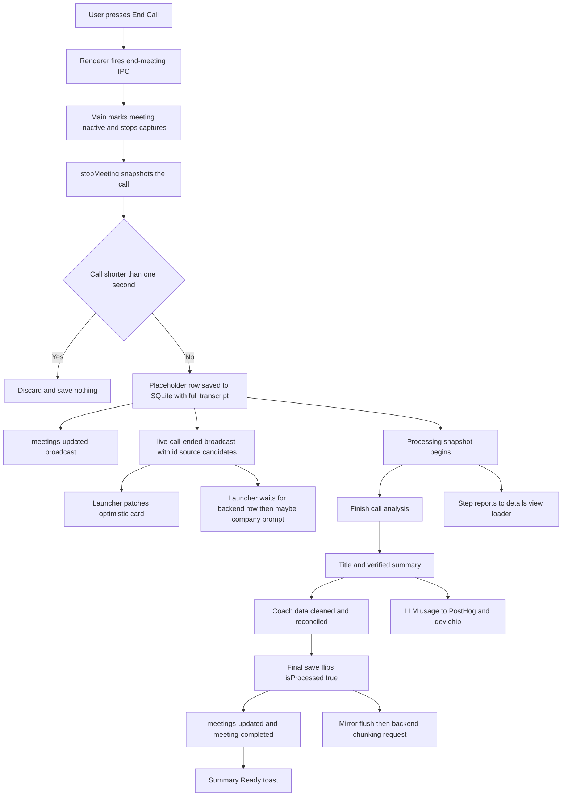
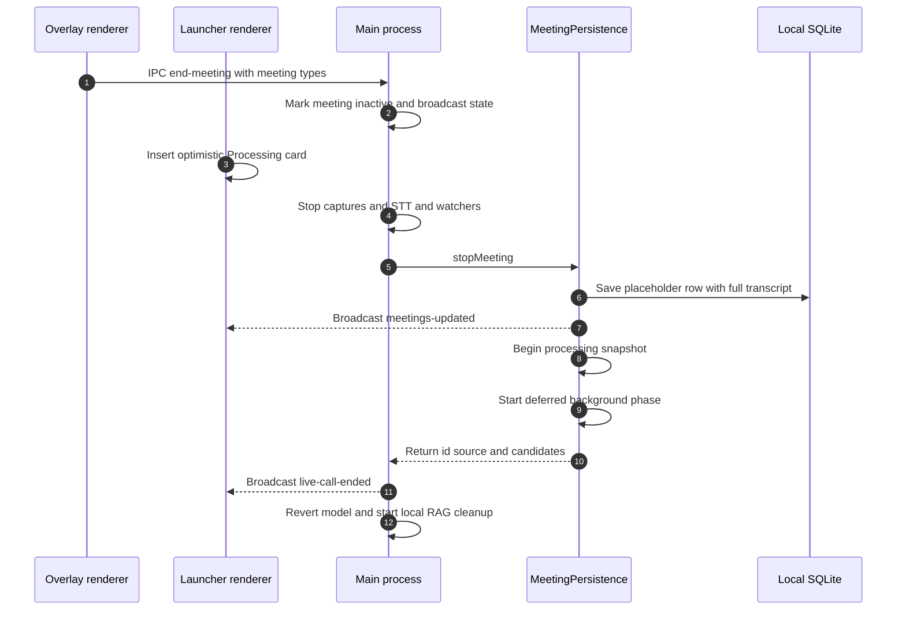
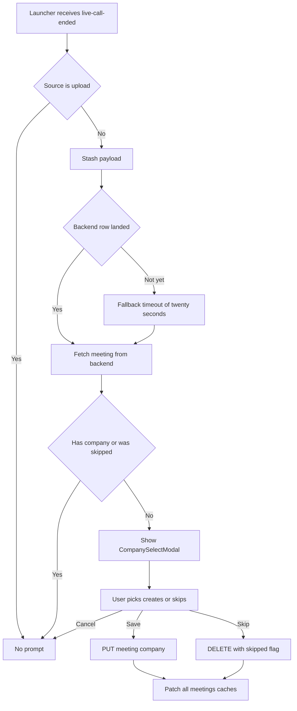
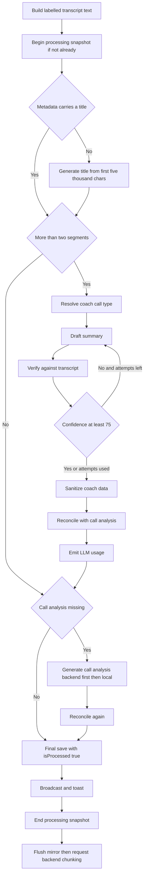
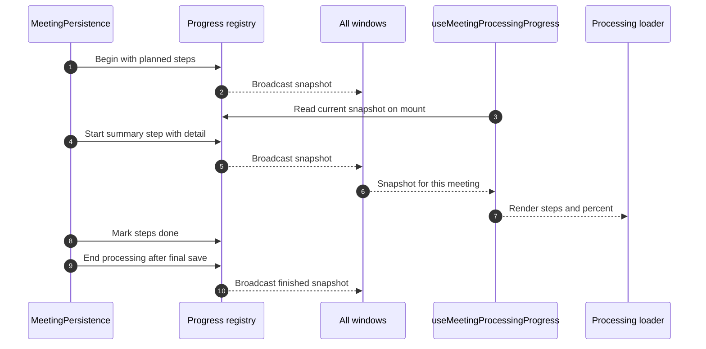

# End Call Flow — Developer Documentation

Everything that happens in GoDojo **after the user presses End Call**, up to the moment the meeting is fully processed: the handoff from the live call, the placeholder meeting row, the "which company was this?" prompt, the end-of-call analysis, background title and summary generation (including the coach-ready data behind the Coach tab), the live progress loader, LLM usage reporting, backend chat-index chunking, the "Processing meeting" card, the "Summary Ready" toast, and every recovery path.

Written for a developer who is new to this codebase. Every technical term is explained the first time it appears.

Related docs:

- `docs/3_Live-Call-Flow.md` — the live call itself. That doc ends where this one begins: the End Call click and the `live-call-ended` broadcast.
- `docs/2_Pre-Call-Flow.md` — how the meeting was detected and started.
- `docs/5_Post-Call-Flow.md` — how a finished meeting is **viewed**: the details-view tabs (Summary/Coach, Call Analysis, Transcript, Ask Dojo), editing, the follow-up email modal, search. This doc only explains how the data those tabs read gets **produced**.
- `docs/AUDIO-PIPELINE.md` — capture, STT, and watchdogs (not repeated here).

Path convention: paths starting with `electron/`, `src/`, or `utils/` are inside `D:\PROJECTS\sales-ai`. Paths starting with `app/` (Python) are inside `D:\PROJECTS\godojo-apis` (the FastAPI backend).

---

## 1. What This Feature Does

GoDojo is an Electron + React desktop app for sales people, with a Python (FastAPI) backend. The end-call phase turns a finished recording into a finished meeting:

1. **Stops everything cleanly** — captures, speech-to-text, watchdogs, the performance sampler — the moment the user presses End Call.
2. **Saves the transcript instantly** — a placeholder meeting row goes into the local SQLite database within milliseconds, already carrying the full transcript. The Transcript tab is usable seconds after hanging up.
3. **Asks "which company was this call with?"** — a picker in the Launcher window, only when the meeting has no company yet and the user has not skipped it.
4. **Finishes the call analysis** — with live analysis v2 enabled, one end-of-call pass over the whole call (`POST /intelligence/live-analysis/v2/end`) produces the final BANT/MEDDIC/objections/signals; otherwise the app waits briefly for the last live-analysis tick to land.
5. **Generates the summary in the background** — a title (unless the calendar or the upload form already gave one), and a structured JSON summary that is fact-checked against the transcript, cleaned, and reconciled against the call analysis. The summary is **call-type aware** (discovery / demo / negotiation) and carries the coach-ready fields the Coach tab renders.
6. **Shows real progress** — main reports each step as it actually starts and finishes over its own IPC channel, and the details view renders a step list with a weighted percentage.
7. **Reports LLM usage** — provider, model, and token counts for the summary generation go to PostHog (`llm_generation_usage`) and to a dev-only chip in the UI.
8. **Mirrors everything to the cloud** — the outbox queue pushes the meeting and transcript rows to Supabase (the Postgres database the backend reads).
9. **Feeds the backend's chat index** — asks the backend to chunk and embed the transcript so "Ask Dojo" chat can answer from it.
10. **Tells the user it's done** — a "Summary Ready" toast on whichever screen the user is looking at, and the meeting card flips from "Processing meeting" to its real title.

Key vocabulary:

- **Two-phase save** — the meeting is saved twice. Phase 1 (synchronous, instant): a placeholder row with `isProcessed = false` and the full transcript. Phase 2 (background, seconds to minutes later): the final row with title and summary, `isProcessed = true`.
- **Placeholder row** — the phase-1 row. Its title is the calendar event's title if there was one, otherwise the literal string `Processing...`.
- **isProcessed** — the boolean column (stored as 0/1) that the UI reads to decide whether a meeting is still processing.
- **Live analysis / call analysis** — the BANT/MEDDIC/objections/signals assessment (`LiveAnalysisData`). Built incrementally during the call, finalized at the end, or generated from the transcript for uploads. It is the single source of truth the summary's BANT/MEDDIC and open loops are reconciled against. Stored at `detailedSummary.liveAnalysis`.
- **Coach call type** — which kind of call this was (`discovery`, `demo`, `negotiation`), resolved by `resolveCoachCallType`. It decides which type-specific coaching blocks the summary prompt asks for.
- **Processing snapshot** — the in-memory record of which background steps are pending, active, or done for one meeting (`MeetingProcessingSnapshot`).
- **Outbox** — `SupabaseMirrorService`'s durable queue of cloud writes. Local SQLite is always written first; the cloud copy arrives when the queue drains.
- **RAG chunking** — splitting the transcript into chunks, embedding them (turning text into vectors), and storing them so chat can search the meeting semantically.

One architectural fact, verified in the code: **the desktop app owns the summary pipeline.** Title, summary, verification, reconciliation, and the local RAG embed all run in the Electron main process with the user's own AI keys (with a backend LLM fallback as the last tier inside `LLMHelper.generateMeetingSummary`). The backend joins the flow in these places: the end-of-call analysis route (called from a renderer on main's behalf), the company association endpoints, the meeting detail/list reads, and the RAG chunking endpoint. The backend's own end-of-call pipeline (`app/services/meetings/background.py`, reached only through `POST /meetings/end`) is not called by the desktop app.

## 2. Simple Mental Model

Think of the end-call phase as a relay race with one baton (the meeting):

```
End Call pressed
  → Runner 1: endMeeting (stop everything, snapshot the call)
  → Runner 2: stopMeeting (placeholder row + transcript to SQLite, instantly)
  → Runner 3: the background worker
        finish analysis → title → summary (draft → verify → retry) → clean + reconcile → final save
  → Runner 4: the mirror outbox (push rows to Supabase; the backend can now see them)
  → Runner 5: the backend (company endpoints, chat index chunking, list/detail reads)

Alongside, a reporter shouts each step to the UI:
  liveAnalysis → title → summary (attempt / verifying) → analysis → save → finished

And the Launcher runs its own loop:
  optimistic card → real placeholder row → poll every 3 s → real title + Summary Ready toast
```

Two ideas explain most of the design:

- **Local first, cloud second.** Everything the UI needs during processing comes from local SQLite or from main directly. The cloud copy is "just a mirror" and can lag by seconds. The UI has one-way merge rules so a lagging mirror can never make a finished card look unfinished again.
- **Failures are non-fatal.** End-of-call analysis fails? Fall back to the live snapshot. Summary fails? Save anyway. Verifier down? Accept the summary ungraded. Call analysis fails? Save without it. The meeting row always lands, and backend chunking is requested whenever the row reached SQLite.

## 3. Big-Picture Diagram



---

## 4. Stage 1 — The End-Call Handoff

Files:

- `src/features/floating-dock/FloatingDock.tsx` — `handleEndCallClick` (the button).
- `src/hooks/useFloatingDock.ts` — `ensureFinalAnalysisBeforeEndCall`, the `run-final-analysis-v2` responder, the `live-call-ended` handler in the overlay window.
- `src/hooks/useMeetingSession.ts` — `handleEndMeeting` (the renderer's end path).
- `electron/ipcHandlers.ts` — the `end-meeting` IPC handler.
- `electron/main.ts` — `AppState.endMeeting`.
- `electron/IntelligenceManager.ts` — thin wrapper; `stopMeeting` forwards to `MeetingPersistence.stopMeeting`.
- `electron/MeetingPersistence.ts` — `stopMeeting`, `runFinalAnalysisV2`.
- `electron/SessionTracker.ts` — transcript, pause totals, session reset.

### 4.1 The button to the IPC call

1. `handleEndCallClick` guards a double-click (`isEndingCall`), then awaits `ensureFinalAnalysisBeforeEndCall()`:
   - **Live analysis v2 enabled** (`LIVE_ANALYSIS_V2_ENABLED`): returns immediately. The end-of-call pass is driven later by main (4.3 step 8); a final tick here would only race it.
   - **v1:** `decideFinalAnalysis` (`src/lib/meetingLifecycle.ts`) decides run / wait / skip. On "run" it awaits only the cheap `setLiveAnalysisInFlight` IPC (so main's settle wait can see the run) and fires the analysis without awaiting the LLM call.
2. `onEndCall(meetingTypes)` calls `handleEndMeeting(meetingTypes)` in `src/hooks/useMeetingSession.ts`, which:
   - Sets `isProcessingMeeting = true` (feeds the post-meeting ad timer; Stage 5).
   - Checks the profile-toaster threshold (8.3).
   - Fires the `end-meeting` IPC **without awaiting**, with payload `{ meetingTypes, tenantId }`. `meetingTypes` is the Discovery/Demo/Negotiation multi-select the rep chose in the dock; it now drives the coach call type of the summary.
   - Switches the window back to launcher mode immediately.
   - On failure, fires PostHog `meeting_end_failed` plus `trackException`.
3. The `end-meeting` handler calls `appState.endMeeting(meetingTypes, tenantId)` and returns `{ success, meetingId }`. The renderer ignores the result.

### 4.2 What `AppState.endMeeting` does, in order (`electron/main.ts`)

1. Stops the meeting performance sampler, sets `isMeetingActive = false` (new data is blocked from this instant), resets the pause flag, and broadcasts `meeting-state-changed` and `meeting-pause-state-changed`. **This first broadcast is what makes the Launcher insert its optimistic card** (4.4).
2. Resets overlay mouse passthrough.
3. Stops, synchronously: stats polling, loop-delay monitor, device watcher, both capture watchdogs, system capture, client STT, mic capture, user STT.
4. `await this.intelligenceManager.stopMeeting(meetingTypes, tenantId)` → `MeetingPersistence.stopMeeting` (4.3). This returns as soon as the placeholder row is saved.
5. If a meeting id came back, broadcasts **`live-call-ended`** with payload `{ meetingId, source, candidates }` (`source` is `manual`, `calendar`, or `upload`; `candidates` is a list of `{ name, domain }`). This is the authoritative "which meeting did this call become" signal.
6. Reverts the LLM to the default model and broadcasts `model-changed`.
7. Flushes any STT provider/key change deferred during the call (`_flushPendingSttResync`).
8. Kicks off **local background RAG work** (not the backend one): `stopLiveIndexing()`, then `processCompletedMeetingForRAG(meetingId)`, then deletes the `live-meeting-current` provisional chunks — only if no new meeting started meanwhile.
9. Returns the meeting id.

If the call was too short (`stopMeeting` returned null), steps 5 and the embed in step 8 are skipped, but the live indexer is still flushed and the provisional chunks are still cleaned up.



### 4.3 What `MeetingPersistence.stopMeeting` does, step by step

Everything up to the deferred block is synchronous on purpose, so the placeholder lands before anything slow happens.

1. **Flush interims** — `session.flushInterimTranscript()` force-finalizes any pending partial sentence.
2. **Snapshot the timing facts** — `start = session.getSessionStartTime()`, `end = Date.now()`, `paused = session.getTotalPausedMs()`, and `duration = max(0, end − start − paused)`. Pause time is subtracted.
3. **Too-short guard** — if `duration < 1000` ms: clear the live-analysis slot, clear any pending-analysis target (`recordPendingLiveAnalysis(null)`), reset the session, return null. **Nothing is saved and nothing is broadcast.**
4. **Take the live analysis by value and clear the slot** — `appState.getCurrentLiveAnalysis()` is read now, synchronously. `endMeeting` already flipped `isMeetingActive`, so any tick landing from here on is routed "drop" (or "patch", 6.5). The slot belongs to whatever call comes next.
5. **Snapshot everything else** — full transcript, AI-interaction usage, session context, meeting metadata (attendees, calendar event, title, source), and the speaker-name map. Then `session.reset()`. Metadata is snapshotted **before** the reset (the BUG-04 fix).
6. **Generate a fresh meeting id** — `crypto.randomUUID()`.
7. **Phase 1 save — the placeholder row.** A `Meeting` object with:
   - `title`: the calendar event's title, else `"Processing..."`.
   - `duration` / `durationMs` from the snapshot.
   - `transcript`: **the real, full transcript**, each segment stamped with a `displayName` by the diarization-aware `resolveSpeakerDisplayName` (`electron/utils/speakerLabels.ts`).
   - `source` from session metadata, `isProcessed: false`, `tenantId`, empty summary.

   `DatabaseManager.saveMeeting(...)` writes it in one SQLite transaction (6.6), then `meetings-updated` is broadcast. The placeholder is saved **before** any background work is started, because an async function's synchronous prefix would otherwise delay the insert.
8. **Begin progress tracking** — `beginMeetingProcessing(meetingId, plan)` with the steps that will really run: `liveAnalysis`, `title` (only when there is no calendar title), `summary` (only when the transcript has more than 2 segments), and `save`. See Stage 4.
9. **Defer phase 2** — a fire-and-forget async block:
   - Starts the `liveAnalysis` step ("Running the end-of-call analysis.").
   - **v2 enabled** (`isFinalAnalysisV2Enabled()`, i.e. `VITE_LIVE_ANALYSIS_V2 === 'true'`): `runFinalAnalysisV2` asks the **overlay** window for the end-of-call pass via `requestFinalAnalysisV2` (`electron/utils/finalAnalysisBridge.ts`, channel `run-final-analysis-v2`, answer on `final-analysis-v2-result`, 65 s ceiling). The overlay's `useFloatingDock` responder runs `finalizeAnalysis()` from `useLiveAnalysisV2` (which calls `POST /intelligence/live-analysis/v2/end`), drops objections for internal meetings, and answers. On success the result is **patched straight onto the placeholder** (`detailedSummary.liveAnalysis` via `updateMeeting`, then `meetings-updated`) so the Call Analysis tab can show it while the summary is still being written, and the pending-analysis target is cleared (`recordPendingLiveAnalysis(null)`).
   - **v1, or the v2 pass failed or returned nothing:** `await appState.waitForLiveAnalysisToSettle(FINAL_ANALYSIS_MAX_WAIT_MS = 10 s)`, then `recordPendingLiveAnalysis(meetingId)` so a late tick can still patch the saved row (6.5). The summary uses the live snapshot from step 4.
   - Completes the `liveAnalysis` step, then `await this.processAndSaveMeeting(snapshot, meetingId, metadataSnapshot, analysisForSummary, speakerNamesSnapshot, undefined, meetingTypes, tenantId)` — Stage 3.
   - If anything throws before `processAndSaveMeeting` takes over, `endMeetingProcessing(meetingId, false)` drops the snapshot.
10. **Compute the company candidates** and return `{ meetingId, source, candidates }`:
    - `deriveCompanyCandidates(attendees, { userEmail })` from `utils/companyDomainShared.ts` drops self/organizer attendees, every attendee on the signed-in user's own email domain, and consumer domains (`CONSUMER_EMAIL_DOMAINS`). What is left becomes `{ name, domain }` pairs, most frequent first.
    - For `source === 'upload'` the list is empty.

### 4.4 The renderer's optimistic card and how it retires

The Launcher shows a processing card through up to three generations of data:

1. **The optimistic card.** The `meeting-state-changed` handler in `src/hooks/useLauncher.ts` fires the instant the meeting goes inactive and prepends a fake card with the fixed id `OPTIMISTIC_LIVE_ID` (`"optimistic-live-call"`), title `PROCESSING_TITLE`, `isProcessed: false`. The fixed id makes the insert idempotent. It also calls `seedMeetingsFromLocal()` right away.
2. **Id patch on `live-call-ended`.** `useLauncher` renames the optimistic card to the real `meetingId` (or drops it if the real row is already listed), patches `selectedMeeting` (a one-time snapshot, not cache-subscribed), and seeds from local SQLite again.
3. **Retirement.** `mergeLocalMeetings(current, local)` folds SQLite rows into the list and deletes the optimistic card as soon as a real processing row exists. `reconcileFetchedMeetings(previous, fresh)` does the same for HTTP refetches. The optimistic card ages out after `OPTIMISTIC_MAX_AGE_MS = 2 minutes`.

The one-way merge rule in `mergeMeetingCopies` (`src/api/meetingMapping.ts`): a meeting only ever moves processing → processed. When the incoming copy (usually the Supabase mirror) still says "processing" but the known copy says "done", the known copy wins, with backend-only fields (`company`, `company_skipped`, `company_candidates`) carried from whichever copy has them. `shouldMergeLocalMeeting` bounds how long a local-only row is trusted (`LOCAL_MERGE_WINDOW_MS = 15 minutes`, always while processing).

## 5. Stage 2 — Company Association at End of Call

Files:

- `src/App.tsx` — the launcher-window listener that decides whether to prompt (`checkAndShowCompanyPrompt`).
- `src/features/meetings/CompanyAssociation.tsx` — `CompanySelectModal` + `CompanyPickerField`.
- `src/api/meetingsApi.ts` — `get`, `setCompany`, `clearCompany`.
- `src/lib/companyAssociation.ts` — `linkMeetingCompany`, `waitForMeetingRow`, `applyCompanyToCaches`, the crash-safe pending queue.
- `utils/companyDomainShared.ts` — `deriveCompanyCandidates` (used in main).
- `electron/db/SupabaseMirrorService.ts` — the `meeting-synced` event.
- `electron/main.ts` — the bridge that turns `meeting-synced` into `meeting-backend-ready`.
- Backend: `app/api/v1/meetings.py`, `app/services/meetings/data_service.py`, `app/services/company_resolution.py`.

### 5.1 Why the prompt waits for the backend

`live-call-ended` fires the instant the **local** placeholder is saved — well before the row reaches Supabase. A `GET /meetings/:id` fired right then would usually 404. So the Launcher (`src/App.tsx`, launcher window only — the dock has no room for a modal):

1. On `live-call-ended`: ignore uploads, stash `{ meetingId, candidates }` in `pendingCompanyCheckRef`, and arm a **20-second fallback timeout**.
2. Wait for **`meeting-backend-ready`**. Main bridges it from `SupabaseMirrorService`'s `meeting-synced`, which fires when a `meetings` **upsert** actually lands in Supabase. `meetings` and `transcripts` are priority tables in the outbox, so this is usually quick.
3. Then `checkAndShowCompanyPrompt`: `meetingsApi.get(meetingId)`, and open the modal only if the meeting has **no** `company` and **no** `company_skipped`. Any lookup failure silently skips the prompt.

In practice the backend check is the filter: a calendar meeting with exactly one external attendee domain usually comes back already auto-associated (5.3), so no prompt; a quick meeting or a multi-domain calendar meeting comes back company-less, so the prompt shows.

### 5.2 The picker

`CompanySelectModal` (mode `post-call`) shows a debounced search combobox over `GET /companies` with a "Create" row, a **"Suggested for this meeting"** group (the candidates from `live-call-ended`), and **Skip** / **Cancel** / **Save**. The full picker UI is documented in `docs/5_Post-Call-Flow.md`.

Save paths:

- **Pick existing** → `meetingsApi.setCompany(id, { company_id })` → `PUT /api/v1/meetings/{id}/company`.
- **Create new / suggestion** → `setCompany(id, { name, domain? })` — strictly either/or with `company_id`.
- **Skip** → `meetingsApi.clearCompany(id, true)` → `DELETE /api/v1/meetings/{id}/company?skipped=true` — records `company_skipped = true` only, so the prompt never re-asks.

On success, `applyCompanyToCaches` patches the detail cache, the company poll, and the launcher list cache.

### 5.3 What the backend does

- `PUT /meetings/{id}/company` → `set_meeting_company`: authorizes in Python, enforces tenant/personal scope (403 on violations), creates or finds the company (`find_or_create_company`) in **the meeting's** workspace, sets `company_id` and clears `company_skipped`. A 404 while the row is still mirroring is expected; the upload path retries it (5.5).
- `GET /meetings/{id}` → `get_meeting` does **lazy company resolution**: exactly one external attendee domain → auto-link; two or more → `company_candidates` on the response; zero → nothing automatic.

The association lives **only** on the backend. `DatabaseManager.saveMeeting`'s mirror upsert uses an explicit column list without `company_id`, so a later local re-save can never clobber it.

### 5.4 The upload variant

The upload modal lets the user pick a company up front. `uploadTranscript` returns as soon as the local placeholder exists, so the same mirror race applies. `src/lib/companyAssociation.ts`:

- `waitForMeetingRow` races `meeting-backend-ready` against a 1.5 s poll, 45 s timeout.
- `linkMeetingCompany` retries the PUT up to 4 times (404/409/5xx/network retryable; 403 thrown straight through).
- `rememberPendingLink` writes the intent to localStorage (`godojo.pendingCompanyLinks`, 7-day TTL) first; `flushPendingLinks` drains it on Launcher mount.



## 6. Stage 3 — Background Processing (Phase 2 of the Two-Phase Save)

Files:

- `electron/MeetingPersistence.ts` — `processAndSaveMeeting`, `generateCallAnalysisFor`, `triggerBackendChunking`, `regenerateSummary`, `uploadTranscript`, `recoverUnprocessedMeetings`.
- `electron/LLMHelper.ts` — `generateMeetingSummary` (provider ladder + usage sink), `generateContentStructured`.
- `electron/llm/summaryPrompt.ts` — `buildSummaryPrompt`, `buildCoachCallTypeSection`, `BANT_MEDDICC_OUTPUT_SCHEMA`.
- `electron/llm/prompts.ts` — `GROQ_TITLE_PROMPT`, `GROQ_SUMMARY_JSON_PROMPT`, `SUMMARY_VERIFICATION_PROMPT`.
- `electron/llm/SummaryVerifier.ts` — `verifySummaryAgainstTranscript`, `buildCorrectionAddendum`.
- `electron/utils/coachCallType.ts` — `resolveCoachCallType`.
- `electron/utils/coachSummaryData.ts` — `sanitizeCoachSummary`, `clearForeignCoachBlocks`.
- `electron/summaryReconciliation.ts` — `reconcileBantMeddicWithLiveAnalysis`, `deriveOpenLoopsFromLiveAnalysis`, `buildMissingWhatIMissed`.
- `electron/utils/callAnalysis.ts` — `generateCallAnalysis`, `meetingTypesForRegenerate`, `hasUsableCallAnalysis`.
- `electron/utils/uploadAnalysisBridge.ts` — `requestUploadAnalysis` (main asks the launcher renderer).
- `electron/utils/uploadAnalysis.ts` — `buildUploadAnalysisPrompt`, `clipForLocalAnalysis`, `normalizeUploadAnalysis` (local fallback analyser).
- `electron/utils/meetingProcessingProgress.ts` — step reporting (Stage 4).
- `electron/utils/llmUsageBus.ts` — `emitLLMUsage` (6.4).
- `electron/utils/speakerLabels.ts` — roster and per-turn labels.
- `electron/db/DatabaseManager.ts`, `electron/db/SupabaseMirrorService.ts`, `electron/utils/backendRagChunking.ts`.

### 6.1 The pipeline, step by step

`processAndSaveMeeting(data, meetingId, metadata, liveAnalysisData, speakerNames, companyIntel, hintMeetingTypes, tenantId)`:



1. **Transcript text rebuild.** The prompt context is rebuilt from the transcript array (not the 10,000-char session context). Non-human speakers (`system`, `ai`, `assistant`, `model`) are filtered out. With two or more far-end voices, prospect turns are labelled per speaker. A roster preamble (`buildSpeakerRoster` / `formatSpeakerRosterBlock`) names participants when display names exist. Nothing from the transcript is logged.
2. **Progress plan.** `beginMeetingProcessing` again — a no-op for live calls (already begun in `stopMeeting`); for uploads and recovery it starts tracking with `title`, `summary`, `analysis` (when no call analysis exists), and `save`.
3. **Title.** If metadata carries a title (calendar event or the upload form), it wins. Otherwise `generateMeetingSummary(titlePrompt, first 5,000 chars, GROQ_TITLE_PROMPT, 'title')`; quotes and asterisks are stripped. Default if everything fails: `"Untitled Session"`.
4. **Summary (only when the transcript has more than 2 segments).**
   - **Coach call type:** `resolveCoachCallType(hintMeetingTypes)` — the rep's live selection (or the upload modal's types), with negotiation > demo > discovery; no selection means discovery.
   - **Prompts:** `buildSummaryPrompt(liveAnalysisData, companyIntel, coachCallType)` (`electron/llm/summaryPrompt.ts`). With call analysis, the prompt gives BANT/MEDDIC, objections (with resolved/handled flags and suggested answers) and signals as **input only** and tells the model not to output `bant`/`meddicc` — code fills those in afterwards. Without it, the prompt includes `BANT_MEDDICC_OUTPUT_SCHEMA` so the model derives them as a last-resort fallback. Both versions append `buildCoachCallTypeSection(coachCallType)`. A compact Groq variant (`GROQ_SUMMARY_JSON_PROMPT` + a condensed analysis block + the same call-type section) is passed for the Groq tier.
   - **Output fields requested:** `overview`, `leadName`, `company`, `salesCoachReview` (`whatIDidRight` as film-review objects `{ time, skill, moment, why }`, `whatICouldHaveDoneBetter` as "Skill: …" strings with a suggested script), `nextCallPlaybook` (`callGoal`, `openingRecap`, `questionsToAsk` as `{ question, gap }`, `valueAndROI`), `keyPoints`, `actionItems`, plus the call-type coaching fields: `openLoops`, `promises`, and `demoReview` (demo calls) or `negotiation` (negotiation calls).
   - **Generate → verify loop:** up to `SUMMARY_MAX_ATTEMPTS = 3`. Each attempt calls `generateMeetingSummary(..., 'summary', usageSink)`; an empty result breaks the loop, and unparseable JSON (after stripping a fenced `json` block) skips to the next attempt. `verifySummaryAgainstTranscript` (a second LLM call through `generateContentStructured`, transcript capped at 20,000 chars) returns a 0–100 confidence and issues. Confidence ≥ `SUMMARY_CONFIDENCE_THRESHOLD = 75` stops the loop; otherwise `buildCorrectionAddendum(issues)` is appended to the next attempt. The **highest-confidence attempt** is kept. The verifier fails open (neutral 50 on its own error), and if it throws anyway the attempt is accepted ungraded.
   - **Coach data cleanup:** `sanitizeCoachSummary(best, coachCallType)` (`electron/utils/coachSummaryData.ts`) drops placeholder ("N/A", "Unknown"…) or incomplete entries in `openLoops`, `promises`, `demoReview` (reactions need feature, verdict `landed`/`follow_up`, quote, speaker; success criteria need metric and target), `negotiation` (terms default to status `open` when the status is invalid; a placeholder walk-away `limit` is removed), and `nextCallPlaybook.callGoal`; removes framework-labelled items from `whatIDidRight`; and keeps only the type-specific block the call type owns (`stakeholders` is always dropped). `coachCallType` is then stamped on the summary.
   - **Reconciliation:** `reconcileBantMeddicWithLiveAnalysis` (`electron/summaryReconciliation.ts`) overwrites `bant`/`meddicc` in code from the call analysis, **replaces `openLoops`** with the analysis's unresolved objections (`deriveOpenLoopsFromLiveAnalysis` — resolved or `handled: 'resolved'` objections excluded, `suggested_answer` carried as `suggestedAnswer`), keeps the LLM's `whatIDidRight` untouched, and falls back to a deterministic `whatIMissedCompletely` list built from Missing fields when the LLM gave nothing substantive. With no call analysis it is a no-op.
   - **Usage:** `emitLLMUsage` with kind `summary_initial` (6.4).
   - Any throw in this block (for example every provider failing) is caught and logged as "Error generating meeting metadata"; processing continues to the final save. The `title` and `summary` steps are marked done either way.
5. **Call analysis when there is none** (uploads, recovery, or a live call where neither the v2 pass nor live ticks produced one). The `analysis` step starts (inserted before `save` if it was not planned). `generateCallAnalysisFor` → `generateCallAnalysis` (`electron/utils/callAnalysis.ts`) needs at least 3 human turns and tries:
   - **Backend first** — `requestUploadAnalysis` (`electron/utils/uploadAnalysisBridge.ts`) asks the **launcher** renderer (`run-upload-analysis`, answer on `upload-analysis-result`, 10-minute ceiling). `useUploadAnalysisBridge` there runs the same v2 end-of-call route over the transcript turns. Skipped when `GODOJO_UPLOAD_ANALYSIS_LOCAL=1`.
   - **Local fallback** — `buildUploadAnalysisPrompt` + `clipForLocalAnalysis` + `normalizeUploadAnalysis`, run through `generateMeetingSummary`. A clipped transcript marks the result `truncated`.
   - The summary is then reconciled again against the new analysis. Failure is non-fatal.
6. **Scorecard: disabled.** The scorecard draft and finalize calls in `processAndSaveMeeting` are commented out, and `postMeetingProgress.ts` deliberately has no scoring step. The helpers (`generateScorecardDraft`, `finalizeScorecard`, `buildScorecardPrompt`, `reconcileScorecardWithLiveAnalysis`) remain in the code but are not called on this path. `meeting:getScorecard` still serves legacy meetings that were scored earlier.
7. **Assemble `detailedSummary`** — the summary data plus `liveAnalysis` (when present) plus `speakerNames` (from the pre-reset snapshot) when a name differs from the Me/Them defaults.
8. **Stamp display names** on every transcript segment.
9. **Final save.** The `save` step starts, then `DatabaseManager.saveMeeting(meetingData, ...)` with `isProcessed: true`, `summary: "See detailed summary"`, title, calendar fields, source, tenant. Uploads with no timestamps keep duration `—`. `savedLocally = true`.
10. **Notify, in order:** `meetings-updated` to all windows **first**, then `meeting-completed`, then the **Summary Ready toast** (`notifyMeetingSummaryReady(title)`).
11. **`finally`:** `endMeetingProcessing(meetingId, savedLocally)` broadcasts the finished snapshot (after `meetings-updated`, so the renderer never hears "finished" before the row exists). If the row was saved locally, `triggerBackendChunking` runs — regardless of whether summary or analysis worked (6.7).

### 6.2 Data produced for the Coach tab and other viewers

What the details view later reads (see `docs/5_Post-Call-Flow.md` for how it is rendered), and where each piece comes from:

| Field in `detailedSummary` | Produced by | Notes |
| --- | --- | --- |
| `overview`, `keyPoints`, `actionItems`, `leadName`, `company` | Summary LLM | Grounded via the verify loop |
| `salesCoachReview.whatIDidRight` | Summary LLM | Film-review objects; framework-labelled items removed by `sanitizeCoachSummary` |
| `salesCoachReview.whatICouldHaveDoneBetter` | Summary LLM | "Skill: …" items with a suggested script |
| `salesCoachReview.whatIMissedCompletely` | LLM, else `buildMissingWhatIMissed` | Deterministic fallback from Missing fields |
| `nextCallPlaybook` incl. `callGoal` | Summary LLM | Placeholder `callGoal` removed |
| `openLoops` | `deriveOpenLoopsFromLiveAnalysis` when analysis exists, else LLM | Unresolved objections only |
| `promises` | Summary LLM | Placeholder entries dropped |
| `demoReview` / `negotiation` | Summary LLM | Only the block matching `coachCallType` is kept |
| `coachCallType` | `resolveCoachCallType` | Reused by regenerate |
| `bant`, `meddicc` | `reconcileBantMeddicWithLiveAnalysis` | Copied from call analysis in code |
| `liveAnalysis` | v2 end pass, live snapshot, or generated call analysis | Call Analysis tab source |
| `speakerNames` | Session snapshot | Only when non-default |

### 6.3 Provider fallbacks inside `generateMeetingSummary`

`LLMHelper.generateMeetingSummary(systemPrompt, context, groqPrompt, task, usageSink)` (`electron/LLMHelper.ts`) is the one entry point for title, summary, local call analysis, and (dormant) scorecard. It injects the language instruction, then tries in order:

1. **Custom / cURL provider** if the user configured one (60 s timeout).
2. **Groq** if the context is under ~100k estimated tokens (45 s timeout, uses the Groq-specific prompt).
3. **Gemini Flash**, 3 attempts with linear backoff.
4. **Gemini Pro**, 5 attempts with exponential backoff (2 s … 32 s), if the Gemini client exists.
5. **Backend fallback** (`callBackendFallback`, the backend's own credentials).

The winning call is reported to `usageSink` as `{ provider, model, inputTokens, outputTokens, estimated }` — real counts from Groq `usage` or Gemini `usageMetadata`, otherwise chars/4 estimates with `estimated: true`. If everything fails it throws with the last real provider error message.

### 6.4 LLM usage reporting (`llmUsageBus`)

`electron/utils/llmUsageBus.ts` is the observability bus for post-call summary generation (and, outside this flow, follow-up email, sales brief, and company insights).

- `processAndSaveMeeting` collects every `LLMUsageCall` its summary drafts report, then after the loop calls `emitLLMUsage` with `kind: 'summary_initial'`, totals, `attempts`, best `confidence`, `durationMs`, and `callType`. `regenerateSummary` does the same with `kind: 'summary_regenerate'`, `attempts: 1`, `confidence: null`.
- `emitLLMUsage` (1) emits on an in-process `EventEmitter`, and (2) captures PostHog **`llm_generation_usage`** through `posthogMain` (`electron/services/PostHogMainService.ts`) with `kind`, `meeting_id`, `providers`, `model`, token totals, `any_estimated`, `llm_calls`, `attempts`, `confidence`, `duration_ms`, `call_type` (plus company/Tavily fields that are null here). Both are wrapped so analytics can never break generation.
- `electron/main.ts` subscribes with `onLLMUsage` at module load and forwards every payload to all windows on **`llm-usage`**.
- `src/lib/llmUsageStore.ts` subscribes at module load, keeps a per-meeting session history, and feeds `LLMUsageChip` (`src/features/meetings/LLMUsageChip.tsx`), which renders only in dev builds (`import.meta.env.DEV`).

What is counted: only the summary draft calls. The verifier's calls (`generateContentStructured`, no sink passed) and the title call are not included. If `generateMeetingSummary` throws, the loop exits through the outer catch and nothing is emitted for that run.

### 6.5 Generation and routing guards (late live results)

Every live-analysis write carries the meeting generation. `AppState.setCurrentLiveAnalysis` routes it through `routeLiveAnalysisWrite` (`electron/liveAnalysisRouting.ts`):

- **store** — belongs to the currently live meeting.
- **patch** — a pending target exists: the result is written into that meeting's **saved row** (`detailedSummary.liveAnalysis` via `updateMeeting`), and the target is consumed.
- **drop** — stale, nothing pending.

On the v1 path the pending target is recorded after the settle wait, so a tick that lands after the summary snapshot can only patch the saved row's Call Analysis; it can never rewrite the summary text. On the v2 path the target is cleared, because the end-of-call pass result is authoritative.

### 6.6 Persistence order and the Supabase mirror

`DatabaseManager.saveMeeting` is used by both phases:

- Refuses to write (logs and returns) when there is no active user database.
- **Write-once facts:** it reads the existing row and pins `owner_uid`, `start_time`, `end_time`, `total_paused_ms`, and `created_at` from the first write. `duration_ms` is recomputed from the pinned values only. Other columns (`title`, `tenant_id`, `source`, `calendar_event_id`, `calendar_event_metadata`, `summary_json`, `is_processed`) are overwritten by every save (`INSERT OR REPLACE`).
- **One transaction:** meetings row, transcripts delete-then-insert, ai_interactions inserts.
- **Mirror enqueue after commit:** explicit-column `meetings` upsert (no `company_id`), a mirrored `deleteRow('transcripts', …)` before the transcript batch upsert (prevents cloud duplicates), then batched transcript and interaction upserts.

`SupabaseMirrorService` drains one item at a time with exponential-backoff retries. `users` and the priority tables (`meetings`, `transcripts`) jump the queue. When a `meetings` upsert lands, it emits `meeting-synced`, which main bridges to `meeting-backend-ready`. `flush(timeoutMs)` waits for the outbox to drain.

### 6.7 Backend RAG: chunking and embedding

`triggerBackendChunking(meetingId, tenantId)` runs from the `finally` of `processAndSaveMeeting`, fire-and-forget:

1. `await SupabaseMirrorService.getInstance().flush(20_000)` — waits up to 20 s for the transcript batch to land, so the first chunking attempt usually succeeds.
2. `requestBackendChunking(meetingId, tenantId)` (`electron/utils/backendRagChunking.ts`):
   - `POST /api/v1/meetings/{id}/chunking` with the Firebase token and tenant header, timeout `CHUNK_TIMEOUT_MS = 5 min`.
   - Up to 3 immediate attempts (0 s, +5 s, +30 s). A 200 with `ingested: false` counts as a failure.
   - 404 → drop; 401 → park in the queue without retrying now.
   - Exhausted → parked in the local `meeting_chunk_queue` table. `drainChunkQueue` runs 20 s after startup and every 10 minutes (`electron/main.ts`), one attempt per row, giving up after `MAX_DRAIN_ATTEMPTS = 15`.
   - Each outcome is captured to PostHog as `rag_chunking_result` (plus an exception report when immediate retries are exhausted).

Backend side, `chunk_meeting` (`app/services/meetings/data_service.py`):

- Zero visible rows: deleted → 404; not mirrored yet → 200 with `ingested: false`.
- With `mark_processing=True` (the app's route), sets the backend row's `is_processed = 0`.
- Pages the transcript (500 rows per page). No transcript → returns with an error and no `ingested` key.
- `ingest_meeting_safe` → `ingest_meeting` (`app/rag/ingest.py`): chunk (`chunk_transcript_objects`), embed (`embed_texts`), resolve meeting types (explicit arg, else `summary_json.detailedSummary.scorecardSummary.detectedTypes` — a key the desktop never writes, so desktop chunks carry empty types), `upsert_chunks` (`app/rag/store.py`), then purge cached chat answers for the meeting.
- Verifies chunks exist; if so, sets `is_processed = 1`.

A separate backend chunk sweep (`app/services/meetings/chunk_sweep.py`, internal route, off unless `meeting_chunk_sweep` is enabled) calls `chunk_meeting(..., mark_processing=False)` for recent meetings with a transcript but no chunks.

### 6.8 The backend's own end-of-call pipeline (unused by the desktop)

`app/services/meetings/background.py` (`process_meeting_background`) is a parallel implementation reachable only via `POST /meetings/end` (`end_live_meeting` in `live_session.py`). The desktop never calls it. `POST /meetings/reap-orphans` closes backend live-session orphans and is likewise irrelevant to desktop rows.

## 7. Stage 4 — Processing State and Progress in the UI

Files:

- `electron/utils/meetingProcessingProgress.ts` — `beginMeetingProcessing`, `startProcessingStep`, `setProcessingStepDetail`, `completeProcessingSteps`, `endMeetingProcessing`, `getMeetingProcessingSnapshot`.
- `src/lib/postMeetingProgress.ts` — shared model: `STEP_META`, `createSnapshot`, `updateStep`, `ensureStep`, `finishSnapshot`, `computeProgressPercent`.
- `src/hooks/useMeetingProcessingProgress.ts` — the renderer subscription.
- `src/features/meetings/PostMeetingProcessingLoader.tsx` — the loader.
- `src/api/meetingMapping.ts` — `isMeetingProcessing`, `PROCESSING_TITLE`.
- `src/features/common/LauncherWidgets.tsx` — `MeetingRow` (the card).
- `src/hooks/useLauncher.ts` — the list poll.
- `src/hooks/useMeetingDetails.ts` — `isProcessing`, unblock effect, stall, `processingStage`, `processingProgress`, `canRegenerate`.
- `src/lib/meetingLifecycle.ts` — `deriveProcessingStage`, `PROCESSING_STALL_TIMEOUT_MS`, `hasGeneratedSummary`.

### 7.1 What "processing" means

`isMeetingProcessing(m)` is the single predicate: `isProcessed === false` or `title === "Processing..."`, with a safety net that treats a row with a real title and summary text as finished.

### 7.2 Real progress reporting (the step loader)

Main keeps an in-memory `Map` of `MeetingProcessingSnapshot`s, one per meeting being processed. Every change is committed and broadcast to all windows on **`meeting-processing-progress`**. Nothing is persisted; a restart simply has no snapshot.

Steps, in execution order (`STEP_META` in `src/lib/postMeetingProgress.ts`):

| Step | Label | Weight | When it is in the plan |
| --- | --- | --- | --- |
| `transcript` | Transcript saved | 5 | Always, already done |
| `liveAnalysis` | Finalizing live analysis | 10 | Live calls |
| `title` | Generating title | 5 | No calendar or typed title |
| `summary` | Writing the summary | 60 | More than 2 segments |
| `analysis` | Analysing the call | 20 | No call analysis; inserted before `save` when it starts |
| `save` | Saving results | 10 | Always |

- `startProcessingStep` marks a step active with a detail string and an optional fraction; `ensureStep` inserts unplanned steps before `save`.
- The summary step reports real sub-progress: each attempt is two round-trips (draft, verify), so the fraction is `((attempt − 1) × 2 + verifying) / 6`. Details read "Drafting key points, action items and coaching notes", "Verifying every claim against the transcript", and "Rewriting to fix issues found while verifying · attempt N of 3".
- `computeProgressPercent` = weighted share of done steps, plus `weight × fraction` for active steps (capped at 0.95 so only finishing completes a step).
- `endMeetingProcessing(meetingId, saved)` broadcasts a finished snapshot (all steps done when saved) and removes it from the map.
- The renderer can also pull the current snapshot with the `get-meeting-processing-progress` IPC.



In the renderer, `useMeetingProcessingProgress(meetingId, enabled)` subscribes **before** doing the initial read (so no event is lost), keeps whichever snapshot has the newer `updatedAt`, and never shows another meeting's steps. `useMeetingDetails` enables it only while `isProcessing && !isProcessingStalled`. `PostMeetingProcessingLoader` renders "Processing your meeting", the active step labels, a monotonic percentage (never moves backwards), an elapsed clock (falls back to the meeting's date when no snapshot exists), and the step list. It avoids heavy animation and goes static under Performance Mode or reduced motion. It appears in the Summary and Call Analysis tabs while processing; once processed, a layout-matching skeleton is shown instead while the detail read loads.

### 7.3 The processing card in the Launcher

`MeetingRow` while `isProcessing`: spinning icon, "Processing meeting" title (pulsing), "Preparing transcript & summary" subtitle, three-dot duration chip, no company chip, `aria-busy`.

### 7.4 Polling and flip-flop protection

- **List poll:** the `['meetings']` query in `useLauncher` refetches every `PROCESSING_POLL_INTERVAL_MS = 3000` while any meeting is processing and younger than `PROCESSING_POLL_TIMEOUT_MS = 5 minutes`. Each fetch pages the slim index and goes through `reconcileFetchedMeetings`.
- **`meetings-updated`** triggers `seedMeetingsFromLocal()` first, then a backend refetch.
- **Details view:** the HTTP detail query is disabled while processing. The transcript comes from local SQLite (`getMeetingDetailsLocal`, polled every 2 s until segments appear). The scorecard is read once with no polling (generation is disabled). The company query polls every 15 s until a company appears. `meeting-backend-ready` for this meeting invalidates the detail and company queries.

### 7.5 The details view: unblocking, stages, stalls

- **Unblock effect** (on mount and on every `meetings-updated`): reads the **local** row first. It unblocks only on positive proof — `isProcessed === true` or real summary prose (`hasGeneratedSummary`). Only when this device has **no** local row does it fall back to `GET /meetings/:id` (complete means `isProcessed` plus a transcript). The local copy never blanks a company already held.
- **`deriveProcessingStage`** now has four stages: `processing` ("Processing your meeting"), `finalizing` (processed, detail read not settled), `ready`, and `stalled`. The per-step detail comes from the progress registry, not from this function.
- **Stall:** `PROCESSING_STALL_TIMEOUT_MS = 5 minutes` from the row's `created_at` (stamped when the call ended). Past it the stage becomes `stalled` ("Processing didn't finish"), the progress subscription stops, and `canRegenerate` unlocks.
- **`isSummaryReady`** = not processing, not regenerating, scorecard read settled, and detail resolved or summary prose already present.

## 8. Stage 5 — Notifications and Completion

Files: `electron/main.ts` (`notifyMeetingSummaryReady`, `showNotificationOnActiveDisplay`, the `llm-usage` forwarder), `electron/preload.ts`, `src/App.tsx`, `src/hooks/useAppLifecycleListeners.ts`, `src/hooks/useMeetingSession.ts`, `src/premium/index.tsx`.

### 8.1 The Summary Ready toast

`notifyMeetingSummaryReady(title)` calls `showNotificationOnActiveDisplay('Summary Ready', '"<title>" has been summarized.')`. It is a custom frameless, always-on-top `BrowserWindow` placed bottom-right of the display the main window is on, shown without stealing focus, auto-dismissed after 4 s, replacing any previous toast. It fires after the `meetings-updated` / `meeting-completed` broadcasts.

### 8.2 Completion broadcasts and telemetry

- `meeting-completed` goes to every window once per successfully saved meeting; `src/App.tsx` tracks PostHog `meeting_completed` in the launcher window only.
- `meetings-updated` fires on the placeholder save, on the v2 analysis patch, on the final save, and on list refreshes.
- `meeting-processing-progress` carries step snapshots (7.2); its last message per meeting has `finished: true`.

### 8.3 The profile toaster threshold

In `handleEndMeeting`, if `godojo_last_meeting_start` shows the call lasted at least 10 s (dev) / 3 minutes (prod), `godojo_show_profile_toaster = true` is written. Its reader lives in the optional premium code; in this repository nothing reads it.

### 8.4 The post-meeting ad timer

`useAppLifecycleListeners` sets `isProcessingMeeting = false` and `lastMeetingEndTime = Date.now()` on every `meetings-updated`, feeding `useAdCampaigns` in `App.tsx`. Because `meetings-updated` fires at the placeholder save too, the timer effectively starts at call end. `src/premium/index.tsx` supplies a no-op hook in this repository.

### 8.5 PostHog events fired during this phase

| Event | Where |
| --- | --- |
| `meeting_end_failed` | `useMeetingSession.handleEndMeeting` |
| `llm_generation_usage` | `emitLLMUsage` in main, once per summary generation or regeneration |
| `meeting_completed` | `src/App.tsx`, launcher window only |
| `rag_chunking_result` | `backendRagChunking.ts`, per chunking outcome |
| `trackException` | wrapped failures (end IPC, regenerate, company association, exhausted chunk retries) |

## 9. Stage 6 — Paths That Reuse This Pipeline

### 9.1 Regenerating the summary

The Regenerate button (enabled when not processing, or when stalled) → `regenerate-meeting-summary` IPC → `MeetingPersistence.regenerateSummary(meetingId)`:

1. Reloads the meeting from SQLite; needs at least 3 transcript segments.
2. Rebuilds the same roster-labelled transcript context.
3. **Call analysis:** uses the stored `detailedSummary.liveAnalysis` if usable (`hasUsableCallAnalysis`). If there is none — or the meeting is an **upload** (its analysis is re-run to pick up analysis fixes) — it runs `generateCallAnalysisFor` with types from `meetingTypesForRegenerate` and a 3-minute backend ceiling (`REGENERATE_ANALYSIS_TIMEOUT_MS`), and writes the new analysis immediately via `updateMeetingSummary`.
4. **Call type:** `resolveCoachCallType(meeting.meetingTypes, stored coachCallType, scorecard detected types, embedded scorecard types)`.
5. **One** generation (no verify loop) with `buildSummaryPrompt(analysis, null, coachCallType)` and the Groq prompt plus the call-type section; usage emitted as `summary_regenerate`.
6. `sanitizeCoachSummary`, stamp `coachCallType`, `reconcileBantMeddicWithLiveAnalysis`, remove any stray `liveAnalysis` key, then `updateMeetingSummary(meetingId, { ...summary, ...clearForeignCoachBlocks(coachCallType) })` — the blanking keys remove type-specific blocks left over from a previous call type. `is_processed` is not touched.
7. Provider errors are rethrown so the IPC handler can return the real message. The scorecard re-score remains commented out. No progress snapshot is created for regenerate; the details view shows its own "Regenerating summary" banner.

### 9.2 The upload-transcript path

`upload-transcript` IPC → `uploadTranscript(rawText, title, meetingTypes, tenantId, repSpeaker)`:

- `parseUploadTranscript` with the rep chosen in the modal, else the speaker matching the signed-in user's name/email, else the first speaker. Fewer than 2 segments → null.
- Placeholder with `source: 'upload'`, the typed title (or `Processing...`), real timestamp span or unknown duration, full transcript; `meetings-updated`.
- Runs the same `processAndSaveMeeting` with `liveAnalysisData = null`, metadata `{ title, source: 'upload' }`, and the modal's meeting types — so the progress plan is `title?` / `summary` / `analysis` / `save`, and the call analysis is generated (backend through the launcher, then local).
- The renderer injects an `optimistic-upload-<timestamp>` card and links the company through the durable queue (5.4).

### 9.3 Recovery of unfinished meetings

`recoverUnprocessedMeetings` runs once at startup (`electron/main.ts` → `IntelligenceManager`). For every row with `is_processed = 0` it reloads details, reuses stored timing facts, and calls `processAndSaveMeeting(snapshot, m.id)` — **with no metadata, no call analysis, no speaker names, no meeting types, and no tenant id** (see 13.1). The no-analysis branch generates a call analysis, the title is regenerated, and the coach call type defaults to discovery. Progress tracking begins fresh (there was no snapshot after the restart).

### 9.4 Edge cases

- **App quit mid-processing** — the placeholder (with transcript) is committed; `is_processed` stays 0; startup recovery finishes it; an open details view would have shown "stalled" after 5 minutes.
- **v2 end pass fails or times out** — falls back to the settle wait and the live snapshot; if that is empty too, the call analysis is generated from the transcript.
- **Every summary provider fails** — logged; the meeting is still saved as processed with no summary; Regenerate is the way back (13.2).
- **Verifier outage** — fails open; the attempt cap prevents a loop.
- **Too-short call** — nothing saved or broadcast; the optimistic card ages out in 2 minutes.
- **A new call during post-processing** — the session was reset in `stopMeeting`; the RAG cleanup skips provisional chunks that now belong to the new call; ids are captured deterministically.
- **Backend unreachable at chunking time** — the durable queue retries every 10 minutes; 401 defers without burning attempts.

## 10. Timers, Thresholds, and Cadences

| Timer / constant | Where | Value |
| --- | --- | --- |
| Final-analysis settle wait (v1) | `FINAL_ANALYSIS_MAX_WAIT_MS` (`MeetingPersistence`, mirrored in `meetingLifecycle`) | 10 s |
| v2 end-of-call pass ceiling | `FINAL_ANALYSIS_V2_TIMEOUT_MS` (`finalAnalysisBridge`) | 65 s |
| Upload/recovery analysis via renderer | `UPLOAD_ANALYSIS_TIMEOUT_MS` (`uploadAnalysisBridge`) | 10 min |
| Regenerate analysis backend ceiling | `REGENERATE_ANALYSIS_TIMEOUT_MS` (`callAnalysis`) | 3 min |
| Min human turns for call analysis | `MIN_TURNS_FOR_CALL_ANALYSIS` | 3 |
| Summary confidence threshold | `SUMMARY_CONFIDENCE_THRESHOLD` | 75 / 100 |
| Summary attempts | `SUMMARY_MAX_ATTEMPTS` | 3 |
| Verifier transcript cap | `SummaryVerifier` | 20,000 chars |
| Title context cap | `processAndSaveMeeting` | first 5,000 chars |
| Groq summary token guard | `generateMeetingSummary` | about 100k estimated tokens |
| Progress active-fraction cap | `MAX_ACTIVE_FRACTION` (`postMeetingProgress`) | 0.95 |
| Processing list poll | `PROCESSING_POLL_INTERVAL_MS` (`useLauncher`) | 3 s |
| Processing poll timeout | `PROCESSING_POLL_TIMEOUT_MS` (`useLauncher`) | 5 min |
| Processing stall timeout | `PROCESSING_STALL_TIMEOUT_MS` (`meetingLifecycle`) | 5 min |
| Local transcript poll (details) | `useMeetingDetails` | 2 s |
| Company resolution poll (details) | `useMeetingDetails` | 15 s |
| Company prompt fallback | `App.tsx` | 20 s |
| Optimistic card max age | `OPTIMISTIC_MAX_AGE_MS` | 2 min |
| Local merge window | `LOCAL_MERGE_WINDOW_MS` | 15 min |
| Summary toast duration | `showNotificationOnActiveDisplay` | 4 s |
| Profile toaster threshold | `useMeetingSession` | 10 s dev / 3 min prod |
| Mirror flush before chunking | `triggerBackendChunking` | 20 s |
| Chunk immediate retries | `IMMEDIATE_RETRY_DELAYS_MS` | +5 s, +30 s |
| Chunk queue drain | `main.ts` | first at 20 s, then every 10 min |
| Chunk give-up | `MAX_DRAIN_ATTEMPTS` | 15 drains |
| Chunk request timeout | `CHUNK_TIMEOUT_MS` | 5 min |
| Company link row wait / poll / attempts | `companyAssociation.ts` | 45 s / 1.5 s / 4 |
| Pending company-link TTL | `PENDING_TTL_MS` | 7 days |
| Pending live-chat link sweep | `useLauncher` | every 15 s |

## 11. IPC Channels and Backend Endpoints on This Path

IPC:

| Channel | Direction | Purpose |
| --- | --- | --- |
| `end-meeting` | renderer → main | stop the call; payload `{ meetingTypes, tenantId }` |
| `run-final-analysis-v2` / `final-analysis-v2-result` | main → overlay → main | end-of-call analysis pass |
| `run-upload-analysis` / `upload-analysis-result` | main → launcher → main | backend call analysis for meetings without one |
| `get-meeting-processing-progress` | renderer → main | current progress snapshot |
| `meeting-processing-progress` (event) | main → all | step snapshot updates |
| `llm-usage` (event) | main → all | LLM usage payloads for the dev chip |
| `upload-transcript` | renderer → main | parse and process a pasted transcript |
| `regenerate-meeting-summary` | renderer → main | re-run summary generation |
| `meeting:getScorecard` | renderer → main | legacy scorecard read |
| `get-meeting-details-local` / `get-meeting-details` / `get-recent-meetings-local` | renderer → main | local-first reads |
| `meeting-state-changed` (event) | main → all | triggers the optimistic card |
| `meetings-updated` (event) | main → all | placeholder, v2 patch, final save, list refresh |
| `live-call-ended` (event) | main → all | `{ meetingId, source, candidates }` |
| `meeting-backend-ready` (event) | main → all | `{ meetingId }` — the row landed in Supabase |
| `meeting-completed` (event) | main → all | once per successfully processed meeting |
| `model-changed` (event) | main → all | default model restored |

Backend (FastAPI, under `/api/v1`):

| Endpoint | Caller | Purpose |
| --- | --- | --- |
| `POST /intelligence/live-analysis/v2/end` | overlay (live) or launcher (upload/recovery) renderer | end-of-call / transcript call analysis |
| `GET /meetings` (paged, `slim`) | `useLauncher` poll | meetings index |
| `GET /meetings/{id}` | company prompt, details fallback | detail read + lazy company resolution |
| `PUT /meetings/{id}/company` | `CompanySelectModal`, upload link | associate a company |
| `DELETE /meetings/{id}/company` | Skip / Remove | record dismissal or unlink |
| `POST /meetings/{id}/chunking` | `requestBackendChunking` | chunk + embed + verify |
| LLM backend fallback | `LLMHelper.callBackendFallback` | last provider tier |
| `POST /meetings/end`, `POST /meetings/reap-orphans` | not the desktop | backend live-session contract only |

## 12. File Inventory

Total relevant files: 64

### Electron main process (29)

| File | Responsibility | Important functions |
| --- | --- | --- |
| `electron/main.ts` | End-call orchestration, toast, mirror bridge, usage forwarder, recovery kick, chunk drain timers | `endMeeting`, `notifyMeetingSummaryReady`, `showNotificationOnActiveDisplay`, `waitForLiveAnalysisToSettle`, `recordPendingLiveAnalysis`, `processCompletedMeetingForRAG`, `onLLMUsage` forwarder |
| `electron/MeetingPersistence.ts` | Two-phase save, analysis, summary pipeline, regenerate, upload, recovery | `stopMeeting`, `runFinalAnalysisV2`, `processAndSaveMeeting`, `generateCallAnalysisFor`, `triggerBackendChunking`, `regenerateSummary`, `uploadTranscript`, `recoverUnprocessedMeetings` |
| `electron/IntelligenceManager.ts` | Facade | `stopMeeting`, `regenerateSummary`, `uploadTranscript`, `recoverUnprocessedMeetings` |
| `electron/SessionTracker.ts` | Session state at stop | `flushInterimTranscript`, `getFullTranscript`, `getTotalPausedMs`, `getMeetingMetadata`, `getSpeakerNameMap`, `reset` |
| `electron/ipcHandlers.ts` | IPC surface | `end-meeting`, `upload-transcript`, `regenerate-meeting-summary`, `get-meeting-processing-progress`, bridge result listeners |
| `electron/preload.ts` | Typed bridge | `endMeeting`, `onLiveCallEnded`, `onMeetingBackendReady`, `onMeetingCompleted`, `onMeetingsUpdated`, `onMeetingProcessingProgress`, `getMeetingProcessingProgress`, `onLLMUsage`, `onRunFinalAnalysisV2`, `onRunUploadAnalysis` |
| `electron/LLMHelper.ts` | Provider ladder and usage sink | `generateMeetingSummary`, `generateContentStructured` |
| `electron/llm/summaryPrompt.ts` | Summary prompts | `buildSummaryPrompt`, `buildCoachCallTypeSection`, `BANT_MEDDICC_OUTPUT_SCHEMA` |
| `electron/llm/prompts.ts` | Shared prompts | `GROQ_TITLE_PROMPT`, `GROQ_SUMMARY_JSON_PROMPT`, `SUMMARY_VERIFICATION_PROMPT` |
| `electron/llm/SummaryVerifier.ts` | Fact-checking | `verifySummaryAgainstTranscript`, `buildCorrectionAddendum` |
| `electron/summaryReconciliation.ts` | Deterministic grounding | `reconcileBantMeddicWithLiveAnalysis`, `deriveOpenLoopsFromLiveAnalysis`, `buildMissingWhatIMissed`, `isPlaceholderSummaryItem` |
| `electron/utils/coachSummaryData.ts` | Coach data cleanup | `sanitizeCoachSummary`, `clearForeignCoachBlocks` |
| `electron/utils/coachCallType.ts` | Call-type resolution | `resolveCoachCallType` |
| `electron/utils/callAnalysis.ts` | Backend-then-local analysis policy | `generateCallAnalysis`, `meetingTypesForRegenerate`, `hasUsableCallAnalysis` |
| `electron/utils/finalAnalysisBridge.ts` | Main ↔ overlay end-of-call request | `requestFinalAnalysisV2`, `handleFinalAnalysisV2Result`, `isFinalAnalysisV2Enabled` |
| `electron/utils/uploadAnalysisBridge.ts` | Main ↔ launcher analysis request | `requestUploadAnalysis`, `handleUploadAnalysisResult`, `isLocalUploadAnalysisForced` |
| `electron/utils/uploadAnalysis.ts` | Local fallback analyser | `buildUploadAnalysisPrompt`, `clipForLocalAnalysis`, `normalizeUploadAnalysis` |
| `electron/utils/meetingProcessingProgress.ts` | Step registry + broadcast | `beginMeetingProcessing`, `startProcessingStep`, `setProcessingStepDetail`, `completeProcessingSteps`, `endMeetingProcessing`, `getMeetingProcessingSnapshot` |
| `electron/utils/llmUsageBus.ts` | Usage bus + PostHog | `emitLLMUsage`, `onLLMUsage` |
| `electron/services/PostHogMainService.ts` | Main-process PostHog (supporting) | `posthogMain.capture` |
| `electron/utils/backendRagChunking.ts` | Durable backend chunk trigger | `requestBackendChunking`, `drainChunkQueue`, `postChunkingForMeeting` |
| `electron/utils/speakerLabels.ts` | Roster and labels | `buildSpeakerRoster`, `formatSpeakerRosterBlock`, `transcriptTurnLabel`, `resolveSpeakerDisplayName`, `hasMultipleClientSpeakers` |
| `electron/utils/uploadTranscriptParser.ts` | Pasted-transcript parsing | `parseUploadTranscript` |
| `electron/liveAnalysisRouting.ts` | Store/patch/drop routing | `routeLiveAnalysisWrite` |
| `electron/db/DatabaseManager.ts` | SQLite writes and pinning | `saveMeeting`, `updateMeeting`, `updateMeetingSummary`, `getUnprocessedMeetings`, `getMeetingDetails` |
| `electron/db/SupabaseMirrorService.ts` | Outbox mirror | `upsertRow`, `upsertRows`, `deleteRow`, `flush`, `meeting-synced` |
| `electron/PendingLiveChatStore.ts` | Live-chat ids saved at call end | `save`, `getPending`, `clearPending` |
| `electron/llm/ScoreCardLLM.ts` | Scorecard prompt (dormant here) | `buildScorecardPrompt` |
| `electron/scorecardReconciliation.ts` | Scorecard grounding (dormant here) | `reconcileScorecardWithLiveAnalysis` |

### Renderer / shared (24)

| File | Responsibility | Important functions / components |
| --- | --- | --- |
| `src/App.tsx` | Company prompt, completion telemetry, upload-analysis bridge mount, ad wiring | `checkAndShowCompanyPrompt`, `useUploadAnalysisBridge` |
| `src/features/floating-dock/FloatingDock.tsx` | End Call button | `handleEndCallClick` |
| `src/hooks/useFloatingDock.ts` | Overlay at call end | `ensureFinalAnalysisBeforeEndCall`, v2 end-pass responder, `live-call-ended` handler |
| `src/hooks/useLiveAnalysisV2.ts` | v2 analysis client (supporting) | `finalizeAnalysis` |
| `src/hooks/useUploadAnalysisBridge.ts` | Launcher-side analysis responder | `useUploadAnalysisBridge` |
| `src/hooks/useMeetingSession.ts` | Renderer end path | `handleEndMeeting` |
| `src/hooks/useLauncher.ts` | List, poll, optimistic cards, uploads | `mergeLocalMeetings`, `seedMeetingsFromLocal`, state/ended/updated handlers |
| `src/hooks/useAppLifecycleListeners.ts` | Ad timer inputs | `onMeetingsUpdated` effect |
| `src/hooks/useMeetingDetails.ts` | Details state while processing | unblock effect, `processingStage`, `processingProgress`, `isProcessingStalled`, `canRegenerate`, `isSummaryReady` |
| `src/hooks/useMeetingProcessingProgress.ts` | Progress subscription | `useMeetingProcessingProgress` |
| `src/features/meetings/PostMeetingProcessingLoader.tsx` | Step loader UI | `PostMeetingProcessingLoader` |
| `src/lib/postMeetingProgress.ts` | Shared progress model | `STEP_META`, `createSnapshot`, `updateStep`, `ensureStep`, `finishSnapshot`, `computeProgressPercent` |
| `src/lib/llmUsageStore.ts` | Usage session store | `useLLMUsage`, `getLLMUsageHistory` |
| `src/features/meetings/LLMUsageChip.tsx` | Dev-only usage chip | `LLMUsageChip` |
| `src/api/meetingMapping.ts` | Processing semantics | `isMeetingProcessing`, `mergeMeetingCopies`, `reconcileFetchedMeetings`, `shouldMergeLocalMeeting`, `OPTIMISTIC_LIVE_ID` |
| `src/api/meetingsApi.ts` | Backend wrappers | `list`, `get`, `setCompany`, `clearCompany` |
| `src/lib/meetingLifecycle.ts` | Pure lifecycle decisions | `decideFinalAnalysis`, `deriveProcessingStage`, `PROCESSING_STALL_TIMEOUT_MS`, `hasGeneratedSummary` |
| `src/lib/companyAssociation.ts` | Durable company linking | `waitForMeetingRow`, `linkMeetingCompany`, `applyCompanyToCaches`, `flushPendingLinks` |
| `src/features/meetings/CompanyAssociation.tsx` | Picker UI | `CompanySelectModal` |
| `src/features/meetings/MeetingDetails.tsx` | Hosts the loader and stalled state | loader placement, Regenerate |
| `src/features/common/LauncherWidgets.tsx` | Meeting card | `MeetingRow` |
| `src/premium/index.tsx` | Optional premium loader | `useAdCampaigns` no-op |
| `src/lib/analytics/posthog.service.ts` | Renderer telemetry | `trackMeetingCompleted`, `trackMeetingEndFailed` |
| `utils/companyDomainShared.ts` | Domain classification | `deriveCompanyCandidates`, `CONSUMER_EMAIL_DOMAINS` |

### Python backend (11)

| File | Responsibility | Important functions |
| --- | --- | --- |
| `app/api/v1/live_analysis_v2.py` | End-of-call analysis route | `POST /intelligence/live-analysis/v2/end` |
| `app/api/v1/meetings.py` | Meeting routes | `get_meeting`, `set_meeting_company`, `clear_meeting_company`, `chunk_meeting` |
| `app/services/meetings/data_service.py` | Meeting data logic | `get_meeting`, `set_meeting_company`, `chunk_meeting` |
| `app/services/meetings/chunk_sweep.py` | Optional backend chunk sweep | `run_chunk_sweep` |
| `app/services/meetings/live_session.py` | Backend live-session contract (unused by desktop) | `end_live_meeting` |
| `app/services/meetings/background.py` | Backend pipeline (unused by desktop) | `process_meeting_background` |
| `app/services/company_resolution.py` | Domain classification | `external_attendee_domains`, `find_or_create_company`, `attach_companies` |
| `app/rag/ingest.py` | Chunk + embed + store | `ingest_meeting`, `ingest_meeting_safe` |
| `app/rag/chunking.py` | Transcript chunking | `chunk_transcript_objects` |
| `app/rag/embeddings.py` | Embeddings | `embed_texts` |
| `app/rag/store.py` | Chunk storage | `upsert_chunks` |

## 13. Identified Gaps / Serious Issues

### 13.1 Startup recovery overwrites the meeting's tenant, source, calendar link, and title

- **What is wrong:** `recoverUnprocessedMeetings` calls `processAndSaveMeeting(snapshot, m.id)` with only two arguments. Inside, `metadata`, `liveAnalysisData`, `speakerNames`, `hintMeetingTypes`, and `tenantId` are all undefined, so `source` defaults to `'manual'`, `calendarEventId` / `calendarEventMetadata` stay undefined, the title is regenerated by the LLM, and `tenantId` becomes null.
- **Where:** `electron/MeetingPersistence.ts` (`recoverUnprocessedMeetings` → `processAndSaveMeeting`), persisted by `electron/db/DatabaseManager.ts` (`saveMeeting`).
- **Evidence:** `saveMeeting` pins only owner, timing, and `created_at`; it writes `meeting.tenantId || null`, `meeting.source || 'manual'`, and the calendar fields straight into both the local `INSERT OR REPLACE` and the Supabase `meetings` upsert. `getUnprocessedMeetings` already returns the row's `title`, `source`, `calendarEventId`, and `calendarEventMetadata` (and `detailedSummary`), but recovery does not pass them on. It also ignores a `detailedSummary.liveAnalysis` that the v2 end pass may already have patched onto the placeholder, and generates a new analysis instead.
- **Why it matters / impact:** any meeting interrupted by a crash or quit loses its tenant association (locally and in Supabase), an upload is relabelled as a quick meeting, a calendar meeting loses its event link and calendar title, and the end-of-call analysis captured from the live session is replaced by a transcript-only one. How each backend read filters on `tenant_id` was not confirmed from the inspected code, but the stored value is definitely cleared.

### 13.2 A total summary failure still marks the meeting processed

- **What / where:** in `processAndSaveMeeting`, the title/summary block is wrapped in a catch that only logs; execution continues to the final save with `isProcessed: true` and no summary.
- **Impact:** if every provider fails (including the backend fallback), the meeting is flagged done with an empty summary, and startup recovery (which only selects `is_processed = 0`) will never retry it. The only way back is the manual Regenerate button. This matches the "failures are non-fatal" design but removes self-healing.

### 13.3 The backend chunking route toggles `is_processed` on the shared row

- **What / where:** `chunk_meeting` (app route, `mark_processing=True`) sets the backend row to `is_processed = 0` before ingesting and only sets it back to 1 when chunks exist. On "No transcript found", on an embed failure, or between a failed attempt and the next queue drain (up to 10 minutes later), the backend row says "processing".
- **Impact:** the desktop list is protected by the one-way `mergeMeetingCopies` rule, but other backend readers (other devices before their local merge, web clients, manager dashboards) can see a finished meeting as processing until a later attempt succeeds.

Lower-severity observations, recorded so they are not mistaken for live behaviour:

- Scorecard generation is fully disabled on this path (calls commented out); regenerate's re-score is also commented out. `meeting:getScorecard` only serves legacy rows.
- `llm_generation_usage` undercounts: verifier and title calls are not included, and a generation that ends in a provider-exhaustion throw emits nothing.
- `saveMeeting` returns silently (no throw) when no user database is active, so `processAndSaveMeeting` would still broadcast completion, show the toast, and request chunking for a row that was not written.
- `godojo_show_profile_toaster` is written but has no reader in this repository.

## 14. Important Functions (quick walkthrough)

`AppState.endMeeting` — `electron/main.ts`
Purpose: stop the world, delegate persistence, broadcast `live-call-ended`, revert the model, flush deferred STT changes, start local RAG cleanup. Called by: `end-meeting` IPC. Calls: `IntelligenceManager.stopMeeting`, `processCompletedMeetingForRAG`.

`MeetingPersistence.stopMeeting` — `electron/MeetingPersistence.ts`
Purpose: snapshot the call, discard too-short calls, save the placeholder with the full transcript, begin progress tracking, start the deferred phase, return company candidates. Called by: `IntelligenceManager.stopMeeting`. Calls: `saveMeeting`, `beginMeetingProcessing`, `runFinalAnalysisV2` or `waitForLiveAnalysisToSettle`, `processAndSaveMeeting`, `deriveCompanyCandidates`.

`MeetingPersistence.runFinalAnalysisV2` — `electron/MeetingPersistence.ts`
Purpose: get the end-of-call analysis from the overlay and patch it onto the placeholder. Calls: `requestFinalAnalysisV2`, `updateMeeting`.

`MeetingPersistence.processAndSaveMeeting` — `electron/MeetingPersistence.ts`
Purpose: title, verified call-type-aware summary, coach cleanup, reconciliation, usage report, call analysis when missing, final save, broadcasts, toast, progress end, backend chunk trigger. Called by: `stopMeeting`, `uploadTranscript`, `recoverUnprocessedMeetings`.

`generateMeetingSummary` — `electron/LLMHelper.ts`
Purpose: provider ladder (custom → Groq → Gemini Flash → Gemini Pro → backend) with usage reporting.

`verifySummaryAgainstTranscript` / `buildCorrectionAddendum` — `electron/llm/SummaryVerifier.ts`
Purpose: grade a summary 0–100 against the transcript (fails open) and turn issues into correction text.

`resolveCoachCallType` — `electron/utils/coachCallType.ts`
Purpose: pick discovery, demo, or negotiation from the available sources.

`sanitizeCoachSummary` / `clearForeignCoachBlocks` — `electron/utils/coachSummaryData.ts`
Purpose: make the coach-ready fields trustworthy and keep only the call type's own blocks.

`reconcileBantMeddicWithLiveAnalysis` — `electron/summaryReconciliation.ts`
Purpose: copy BANT/MEDDIC and open loops from the call analysis in code.

`generateCallAnalysis` — `electron/utils/callAnalysis.ts`
Purpose: backend producer first (through the launcher renderer), local analyser second.

`beginMeetingProcessing` / `startProcessingStep` / `endMeetingProcessing` — `electron/utils/meetingProcessingProgress.ts`
Purpose: track and broadcast real processing steps.

`emitLLMUsage` — `electron/utils/llmUsageBus.ts`
Purpose: forward usage to the renderer and capture PostHog `llm_generation_usage`.

`DatabaseManager.saveMeeting` — `electron/db/DatabaseManager.ts`
Purpose: one transactional save with pinned write-once facts, followed by mirror enqueues.

`requestBackendChunking` / `drainChunkQueue` — `electron/utils/backendRagChunking.ts`
Purpose: immediate retries, then a durable queue for backend RAG ingest.

`useMeetingProcessingProgress` — `src/hooks/useMeetingProcessingProgress.ts`
Purpose: subscribe to one meeting's progress snapshots for the loader.

`deriveProcessingStage` — `src/lib/meetingLifecycle.ts`
Purpose: map processing / finalizing / ready / stalled.

`recoverUnprocessedMeetings` — `electron/MeetingPersistence.ts`
Purpose: finish meetings left at `is_processed = 0` at startup.

## 15. Module Connections

```
Overlay renderer (End Call, meeting types)
        ↓ IPC end-meeting
AppState.endMeeting (main)
        ├─ stops captures / STT / watchers / sampler
        ├─ MeetingPersistence.stopMeeting
        │       ├─ SessionTracker (snapshot + reset)
        │       ├─ DatabaseManager.saveMeeting → SQLite placeholder + transcript
        │       ├─ meetings-updated → Launcher card, ad timer
        │       ├─ meetingProcessingProgress → meeting-processing-progress → details loader
        │       └─ deferred:
        │             ├─ v2: finalAnalysisBridge → overlay → POST /v2/end → patch placeholder
        │             ├─ v1: waitForLiveAnalysisToSettle → recordPendingLiveAnalysis
        │             └─ processAndSaveMeeting
        │                   ├─ LLMHelper (title, summary drafts) + SummaryVerifier
        │                   ├─ coachCallType → summaryPrompt → coachSummaryData → summaryReconciliation
        │                   ├─ llmUsageBus → PostHog + llm-usage → dev chip
        │                   ├─ callAnalysis → uploadAnalysisBridge → launcher → POST /v2/end, else local
        │                   ├─ DatabaseManager final save → SupabaseMirrorService
        │                   ├─ meetings-updated + meeting-completed + Summary Ready toast
        │                   └─ mirror flush → requestBackendChunking → POST /meetings/{id}/chunking
        ├─ live-call-ended { meetingId, source, candidates }
        │       ├─→ Launcher: optimistic card id patch
        │       ├─→ Overlay: pending live-chat ids saved
        │       └─→ App.tsx: stash → meeting-backend-ready → company prompt
        └─ local RAG: stopLiveIndexing → processCompletedMeetingForRAG → cleanup

SupabaseMirrorService
        └─ meeting-synced → main → meeting-backend-ready
```

In plain words: the main process owns the meeting and the summary work; SQLite is the immediate truth; renderers act as API couriers for the analysis route because they own the auth token; the progress registry tells the UI what main is really doing; the mirror eventually tells the backend; and the backend owns company association, reads, and the chat index.

## 16. Common Questions

**Q: Why can I read the transcript immediately but the summary takes a minute?**
The two-phase save. The placeholder committed at call end already contains the full transcript.

**Q: Is the progress percentage real?**
Yes. It is the weighted share of steps main has actually finished, plus a bounded fraction for the summary step based on which attempt and which half (draft or verify) is running. Nothing is timer-driven.

**Q: Why might the Call Analysis tab fill in before the summary?**
With live analysis v2, the end-of-call pass result is patched onto the placeholder as soon as it arrives, before summary generation starts.

**Q: Where does the Coach tab's data come from?**
From the summary JSON generated in `processAndSaveMeeting`: the call-type-aware prompt, then `sanitizeCoachSummary`, then `reconcileBantMeddicWithLiveAnalysis` (which owns `openLoops`). See 6.2.

**Q: Does the meeting still get a score?**
Not on this path. Scorecard generation is disabled; only legacy scorecards are read.

**Q: What does `llm_generation_usage` measure?**
The summary draft calls of one generation or regeneration: providers, model, token totals, attempts, confidence, duration, call type. Verifier and title calls are not included.

**Q: What happens if I quit while a summary is generating?**
The placeholder is in SQLite; startup recovery regenerates it (with the caveats in 13.1).

**Q: Does the desktop call the backend to generate the summary?**
Not normally. Summaries run locally with the user's providers; the backend is only the last fallback tier inside `generateMeetingSummary`. The backend does produce the end-of-call call analysis when v2 is enabled or for uploads/recovery.

## 17. Quick Reference

- Feature entry points: the End Call button (`FloatingDock.tsx` → `handleEndMeeting`), the upload modal submit (`useLauncher`), Regenerate (`regenerate-meeting-summary`), and startup recovery (`recoverUnprocessedMeetings`).
- Primary flow: `end-meeting` → `AppState.endMeeting` → `MeetingPersistence.stopMeeting` (placeholder + transcript, `meetings-updated`, progress begins, `live-call-ended`) → deferred: v2 end pass or settle wait → `processAndSaveMeeting` (title → generate/verify summary → sanitize → reconcile → usage → call analysis if missing → final save) → `meetings-updated` + `meeting-completed` + toast → progress finished → mirror flush → `requestBackendChunking`; in parallel the mirror drains → `meeting-backend-ready` → company prompt.
- Relevant files: 64 (29 Electron main, 24 renderer/shared, 11 backend).
- Primary IPC: `end-meeting`, `run-final-analysis-v2`, `run-upload-analysis`, `get-meeting-processing-progress`, `upload-transcript`, `regenerate-meeting-summary`; events `meeting-state-changed`, `meetings-updated`, `live-call-ended`, `meeting-processing-progress`, `llm-usage`, `meeting-backend-ready`, `meeting-completed`, `model-changed`.
- Most important functions: `AppState.endMeeting`, `MeetingPersistence.stopMeeting`, `runFinalAnalysisV2`, `processAndSaveMeeting`, `generateMeetingSummary`, `verifySummaryAgainstTranscript`, `resolveCoachCallType`, `sanitizeCoachSummary`, `reconcileBantMeddicWithLiveAnalysis`, `generateCallAnalysis`, `emitLLMUsage`, `beginMeetingProcessing`, `DatabaseManager.saveMeeting`, `requestBackendChunking`, `useMeetingProcessingProgress`, `recoverUnprocessedMeetings`.
- Current serious issues: startup recovery overwrites tenant, source, calendar link, and title (13.1); a total summary failure is still marked processed (13.2); backend chunking toggles `is_processed` on the shared row (13.3).
