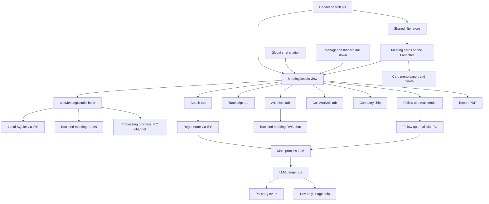
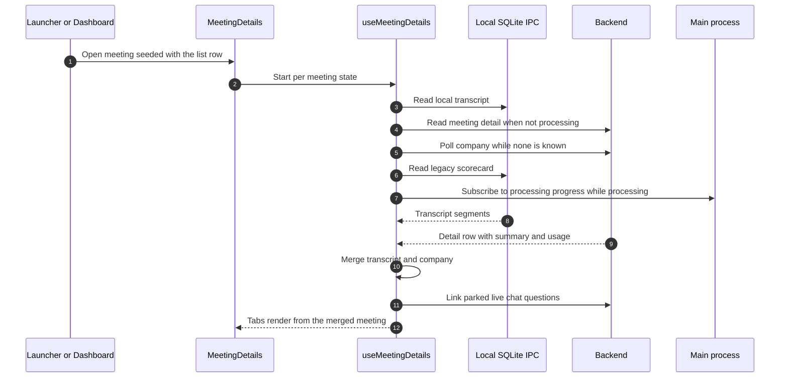
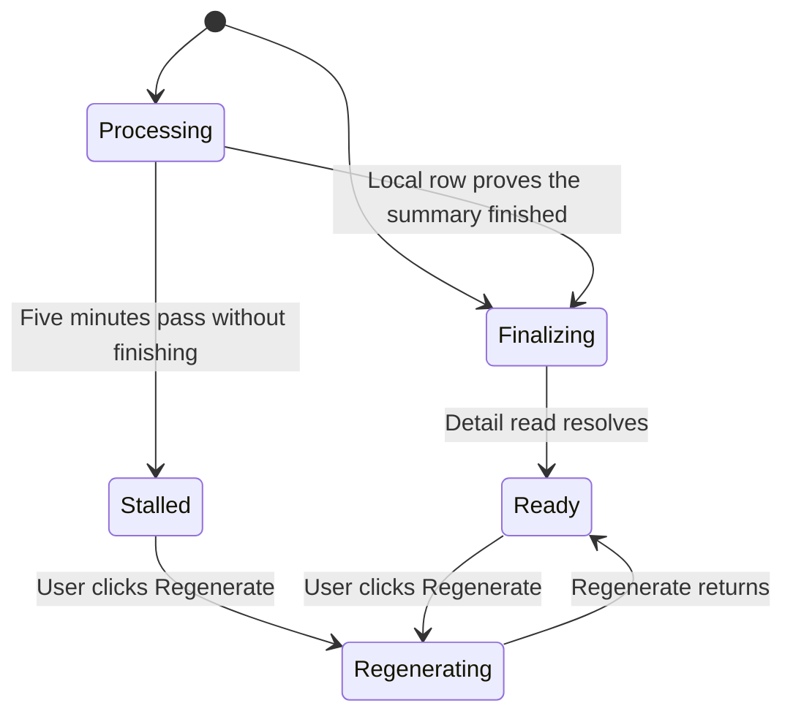
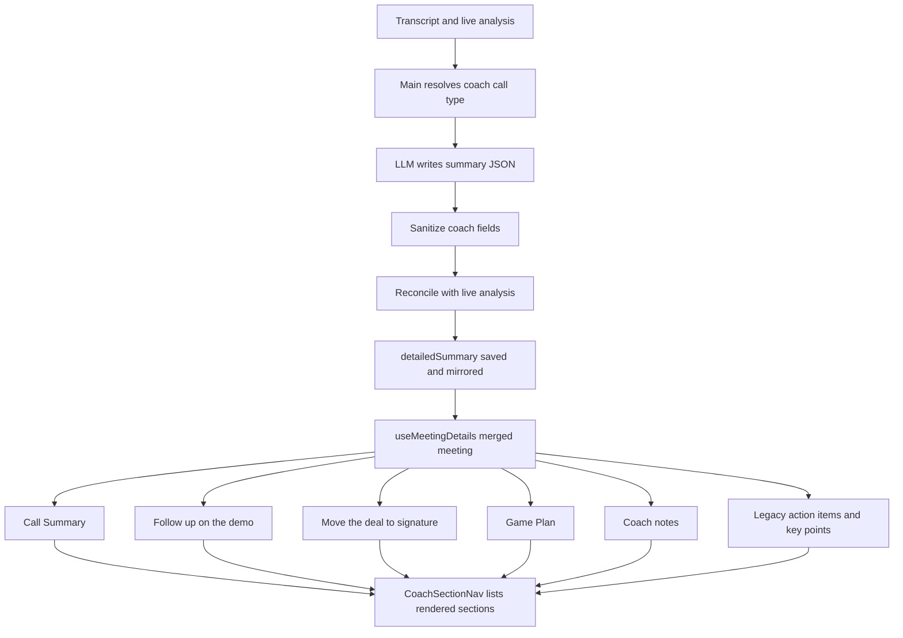
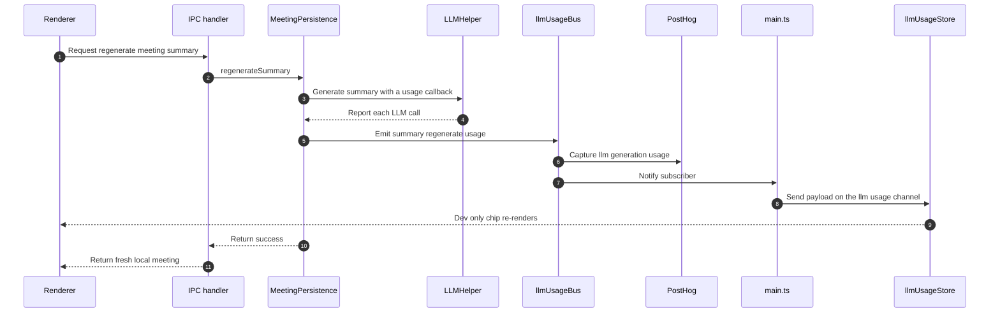
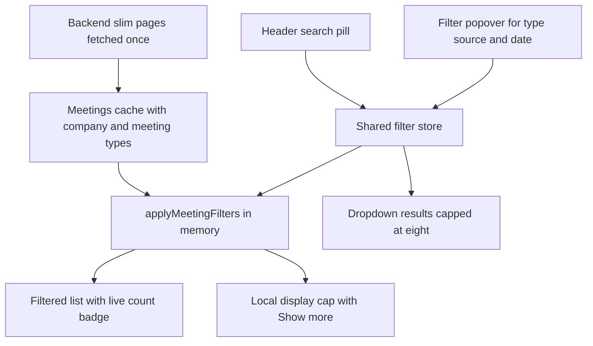
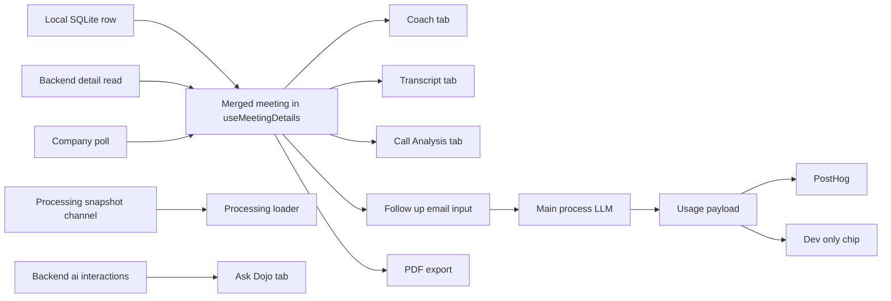

# Post-Call Flow — Developer Documentation

Everything the user can do with a meeting in GoDojo **after the meeting exists**: opening the details view, watching the live processing loader, the four tabs (**Coach** / Transcript / Ask Dojo / Call Analysis), editing, regenerating, the company chip, the follow-up email, the meeting cards on the Launcher (open, export to PDF, delete), search and filters, uploading a transcript, and the manager dashboard's drill-down into a rep's calls. It also covers the LLM usage reporting that now rides along with summary regeneration and follow-up email generation.

Written for a developer who is new to this codebase. Every technical term is explained the first time it appears.

Related docs:

- `docs/4_End-Call-Flow.md` — how the meeting got here: the end-call handoff, `processAndSaveMeeting`, summary generation (including the initial `summary_initial` usage report), the Supabase mirror, RAG chunking, recovery. That doc **produces** the data; this doc **consumes and acts on** it.
- `docs/3_Live-Call-Flow.md` — the live call itself (live chat, live analysis).
- `docs/2_Pre-Call-Flow.md` — calendar detection, the Sales Brief and company insights (which also report LLM usage through the same bus described in section 5.10).
- `docs/1_Auth-Flow.md` — sign-in, sessions, tenants.

Path convention: paths starting with `electron/`, `src/`, or `utils/` are inside `D:\PROJECTS\sales-ai`. Paths starting with `app/` (Python) are inside `D:\PROJECTS\godojo-apis` (the FastAPI backend).

---

## 1. What This Feature Does

GoDojo is an Electron + React desktop app for salespeople, with a Python (FastAPI) backend. After a call ends (or a transcript is uploaded), a meeting row exists. Background processing then fills in its title, summary and call analysis. The post-call phase is everything the user does with that meeting:

1. **Open the meeting** — from a card on the Launcher, from the header search, from a Global Chat citation, or from the manager dashboard. One details view serves every entry point.
2. **Watch it finish processing** — if the meeting is still processing, the view shows a real step-by-step progress loader driven by what the main process is actually doing.
3. **Read the Coach tab** (the old "Summary" tab, renamed) — Call Summary, call-type panels for demos and negotiations, a fixed five-part Game Plan for the next call, and Coach's notes. A sticky "Coach sections" rail on the right lets the user jump between sections.
4. **Read the other tabs** — Transcript (speaker-labelled turns plus a sticky Speaking Balance panel), Ask Dojo (persisted Q&A about this meeting), and Call Analysis (MEDDICC, BANT, signals, objections, deal alerts, with its own section rail).
5. **Edit** — the title, and for legacy meetings the action items, key points and their section titles, are inline-editable with optimistic UI.
6. **Regenerate** — re-run summary generation. Regenerate now also (re)builds a missing Call Analysis and refreshes an upload's analysis, and reports its LLM token usage.
7. **Manage the company** — view, change, or remove the customer company via a chip in the header.
8. **Draft a follow-up email** — always generated by a fresh LLM call, editable, copied to the clipboard; also reports LLM token usage.
9. **Export to PDF** — from the details header or from a card's context menu; **delete** from the card's context menu.
10. **Search and filter** — a header search pill (⌘K) that both shows instant results and filters the meetings list.
11. **Upload a transcript** — paste a transcript, optionally pick which speaker is "you", and it rides the same processing pipeline as a live call.
12. **Review as a manager** — the dashboard drills into a rep's calls and opens the same details view.

Key vocabulary:

- **Meeting card / row** — one entry in the Launcher's "My Meetings" list (`MeetingRow` in `src/features/common/LauncherWidgets.tsx`).
- **Details view** — the full-page view for one meeting (`MeetingDetails` in `src/features/meetings/MeetingDetails.tsx`). It is not a separate window; it replaces the Launcher's content area (or fills the dashboard's drill-down panel).
- **detailedSummary** — the structured summary JSON in the meeting row's `summary_json`. The Coach tab reads these fields of it: `keyPoints`, `nextCallPlaybook` (`callGoal`, `openingRecap`, `questionsToAsk`, `valueAndROI`), `openLoops`, `promises`, `demoReview`, `negotiation`, `salesCoachReview`, `coachCallType`, plus legacy `actionItems`. The Call Analysis tab reads `liveAnalysis`.
- **coachCallType** — the kind of call the summary was generated for: `discovery`, `demo` or `negotiation`. It is stamped by the Electron generator (never by the LLM), resolved with the priority "rep's selected types, then the previously stamped type, then scorecard-detected types, then discovery"; within a source, negotiation beats demo beats discovery.
- **Processing snapshot** — a small object main publishes while a meeting is being processed: the list of planned steps (transcript, live analysis, title, summary, analysis, save), each `pending`, `active` or `done`.
- **React Query cache keys** — `['meetings']` (the list), `['meeting', id]` (one meeting's detail), `['meeting-company', id]` (company poll), `['meeting-local-transcript', id]` (local transcript fallback), `['meeting-scorecard', id]` (legacy scorecard IPC read), `['ai-interactions', id]` (Ask Dojo history).
- **Optimistic UI** — the UI updates first, the server second; if the server fails, the UI rolls back.
- **Write-through** — after an HTTP write succeeds, the same value is also written to local SQLite over IPC so the async Supabase mirror cannot clobber the edit.
- **LLM usage payload** — a record of which provider/model served a generation and how many input/output tokens it used, emitted by `electron/utils/llmUsageBus.ts`.

One architectural fact, verified in the code: **all AI work in this phase runs in the Electron main process with the user's own keys** (summary regeneration, call-analysis regeneration, follow-up email). The backend handles meeting reads and writes, the company association, the Ask Dojo history, the meeting-scoped RAG chat, and an LLM fallback endpoint used only when the follow-up email's local providers fail.

## 2. Simple Mental Model

Think of the post-call phase as a library with one catalog and one reading room:

```
The catalog (built once):  full slim index of every meeting, paged in from the backend
The header pill:           search box + filter chips → a shared filter store
The shelf:                 applyMeetingFilters slices the catalog in memory — zero API calls
The reading room:          MeetingDetails — one meeting, four tabs, local-first reads
The progress board:        while processing, main's real steps drive the loader
The coach's desk:          Coach tab panels render detailedSummary fields, never invent data
The edits:                 optimistic UI → backend PATCH → local write-through
The heavy jobs:            regenerate + follow-up email → IPC → main process LLM → usage report
```

Four ideas explain most of the design:

- **One list, filtered in memory.** The Launcher fetches the whole meeting index once (slim, card-shaped rows); search, filters, the count badge and "Show more" are local operations.
- **Local first, backend second.** The transcript and the "is it finished?" check read local SQLite first. HTTP is only the fallback for meetings this device never saw.
- **Paint only real data.** Each tab renders when all of its data has landed, and the processing loader shows only steps main has actually reported. No timers fake progress.
- **Presentation only on the Coach tab.** Every Coach panel renders fields straight from `detailedSummary`; a panel with no data either hides or shows a quiet "nothing was captured" note.

## 3. High-Level Architecture



---

## 4. End-to-End Flow

A typical post-call session, in order:

1. The user clicks a meeting card. `handleOpenMeeting` in `src/hooks/useLauncher.ts` stores the meeting as `selectedMeeting`, and `Launcher.tsx` renders `MeetingDetails` keyed by meeting id.
2. `useMeetingDetails` seeds the view with the list row, then starts its reads: the backend detail read, the local transcript fallback, the company poll, and the legacy scorecard IPC read.
3. If the meeting is still processing, the Coach and Call Analysis tabs show `PostMeetingProcessingLoader`, fed by `useMeetingProcessingProgress`. A local-first "unblock" check flips the view to ready once the local row is finished.
4. The Coach tab renders Call Summary, the demo and negotiation panels when the call involved those types, the Game Plan and Coach's notes, with the `CoachSectionNav` rail beside them.
5. The user may switch tabs, edit the title, ask Dojo a question (meeting-scoped RAG chat), change the company, or regenerate.
6. Regenerate calls the `regenerate-meeting-summary` IPC. Main regenerates (and, when needed, builds the call analysis first), saves locally, emits a `summary_regenerate` usage payload, and returns the fresh local row.
7. The user opens the follow-up email modal. `useFollowUpEmail` resolves the recipient, then calls the `generate-followup-email` IPC; main generates the email and emits a `followup_email` usage payload.
8. The user exports a PDF (`generateMeetingPDF`) or goes back to the list, where they can search, filter, export or delete.

---

## 5. Detailed Execution Flow

### 5.1 Opening a meeting: the details view

Files: `src/features/common/Launcher.tsx`, `src/features/common/LauncherWidgets.tsx`, `src/hooks/useLauncher.ts`, `src/features/meetings/MeetingDetails.tsx`, `src/hooks/useMeetingDetails.ts`, `src/api/meetingsApi.ts`, `src/api/meetingMapping.ts`.

**Entry points.**

1. **From a card.** `MeetingRow` calls `onOpen(m)` → `handleOpenMeeting` in `useLauncher`, which sets `selectedMeeting` and fires PostHog `meeting_details_view`. `Launcher.tsx` renders `<MeetingDetails key={selectedMeeting.id} …/>`. The `key` matters: `useMeetingDetails` holds per-meeting state (active tab, chat messages, processing flag), and without it switching meetings would reuse the previous meeting's UI.
2. **From the search pill.** Selecting a result calls `onOpenMeeting(meetingId)`; `Launcher.handleOpenMeetingFromSearch` first closes any open Settings or Manager Dashboard overlay so the meeting is not rendered behind it.
3. **From Global Chat.** A meeting citation finds the meeting in the cached list and opens it like a card click.
4. **From the dashboard.** `useAeDetail.handleSelectCall` builds a placeholder meeting (`placeholderMeetingFromCall`) and `AEDetailView` renders `MeetingDetails` with `viewContext="ae_review"` (section 5.14).

On mount, `MeetingDetails` fires a PostHog page view named `meeting_details` (or `ae_meeting_details` in the dashboard).

**What loads.** `useMeetingDetails(initialMeeting)` runs these reads in parallel:

| Read | Cache key | Source | When it runs |
| --- | --- | --- | --- |
| Detail | `['meeting', id]` | `meetingsApi.get` → `GET /api/v1/meetings/{id}` → `mapMeetingDetail` | Not while processing; never for `optimistic-*` or `live-meeting-current` ids. The list row is `initialData`, with `initialDataUpdatedAt: 0` so "resolved" only becomes true after a real fetch. |
| Local transcript | `['meeting-local-transcript', id]` | `getMeetingDetailsLocal` IPC first, then the cloud-preferring `getMeetingDetails` IPC | Whenever the detail's transcript is empty. Polls every 2 s until segments appear. Not gated on processing. |
| Company poll | `['meeting-company', id]` | a second `meetingsApi.get`, keeping only `company` | While the meeting has no company. Polls every 15 s until one resolves. |
| Scorecard (legacy) | `['meeting-scorecard', id]` | `meetingGetScorecard` IPC (`meeting:getScorecard`) | One read, no polling. Scorecard generation is disabled in processing, so this only serves older, already-scored meetings. |
| Ask Dojo history | `['ai-interactions', id]` | `GET /meetings/{id}/ai-interactions?limit=N` | Lazily, only when the Ask Dojo tab is opened and the meeting is not processing. |

The view's `meeting` object is a merge: the local transcript wins permanently once loaded (it never swaps back to the backend's possibly differently-chunked copy), `dedupeTranscript` drops exact back-to-back duplicate lines within 500 ms, and the company poll only **fills a gap** — a company already on the detail read always wins.

**Backend-ready listener.** On the `meeting-backend-ready` broadcast for this meeting id (the row has landed in Supabase), the detail and company queries are invalidated so a meeting opened during mirror lag re-reads instead of waiting for the next mount.

**Linking live-chat questions.** Questions asked in the live chat during the call are parked locally at call end. Once the detail read has really completed (`dataUpdatedAt > 0`), the view reads `getPendingLiveChatInteractions`, links them with `chatApi.linkMeetingInteractions` (`POST /api/v1/live/link-meeting`), and clears them. On failure they stay parked; `useLauncher` also runs a 15-second sweep that links pending ids for every meeting.



### 5.2 The processing skeleton and the summary progress loader

Files: `src/features/meetings/PostMeetingProcessingLoader.tsx`, `src/hooks/useMeetingProcessingProgress.ts`, `src/lib/postMeetingProgress.ts`, `electron/utils/meetingProcessingProgress.ts`, `src/lib/meetingLifecycle.ts`, `src/features/meetings/MeetingSummarySkeleton.tsx`, `src/features/meetings/CallAnalysisSkeleton.tsx`.

This replaced the older stage-label banner. The rule is now **two distinct placeholders, never mixed**:

- **Still processing** → `PostMeetingProcessingLoader`, which shows the real background steps main reports.
- **Already processed, detail read still in flight** → a layout-matching skeleton (`MeetingSummarySkeleton` on the Coach tab, `CallAnalysisSkeleton` on Call Analysis).

**Where the steps come from.** Main tracks one `MeetingProcessingSnapshot` per meeting in `electron/utils/meetingProcessingProgress.ts` and pushes it on its own IPC channel, `meeting-processing-progress`; the `get-meeting-processing-progress` handler returns the current snapshot. This channel is deliberately separate from every meeting-detail read. The step model lives in `src/lib/postMeetingProgress.ts` (shared by main and renderer):

| Step id | Label | Weight | When it is in the plan |
| --- | --- | --- | --- |
| `transcript` | Transcript saved | 5 | Always, already done |
| `liveAnalysis` | Finalizing live analysis | 10 | Live calls |
| `title` | Generating title | 5 | Only when no title was supplied (for example, no calendar title) |
| `summary` | Writing the summary | 60 | Transcripts longer than 2 segments |
| `analysis` | Analysing the call | 20 | Only when no live analysis exists (uploads, recovery); can be inserted mid-run by `ensureStep` |
| `save` | Saving results | 10 | Always |

How the step model is produced is covered in `docs/4_End-Call-Flow.md`; this doc only consumes it.

**How the renderer consumes it.** `useMeetingProcessingProgress(meetingId, enabled)` is enabled only while the meeting is processing and not stalled. It subscribes to the push channel **before** doing the initial read, keeps whichever snapshot is newer (`updatedAt`), and never returns another meeting's snapshot.

**How the loader renders.**

- Percentage = weighted share of finished work (`computeProgressPercent`); an active step may claim up to 95 percent of its weight from its `fraction`. The loader keeps the maximum it has shown, so the bar never moves backwards when a step re-activates.
- The headline is the label of the active step(s), or "Getting started" before the first snapshot and "Almost there" when nothing is active.
- An elapsed clock ticks once per second, paused while the window is hidden; it starts from the snapshot's `startedAt`, or from the meeting date when there is no snapshot yet.
- The bar animates `transform: scaleX` only; Performance Mode and reduced-motion turn the spinner and shimmer static.
- A footer reads "N of M steps complete · You can leave this page — it keeps running in the background."

**The unblock effect.** While `isProcessing` is true, an effect runs immediately on mount and again on every `meetings-updated` broadcast:

1. `unblockFromLocal` reads the **local** row. It unblocks only on positive proof: the row is not processing **and** either `isProcessed === true` or real summary prose exists (`hasGeneratedSummary`). It then writes the row into the detail cache (keeping any known company, because local reads carry no company), sets `isProcessing` false, and invalidates the scorecard key.
2. Only when there is **no local row at all** (a meeting processing on another device) does it fall back to HTTP: "complete" means `isProcessed` plus a non-empty transcript; otherwise it falls back to the local read again.

The mount-time check matters because `meetings-updated` usually fires before the details view is ever opened.

**Stalled processing.** If processing has run for 5 minutes (`PROCESSING_STALL_TIMEOUT_MS`), measured from the row's own date, `isProcessingStalled` becomes true. The Coach tab then shows an amber "Processing didn't finish" panel with a Regenerate button, and the progress subscription stops.



In the code, `deriveProcessingStage` maps state onto `processing`, `finalizing`, `ready` or `stalled`; "Regenerating" is the separate `isRegenerating` flag in `useMeetingDetails`.

### 5.3 The Coach tab (new; formerly the Summary tab)

Files: `src/features/meetings/MeetingDetails.tsx`, `src/features/meetings/HowDemoLanded.tsx`, `src/features/meetings/WhereTermsStand.tsx`, `src/features/meetings/GamePlan.tsx`, `src/features/meetings/CoachNotes.tsx`, `src/features/meetings/CoachSectionNav.tsx`, `src/features/meetings/coachShared.tsx`, `src/lib/coachSummary.ts`, `src/types/index.tsx`.

Internally the tab id is still `summary`; only its label changed to **Coach**. It is a two-column layout: content on the left, the sticky `CoachSectionNav` rail on the right (large screens only).

**Where the data comes from.** Every field comes from `meeting.detailedSummary`, which the end-call pipeline (or a regenerate) wrote. Before saving, main:

- resolves `coachCallType` (`resolveCoachCallType` in `electron/utils/coachCallType.ts`) and builds a call-type-specific prompt section,
- runs `sanitizeCoachSummary` (`electron/utils/coachSummaryData.ts`): drops placeholder goals, invalid open loops and promises, framework-labelled "what I did right" items, and **keeps only the type block the resolved call type owns** (`demoReview` for demo, `negotiation` for negotiation, neither for discovery; `stakeholders` is always dropped),
- runs `reconcileBantMeddicWithLiveAnalysis` (`electron/summaryReconciliation.ts`), which also **replaces** any LLM-written `openLoops` with ones derived deterministically from the live analysis's unresolved objections.

So `openLoops` always agrees with the Call Analysis tab's objection list.

**When the tab paints.** Gated on `isSummaryReady`: not processing, not regenerating, the scorecard read settled, and the detail read resolved (or the list row already carries real summary prose). Then, in order:

1. Stalled → amber panel with Regenerate.
2. No `detailedSummary` at all → "No summary yet" with a **Generate summary** button.
3. `detailedSummary` exists but `hasGeneratedSummary` is false → "Summary data is empty" with Regenerate.
4. Otherwise (and `isSummaryEmpty` is false) → the panels below.

`hasGeneratedSummary` and `isSummaryEmpty` now both count the coach fields (game plan, open loops, promises, demo review, negotiation), so a demo or negotiation meeting whose only content is its type panel is not treated as empty.

**The panels, top to bottom** (each section has a DOM id the rail looks for):

| Section id | Panel | Reads | Shown when |
| --- | --- | --- | --- |
| `coach-call-summary` | Call Summary card | `keyPoints` | keyPoints is non-empty |
| `coach-demo` | `HowDemoLanded` — "Follow up on the demo" | `demoReview.reactions`, `openLoops`, `demoReview.successCriteria` | the call involves demo **and** at least one of those lists has entries |
| `coach-negotiation` | `WhereTermsStand` — "Move the deal to signature" | `negotiation.terms`, `trades`, `limit`, `pathToSignature` | the call involves negotiation **and** at least one has data |
| `coach-game-plan` | `GamePlan` — "Your game plan for the next call" | `nextCallPlaybook`, `openLoops`, `promises` (or legacy `actionItems`) | at least one of goal, recap, questions, loops, value, promises exists |
| `coach-notes` | `CoachNotes` — "Coach's notes" | `salesCoachReview.whatICouldHaveDoneBetter` | at least one parseable note |
| `coach-action-items`, `coach-key-points` | Legacy editable lists | `actionItems`, `keyPoints` | only when `salesCoachReview` is undefined (pre-coach meetings) |

"The call involves X" is `callInvolves(type, summary, meeting.meetingTypes, scorecard.detectedTypes)` in `src/lib/coachSummary.ts`: true when X is the summary's `coachCallType`, is in the summary's embedded scorecard types, is in the meeting's `meetingTypes`, or is in the legacy scorecard's detected types.

**Game Plan** has a fixed five-part shape for every call type, so numbering never changes; a part with no data shows an `EmptySectionNote` instead of disappearing:

1. **Open with** — `openingRecap` with a copy button.
2. **Ask these** — `questionsToAsk`, each with an optional amber "gap" tag; the first 3 show, "Show all N questions" expands. Old summaries store plain strings, new ones store `{ question, gap }`; `coachQuestionText` reads both.
3. **Close the open loops** — `openLoops` cards with a green "Try saying" answer.
4. **Reinforce the value** — `valueAndROI.quantitative` (a leading number is split out as a big stat) and `qualitative`.
5. **Promises you made** — `coachPromises(summary)`: structured `promises` when present, otherwise legacy `actionItems`. Each row has a local-only checkbox ("N of M done") and an optional due-date chip. The checkboxes are not persisted.

Above the five parts, a **Goal** card shows `callGoal` plus up to 4 "Closes:" gap tags taken from the questions.

**Coach's notes** currently shows a single "Try next time" column. `parseCoachNoteItem` strips a leading timecode, splits a short "Label:" prefix into a chip (stripping MEDDIC/BANT/DISCOVERY prefixes from legacy labels), drops placeholder junk ("N/A", "Not discussed"…), and lifts a quoted script into a copyable "Try saying" box. The first 3 notes show, with "Show N more". The "Replay these moments" column (`whatIDidRight`) is commented out in the code ("REPLAY (disabled)").

**Follow up on the demo** has three parts: How it landed (feature, quote, speaker and timestamp, Landed or Follow up pill, with counts), Answer what you owe them (`openLoops`), and Agree how the pilot is judged (`successCriteria`).

**Move the deal to signature** has three parts: Where the terms stand (term, they asked, you offered, a status pill Agreed / Open / Leaning yes / Must have, with agreed and open counts), Trades to offer (give and get pairs plus a dashed "Your limit" card), and Path to signature (dated steps, with an amber "Owner not confirmed" marker).

**The section rail.** `CoachSectionNav` scans the DOM for the candidate section ids after each new `meeting` object, lists only the sections that actually rendered, and hides itself when fewer than 2 exist. Clicking an item scrolls the details pane so the section sits just below the sticky header. The active item is the last section whose top has passed a mark 28 percent down the pane (or the last section when scrolled to the bottom). A "Back to top" link sits at the bottom of the rail.

**Disabled pieces still in the code.** The "Practice with Dojo" buttons in `GamePlan` and `HowDemoLanded` are commented out (`handlePracticeWithDojo` is still plumbed). The **Detailed Analysis** scorecard accordion (`DetailAnalysisAccordion` → `MeetingScorecardPanel`) is commented out of the tab, and its score badges are marked "SCORING DISABLED FOR TESTING".



### 5.4 Editing, regenerating and copying

Files: `src/features/common/EditableTextBlock.tsx`, `src/hooks/useEditableTextBlock.ts`, `src/hooks/useMeetingDetails.ts`, `electron/ipcHandlers.ts`, `electron/MeetingPersistence.ts`, `electron/utils/callAnalysis.ts`.

**Inline editing.** `EditableTextBlock` is a small contentEditable element driven by `useEditableTextBlock`: click to edit, typing schedules a debounced save (600 ms), Enter commits single-line fields, Escape reverts, and in list items a double-Enter (within 500 ms) commits and calls `onEnter`, which inserts an empty item after the current one in the cached array.

What is editable today:

- **Title** (every meeting) → `titleMutation`.
- **Action items, key points, and both section titles** — only on legacy meetings without `salesCoachReview` → `summaryMutation`. The Coach panels themselves are read-only.

**Title mutation:** optimistic patch of `['meeting', id]` → `PATCH /api/v1/meetings/{id}/title` (`MeetingTitleUpdate`, 1–500 chars) → on success, IPC `update-meeting-title` write-through → on error, rollback → always invalidate `['meeting', id]` and `['meetings']`.

**Summary mutation:** the partial (`{ actionItems }`, `{ keyPoints }`, `{ actionItemsTitle }` or `{ keyPointsTitle }`) is spread into the cached `detailedSummary` → `PATCH /api/v1/meetings/{id}/summary` with `{ updates }` (the backend merges field by field into `summary_json.detailedSummary`) → IPC `update-meeting-summary` write-through → same rollback and invalidation.

**Regenerate.** The Regenerate button sits in the tab bar (plus the stalled and empty-state panels). It is enabled when `canRegenerate` is true: not already regenerating, and either not processing or stalled. Clicking fires PostHog `summary_regenerate`, then `handleRegenerateSummary`:

1. `guardSession()` — silently stops when the session is gone.
2. IPC `regenerate-meeting-summary` → `IntelligenceManager.regenerateSummary` → `MeetingPersistence.regenerateSummary(meetingId)`:
   - Refuses unless the local meeting has at least 3 transcript segments.
   - Builds the same speaker-roster-labelled transcript context as the original run.
   - **Call analysis first, when needed.** If the stored live analysis is unusable (`hasUsableCallAnalysis`), or the meeting is an upload, it runs `generateCallAnalysisFor` with the regenerate timeout and saves the result immediately (`updateMeetingSummary` with `liveAnalysis`), so it survives a later summary failure. A live call that already has an analysis keeps it.
   - Resolves `coachCallType` again (rep's types, previous stamp, scorecard types, default discovery) and appends the call-type section to the Groq prompt.
   - Calls `LLMHelper.generateMeetingSummary`, collecting each underlying LLM call into a usage list, then **emits a `summary_regenerate` usage payload** (section 5.10) — even when generation returns nothing.
   - Parses the JSON, runs `sanitizeCoachSummary`, stamps `coachCallType`, reconciles BANT/MEDDIC and `openLoops` against the live analysis, removes any stray `liveAnalysis` key, and saves with `clearForeignCoachBlocks` so a stale demo or negotiation block from an earlier call type is removed.
   - Provider errors are rethrown, so the real message reaches the UI.
3. The IPC handler returns `{ success: true, meeting }` with the fresh **local** row, or `{ success: false, error?, meeting }` — the row is returned on failure too, because a new Call Analysis may already have been saved.
4. On success the renderer replaces `['meeting', id]` with the returned meeting and invalidates `['meetings']` and the scorecard key. On failure it patches in a newly saved `liveAnalysis` if the view had none, classifies the error with `classifyLLMError`, shows the message next to the button, and sends PostHog `summary_regenerate_failed` (reason, raw error, meeting id). A thrown error additionally goes to `trackException`.

While regenerating, the Coach tab shows a "Regenerating summary — this may take 15-30 seconds" banner above the skeleton.

**Dormant re-score.** The scorecard re-score inside `regenerateSummary` is still commented out; the renderer's comment that regeneration "re-scores against the latest criteria" describes intent only.

**Copy.** The blue button in the tab bar is tab-aware (`handleCopy`):

- **Coach tab — "Copy prep sheet"**: title and date, then CALL SUMMARY, FOLLOW UP ON THE DEMO and MOVE THE DEAL TO SIGNATURE (only when the call involves those types), YOUR GAME PLAN FOR THE NEXT CALL (goal, the five numbered parts, with "(none captured)" placeholders), COACH'S NOTES ("Try next time"), and legacy ACTION ITEMS.
- **Transcript — "Copy transcript"**: `formatTranscriptForCopy` writes `Label (MM:SS): text` lines with call-relative times, a format the Upload Transcript parser reads back.
- **Ask Dojo — "Copy"**: Q and A pairs from the detail read's `usage` array.
- **Call Analysis — "Copy"**: MEDDICC and BANT lines with status icons and indented evidence, buying signals, objections, and the rep's own follow-ups listed separately.

Each Coach card also has small per-item copy buttons (`CopyButton` in `coachShared.tsx`).

### 5.5 The Transcript tab

Files: `src/features/meetings/MeetingDetails.tsx`, `src/hooks/useMeetingDetails.ts`, `src/lib/transcriptLabels.ts`.

- **Local first.** The tab is not gated on the backend read or on processing. Its skeleton reflects only the initial local fetch; a meeting with no transcript settles into "No transcript recorded".
- **Two columns.** The transcript is on the left; **Speaking Balance** is now a sticky panel on the right (above the transcript on narrow panes), not an accordion. It shows per-speaker word counts and percentages from `computeTalkTime`, grouping by role, display name and speaker index.
- **Speaker labels** come from `createSpeakerLabeler` in `src/lib/transcriptLabels.ts` — the same labeler the PDF uses. Order: legacy "Me"/"Them" are normalised away; far-end turns are re-labelled "`base` · Speaker N" when 2+ client voices were recorded; then the per-segment `displayName`; then the first live-resolved name for that role; then `speakerNames` from the summary; then "You" / "Other Party".
- **Timestamps.** `transcriptTimesAreRelative` detects uploaded transcripts (positive times below 1e11). Relative times render with unit letters ("12s", "3m 13s") so they cannot be mistaken for a clock time; absolute times render as wall-clock times.
- System and AI rows (`system`, `ai`, `assistant`, `model`) are hidden.
- A floating "Back to top" button appears after scrolling 240 px on the Transcript and Ask Dojo tabs.

### 5.6 The Ask Dojo tab and meeting chat

Files: `src/features/meetings/MeetingDetails.tsx`, `src/hooks/useMeetingDetails.ts`, `src/features/meetings/MeetingChatOverlay.tsx`, `src/hooks/useMeetingChat.ts`, `src/api/chatApi.ts`, `src/features/chat/markdownComponents.tsx`. Backend: `app/api/v1/meetings.py` (`meeting_chat_history`), `app/services/meetings/data_service.py` (`get_meeting_chat_history`), `app/api/v1/chat.py` and `app/services/chat.py` (`meeting_chat`), `app/services/chat_session.py` (`append_turn`), `app/services/access_control.py` (`verify_admin_for_meeting`).

**History.** The tab lazily fetches `GET /api/v1/meetings/{id}/ai-interactions?limit=50`. The route accepts `limit` between 1 and 200 and checks access with `verify_admin_for_meeting` (the owner, or a tenant admin for a member's meeting). **Load more** raises the limit by 50 and refetches; a full page is the only "maybe more" signal. The scroller position is anchored so older items prepend without moving the viewport, and on open the tab jumps to the newest exchange. Answers render as markdown with inline citation chips from the stored `source_map`, plus a deduplicated document-sources row. The tab's empty state only appears after a real read has answered (`isLoadingAskDojo` treats a not-yet-enabled query as loading).

**Asking.** The floating "Ask about this meeting..." bar (Enter submits, Shift+Enter is a newline, focusing it opens the chat panel):

1. `handleSubmitQuestion` sets `pendingQuery` and opens `MeetingChatOverlay`.
2. `useMeetingChat.submitQuestion` adds the user bubble and a streaming assistant bubble, then calls `chatApi.queryMeeting` → `POST /api/v1/chat/rag/query/meeting/{meetingId}` (SSE, `citations_inline: true`). It sends an empty history; the backend loads prior turns from the session.
3. The backend re-checks access and runs `_run_chat` with chat type `meeting`. Its retrieval internals were not re-traced in this update.
4. Stream frames handled: `session_created`, status, retry ("Reconnecting…"), source map, sources-verified (dims unverified chips), reset ("Rewriting…"), tokens via `useStreamBuffer`, a one-shot RAG answer, done, and error.
5. On `done` the overlay calls `onTurnComplete`. `MeetingDetails` then invalidates `['ai-interactions', id]` immediately **and again 1.5 s later**, because the backend persists the turn in a background task and a single refetch can race the insert.
6. While streaming, the ask bar's send button becomes **Stop**. A question submitted while busy is held in a single pending slot (a newer one replaces it) and sent when the current turn ends.
7. When the overlay is closed and a conversation exists, a "N messages · View conversation" pill reopens it.

**Table rendering fix.** In chat answers, markdown tables now wrap their cells (`w-full table-auto`, horizontal scroll only as a fallback), so a long cell no longer makes the bubble several screens wide. The Ask Dojo tab's answer column uses `min-w-0` for the same reason.

### 5.7 Call Analysis and the scorecard

Files: `src/features/meetings/CallAnalysisPanel.tsx`, `src/lib/analysisSections.ts`, `src/features/meetings/CoachSectionNav.tsx`, `src/lib/bantMeddic.ts`, `src/lib/objections.ts`.

The tab now renders `CallAnalysisPanel` (replacing the older `LiveAnalysisContent` renderer, which the floating overlay still uses). It is gated on `isAnalysisReady`: the live analysis is present, or the meeting is processed and the detail read has resolved. Before that it shows the processing loader (if processing) or `CallAnalysisSkeleton`. With no `liveAnalysis` it shows "No live analysis captured".

Layout, in order (section numbering follows what actually renders):

1. **Overview tiles** — MEDDICC confirmed out of 7, BANT confirmed out of 4, signals (positive and risk), open objections; tones are green at 70 percent or more, amber at 40 percent or more.
2. **MEDDICC** and **BANT** — one `FieldCard` per field with a Confirmed / Partial / Missing pill, the assessment text from `fieldDisplay`, an "Evidence (N)" disclosure, and an "Ask next time" box when not confirmed.
3. **Buying signals** — only when present.
4. **Objections** — shown when present or when detection was off for an internal meeting. Prospect objections and the rep's own follow-ups are split (`splitRepFollowUps`), open and resolved are partitioned, cards can be ticked as handled (local state only), and customer questions show a "Try saying" answer.
5. **Deal alerts** — the `dealOptimizer` triggers with suggested moves, only when present.

A right-hand rail (`CoachSectionNav` titled "Analysis sections") lists **exactly** the sections `visibleAnalysisSections` reports, so the rail and the panel can never disagree.

**Scorecard.** Scorecard generation is disabled in processing and in regenerate. The scorecard IPC read (`meeting:getScorecard`) still runs once per meeting, and its `detectedTypes` feed `callInvolves`, but the Detailed Analysis accordion that displayed the score is commented out. `MeetingScoreCard.tsx`, `ScorecardCard.tsx`, `ScorecardCategoryRow.tsx`, `ScoreRing.tsx` and `useMeetingScorecard.ts` are therefore not rendered by the details view today.

### 5.8 The company chip

Files: `src/features/meetings/MeetingDetails.tsx`, `src/features/meetings/CompanyAssociation.tsx`, `src/lib/companyAssociation.ts`.

The header shows the company as a green chip, or a dashed **Add company** button. Both open `CompanySelectModal` in `edit` mode, which now also receives `meeting.company_candidates` (attendee-domain suggestions the backend returns for multi-domain meetings). Save calls `PUT /meetings/{id}/company`; Remove calls `DELETE /meetings/{id}/company`. Both outcomes go through `applyCompanyToCaches`, which patches the detail cache, the company poll cache and the `['meetings']` list (the card chip and search text) and invalidates them. The association routes themselves are described in `docs/4_End-Call-Flow.md`.

### 5.9 The follow-up email modal

Files: `src/features/meetings/FollowUpEmailModal.tsx`, `src/hooks/useFollowUpEmail.ts`, `src/features/meetings/EmailPreview.tsx`, `src/features/meetings/LLMUsageChip.tsx`, `electron/ipcHandlers.ts`, `electron/utils/emailUtils.ts`.

The **Follow-up email** button is in the header (disabled while processing or regenerating). Opening it fires PostHog `followup_mail`, and `initializeFields` runs:

1. Subject: `Follow up - <title>` with quotes and asterisks stripped.
2. Sender: `godojo_user_name` from localStorage.
3. Recipient: the first calendar attendee (`get-calendar-attendees`) when the meeting has a calendar event, else the first email found in the transcript (`extract-emails-from-transcript`).
4. If the body is empty, `generateEmail` runs.

**Generation is always a fresh LLM call now.** The prebuilt path that assembled the body from `detailedSummary.followUpEmail` is gone (the code comment says that field was dropped from the generation contract). `generateEmail` builds an input with `meeting_id` (for usage attribution), title, date, overview, key points, action items, lead and company names, resolved first names, confirmed-only BANT from the live analysis, any stored `followUpEmail` sections, the transcript, and a neutral tone, then calls the `generate-followup-email` IPC.

In main:

1. `buildFollowUpEmailPromptInput` builds the context; the user's own-company knowledge block and a prospect block from `appState.getCompanyIntel()` are prepended (see the issue in section 13).
2. `chatWithGemini` runs with a Groq fallback prompt. On success: PostHog `llm_generation_source` (`electron_native`) and an `emitLLMUsage` payload of kind `followup_email` with **estimated** token counts (characters divided by 4), because this call path does not surface provider usage.
3. On failure, if signed in, it calls `POST /api/v1/llm/fallback/generate`. On success: `llm_generation_source` (`backend_fallback`) and a `followup_email` usage payload with provider `backend_fallback` and the first provider name the backend reports, also estimated.

Back in the renderer, a `Subject:` line is lifted into the Subject field, any greeting and sign-off the model wrote are stripped, and the body is wrapped as "Dear `first name`," … "Warm regards, `sender`". On total failure a short canned body is used. **Re-generate** (PostHog `followup_regenerate`) reruns `generateEmail`. The body can be switched to a raw-text edit mode; otherwise `EmailPreview` renders it. The only output is **Copy** (`Subject:` line plus body; PostHog `followup_copy`) — nothing is sent.

In development builds, an `LLMUsageChip` filtered to `followup_email` appears in the modal.

### 5.10 LLM usage reporting (new)

Files: `electron/utils/llmUsageBus.ts`, `electron/main.ts`, `electron/preload.ts`, `src/lib/llmUsageStore.ts`, `src/features/meetings/LLMUsageChip.tsx`.

Every summary generation and regeneration, every follow-up email, and the pre-call Sales Brief and company insights generations report their usage through one function, `emitLLMUsage(payload)`. A payload carries the meeting id (or a synthetic key for pre-call work), a `kind` (`summary_initial`, `summary_regenerate`, `followup_email`, `company_insights`, `sales_brief`), one entry per underlying LLM call (provider, model, input and output tokens, whether estimated), totals, and optional attempts, grounding confidence, duration and call type.

`emitLLMUsage` does two things, each in its own try/catch so analytics can never break generation:

1. Emits the payload on an in-process event bus. `main.ts` subscribes with `onLLMUsage` and sends it to every open window on the `llm-usage` IPC channel.
2. Captures PostHog **`llm_generation_usage`** from the main process with flattened fields (kind, meeting id, providers, model, input, output and total tokens, whether any count was estimated, call count, attempts, confidence, duration, call type, and Tavily fields for company insights).

In the renderer, `src/lib/llmUsageStore.ts` subscribes as soon as the module loads, keeps a session-only list of payloads per meeting id (nothing is persisted), and exposes `useLLMUsage(meetingId)`. `LLMUsageChip` renders **only when `import.meta.env.DEV` is true**: it shows the latest matching payload's input and output tokens (with a count when there have been several) and a hover tooltip with the per-call breakdown. In the details view it sits in the tab bar filtered to `summary_initial` and `summary_regenerate`; in the follow-up modal it is filtered to `followup_email`.



### 5.11 Meeting cards: the row, export to PDF, and delete

Files: `src/features/common/LauncherWidgets.tsx`, `src/hooks/useLauncher.ts`, `src/api/meetingMapping.ts`, `utils/pdfGenerator.ts`, `src/lib/transcriptLabels.ts`, `src/lib/coachSummary.ts`. Backend: `app/services/meetings/data_service.py` (`delete_meeting`).

**The row.** Kind tile and badge from `meetingKindOf` (Calendar, Quick, Upload; unknown shows none), the title (literally "Processing meeting", pulsing, while processing), a subtitle (organizer and participant count or the time, plus the green company chip once finished; while processing it reads "Preparing transcript & summary"), the date label, the duration pill (or three pulsing dots of the same size while processing), and a chevron. Processing rows get `aria-busy`.

**Context menu.** Hovering reveals a "…" button; its Export and Delete menu is portaled to `document.body` and positioned against the trigger, because the list's `overflow-hidden` would otherwise clip it.

**Export to PDF.** Two entry points now:

- The details header's **Export as PDF** icon button calls `generateMeetingPDF(meeting)` with the already-merged meeting the view is showing.
- The card menu's **Export** first reads the full meeting via the cloud-first `get-meeting-details` IPC, falling back to the slim list row.

`generateMeetingPDF` (rewritten) then:

1. `withFullDetail` — if the meeting lacks a transcript or summary and has a real id, fetches `GET /meetings/{id}` and merges non-null fields over it.
2. `fetchAskDojo` — asks `meetingsApi.getAiInteractions(id, 500)`; on failure falls back to the caller's list (none is passed today), and `collectQA` then uses the meeting's `usage` array.
3. `buildMeetingPdf` lays out a "GODOJO AI | MEETING REPORT" title block with an at-a-glance table (company, lead, call type, participants), then tabbed sections that mirror the app: **Coach** (Call Summary, demo and negotiation panels, Game Plan, Coach's notes, legacy action items — using the same `coachSummary` helpers), **Transcript** (Speaking Balance and the full transcript, with the shared speaker labeler), **Ask Dojo** (questions, markdown answers, sources), and **Call Analysis** (a partial-analysis warning when the analysis was truncated, MEDDICC and BANT tables, objections, follow-ups, buying signals, deal optimizer).
4. Saves as `<sanitized-title>.pdf`.

**Delete.** `deleteMutation` in `useLauncher`: optimistic removal from `['meetings']` → `DELETE /api/v1/meetings/{id}` (the backend soft-deletes the row and hard-deletes its chunks, transcripts, scorecards and AI interactions) → IPC `delete-meeting` write-through (local delete plus mirrored delete) → rollback on failure. The local-only id `live-meeting-current` skips the HTTP call.

### 5.12 Search and filter

Files: `src/features/common/TopSearchPill.tsx`, `src/hooks/useTopSearchPill.ts`, `src/features/common/SearchResultRow.tsx`, `src/lib/meetingFilterStore.ts`, `src/hooks/useLauncher.ts`, `src/api/meetingMapping.ts`. Backend: `app/services/meetings/data_service.py` (`list_meetings`, `_attach_meeting_types`).

Unchanged in this release, re-verified:

- **The pill.** ⌘K or Ctrl+K toggles it, Escape closes, arrow keys move, Enter opens; click-outside is armed after 100 ms. Typing shows up to 8 results and writes the trimmed text into the shared filter store, so the list behind it filters live. Closing the pill keeps the filter; only the clear button removes it.
- **The filter store.** `meetingFilterStore.ts` is a module-level store read through `useSyncExternalStore`, holding search, source, date range and call types. The popover offers Types (Discovery, Demo, Negotiation; any-match), Source (All, Calendar, Quick, Upload), Date (All time, Today, Last week, Last month) and Clear filters.
- **The index.** The `['meetings']` query loops `GET /meetings?slim=true&limit=200&offset=…` until a short page or 5,000 rows, folds the result through `reconcileFetchedMeetings`, and merges local rows. It refetches every 3 s only while something is processing (staleTime 10 s).
- **Filtering.** `applyMeetingFilters` is a pure in-memory pass (source via `meetingKindOf`, date cutoff, call-type any-match against `meetingTypes`, search text against the cached `meetingSearchText` haystack). The count badge shows the filtered count; the list shows 20 rows, then +10 per "Show more".

Note on the Types filter: list rows get `meeting_types` from `_attach_meeting_types`, which reads `meeting_scorecards.detected_types`. Electron scorecard generation is now disabled, so meetings processed by this desktop build carry no scorecard row from it. Whether any other path writes `meeting_scorecards` for them is not confirmed from the inspected code; if none does, those meetings will not match any Types filter.



### 5.13 Upload transcript

Files: `src/features/common/LauncherWidgets.tsx` (`TranscriptUploadModal`), `src/hooks/useLauncher.ts` (`handleUploadTranscript`), `electron/ipcHandlers.ts`, `electron/MeetingPersistence.ts` (`uploadTranscript`), `electron/utils/uploadTranscriptParser.ts`, `src/lib/companyAssociation.ts`.

The modal has an optional title, an optional company (picked or typed; a typed draft is linked on submit), the meeting-type multi-check (default Discovery), the transcript textarea, and — **new** — a **"Which speaker is you?"** picker. While the modal is open, 300 ms after each edit the renderer calls the `upload-transcript-speakers` IPC, which parses the text and returns the speaker labels plus a suggested rep: a speaker named like the signed-in user (display name or email), else the first speaker. A speaker the user clicked stays picked while it still exists. The comment explains why this matters: analysis grades only the prospect side, so a swapped rep scores zero.

Submit: optimistic `optimistic-upload-<timestamp>` card → `upload-transcript` IPC with text, title, meeting types, tenant id and the chosen rep speaker → `MeetingPersistence.uploadTranscript` parses with `parseUploadTranscript` (fewer than 2 segments is rejected), saves a placeholder (`source: 'upload'`, full transcript, `isProcessed: false`), broadcasts `meetings-updated`, starts the shared `processAndSaveMeeting`, and returns the real id. The renderer swaps the optimistic id for the real one, then links the company through the durable queue (`rememberPendingLink` → `linkMeetingCompany` → `applyCompanyToCaches`; a failure toast offers retry). The processing pipeline itself is in `docs/4_End-Call-Flow.md`.

The backend route `POST /api/v1/meetings/upload-transcript` still exists but is not used by the desktop.

### 5.14 Manager dashboard drill-down

Files: `src/features/dashboard/AEDetailView.tsx`, `src/hooks/useAeDetail.ts`.

`handleSelectCall` (PostHog `ae_meeting_view`) builds a placeholder meeting from the call row and renders the same `MeetingDetails` with `viewContext="ae_review"`, which only changes the page-view name to `ae_meeting_details`. The detail read and Ask Dojo history work for a tenant admin because the backend allows the admin to read a member's meeting (`verify_admin_for_meeting`).

---

## 6. Data Flow

The important objects and where they move:

| Object | Created | Changed | Persisted | Consumed |
| --- | --- | --- | --- | --- |
| `detailedSummary` coach fields | Main, end-call or regenerate | `sanitizeCoachSummary`, `reconcileBantMeddicWithLiveAnalysis`; renderer `summaryMutation` for legacy lists | Local SQLite `summary_json`, mirrored to Supabase | Coach tab panels, Copy prep sheet, PDF, follow-up email input |
| `liveAnalysis` | Live call, or main's transcript analysis (uploads, recovery, regenerate) | Saved before the summary on regenerate | Inside `summary_json` | Call Analysis tab, open loops, follow-up BANT, PDF |
| Transcript | Capture or upload parser | `dedupeTranscript` on read | Local SQLite, mirrored | Transcript tab, Speaking Balance, copy, PDF, email input |
| Processing snapshot | Main, `meetingProcessingProgress.ts` | Step updates as work runs | Memory only | `useMeetingProcessingProgress` → loader |
| LLM usage payload | Main, after each generation | — | Not persisted (PostHog event only) | PostHog, dev-only chip |
| Ask Dojo turns | Backend chat | — | Backend `ai_interactions` | Ask Dojo tab, detail `usage`, PDF |



## 7. State / Lifecycle

Per meeting view (all in `useMeetingDetails`, reset by the `key` when another meeting opens):

- **isProcessing** — starts from `isMeetingProcessing(initialMeeting)`; cleared only by the unblock effect.
- **isProcessingStalled** — set after 5 minutes from the meeting date while processing.
- **isDetailResolved** — true after a real detail fetch or the unblock's cache write (or always for ids with no backend row).
- **isSummaryReady / isAnalysisReady** — the paint gates for the Coach and Call Analysis tabs.
- **isRegenerating / regenError** — the regenerate lifecycle.
- **activeTab** — starts on `summary` (the Coach tab).
- **Chat state** — `chatMessages`, `isChatOpen`, `isChatBusy`, `pendingQuery`; held by the parent so closing the overlay keeps the conversation.

The diagram in section 5.2 shows the processing transitions. Ask Dojo has its own small lifecycle: idle until the tab opens, loading until the first read answers, then loaded; Load more re-enters a fetching state without hiding the list.

## 8. Files Involved

Total relevant files: 65

Directly involved files are listed below; supporting dependencies are marked as such.

### Renderer — UI components (23)

| File | Responsibility | Important functions / components |
| --- | --- | --- |
| `src/features/common/Launcher.tsx` | Hosts the list and the details view; open-from-search | `handleOpenMeetingFromSearch` |
| `src/features/common/LauncherWidgets.tsx` | Cards, card menu, upload modal, header | `MeetingRow`, `MeetingsList`, `TranscriptUploadModal`, `LauncherHeader` |
| `src/features/common/TopSearchPill.tsx` | Search pill UI | filter popover, results dropdown |
| `src/features/common/SearchResultRow.tsx` | One search result | `SearchResultRow` |
| `src/features/common/EditableTextBlock.tsx` | Inline editor | `EditableTextBlock` |
| `src/features/meetings/MeetingDetails.tsx` | The details view: header, tabs, ask bar, modals | `MeetingDetails`, `docSourcesFor`, `handleRegenerateSummaryTracked` |
| `src/features/meetings/PostMeetingProcessingLoader.tsx` | Real-step processing loader | `PostMeetingProcessingLoader` |
| `src/features/meetings/MeetingSummarySkeleton.tsx` | Coach tab skeleton for processed meetings | `MeetingSummarySkeleton` |
| `src/features/meetings/CallAnalysisSkeleton.tsx` | Call Analysis skeleton | `CallAnalysisSkeleton` |
| `src/features/meetings/GamePlan.tsx` | Coach: five-part next-call plan | `GamePlan`, `QuestionsCard`, `PromisesCard`, `ValueCard` |
| `src/features/meetings/CoachNotes.tsx` | Coach: "Try next time" notes | `CoachNotes`, `NotesColumn` |
| `src/features/meetings/HowDemoLanded.tsx` | Coach: demo follow-up panel | `HowDemoLanded` |
| `src/features/meetings/WhereTermsStand.tsx` | Coach: negotiation panel | `WhereTermsStand` |
| `src/features/meetings/CoachSectionNav.tsx` | Sticky section rail (Coach and Call Analysis) | `CoachSectionNav` |
| `src/features/meetings/coachShared.tsx` | Shared copy button and empty note | `CopyButton`, `EmptySectionNote` |
| `src/features/meetings/CallAnalysisPanel.tsx` | Call Analysis tab content | `CallAnalysisPanel`, `FieldCard`, `ObjectionCard` |
| `src/features/meetings/LLMUsageChip.tsx` | Dev-only token usage chip | `LLMUsageChip` |
| `src/features/meetings/CompanyAssociation.tsx` | Company picker modal | `CompanySelectModal`, `CompanyPickerField` |
| `src/features/meetings/FollowUpEmailModal.tsx` | Follow-up email modal chrome | `FollowUpEmailModal` |
| `src/features/meetings/EmailPreview.tsx` | Email body preview | `EmailPreview` |
| `src/features/meetings/MeetingChatOverlay.tsx` | Meeting chat overlay | `MeetingChatOverlay` |
| `src/features/chat/markdownComponents.tsx` | Shared chat markdown, wrapping tables (supporting) | `chatMarkdownComponents` |
| `src/features/dashboard/AEDetailView.tsx` | Dashboard host for the same view | `AeDetailView` |

### Renderer — hooks, libraries, API, types (22)

| File | Responsibility | Important functions |
| --- | --- | --- |
| `src/hooks/useLauncher.ts` | Index, filters, delete, upload, open | `applyMeetingFilters`, `deleteMutation`, `handleUploadTranscript`, `handleOpenMeeting` |
| `src/hooks/useMeetingDetails.ts` | Details state, reads, gates, edits, regenerate, copy | `useMeetingDetails`, `isSummaryEmpty`, `dedupeTranscript`, `computeTalkTime`, `handleRegenerateSummary`, `handleCopy` |
| `src/hooks/useMeetingProcessingProgress.ts` | Live processing snapshot | `useMeetingProcessingProgress` |
| `src/hooks/useTopSearchPill.ts` | Pill state, keys, search | `useTopSearchPill` |
| `src/hooks/useEditableTextBlock.ts` | Edit, debounce, double-Enter | `useEditableTextBlock` |
| `src/hooks/useFollowUpEmail.ts` | Recipient, generation, copy | `useFollowUpEmail`, `generateEmail`, `wrapWithGreetingAndSignoff` |
| `src/hooks/useMeetingChat.ts` | Meeting chat streaming | `submitQuestion` |
| `src/hooks/useAeDetail.ts` | Dashboard call list | `handleSelectCall`, `placeholderMeetingFromCall` |
| `src/lib/coachSummary.ts` | Coach read-side helpers | `callInvolves`, `coachQuestionText`, `filledCoachQuestions`, `coachPromises`, `parseCoachNoteItem` |
| `src/lib/analysisSections.ts` | Which analysis sections render | `analysisSectionFlags`, `visibleAnalysisSections` |
| `src/lib/postMeetingProgress.ts` | Step model shared with main | `STEP_META`, `computeProgressPercent`, `createSnapshot`, `ensureStep` |
| `src/lib/meetingLifecycle.ts` | Stage and summary predicates | `deriveProcessingStage`, `hasGeneratedSummary`, `PROCESSING_STALL_TIMEOUT_MS` |
| `src/lib/transcriptLabels.ts` | Speaker labels, timestamps, copy format | `createSpeakerLabeler`, `formatTranscriptForCopy`, `formatDurationHuman` |
| `src/lib/llmUsageStore.ts` | Session store of usage payloads | `useLLMUsage`, `getLLMUsageHistory` |
| `src/lib/meetingFilterStore.ts` | Shared filter store | `useMeetingFilters`, `setMeetingFilters` |
| `src/lib/companyAssociation.ts` | Company link queue and cache patch | `linkMeetingCompany`, `applyCompanyToCaches` |
| `src/lib/analytics/posthog.service.ts` | Renderer telemetry (supporting) | the `track*` methods in Appendix B |
| `src/api/meetingsApi.ts` | Backend wrappers | `list`, `get`, `getAiInteractions`, `updateTitle`, `updateSummary`, `remove` |
| `src/api/meetingMapping.ts` | Row mapping and list semantics | `mapMeetingDetail`, `mapMeetingRow`, `meetingKindOf`, `isMeetingProcessing` |
| `src/api/chatApi.ts` | Chat endpoints | `queryMeeting`, `linkMeetingInteractions` |
| `src/types/index.tsx` | Coach and meeting types (supporting) | `MeetingDetailedSummary`, `CoachQuestion`, `CoachPromise`, `NegotiationTerm`, `DemoReaction` |
| `utils/pdfGenerator.ts` | PDF export | `generateMeetingPDF`, `buildMeetingPdf`, `withFullDetail`, `fetchAskDojo` |

### Electron main process (13)

| File | Responsibility | Important functions |
| --- | --- | --- |
| `electron/ipcHandlers.ts` | IPC channels on this path | `regenerate-meeting-summary`, `generate-followup-email`, `get-meeting-processing-progress`, `upload-transcript-speakers`, `upload-transcript`, `delete-meeting`, `update-meeting-title`, `update-meeting-summary` |
| `electron/MeetingPersistence.ts` | Regenerate and upload | `regenerateSummary`, `uploadTranscript` |
| `electron/main.ts` | Forwards usage payloads to windows | `onLLMUsage` subscription |
| `electron/preload.ts` | Typed bridge | `onLLMUsage`, `onMeetingProcessingProgress`, `getMeetingProcessingProgress` |
| `electron/utils/llmUsageBus.ts` | Usage bus and PostHog capture | `emitLLMUsage`, `onLLMUsage` |
| `electron/utils/meetingProcessingProgress.ts` | Processing snapshots (supporting) | `getMeetingProcessingSnapshot`, `beginMeetingProcessing` |
| `electron/utils/coachCallType.ts` | Call type resolution (supporting) | `resolveCoachCallType` |
| `electron/utils/coachSummaryData.ts` | Coach field validation (supporting) | `sanitizeCoachSummary`, `clearForeignCoachBlocks` |
| `electron/summaryReconciliation.ts` | BANT/MEDDIC and open loops reconciliation (supporting) | `reconcileBantMeddicWithLiveAnalysis` |
| `electron/utils/uploadTranscriptParser.ts` | Upload parser | `parseUploadTranscript` |
| `electron/utils/emailUtils.ts` | Follow-up prompt input | `buildFollowUpEmailPromptInput`, `extractEmailsFromTranscript` |
| `electron/db/DatabaseManager.ts` | Local reads and writes | `getMeetingDetails`, `updateMeetingTitle`, `updateMeetingSummary`, `deleteMeeting` |
| `electron/db/SupabaseReadService.ts` | Cloud-preferring reads | `getMeetingDetails` |

### Python backend (7)

| File | Responsibility | Important functions |
| --- | --- | --- |
| `app/api/v1/meetings.py` | Meeting routes | `update_title`, `update_summary`, `delete_meeting`, `meeting_chat_history` |
| `app/services/meetings/data_service.py` | Meeting data logic | `list_meetings`, `_attach_meeting_types`, `get_meeting`, `update_summary`, `delete_meeting` |
| `app/models/meeting.py` | Request validators | `MeetingTitleUpdate`, `MeetingSummaryUpdate` |
| `app/api/v1/chat.py` | Chat route | `meeting_chat` |
| `app/services/chat.py` | Chat logic | `meeting_chat`, `_run_chat` |
| `app/services/chat_session.py` | Turn persistence | `append_turn` |
| `app/services/access_control.py` | Owner or tenant admin access | `verify_admin_for_meeting` |

Also present in `src/features/meetings` but **not part of this flow**: pre-call components (`SalesBriefPanel.tsx`, `NextMeetingDetails.tsx`, `NextMeetingChips.tsx`, `NextMeetingCountdownRing.tsx`, `NextMeetingEmptyState.tsx`, `MeetingTimeline.tsx`; see the Pre-Call doc) and the currently unrendered scorecard components (`MeetingScoreCard.tsx`, `ScorecardCard.tsx`, `ScorecardCategoryRow.tsx`, `ScoreRing.tsx`).

## 9. Important Functions

`useMeetingDetails(initialMeeting)`
Location: `src/hooks/useMeetingDetails.ts`
Purpose: Owns all reads, the processing unblock, the paint gates, edits, regenerate, copy, talk time and speaker names for one meeting.
Called by: `MeetingDetails`.
Calls: `meetingsApi.get`, `getMeetingDetailsLocal`, `meetingGetScorecard`, `useMeetingProcessingProgress`, `deriveProcessingStage`, `regenerateMeetingSummary`.

`useMeetingProcessingProgress(meetingId, enabled)`
Location: `src/hooks/useMeetingProcessingProgress.ts`
Purpose: Subscribes to main's processing snapshot for one meeting, then reads the current one; keeps the newer.
Called by: `useMeetingDetails`.
Calls: `onMeetingProcessingProgress`, `getMeetingProcessingProgress`.

`PostMeetingProcessingLoader`
Location: `src/features/meetings/PostMeetingProcessingLoader.tsx`
Purpose: Shows the real steps, a monotonic weighted percentage and an elapsed clock.
Called by: `MeetingDetails` (Coach and Call Analysis tabs while processing).
Calls: `computeProgressPercent`, `STEP_META`.

`GamePlan`, `CoachNotes`, `HowDemoLanded`, `WhereTermsStand`
Location: `src/features/meetings/`
Purpose: Render the Coach tab panels from `detailedSummary` fields; hide or show an empty note when data is missing.
Called by: `MeetingDetails`.
Calls: `coachQuestionText`, `coachPromises`, `parseCoachNoteItem`, `callInvolves`.

`CoachSectionNav`
Location: `src/features/meetings/CoachSectionNav.tsx`
Purpose: Sticky rail that lists the rendered sections (DOM scan for Coach, explicit list for Call Analysis) and tracks the active one.
Called by: `MeetingDetails`, `CallAnalysisPanel`.

`CallAnalysisPanel`
Location: `src/features/meetings/CallAnalysisPanel.tsx`
Purpose: Overview tiles, MEDDICC, BANT, signals, objections and deal alerts.
Called by: `MeetingDetails`.
Calls: `fieldDisplay`, `splitRepFollowUps`, `partitionObjections`, `visibleAnalysisSections`.

`handleRegenerateSummary()`
Location: `src/hooks/useMeetingDetails.ts`
Purpose: Guards the session, calls the regenerate IPC, updates caches, surfaces classified errors and patches in a newly saved analysis on failure.
Called by: Regenerate buttons.
Calls: `guardSession`, `regenerateMeetingSummary`, `classifyLLMError`, `trackSummaryRegenerateFailed`.

`MeetingPersistence.regenerateSummary(meetingId)`
Location: `electron/MeetingPersistence.ts`
Purpose: Builds context, generates a missing or upload call analysis, resolves the call type, regenerates and sanitises the summary, reconciles it, saves, and reports usage.
Called by: `regenerate-meeting-summary` handler (via `IntelligenceManager`).
Calls: `generateCallAnalysisFor`, `resolveCoachCallType`, `LLMHelper.generateMeetingSummary`, `emitLLMUsage`, `sanitizeCoachSummary`, `reconcileBantMeddicWithLiveAnalysis`, `clearForeignCoachBlocks`, `DatabaseManager.updateMeetingSummary`.

`emitLLMUsage(payload)`
Location: `electron/utils/llmUsageBus.ts`
Purpose: Forwards a usage payload to subscribers and captures PostHog `llm_generation_usage`.
Called by: `processAndSaveMeeting`, `regenerateSummary`, the `generate-followup-email` handler, and pre-call generators.

`useFollowUpEmail(isOpen, meeting)` / `generateEmail()`
Location: `src/hooks/useFollowUpEmail.ts`
Purpose: Resolves recipient and sender, always generates the body by IPC, wraps greeting and sign-off, handles re-generate and copy.
Called by: `FollowUpEmailModal`.
Calls: `generateFollowupEmail` IPC, `get-calendar-attendees`, `extract-emails-from-transcript`.

`generateMeetingPDF(meeting)`
Location: `utils/pdfGenerator.ts`
Purpose: Completes the meeting if needed, fetches Ask Dojo history, builds the tabbed report and saves it.
Called by: the details header button and the card menu.
Calls: `withFullDetail`, `fetchAskDojo`, `buildMeetingPdf`.

`applyMeetingFilters(meetings, opts)`
Location: `src/hooks/useLauncher.ts`
Purpose: Pure in-memory filter over the cached index.
Called by: `useLauncher`.

`submitQuestion(question)`
Location: `src/hooks/useMeetingChat.ts`
Purpose: Streams a meeting-scoped answer and notifies the parent when a turn completes.
Called by: `MeetingChatOverlay`.
Calls: `chatApi.queryMeeting`.

## 10. Module Connections

```
Launcher window
   ├─ LauncherHeader ── TopSearchPill ── useTopSearchPill ── meetingFilterStore
   ├─ MeetingsList ── MeetingRow
   │        ├─ menu Export ── get-meeting-details IPC ── generateMeetingPDF
   │        └─ menu Delete ── deleteMutation ── DELETE /meetings/{id} + delete-meeting IPC
   ├─ TranscriptUploadModal ── upload-transcript-speakers IPC + upload-transcript IPC
   ├─ useLauncher ── ['meetings'] slim index ── applyMeetingFilters
   └─ MeetingDetails (keyed by id)
            ├─ useMeetingDetails
            │     ├─ GET /meetings/{id} + company poll
            │     ├─ get-meeting-details-local IPC (transcript, unblock)
            │     ├─ meeting-processing-progress channel ── PostMeetingProcessingLoader
            │     ├─ PATCH title|summary + write-through IPC
            │     └─ regenerate-meeting-summary IPC ── MeetingPersistence ── llmUsageBus
            ├─ Coach tab ── HowDemoLanded, WhereTermsStand, GamePlan, CoachNotes, CoachSectionNav
            ├─ Call Analysis ── CallAnalysisPanel ── CoachSectionNav
            ├─ Ask Dojo ── GET /meetings/{id}/ai-interactions
            ├─ CompanySelectModal ── PUT|DELETE company ── applyCompanyToCaches
            ├─ FollowUpEmailModal ── generate-followup-email IPC ── llmUsageBus
            ├─ Export PDF ── generateMeetingPDF
            └─ MeetingChatOverlay ── POST /chat/rag/query/meeting/{id}

llmUsageBus ── PostHog llm_generation_usage
            └─ main.ts ── llm-usage channel ── llmUsageStore ── LLMUsageChip (dev only)

Manager Dashboard ── AEDetailView ── same MeetingDetails (viewContext ae_review)
```

In plain words: the renderer owns everything the user touches and keeps caches honest with optimistic updates and local-first reads; the main process owns AI work, local truth in SQLite, the processing snapshots, and usage reporting; the backend owns canonical meeting rows, the company association, Ask Dojo history and meeting chat retrieval.

**IPC channels on this path**

| Channel | Direction | Purpose |
| --- | --- | --- |
| `get-meeting-details` / `get-meeting-details-local` | renderer → main | Cloud-first or local-only detail reads |
| `get-meeting-processing-progress` | renderer → main | Current processing snapshot |
| `meeting-processing-progress` (event) | main → windows | Snapshot updates |
| `meeting:getScorecard` | renderer → main | Legacy scorecard read |
| `update-meeting-title` / `update-meeting-summary` | renderer → main | Write-through after backend PATCH |
| `regenerate-meeting-summary` | renderer → main | Regenerate; returns the local row on success and failure |
| `generate-followup-email` | renderer → main | Follow-up email (Gemini, Groq, then backend fallback) |
| `extract-emails-from-transcript` / `get-calendar-attendees` | renderer → main | Recipient resolution |
| `upload-transcript-speakers` / `upload-transcript` | renderer → main | Speaker picker and upload |
| `delete-meeting` | renderer → main | Local delete after backend DELETE |
| `llm-usage` (event) | main → windows | Usage payloads for the dev chip |
| `meetings-updated` / `meeting-backend-ready` (events) | main → windows | List refresh; row landed in Supabase |

**Backend endpoints (under `/api/v1`)**

| Endpoint | Caller | Purpose |
| --- | --- | --- |
| `GET /meetings?slim=true&limit&offset` | `useLauncher` | Card-shape index with company and `meeting_types` |
| `GET /meetings/{id}` | detail read, company poll, PDF `withFullDetail` | Detail with transcript and usage |
| `PATCH /meetings/{id}/title`, `PATCH /meetings/{id}/summary` | edit mutations | Canonical writes |
| `DELETE /meetings/{id}` | delete | Soft-delete plus child cleanup |
| `GET /meetings/{id}/ai-interactions?limit` | Ask Dojo tab, PDF | History; `limit` between 1 and 200 |
| `POST /chat/rag/query/meeting/{id}` | meeting chat | SSE answer |
| `POST /live/link-meeting` | pending-link effect and sweep | Attach live-call questions |
| `PUT` and `DELETE /meetings/{id}/company` | company chip, upload link | Association |
| `POST /llm/fallback/generate` | follow-up email fallback | Backend LLM |

## 11. Important Examples

**Example — a demo call opened after processing (simplified).** The summary has `coachCallType: 'demo'`, two `demoReview.reactions`, one `openLoops` entry, a `nextCallPlaybook` with a goal and three questions, and two `whatICouldHaveDoneBetter` items. The Coach tab renders Call Summary, "Follow up on the demo" (How it landed with 2 rows, Answer what you owe them with 1 card, and an empty-note for pilot criteria), the Game Plan (goal card plus five parts, recap empty-note if no recap), and Coach's notes. The rail lists 4 sections. "Move the deal to signature" is absent because a demo summary carries no `negotiation` block.

**Example — a regenerate usage payload (illustrative shape, values made up).**

```
kind: summary_regenerate
meetingId: 3f2c...
calls: [ { provider: gemini_flash, model: ..., inputTokens: 18400, outputTokens: 2100, estimated: false } ]
totalInputTokens: 18400, totalOutputTokens: 2100, attempts: 1, confidence: null
durationMs: 21400, callType: demo
```

PostHog receives `llm_generation_usage` with `total_tokens: 20500`; in a dev build the tab bar chip reads "18.4k↓ 2.1k↑".

**Example — processing loader for an upload.** Plan: transcript (done), summary, analysis, save. Title is absent because the user typed one. While the summary step is active at fraction 0.5, the bar shows roughly (5 + 30) out of 95, about 37 percent.

## 12. Error Handling

| What fails | Where handled | What the user sees |
| --- | --- | --- |
| Backend detail read during mirror lag | Query disabled while processing; `meeting-backend-ready` invalidates | List row data, then the full detail |
| No processing snapshot (app restarted mid-run) | Hook returns null | Loader shows "Getting started"; stalled panel after 5 minutes |
| Processing never finishes | `isProcessingStalled` | "Processing didn't finish" with Regenerate |
| Regenerate on fewer than 3 segments | `regenerateSummary` returns false | A generic failure message next to the button |
| Regenerate provider error | Rethrown, classified by `classifyLLMError` | A readable message; PostHog `summary_regenerate_failed` |
| Regenerate summary fails after a new analysis was saved | Handler returns the row; renderer patches `liveAnalysis` | Call Analysis fills in even though the summary failed |
| Title or summary PATCH fails | `onError` rollback; write-through only on success | The edit reverts |
| Follow-up email generation fails | Backend fallback, then canned body | A short template email |
| Usage reporting throws | try/catch in `emitLLMUsage` | Nothing; generation continues |
| Chat stream error | `onError` in `useMeetingChat` | "Couldn't get a response. Please try again." |
| PDF detail fetch fails | `withFullDetail` returns the input | A PDF with whatever the caller had |

**Edge cases worth knowing:**

- **Regenerate replaces the detail cache with the local row.** Local reads carry no `company`, so after a successful regenerate the merged meeting falls back to the company poll; the chip can briefly show "Add company" until the poll answers.
- **PDF Ask Dojo section.** `fetchAskDojo` requests `limit=500`, but the backend route allows at most 200, so that request is rejected and the PDF falls back to the detail read's `usage` array. Questions and answers still appear (the detail read's `usage` comes from the same `ai_interactions` table), but citation source titles do not.
- **Sparse PDF from the card menu during mirror lag.** The card's export prefers the Supabase read, which returns null for a not-yet-mirrored row; `withFullDetail` then calls the backend, which also has no row yet, so the PDF can be header-only for a few seconds after a call. The details-header export uses the in-memory merged meeting and does not have this problem.
- **Mixed demo and negotiation calls.** `coachCallType` resolves to negotiation, so `demoReview` is stripped. If the meeting's types include demo, `HowDemoLanded` can still render with only "Answer what you owe them" filled (the same open loops the Game Plan shows).
- **Promises and objection checkboxes** are local UI state and reset when the view remounts.
- **Meeting deleted while its view is open** — the card disappears, but the open view keeps its snapshot until Back; edits from it fail and roll back.

## 13. Identified Gaps / Serious Issues

**1. The follow-up email can be grounded in the wrong company's research.**

- What is wrong: the `generate-followup-email` handler prepends a "PROSPECT COMPANY INTELLIGENCE" block built from `appState.getCompanyIntel()`, which is process-wide state, not data belonging to the meeting being emailed about.
- Where: `electron/ipcHandlers.ts`, `generate-followup-email` handler (`buildCompanyContextBlock(appState.getCompanyIntel())`).
- Evidence: that state is set by the `set-company-intel` handler (called from `src/hooks/useCompanyIntel.ts` when pre-call intel is fetched) and by the company-intel handler in the same file. Nothing in the follow-up path reads or checks the meeting's own `company` before using it. The renderer reset in `useGodojoInterface.ts` only clears the renderer's local copy, not main's.
- Why it matters: the user may open an old meeting while main holds intel fetched for a different upcoming meeting. The model is then told that other company is the prospect.
- Potential impact: an email draft that mentions another company's facts; the user must catch it before pasting it into a real email. Low-confidence intel is filtered out, but a confident result about the wrong company is not.

No other serious gaps were found. The earlier observations still apply with lower severity: the commented-out re-score whose renderer comment still says regeneration "re-scores against the latest criteria" (`useMeetingDetails.handleRegenerateSummary`), the stale view after a delete, and the edge cases in section 12.

## 14. Quick Reference

- Feature entry points: `MeetingRow` → `handleOpenMeeting` (`useLauncher`); search pill → `handleOpenMeetingFromSearch` (`Launcher.tsx`); Global Chat citation; `AEDetailView` → `handleSelectCall`. All render `MeetingDetails`.
- Primary flow: open → local and backend reads merged in `useMeetingDetails` → processing loader or skeleton → Coach, Transcript, Ask Dojo, Call Analysis tabs → edit, regenerate, email, export.
- Coach tab data: `detailedSummary` fields written by main after `resolveCoachCallType`, `sanitizeCoachSummary` and `reconcileBantMeddicWithLiveAnalysis`; rendered by `HowDemoLanded`, `WhereTermsStand`, `GamePlan`, `CoachNotes`, navigated by `CoachSectionNav`.
- LLM usage: `emitLLMUsage` → PostHog `llm_generation_usage` plus `llm-usage` channel → `llmUsageStore` → dev-only `LLMUsageChip`; kinds on this path are `summary_regenerate` and `followup_email` (and `summary_initial` from end-call).
- Relevant files: 65 (23 UI components, 22 hooks, libraries, API and types, 13 Electron main, 7 backend).
- Primary modules: `MeetingDetails`, `useMeetingDetails`, Coach panels, `CallAnalysisPanel`, `PostMeetingProcessingLoader`, `useFollowUpEmail`, `MeetingPersistence`, `llmUsageBus`, `pdfGenerator`, `useLauncher`.
- Most important functions: `useMeetingDetails`, `useMeetingProcessingProgress`, `handleRegenerateSummary`, `MeetingPersistence.regenerateSummary`, `emitLLMUsage`, `generateEmail`, `generateMeetingPDF`, `callInvolves`, `coachPromises`, `parseCoachNoteItem`, `applyMeetingFilters`, `submitQuestion`.
- Current serious issues: 1 — follow-up email prospect context comes from process-wide company intel rather than the meeting's company.

---

## Appendix A — Timers, thresholds and cadences

| Timer / constant | Where | Value |
| --- | --- | --- |
| Processing stall timeout | `PROCESSING_STALL_TIMEOUT_MS` | 5 minutes |
| Loader elapsed-clock tick | `PostMeetingProcessingLoader` | 1 s, paused while hidden |
| Max share of an active step | `MAX_ACTIVE_FRACTION` | 95 percent |
| Company poll | `useMeetingDetails` | 15 s until resolved |
| Local transcript poll | `useMeetingDetails` | 2 s until non-empty |
| Ask Dojo page size and staleTime | `AI_INTERACTIONS_PAGE_SIZE` | 50, 30 s |
| Ask Dojo refresh after a chat turn | `MeetingDetails` | immediately and after 1.5 s |
| Back-to-top threshold | `SCROLL_TOP_THRESHOLD_PX` | 240 px |
| Coach rail active mark | `CoachSectionNav` | 28 percent down the pane |
| Questions and notes preview | `GamePlan`, `CoachNotes` | 3 items |
| Edit save debounce and double-Enter | `useEditableTextBlock` | 600 ms, 500 ms |
| Regenerate minimum transcript | `regenerateSummary` | 3 segments |
| Upload speaker lookup debounce | `useLauncher` | 300 ms |
| Search results cap and click-outside arm | `useTopSearchPill` | 8 results, 100 ms |
| Index page size and cap | `useLauncher` | 200 rows, 5,000 rows |
| Processing list poll and list staleTime | `useLauncher` | 3 s, 10 s |
| Display cap and step | `useLauncher` | 20, then +10 |
| Pending live-chat link sweep | `useLauncher` | 15 s |

## Appendix B — Telemetry events (PostHog)

| Event | Where |
| --- | --- |
| `meeting_details_view` | `useLauncher.handleOpenMeeting` |
| `meeting_details` / `ae_meeting_details` page view | `MeetingDetails` mount |
| `transcript` / `ask_dojo` / `call_analysis` | tab clicks (`trackTranscriptTabView`, `trackAskDojoTabView`, `trackCallAnalysisTabView`); the Coach tab has no tracker |
| `summary_regenerate` | any Regenerate button except the "Summary data is empty" one, which calls `handleRegenerateSummary` directly |
| `summary_regenerate_failed` | `handleRegenerateSummary` failure paths |
| `followup_mail` / `followup_regenerate` / `followup_copy` | follow-up modal open, re-generate, copy |
| `meeting_chat_opened` / `meeting_chat_query` | meeting chat overlay |
| `ae_meeting_view` | dashboard drill-down |
| `llm_generation_usage` (main process) | `emitLLMUsage` — every summary, regenerate and follow-up email generation |
| `llm_generation_source` (main process) | follow-up email: `electron_native` or `backend_fallback` |

## Appendix C — Common questions

**Q: Where did the Summary tab go?**
It is the Coach tab. The internal tab id is still `summary`, and its copy button reads "Copy prep sheet".

**Q: Why is there no score on the Coach tab any more?**
Scorecard generation is disabled in processing and regenerate, and the Detailed Analysis accordion is commented out. The scorecard read still runs only to supply detected types for older meetings.

**Q: Can the user edit the Coach panels?**
No. Only the title, and on legacy meetings the action items, key points and their titles, are editable. The Coach panels are read-only; regenerate rebuilds them.

**Q: Does the processing loader guess progress?**
No. It shows only steps main has reported, weighted by `STEP_META`. If there is no snapshot it says "Getting started" and still stalls out after 5 minutes.

**Q: Is the token usage chip visible to users?**
No. `LLMUsageChip` renders only in development builds. Production usage goes to PostHog as `llm_generation_usage`.

**Q: Are follow-up email token counts exact?**
No. That path does not get provider usage, so counts are characters divided by 4 and marked `estimated`.

**Q: Does the follow-up email send anywhere?**
No. Copy to clipboard is the only output.

**Q: Does Regenerate refresh the Call Analysis?**
Only when the meeting has no usable analysis, or when it is an upload. A live call keeps the analysis captured at the end of the call.
