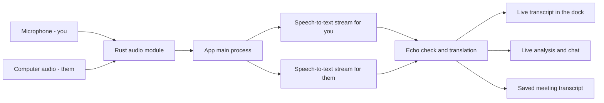
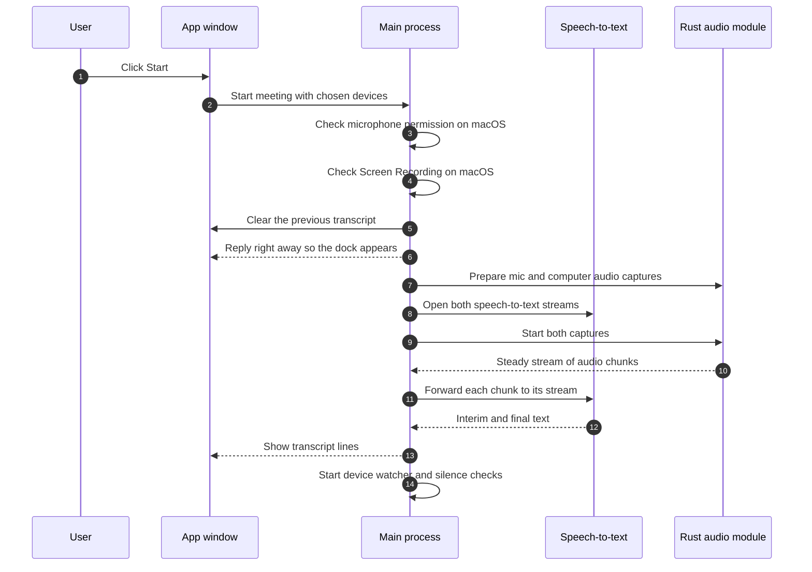
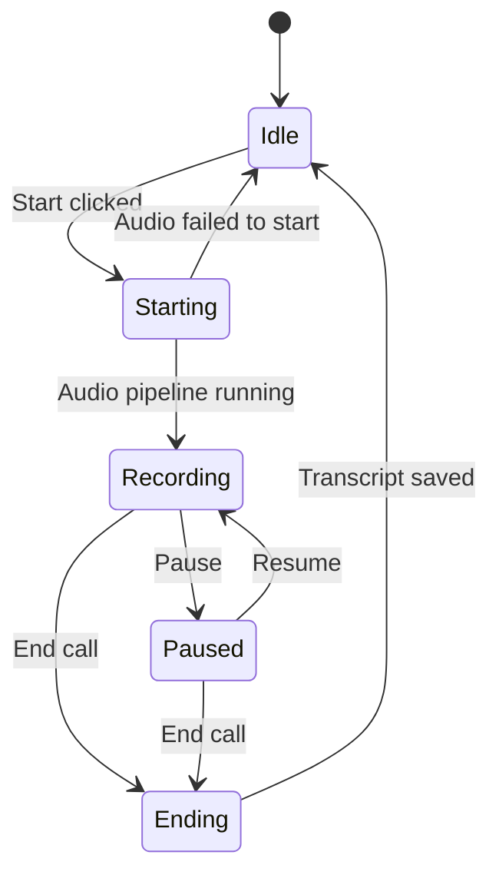
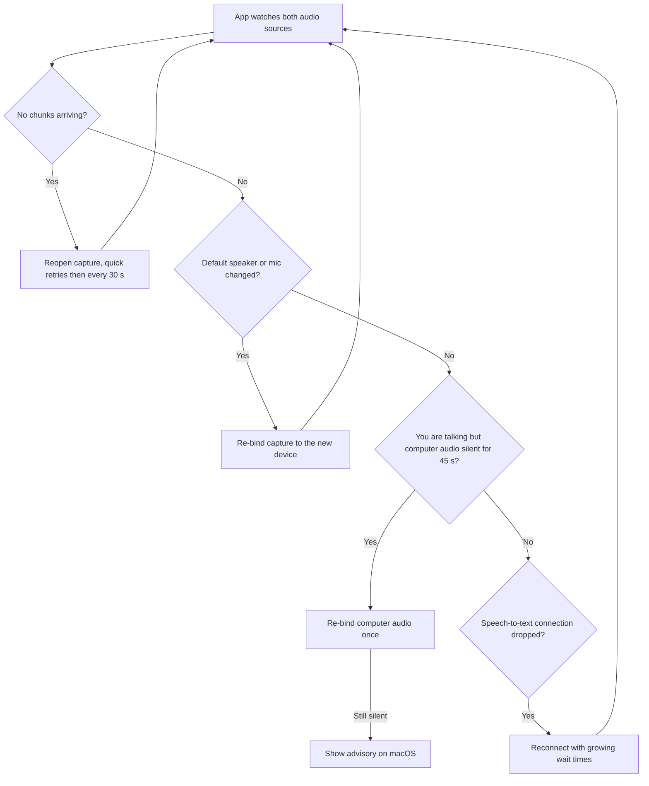

# Audio Pipeline: From Sound to Transcript

This page explains how GoDojo hears a sales call and turns it into a live transcript. It is written for people who are new to the project, so it uses plain language throughout. Technical terms are explained the first time they appear, and the glossary at the end lists them all.

---

## 1. What the audio pipeline does

During a call, GoDojo listens to **two separate sources of sound** at the same time:

| Source | Who it is | Name in the code |
| --- | --- | --- |
| **Your microphone** | You, the salesperson | `user` |
| **Your computer's audio** | The other people on the call, whose voices come out of your speakers or headphones | `client` |

Each source is captured on its own, cleaned up, converted to one standard format, and sent to a **speech-to-text** service (a cloud service that turns spoken words into written text). The text comes back within a second or so. It then appears in the floating dock, the live analysis and chat use it, and the full transcript is saved when the call ends.

The two sources stay separate from start to finish, and that is how the app knows who said what. Anything heard through the microphone is "you". Anything heard through the computer's audio is "them".

### The big picture

In short:

- The **Rust audio module** (the `native-module` folder) talks directly to the operating system to capture sound. It cleans the sound up and hands it to the app in small pieces called *chunks*, each about 20 milliseconds long. Rust is used because this part has to be fast and reliable.
- The **app's main process** is the Electron "back end" of the desktop app. It forwards those chunks to two speech-to-text streams, one per source, and then sends the resulting text to the screens.

---

## 2. How sound is captured on each platform

Capturing the microphone works much the same way everywhere. Capturing the *computer's* audio is different on each operating system.

| | Windows | macOS | Linux |
| --- | --- | --- | --- |
| **Microphone (you)** | Standard audio library (cpal) | Standard audio library (cpal) | Standard audio library (cpal) |
| **Computer audio (them)** | WASAPI **loopback** | **ScreenCaptureKit** by default. A **CoreAudio process tap** is available as an alternative | PulseAudio / PipeWire **monitor** source |
| **Permission needed** | Microphone privacy setting | Microphone **and** Screen Recording | None |
| **Full echo cancellation** | No (uses the echo gate only) | Yes | Yes |

Plain-language notes:

- **Loopback (Windows).** The app records whatever is playing on your default speakers or headphones, as if that output were a microphone. If the Windows default output device changes, the loopback reconnects itself to the new device.
- **macOS.** When a meeting is started from the app, it uses Apple's ScreenCaptureKit (the system feature for recording the screen and its sound) by default. You can switch to the CoreAudio "process tap" in Settings. If the tap fails to start, the module falls back to ScreenCaptureKit on its own. In both cases the app requires **Screen Recording** permission before it captures computer audio. ScreenCaptureKit can take 5 to 7 seconds to warm up at the start of a call.
- **Linux.** Every speaker output has a matching "monitor" source that carries a copy of what is being played. The app records that copy. This works with both PulseAudio and PipeWire (through PipeWire's PulseAudio compatibility layer), with no extra setup and no admin rights.

**One standard format.** Microphones and sound cards all work at different quality settings. Before anything reaches speech-to-text, the Rust module converts every source to **16 kHz mono**: 16,000 samples per second on a single channel. This conversion is called **resampling**. Because the format never changes, the app can switch devices in the middle of a call without reconnecting to the speech-to-text service.

**Build facts worth knowing:**

- Windows builds are **64-bit (x64) only**.
- On Windows the Rust module is **statically linked** to the C runtime, which means the runtime is built into the module itself. It therefore does **not** need the Microsoft Visual C++ Redistributable and loads on a clean Windows install.
- The macOS Intel (x86_64) build now compiles the bundled WebRTC echo-cancellation library for Intel. The build fails loudly if that library is missing, so an Intel Mac can no longer receive a module without echo cancellation.
- The Rust module contains no licence or activation code. It deals only with audio.

---

## 3. Echo: why it matters and how it is handled

**The problem.** If you use speakers instead of headphones, your microphone also hears the other person's voice coming out of your speakers. That leaked sound is called **echo**. Without protection, their words would be transcribed twice: once correctly as "them", and once wrongly as "you", as if you had said the client's words. That spoils the transcript and confuses the live analysis.

GoDojo protects against echo in up to three layers:

| Layer | What it does | Where it runs |
| --- | --- | --- |
| **1. Echo cancellation** | Uses the computer audio as a reference and subtracts it from the microphone signal, leaving only your voice. GoDojo uses Google's WebRTC echo canceller. | macOS and Linux only |
| **2. Echo gate** | While the other side is playing through your **speakers**, it mutes or turns down the microphone so leaked sound isn't sent. If you talk over them loudly and clearly, your speech is let through. With **headphones** the gate is bypassed, because headphones don't leak. | All platforms |
| **3. Transcript echo filter** | After speech-to-text, it compares each of "your" lines with what "they" just said. A line that is just their words picked up again is dropped, and a line that is only partly echo has the echoed words trimmed out. If an echoed line was already shown on screen, it is taken back down. | macOS only (default) |

**On Windows**, full echo cancellation is not built into the module, so layer 2 does all the echo work. Two practical results follow:

- When you use speakers, words you say *while the other person is talking* can sometimes be muted.
- Using **headphones** gives the best results, because the gate then stays open.

> The transcript echo filter (layer 3) is switched on for macOS only by default. On Windows and Linux it currently passes everything through.

---

## 4. Speech-to-text

### Two live streams

The app opens **two separate speech-to-text connections** for every call: one for your microphone and one for the computer audio. Each connection receives only its own audio, so the service never has to guess who is speaking.

### Supported providers

The provider is chosen in Settings. If the chosen provider has no API key, the app quietly falls back to Google speech-to-text.

| Provider | Style |
| --- | --- |
| **Deepgram** (default) | Live stream (WebSocket), using the `nova-3` model |
| Soniox | Live stream |
| ElevenLabs | Live stream |
| OpenAI | Live stream, with a non-streaming fallback |
| Google | Fallback |
| Groq Whisper, Azure, IBM Watson | **REST**: audio is sent in batches rather than as a continuous stream, so text appears a little later |

### Interim vs final results

- An **interim** result is the service's live guess while you are still speaking. It changes quickly and is replaced by later guesses. The dock shows interims so the text feels instant.
- A **final** result is the settled version of a sentence or phrase, which the service will not change. Only finals are stored, used for analysis, or saved.

### Translation to English

If **"translate transcripts to English"** is turned on and an AI key is configured (Groq, Gemini, OpenAI, or Claude), final lines written in a non-Latin script, such as Hindi in Devanagari, are translated into English before they are shown.

- Latin-script lines are left untouched and cost nothing.
- If translation fails or takes more than about 2.5 seconds, the original text is shown instead.
- Lines are translated in the order they were spoken.
- The original wording is kept alongside the translation.

### Speaker names

- If the call came from a calendar invite, the app uses real names from the attendee list, or the company name when several people from one company are on the call. You can also rename speakers by hand.
- When no names are known, the generic labels are **Me / Them** in the main process. The dock's own default is **You / Other Party**.
- With Deepgram's optional **diarization** (splitting one audio stream by voice), the "them" side can tell different voices apart. Once a second voice is detected, lines are labelled **"Other Party · Speaker 1"**, **"Speaker 2"**, and so on. A real person's name is not used at that point, because the app cannot be sure which voice belongs to whom. Diarization is only ever used on the "them" side.

---

## 5. Where the transcript goes

Every transcript line goes through the main process. It is passed out from there:

1. **Floating dock (live rolling transcript).** Your text and their text are kept on separate tracks. Interims update in place, and finals replace them. If the echo filter drops a line that was already on screen, the dock receives a "retract" message and removes it.
2. **Live analysis and in-call chat.** The dock keeps a running list of final lines. The live analysis and the in-call assistant chat read from that list. The main process also keeps its own copy of the conversation for AI features, and adds each final line to a live search index so the assistant can look things up during the call.
3. **Saving at the end of the call.** When you end the call, any half-finished interim line is saved as final so the last words aren't lost. The full transcript, with speaker names, is then written to the meeting record straight away, and the summary is generated in the background afterwards.

---

## 6. What happens when a meeting starts

Key points:

- On macOS, a missing **microphone** permission stops the meeting from starting. A missing **Screen Recording** permission does not: the meeting runs in microphone-only mode and a warning is shown.
- The speech-to-text streams are always opened **before** the captures start, so the first words of the call are not thrown away.
- Audio setup runs in the background after the app has already replied, so the dock appears straight away even though macOS capture can take several seconds to warm up.
- If audio setup fails completely, the meeting is marked as not running again.

### Meeting lifecycle

---

## 7. Keeping it reliable

Calls are long, and a lot can change during one: devices get plugged in or out, apps grab the microphone, and networks drop. The pipeline is built to repair itself quietly where it can.

| Safeguard | What it means in plain terms |
| --- | --- |
| **Silence keepalives** | Even when nobody is talking, each source sends a small "silent" chunk about 10 times a second. So **no chunks at all** always means something is broken, never just that the room is quiet. |
| **Stalled-capture watchdog** | If a source stops sending chunks for a few seconds (3 seconds for the mic, up to 10 for computer audio), it is reopened automatically. It retries quickly at first (¼ s, ½ s, 1 s, 2 s, 4 s) and then every 30 seconds for as long as the call lasts. There is extra grace time at start-up: 5 seconds normally, 8 on Linux, and 12 on macOS. |
| **"Never started" check** | If a source produces nothing at all within 12 seconds of starting, this is logged as a stuck capture. |
| **macOS silent-audio check** | macOS can deliver perfect silence when the Screen Recording grant no longer applies, for example after an app update. If the computer audio is silent for a long stretch, the app tests whether screen capture really works, and shows a warning if it does not. |
| **Device changes** | Every 1.5 seconds the app checks which speaker and microphone are the defaults. A change must show up on two checks in a row before the app acts on it, which avoids reacting to a device that is just flickering. When you plug in a headset, the app **re-binds** (reconnects) the capture to the new device. Only captures that follow the system default are moved; a device you picked yourself stays as it is. |
| **Far-end silence check** | If your microphone hears you talking but the computer audio has been completely silent for **45 seconds**, the app may be listening to the wrong output. It re-binds the computer audio once. On macOS, if that doesn't help, it also shows an advisory. |
| **Speech-to-text reconnect** | If the Deepgram connection drops, the app reconnects on its own, waiting longer between each try (1 s, rising to 30 s at most). If the service says "too many requests", the app waits 30 seconds before trying again. Audio arriving while the connection reopens is held briefly (up to 500 chunks) and sent once it is back. |
| **Settings changes mid-call** | If you change the speech-to-text provider or key during a call, the change is held until the call ends so the live transcript isn't interrupted. |

### Pause and resume

- **Pause** stops both captures and both speech-to-text streams. Audio during a pause is **not sent anywhere**, any text that arrives late is thrown away, and paused time is **not counted** in the meeting length. The device watcher also stops.
- **Resume** checks permissions again, re-binds any device that changed while paused (for example, a headset unplugged during the break), reopens speech-to-text first, and then restarts the captures. If resuming fails, the meeting stays paused and an error is reported.

### Recovery at a glance

---

## 8. Permissions and in-app warnings

**macOS**

- **Microphone.** Required. The app checks it when a meeting starts and asks for it if needed. If it is denied, the meeting does not start.
- **Screen Recording.** Needed to capture the other side of the call. If it is denied, the meeting continues with your microphone only, and a banner explains how to turn it on in System Settings → Privacy & Security → Screen Recording. Granting it needs an app restart.
- The banner offers buttons to open the right Settings page, and a "repair" option for when a permission looks granted but no longer works, as can happen after an update. The warning clears itself when you come back to the app after granting the permission, or when audio starts flowing again.

**Windows**

- Windows has no screen-recording gate. Computer-audio capture works without any permission.
- The microphone depends on the Windows **Microphone privacy setting**. The app does not check this setting in advance. The "Settings" link opens Windows' Privacy → Microphone page.

**Linux**

- There is no permission prompt. A PulseAudio or PipeWire sound server must be running.

**Which warnings actually appear.** The permission banner shows Screen Recording problems and capture failures that cannot be fixed by retrying. Short "stuck" moments are deliberately not shown, because they fire during perfectly normal quiet stretches. Those moments are still written to the log.

---

## 9. Low-end machines and Performance Mode

Performance Mode, whether switched on by hand or automatically on weaker machines, **does not change audio capture or speech-to-text**. Its audio-related effects are only cosmetic or background:

- The dock's sound-wave meter animates at a lower frame rate and without its glow effect.
- The live search index built from the transcript during a call updates less often.

The sound-wave meter only shows that sound is arriving. It is separate from speech-to-text, so the meter can move even while a transcript is delayed.

---

## 10. Common problems and what they mean

| What you see | What it usually means | What to try |
| --- | --- | --- |
| **No transcript for the other side** | **macOS:** Screen Recording is not granted, or the grant no longer applies after an update. **Windows:** the meeting app is playing sound to a different device than the Windows default (for example, a separate "communications" device). **Linux:** no sound server is running. | macOS: grant Screen Recording or use "repair", then restart the app. Windows: set the meeting app's speaker to your default output. Linux: check that PipeWire or PulseAudio is running. |
| **The other person's words also appear as mine**, or lines show up twice | Echo: the speakers' sound is leaking into your microphone. This is more likely on Windows, which has no full echo cancellation. It also happens when a virtual or "loopback" microphone is selected. | Use headphones. Pick a real, physical microphone in Audio Settings. |
| **Some of my words are missing while the client talks** | The echo gate muted your microphone because the other side was playing through speakers. | Use headphones, which bypass the gate. |
| **Audio stops after plugging in headphones** | The device change is being picked up. Re-binding normally happens within a few seconds. If you chose a specific device yourself, the app keeps using that one on purpose. | Wait a few seconds. Otherwise, select the new device in Audio Settings, or pause and resume. |
| **Other side goes quiet mid-call, but my side works** | The computer audio is still connected to an output nobody is using. The app re-binds once after 45 seconds of one-sided silence. | Switch the meeting app's output to your default device. |
| **Nothing works on a fresh Windows PC** | Older builds needed the Visual C++ runtime. The current audio module is statically linked and no longer needs it, so on current builds this points to something else, such as the microphone privacy setting or the audio module failing to load. | Check Windows Privacy → Microphone. Check the app log for audio-module load errors. Windows builds are x64 only. |
| **Transcript quality suddenly changed** | The chosen provider has no API key, so the app fell back to Google. | Check the speech-to-text key in Settings. |
| **Transcript appears in the original language** | Translation is off, no AI key is configured, or translation timed out. Latin-script languages are never translated. | Turn on translation and add an AI key. |

---

## 11. Known gaps

- **Some start-up audio messages are never shown on screen.** The main process sends "meeting audio error" and "meeting audio warning" messages in several cases: macOS microphone denied at start, audio pipeline failing to start, a suspected loopback or virtual microphone, and capture errors. No screen currently listens for these messages, so users don't see them. The failure is still logged, and a start failure is also reported back to the window that started the meeting.

---

## 12. Glossary

| Term | Plain meaning |
| --- | --- |
| **Chunk** | A small slice of audio, about 20 ms long, passed from the Rust module to the app. |
| **Diarization** | Splitting one audio stream into different voices ("Speaker 1", "Speaker 2"). |
| **Echo** | Your speakers' sound being picked up again by your microphone. |
| **Echo cancellation** | Removing the speakers' sound from the microphone signal using the speaker audio as a reference. Uses the WebRTC library on macOS and Linux. |
| **Echo gate** | A simpler protection that mutes or turns down the mic while the other side is playing through speakers. |
| **Final result** | The settled text for a phrase. It won't change, and it is what gets saved. |
| **Interim result** | A live, provisional guess shown while someone is still speaking. |
| **Keepalive** | A small silent chunk sent regularly so a quiet but healthy stream never looks dead. |
| **Loopback** | Recording what your computer is playing, as if the speakers were a microphone (Windows). |
| **Monitor source** | Linux's built-in copy of what a speaker output is playing. |
| **Re-bind** | Reconnecting a capture to a different audio device. |
| **Resampling** | Converting audio to a different sample rate. Here it is always 16 kHz mono. |
| **ScreenCaptureKit / CoreAudio tap** | Two macOS ways of recording the computer's sound. Both rely on the Screen Recording permission in this app. |
| **Speech-to-text (STT)** | A service that turns spoken audio into written text. |
| **Static linking** | Building required system code into the module itself, so it doesn't depend on extra installs. |
