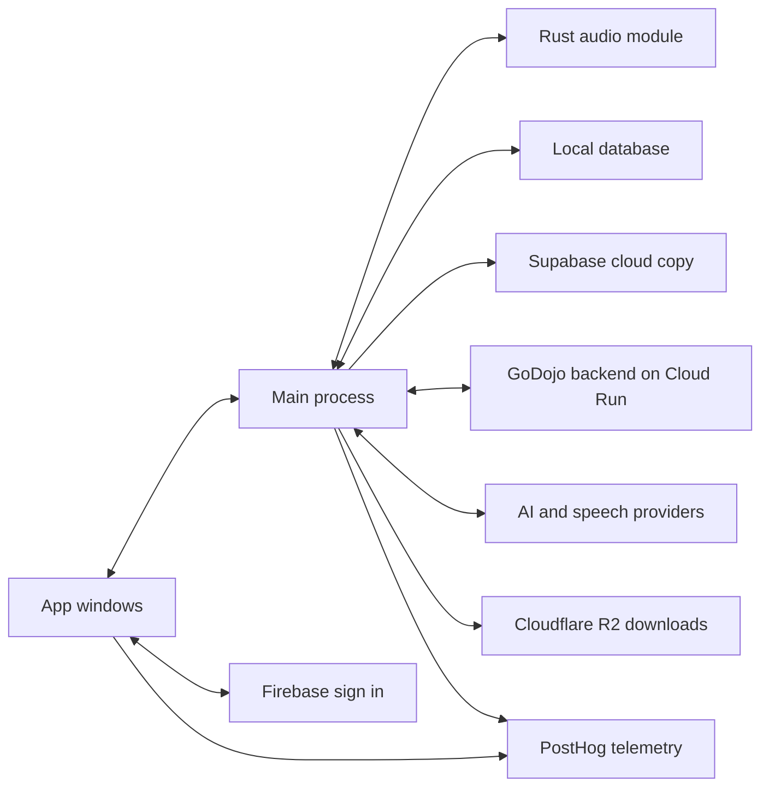
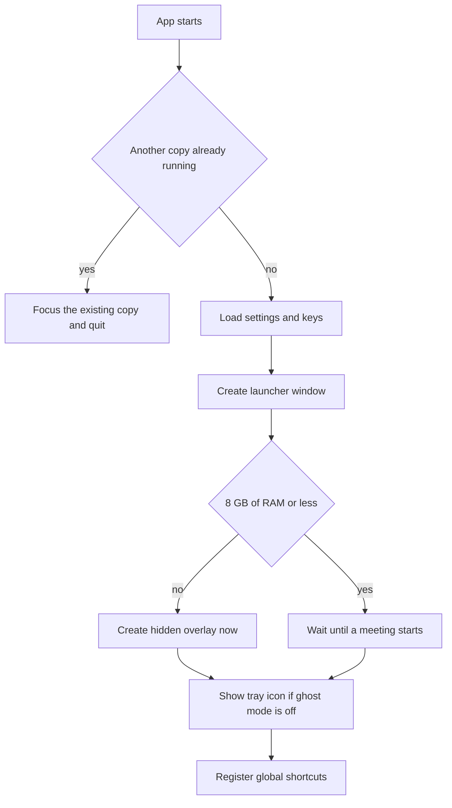
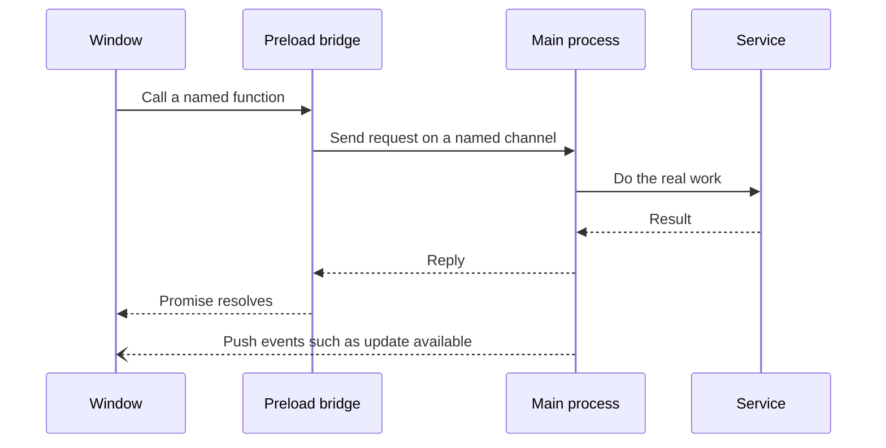
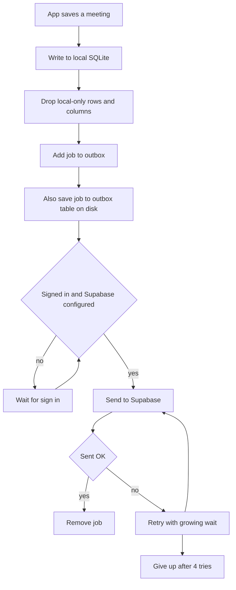
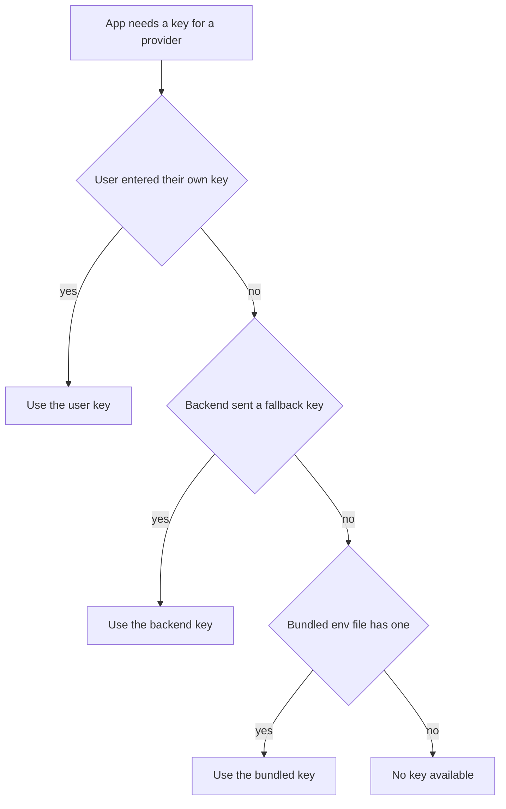
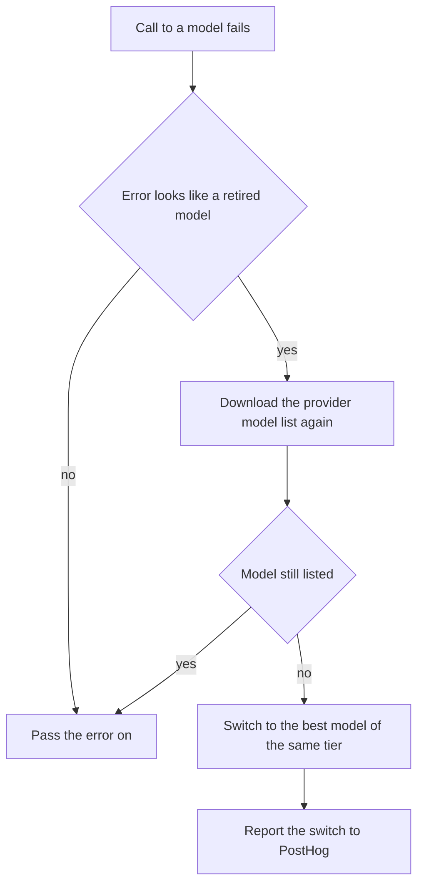
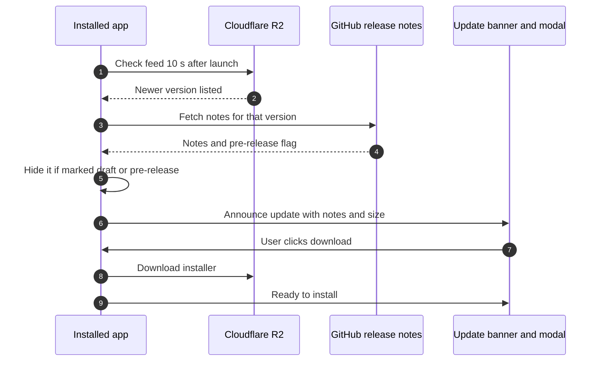
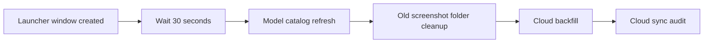
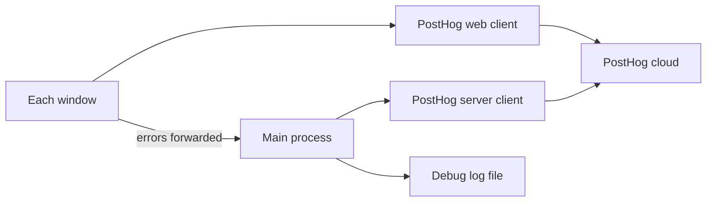
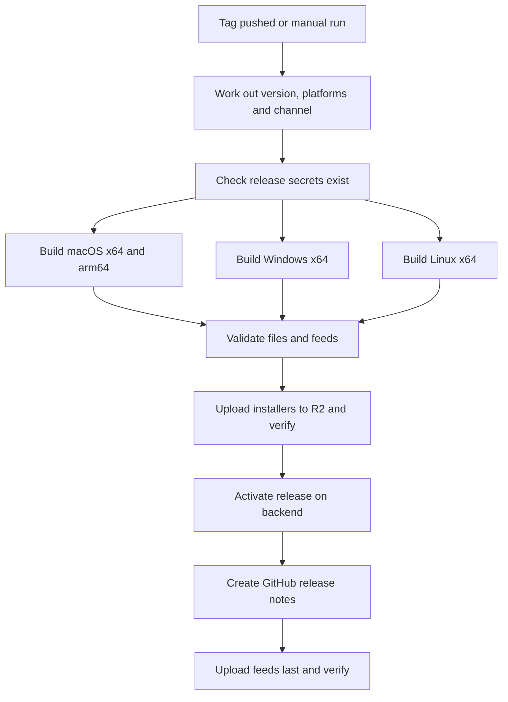

# GoDojo Platform Infrastructure

GoDojo is a desktop app built with **Electron**, a framework that lets one codebase run as a native app on Windows, macOS and Linux. The app has a hidden "back office" (the **main process**) and several visible screens (the **renderer windows**, built with React). Live audio is captured by a small **Rust native module**. Your meetings are saved to a database on your own computer and copied to the cloud (**Supabase**) in the background. Sign-in uses **Firebase**, our own server runs on **Google Cloud Run**, installers and update files live on **Cloudflare R2**, and usage and error data goes to **PostHog**. This page explains how all of these pieces fit together. It is written for developers who are new to the project.

---

## The big picture

How to read it:

- The **windows** never touch the disk, the network keys or the audio hardware directly. They ask the main process to do things for them.
- The **main process** owns everything sensitive: API keys, the database, the audio module, updates and the cloud copy.
- The **local database** is written first. The cloud copy is written a moment later in the background.
- **Firebase** sign-in runs inside the windows. The main process gets the resulting sign-in token and uses it for Supabase and the backend.

## Table of contents

1. [Desktop app shell](#1-desktop-app-shell)
2. [Native audio module](#2-native-audio-module)
3. [Local-first storage and cloud sync](#3-local-first-storage-and-cloud-sync)
4. [API keys and credentials](#4-api-keys-and-credentials)
5. [AI model management](#5-ai-model-management)
6. [In-app updates and releases](#6-in-app-updates-and-releases)
7. [Startup performance](#7-startup-performance)
8. [Telemetry and diagnostics](#8-telemetry-and-diagnostics)
9. [Data migrations](#9-data-migrations)
10. [Demo data](#10-demo-data)
11. [CI/CD and code signing](#11-cicd-and-code-signing)
12. [Known gaps worth fixing](#12-known-gaps-worth-fixing)
13. [Common questions](#13-common-questions)
14. [Candidates for a separate deep-dive doc](#14-candidates-for-a-separate-deep-dive-doc)
15. [Glossary](#15-glossary)

---

## 1. Desktop app shell

### What it is

An Electron app is really two kinds of program working together:

- The **main process**: one invisible Node.js program. It creates windows, talks to the operating system, reads and writes files, and holds secrets.
- **Renderer processes**: one per window. Each one is a small web page (React) that draws the UI.

GoDojo has four kinds of window. All of them load the same React app, and a small `?window=` tag in the address tells the app which screen to show.

| Window | What the user sees | When it is created |
| --- | --- | --- |
| **Launcher** | The main app: meetings list, settings, sign-in | At startup |
| **Overlay** (the "floating dock") | The small always-on-top panel during a call | At startup, hidden. On machines with **8 GB of RAM or less** it is not created until a meeting starts |
| **Meeting reminder popup** | "Your meeting starts soon" card from the calendar | About 30 seconds before a reminder is due, then destroyed when dismissed. On low-memory machines the early creation is skipped and it is built only when the reminder is due |
| **Model selector** | The dropdown for choosing an AI model | Only when first opened (a "pre-load" helper exists but nothing calls it) |

In production the windows are served from a tiny web server inside the app that only listens on your own computer (a **loopback** server). This gives every window a stable web address, which Google sign-in pop-ups and saved sign-in sessions need.

### Why it exists

Keeping secrets and hardware access in one place (the main process) means a bug in a web page cannot read your API keys or files. Creating windows only when needed saves memory on small laptops.

### How it works, step by step

1. **Single-instance lock.** If GoDojo is already running, the new copy hands over any invite link it was opened with, brings the existing window forward, and quits. This also stops duplicate dock or taskbar icons.
2. **Settings and keys load** (see sections 4 and 7).
3. **The launcher is created.** The overlay is created at the same time unless the machine is low on memory.
4. **System tray.** A tray icon (menu-bar icon on macOS) appears only when ghost mode is **off**. Its menu shows "Meeting Active / Paused" during a call, "Show Godojo.ai", "Toggle Window" and "Quit". Double-clicking it shows the window.
5. **Open at login.** In packaged builds, "Open GoDojo when you log in" is switched **on once** on first run. After that the app only follows the user's own choice. On Windows it always writes the login entry under one fixed name and removes stray entries that older builds wrote under disguise names.

### Closing the window ("ask once")

- **Windows and Linux:** the first time you click the app's own close (✕) button, a dialog asks: *Keep running in background*, *Quit GoDojo* or *Cancel*. The answer is remembered and can be changed in Settings, General. Running in the background is what lets calendar reminders appear and auto-start meetings.
- **macOS:** the red close button simply closes the window and the app keeps running, as Mac apps normally do. No question is asked.
- Closing the overlay during a call only hides it. The meeting keeps recording.

### Ghost mode and disguise mode

- **Ghost mode** (called "undetectable" in the code) hides GoDojo's windows from screen sharing and screenshots. It uses Electron's **content protection**, an OS feature that tells the system not to include a window in screen captures. On macOS it also hides the Dock icon, and on every platform it hides the tray icon. It is **on by default in packaged builds** and off by default in development.
- **Disguise mode** changes the app's visible name and icon to look like Terminal / Command Prompt, System Settings / Settings, or Activity Monitor / Task Manager. It changes the process title, window titles, icons and (on Windows) the taskbar grouping ID.

### The preload bridge and IPC (in simple terms)

**IPC** (inter-process communication) is how a window and the main process send messages to each other. Each window has a small **preload script** that runs before the page and publishes a safe list of functions on `window.electronAPI`. A window cannot reach Node.js or the file system directly (it runs with Node access turned off and isolated from the preload).

Two directions exist: a window **asks** and waits for a reply, or the main process **broadcasts** an event to every window (for example "an update is available").

### Global shortcuts

These work even when GoDojo is not the focused app. All can be changed in Settings and are saved per machine.

| Shortcut | Action |
| --- | --- |
| Ctrl or Cmd + B | Show or hide the GoDojo window |
| Ctrl or Cmd + Shift + B | Click-through on the overlay, so mouse clicks pass to the app behind it |
| Ctrl or Cmd + Shift + Arrow keys | Move the window up, down, left or right |

### Things to know / gotchas

- The `userData` folder (where settings, keys and databases live) is `godojo-ai` for real installs and `godojo-ai-dev` for development, so dev testing never touches a real install's data.
- Only the overlay keeps its timers running at full speed while hidden. Other windows slow down when hidden, which saves CPU.
- If a meeting is started from a calendar reminder while the app is minimised, the app first makes sure the launcher and overlay exist and are ready before the call begins.

---

## 2. Native audio module

**Short summary.** The `native-module` folder is a Rust library that GoDojo loads directly into the main process. It captures **your microphone** and **your computer's audio** (the other people on the call) as two separate streams, cleans them up, converts both to one standard format (16 kHz mono), and hands them to the main process in roughly 20 ms chunks for speech-to-text.

Key facts:

- **macOS:** the app asks for **ScreenCaptureKit** (Apple's screen-and-sound capture feature) by default. The **CoreAudio process tap** is the opt-in alternative, chosen in Settings. If the tap fails to start, the module falls back to ScreenCaptureKit.
- **Windows:** captures computer audio with WASAPI loopback. The module is **statically linked to the C runtime**, meaning the runtime is built into it, so it loads on a clean Windows install. **Windows builds are x64 only.**
- **macOS Intel builds** are cross-compiled on Apple Silicon. The build checks the result and fails if the echo-cancellation library was built for the wrong chip (see section 11).

For the full story read **AUDIO-PIPELINE.md** in this folder: [./AUDIO-PIPELINE.md](./AUDIO-PIPELINE.md).

---

## 3. Local-first storage and cloud sync

### What it is

Every meeting, transcript, AI answer and piece of company context is written to a **SQLite** database on your computer first. SQLite is a database that lives in a single file, with no server. A background service then copies those writes to **Supabase**, a hosted Postgres database, so your data is backed up and visible on your other devices.

### Why it exists

- Saving locally is instant and works offline, so a call is never lost because the Wi-Fi dropped.
- The cloud copy lets the backend (summaries, team dashboards, search) and your other devices see the same data.

### One database per account

| File in the userData folder | Who it belongs to |
| --- | --- |
| `godojo-anon.db` | Nobody signed in yet (first launch, or signed out) |
| `godojo-<your user id>.db` | One file per signed-in account |

When you sign in, sign out or switch accounts, the app closes the current file cleanly and opens the right one. Two people sharing a computer never see each other's meetings.

The database runs in **WAL mode** (write-ahead logging, a safer way of writing that survives crashes) and loads **sqlite-vec**, an add-on that lets SQLite search "by meaning" using number lists called **embeddings**. If sqlite-vec fails to load, search still works using a slower JavaScript fallback.

### Versioned schema migrations

A **migration** is a small upgrade step that changes the database layout (adds a table, adds a column). Each database file remembers its own version number. On every open, the app runs any steps newer than that number, in order. The current version is **24**. Because the version is stored per file, each account's database is upgraded the first time it is opened.

### The cloud mirror: how a write reaches Supabase

In plain words:

1. The local write always happens first and never waits for the network.
2. The change is put in an **outbox**, a to-do list of cloud writes. The outbox is also saved in its own table inside the database, so it survives a restart.
3. A sender works through the outbox **one job at a time**. Account rows go first, then `meetings` and `transcripts` rows, because the UI waits on those after a call. Everything else follows in order.
4. Every job is stamped with the user ID captured when it was created. A meeting and its transcript therefore always land under the same account, even if a token refreshes in between.
5. If a send fails, it is retried after about 1.5 s, then 3 s, then 6 s. After the **4th failure the job is dropped** and an error is logged.
6. When a `meetings` row lands in the cloud, the main process tells every window, so screens that need the backend to know about the meeting can continue.

### What is mirrored and what stays local

| Mirrored to Supabase | Stays on this device only |
| --- | --- |
| Meetings, transcripts, AI interactions | The outbox itself |
| Search chunks, chunk summaries, embedding queue, and vectors in per-size tables | The retry queue for backend chunking |
| Company context, assets, asset files and chunks, personas, competitors | Most app settings (only an allow-list of 4 keys is mirrored) |
| Scorecards and scoring criteria | Two meeting columns: meeting types and owner ID |
| The user's profile row | The **live-call placeholder** meeting and everything attached to it |

The rules in the right-hand column live in one shared set of **sync filters**. They are used by the live mirror, the one-time backfill and the startup audit, so the three can never disagree. The live-call placeholder is a temporary meeting the search index creates during a call. It is deleted when the call ends, but it can survive a crash, and it must never reach the cloud.

### One-time backfill and startup sync audit

- **Backfill.** On the first launch after cloud sync was set up, the app copies all older local rows up to Supabase in batches of 50. It saves its position as it goes, so an interrupted run resumes on the next launch. When finished it records "done" and never runs again for that database.
- **Sync audit.** On each launch (after sign-in), the app compares the IDs of local rows with the IDs in Supabase for meetings, transcripts, AI interactions, chunks and chunk summaries. Anything missing in the cloud is put back in the outbox. This is the safety net for dropped jobs.
- Both run through the **deferred startup queue** (section 7), so they start about 30 seconds after the launcher appears, one at a time.

### Reading data: not purely local

When you are **signed in**, the meetings list, meeting details and company context are read **from Supabase first**, with the local database used only if the cloud read fails. A few screens deliberately read local data right after a call ends, because the cloud copy may not exist yet.

### Offline behaviour

- **Signed out:** writes go to the local database and wait in the outbox. Nothing is lost. They are sent after sign-in.
- **Signed in but offline:** local writes succeed. Cloud reads fail, so screens fall back to local data. The outbox, however, keeps trying and **drops each job after 4 failures** (roughly 10 seconds). Those rows are restored by the next launch's sync audit, but only for the five tables the audit checks (see section 12).

### Things to know / gotchas

- Add any new local-only column to the shared sync filters, or Supabase will reject the whole upsert.
- Never capture a database handle early in startup code. Signing in replaces the open database. Look it up when the task actually runs.
- The Supabase client never holds a service key. Every request carries the user's Firebase token, and Supabase's **row-level security** (rules that only let a user see their own rows) does the rest.

---

## 4. API keys and credentials

### What it is

GoDojo calls many providers: Gemini, Groq, OpenAI, Claude, Deepgram, Tavily, ElevenLabs and Azure. Each needs an **API key**, a password for a paid service. The Credentials Manager decides which key to use, stores keys safely and keeps each account's keys separate.

### Resolution order

1. **The user's own key** from Settings, AI Providers.
2. **Backend fallback keys.** After sign-in, the app downloads encrypted company keys from the backend. They are decrypted in memory only (AES-256-GCM, using `API_ENCRYPTION_KEY` from the bundled settings file) and are **never written to disk**. They are cleared when you sign out or switch accounts.
3. **Bundled defaults** from the `.env` file shipped inside the app. Only Gemini, Groq, Deepgram, Tavily and Azure have a bundled tier. OpenAI and Claude do not. Azure has no backend tier.

Which tier won is reported to PostHog, without the key itself.

### Encryption at rest

- Keys you type are saved with **Electron safeStorage**, which encrypts data using the operating system's own key store (Keychain on macOS, DPAPI on Windows, the desktop secret store on Linux).
- If the OS says encryption is unavailable, the app falls back to a **plain JSON file**. This is rare, but it means keys are readable on that machine.
- On macOS, a new unsigned build can lose access to the Keychain item written by the previous build. The app then reports the store as "failed" and asks for keys again. It refuses to overwrite the file with an empty list.
- On quit, keys are wiped from memory.

### Per-account isolation

| File | Contents | Scope |
| --- | --- | --- |
| `credentials-anon.enc` | Keys typed while signed out | Anonymous |
| `credentials-<user id>.enc` | That account's own keys and model choices | One account |
| `identity.enc` | Saved Firebase sign-ins, so you stay signed in | The whole machine |

Keys typed while signed out are **not** moved into an account after sign-in. The user must enter them again.

### The bundled .env file

The `.env` file is written by the release workflow from GitHub secrets and copied into the installed app. Its contents are readable by anyone who opens the install folder. It contains:

- PostHog key and host, Firebase web config, the backend URL
- Supabase URL and public (anon) key
- `API_ENCRYPTION_KEY` for the backend fallback keys
- Default provider keys: Deepgram, Gemini, Groq, Tavily, plus Tavily tuning values and the default speech-to-text provider
- Google and Zoom calendar OAuth client ID and secret
- `SUPABASE_SERVICE_KEY` (not used by any app code, see section 12)

**For real builds it must point at production.** The backend URL, Supabase project and Firebase project in this file decide which servers the installed app talks to. In development the app reads the `.env` at the repo root, and it copies the Supabase URL and key from it into the local credential store on every launch.

### Things to know / gotchas

- If `API_ENCRYPTION_KEY` is missing from a build, the backend tier silently does nothing and the app falls back to bundled keys. The release workflow prints a warning, and the app reports `env_fallback_keys_status` at launch.
- Settings that are not secrets (`settings.json`, `keybinds.json`) are shared by every account on the machine.

---

## 5. AI model management

### What it is

The part of the app that decides **which AI model** answers each request, and what happens when that model fails or is retired by its provider.

### The pieces

| Piece | What it does |
| --- | --- |
| **Provider clients** | One client each for Gemini, Groq, OpenAI and Claude. Also Ollama (a program that runs AI models on your own computer) and user-defined "custom" or cURL providers such as OpenRouter |
| **Model Catalog** (newer) | Downloads each provider's current model list (cached for 24 hours), picks a model by tier (capable, fast, vision), and **heals** retired model IDs |
| **Model Version Manager** (older) | Discovers models about every 14 days and keeps three tiers per model family. It still supplies the model names used in the main chat fallback chains |
| **Backend LLM fallback** | Our own server's model endpoint, used as the last resort for summaries, titles and follow-up emails |
| **Local embedding model** | A small built-in model (all-MiniLM-L6-v2) for search, used when no cloud embedding provider is available |

### Retired-model healing

A temporary "high demand" error on a model that still exists is passed on, not treated as a retirement. The catalog is refreshed at launch (through the deferred queue) and then weekly, for every provider with a key. If the refresh fails, the old cached list is kept.

### Fallback chains

If one provider fails, the next one is tried. The whole chain is retried up to 3 times with a short pause.

| Request type | Order tried |
| --- | --- |
| Chat, text only | Groq, Gemini Flash, Gemini Pro, OpenAI, Claude |
| Chat with images | OpenAI, Gemini Flash, Claude, Gemini Pro, Groq vision |
| Structured output | OpenAI, Gemini Pro, Gemini Flash, Claude, Groq, Ollama, custom provider |
| Meeting summary and similar | Custom provider if chosen, Groq for shorter transcripts, Gemini Flash, Gemini Pro, then the **backend fallback** |

If the user picked an Ollama model as their default, chat goes straight to Ollama.

### Ollama and local embeddings

- The Ollama helper only starts `ollama serve` if the user's default chat model is an Ollama model. It stops it on quit if GoDojo started it.
- For search embeddings the order is OpenAI, Gemini, Ollama, then the **built-in local model**, which always works because it ships inside the app.

### What is dormant

- The **"What should I say"** mode still exists in the main process, but no screen calls it.
- Its **intent-classifier model** (mobilebert-uncased-mnli) is **no longer downloaded or packaged**. The classifier code remains and would fall back to simple pattern matching if the mode came back.

### Things to know / gotchas

- Two systems overlap here. The Model Catalog handles retirement healing and user-facing model choice. The older Model Version Manager still feeds model names into the chat chains. Changing one does not change the other.
- The backend fallback needs a signed-in user, because it sends the Firebase token.

---

## 6. In-app updates and releases

### What it is

Installed apps check for new versions using **electron-updater**, a library that reads a small file called a **feed** (`latest.yml`, `latest-mac.yml` or `latest-linux.yml`) and downloads the installer it points to. Feeds and installers live on **Cloudflare R2**, an online file store. GitHub Releases only hosts the **release notes**.

### Channels

There are three channels: **production**, **beta** and **test**. A build's channel is fixed **at build time**: the feed address `<R2 address>/<channel>/<os>` is written into the app. There is no channel switch inside the app.

| Git tag pushed | Channel |
| --- | --- |
| `v1.5.0` | production (must build all platforms) |
| `v1.6.0-beta.1` | beta |
| `v1.5.0-all`, `v1.5.0-mac`, `-windows`, `-linux` | test |
| Manual run | Chosen from a dropdown |

### How an update reaches a user

- Checks run **10 seconds after launch**, then **every 6 hours**. A failed background check retries quietly after 5, 10, 20 minutes and so on, never showing an error.
- Nothing downloads automatically. The user clicks download, then install. Install is refused while a meeting is running.
- **Windows:** full self-update with the NSIS installer. The portable `.exe` cannot update itself.
- **macOS:** builds are not properly signed, so the app opens the backend's `/download/macos` link for the right chip in the browser, and the user installs the DMG by hand.
- **Linux:** the AppImage updates itself. The `.deb` cannot.

### The release pipeline (summary)

Releases are published in a strict order so the auto-updater never sees a half-finished release:

1. Build Windows, macOS and Linux in parallel.
2. Check that every file named in the feeds really exists.
3. Upload installers to R2 (files never change once uploaded), then verify them.
4. **Activate on the backend**, so the backend records this as the current release for that channel. For production this is what the stable `/download/windows` and `/download/macos` links redirect to.
5. Create the GitHub release page with the notes (only for tag pushes). Test and beta releases are marked **pre-release**.
6. Upload the feed files **last**. This is the moment installed apps can see the update.

### Rollback

The **Rollback release** workflow (tag `rollback-v1.5.0`, or a manual run) points the backend and the feeds back at an earlier, already-published version, without rebuilding. Installers are never deleted.

Full details live in [./RELEASE.md](./RELEASE.md). To test the update flow locally against a fake feed, see [./TESTING-UPDATES.md](./TESTING-UPDATES.md).

### Things to know / gotchas

- The app sets its updater channel to `latest` in code. In electron-updater this **also allows downgrades**, which conflicts with what the rollback docs say (section 12).
- The "hide pre-releases" check also hides beta and test updates on beta and test installs (section 12).
- Updates are switched off in development, unless you start the app in the special dev-updates mode described in TESTING-UPDATES.md.

---

## 7. Startup performance

### What it is

A set of measures that make the launcher appear quickly and stay responsive, especially on weak Windows laptops at sign-in time, when the OS itself is busy.

### The deferred startup queue

Non-urgent jobs are put in a waiting line instead of running immediately.

- The countdown starts only after the launcher exists.
- Jobs run **one at a time**, in order, with a 2-second gap between them. One failing job never blocks the rest.
- Backfill and audit are only added after sign-in. If you sign in minutes later, they still run, just later.

### Other startup savings

- **Lazy windows:** model selector on demand, overlay deferred on machines with 8 GB of RAM or less, reminder popup created shortly before it is needed (section 1).
- **Removed from startup:** the intent-classifier warm-up and its model; starting Ollama for users who never chose it; the Ollama embedding setup when a cloud key exists; a global switch that kept every hidden window's timers at full speed (now only the overlay has this); audio pipeline setup (now done when a meeting starts); the model-catalog network refresh (now in the queue).
- **Logging** to the debug file is buffered and written every 300 ms instead of on every line.

### Performance Mode

Performance Mode lowers visual effects on weak hardware. Users can set it to **Auto**, **On** or **Off** in Settings.

| | When Auto turns it on | What it changes |
| --- | --- | --- |
| **Windows (visual)** | Chromium fell back to software drawing, **or** 4 or fewer CPU threads, **or** an Intel integrated GPU with 8 GB of RAM or less. RAM alone never triggers it | Turns off background blur everywhere, skips decorative animations, and does not start PostHog session replay |
| **Main process (background work)** | Software drawing, **or** 4 or fewer CPU threads, **or** 8 GB of RAM or less | Live search indexing during a call runs every 90 seconds instead of every 30 |

On or Off always overrides the automatic decision.

### Things to know / gotchas

- The two "Auto" rules differ: an 8 GB Mac keeps full visuals but still gets the slower background indexing.
- Anything you add to startup that is not needed for the first screen should go through the deferred queue.

---

## 8. Telemetry and diagnostics

### What it is

**Telemetry** means anonymous-by-design usage and error data sent to PostHog so the team can see what breaks and how the app performs. There are two PostHog clients:

### Windows (renderer)

- **Product events** are sent only at chosen points: sign-up and sign-in, meeting started, completed or failed, live analysis and chat opened, calendar connected, follow-up email, team invites, ghost mode on or off, and similar. Automatic click tracking and page-view tracking are off.
- **Error tracking:** uncaught errors are captured automatically. React screen crashes are reported by error boundaries.
- **Session replay** is set up **off**, and started only on machines **not** in Performance Mode. Text inputs are masked. A recording is only uploaded when an error happens, based on a rule configured in the PostHog dashboard, not in code.

### Main process

- Uncaught exceptions, crashed windows and crashed helper processes are reported as errors.
- Diagnostic events include `env_fallback_keys_status` at launch (which bundled keys exist, never their values), API key source changes, backend fallback key problems, `model_auto_migrated`, `rag_chunking_result` and `llm_generation_source`.
- **LLM and Tavily usage:** every summary, regenerated summary, follow-up email, sales brief and company-insights generation reports `llm_generation_usage`: provider, model, token counts and, for company insights, the number of Tavily searches and an estimate of credits used.

### perf_sample performance samples

| When | Sent to PostHog |
| --- | --- |
| 15 s, 60 s and 180 s after launch | All three samples |
| Every 60 s during a meeting | Every 5th sample, about every 5 minutes |

Each sample contains CPU and memory totals per process type, process count, GPU drawing status and vendor, the Auto Performance Mode decision with its reason, the hardware summary and the OS. It holds numbers and labels only, never meeting content.

### The local debug log

- File: **`godojo_debug.log`** in the user's **Documents** folder.
- Everything the main process logs goes there, including every perf sample.
- When it reaches 10 MB it is renamed to `godojo_debug.log.1` and a new file starts. Only one old file is kept.
- Settings has a **verbose logging** switch for extra detail.

### Things to know / gotchas

- If the PostHog key is missing from the build's `.env`, both clients turn themselves off and log a warning.
- Release builds upload **source maps** (files that map minified code back to the original) to PostHog, so error stack traces are readable.

---

## 9. Data migrations

GoDojo started from an older codebase called **Natively**. Several one-time steps carry old users' data across. Each step is safe to run many times: once there is nothing left to move, it does nothing.

| What | How it is migrated |
| --- | --- |
| **Database files** | `natively-<id>.db` and its two sidecar files are renamed to `godojo-<id>.db` the first time that account's database is opened. Sidecars move first and the main file last, so a crash part-way is completed on the next launch. If the rename fails, the old file is used where it is |
| **Window settings in localStorage** | Keys starting `natively_` are copied to `godojo_` (a few go to special new names) and the old keys removed. A value already under the new name wins. This runs first thing in every window |
| **Login item (Windows)** | Old "open at login" registry entries written under disguise names, both `com.natively.*` and `com.godojo.*`, are removed, and one entry under a fixed name is kept |
| **Environment variable names** | Developer flags are now `GODOJO_*`. Old `NATIVELY_*` names still work, and `GODOJO_*` values are copied to the `NATIVELY_*` names the Rust module still reads |
| **Pending live-chat file** | The old `natively-pending-live-chat.json` is carried over |
| **Database schema** | Versioned migrations, currently at version 24 (section 3) |
| **Old screenshot folders** | `screenshots` and `extra_screenshots`, left by a removed screenshot feature, are deleted. This job runs through the deferred queue on every launch and does nothing once the folders are gone |

---

## 10. Demo data

There is a `seed-demo` action, but **today it creates nothing**.

- **Who triggers it:** nobody chooses to. The launcher calls it automatically every time it opens.
- **What it does:** it checks whether a meeting with the ID `demo-meeting` exists. If not, it builds an example meeting (a discovery call with "Alex Rivera" of "Vertex Solutions", with summary and BANT/MEDDIC analysis), **but the line that saves it is commented out**, so nothing is written.
- If a `demo-meeting` did exist (for example from an older build), the action would also make sure it has search embeddings.

Treat this as dormant code. Do not rely on it for onboarding or tests.

---

## 11. CI/CD and code signing

### CI checks (every pull request and push to main)

**CI** (continuous integration) runs automatic checks on every change.

| Job | What it does |
| --- | --- |
| Type Check | Type-checks the windows code and the main-process code |
| Unit Tests | Runs the Vitest test suite on Linux |
| Smoke Build | Builds the windows bundle and the main process on Linux and checks the output files exist |
| Warm native caches | On pushes to the main branch only, when the Rust code changed: pre-builds the Rust module on macOS, Windows and Linux so release builds start warm |

There is **no lint step** in CI.

### The release workflow

What each build job does:

1. Sets the app version from the tag, without the platform suffix.
2. Writes the runtime `.env` from GitHub secrets and warns about any that are empty.
3. Builds the windows and main process, and uploads source maps to PostHog.
4. **Builds the Rust module.** On macOS it builds both chips. The Intel build is cross-compiled with Rosetta 2 installed, and the build **fails** if the Intel module has the wrong chip type or is missing echo-cancellation code. On Windows it rebuilds whenever the Rust source is newer than the existing module.
5. **Packages with electron-builder**, the tool that turns the app into installers, and bakes this channel's feed address into it. The package leaves out: source maps, tests, the Rust source and build folders, `onnxruntime` binaries for other operating systems, and the intent-classifier model. Native `.node` and `.dylib` files are **unpacked** from the **asar**, the single archive file that holds the app's code, because the OS cannot load native code from inside it.
6. **Windows only:** copies the Visual C++ runtime DLLs next to the `onnxruntime` binary inside the package. That library runs the local AI models and needs this runtime, which a fresh Windows install may lack. The build fails if Visual Studio's copies cannot be found.
7. **macOS only:** checks that the `.env` really made it into each `.app`.

Then the publish job runs the six ordered steps described in section 6. Only one publish or rollback runs at a time.

### Code signing status

**Code signing** attaches a certificate to an app that proves who made it. **Notarization** is Apple's extra online malware check for Mac apps.

| OS | What the workflow actually does | What users see |
| --- | --- | --- |
| **Windows** | No certificate is configured anywhere. There is no certificate secret and no signing settings. electron-builder runs its signing step, which is the "signing with signtool" line in the log, but with no certificate there is no trusted publisher signature. The release notes correctly call it unsigned | SmartScreen "Windows protected your PC". Click More info, then Run anyway |
| **macOS** | Signing identity is turned off. After packaging, a hook applies an **ad-hoc signature** (a signature with no Apple identity) with the hardened-runtime permissions Apple Silicon needs to run the app at all. Not notarized. The notarization tool is installed but unused | Gatekeeper says the app "is damaged and can't be opened". The release notes explain how to clear the quarantine flag with `xattr -cr` |
| **Linux** | Not signed | Nothing special |

Unsigned macOS builds are also why macOS updates go through the browser instead of installing themselves.

### Things to know / gotchas

- Release builds skip the model download during install. The local embedding model is packaged from the `resources/models` folder in the checkout.
- Production releases must build every platform and must use a plain `x.y.z` version. The workflow refuses anything else.
- Uploaded installer names can never be overwritten with different bytes. Bump the version instead of re-tagging.

---

## 12. Known gaps worth fixing

Only issues with clear evidence in the code are listed.

**1. Offline cloud writes are dropped, and the meeting list reads the cloud first.**
- *Where:* the cloud mirror and the meeting-list reads.
- *What happens:* while signed in but offline, each outbox job is dropped after 4 failed attempts (about 10 seconds), and its saved copy is deleted too. When signed in, the meetings list and meeting details are read from Supabase first.
- *Impact:* a meeting recorded on a flaky connection can be missing from the meetings list once the connection returns, until the next app launch's sync audit re-queues it. The audit only covers meetings, transcripts, AI interactions, chunks and chunk summaries, so dropped company-context, scorecard and vector writes are never restored to the cloud automatically. The data is still safe in the local database.

**2. The release `.env` bundles the Supabase service key.**
- *Where:* all three build jobs in the release workflow write `SUPABASE_SERVICE_KEY` into the `.env` that ships inside every installer, in plain text.
- *Why it matters:* the Supabase client code and the backend setup guide both say a service key must never be shipped to the client, because it bypasses row-level security. No app code reads it.
- *Impact:* if that GitHub secret is set (not confirmed from the repo), anyone with an installer could read and write every user's data. It should be removed from the workflow and rotated.

**3. Rollback assumes no downgrades, but the app allows them.**
- *Where:* the app sets the updater channel to `latest`. In electron-updater, setting a channel also turns on "allow downgrade".
- *Impact:* after a rollback, users already on the bad version are offered the older version as an "update". RELEASE.md and the rollback workflow say the opposite. This may be useful behaviour, but the docs and the code should agree.

**4. Beta and test installs never announce their own updates.**
- *Where:* the release workflow marks every non-production GitHub release as pre-release, and the app hides any update whose GitHub release is a pre-release.
- *Impact:* a beta install that finds a newer beta in its own feed looks up `v<version>` (for example `v1.6.0-beta.2`), finds a pre-release, and reports "no update". Beta and test channels therefore cannot self-update from tag-push releases. Manual workflow runs create no GitHub release and so are not blocked.

---

## 13. Common questions

**Where is my data stored?**
In the app's userData folder: `%APPDATA%\godojo-ai` on Windows, `~/Library/Application Support/godojo-ai` on macOS, and the matching config folder on Linux. Each account has its own `godojo-<id>.db` and `credentials-<id>.enc`. When signed in, a copy is kept in Supabase.

**Why does the app work offline?**
Every write goes to the local database first, and screens fall back to local data when the cloud cannot be reached. Cloud copies catch up later, with the limits described in section 12.

**Where do the AI keys come from if I never entered any?**
From the backend after sign-in (encrypted, held only in memory), or else from the defaults bundled in the app's `.env`.

**How do I ship a test build?**
Push a tag like `v1.5.1-all` (all platforms) or `v1.5.1-windows` (one platform), or run the release workflow by hand with channel "test". It is published under `test/` on R2 and never reaches production users.

**How do I ship a production release?**
Push a plain `vX.Y.Z` tag from the main branch. See [./RELEASE.md](./RELEASE.md).

**How do I test the update flow without releasing?**
Run the app in dev-updates mode against the local fixture feed, as described in [./TESTING-UPDATES.md](./TESTING-UPDATES.md).

**Why do Mac users see "damaged and can't be opened"?**
The app is only ad-hoc signed and not notarized. Gatekeeper reacts this way to any quarantined app without an Apple identity. Clearing the quarantine flag fixes it.

**Where do I look when a user reports a problem?**
Ask for `godojo_debug.log` from their Documents folder, and check PostHog for their errors and `perf_sample` events.

**Why can't I see GoDojo in my screen share?**
Ghost mode is on, which is the default for installed builds. Turn it off in Settings if you want the window to be visible.

**Is it safe to add a new database column?**
Yes, through a new numbered migration step. If the column should not go to Supabase, add it to the shared sync filters as well.

---

## 14. Candidates for a separate deep-dive doc

| Proposed doc | What it should cover |
| --- | --- |
| **Cloud sync and offline** | The outbox in depth, ordering and owner pinning, backfill cursors, the sync audit, cloud-first reads, account switching, and fixing gap 1 |
| **Auth and account lifecycle** | Firebase in the windows, the token bridge to the main process, the saved identity store, switching database and key files on sign-in and sign-out, invite deep links |
| **LLM routing and model catalog** | Every fallback chain, catalog tiers and seeds, retirement healing, the overlap with the Model Version Manager, the backend fallback, custom and cURL providers |
| **Window management, ghost mode and disguise** | Overlay pinning and recovery watchdogs, content protection per OS, dock and tray handling, macOS permission prompts |
| **Local database schema** | Every table and migration step from version 1 to 24, vector tables and dimensions, indexes |
| **Performance and diagnostics playbook** | Reading perf samples and the debug log, Performance Mode rules, the startup timeline on low-end machines |

---

## 15. Glossary

| Term | Meaning |
| --- | --- |
| **asar** | The single archive file that holds the app's code inside the installed app |
| **Content protection** | An OS feature that hides a window from screen capture and sharing |
| **Deferred startup queue** | A line of non-urgent startup jobs that run one by one, 30 seconds after the launcher appears |
| **Electron** | A framework for building desktop apps with web technology |
| **Embedding** | A list of numbers representing the meaning of some text, used for search |
| **Feed** | The `latest*.yml` file the updater reads to learn about new versions |
| **IPC** | Inter-process communication: messages between a window and the main process |
| **Main process** | The single hidden Node.js program that runs the app |
| **Migration** | A numbered step that upgrades the database layout or moves old data |
| **Notarization** | Apple's online check that marks a Mac app as scanned and trusted |
| **Outbox** | The queue of local changes waiting to be copied to Supabase |
| **Preload script** | A small script that safely exposes chosen main-process functions to a window |
| **R2** | Cloudflare's file storage, where installers and feeds are hosted |
| **Renderer** | A window's web page process |
| **Row-level security** | Database rules that let each user read and write only their own rows |
| **safeStorage** | Electron's API for encrypting data with the operating system's key store |
| **SQLite** | A database stored in a single local file |
| **sqlite-vec** | An SQLite add-on for searching embeddings |
| **Telemetry** | Usage, performance and error data sent to PostHog |
| **WAL** | Write-ahead logging, a crash-safe way for SQLite to write changes |
