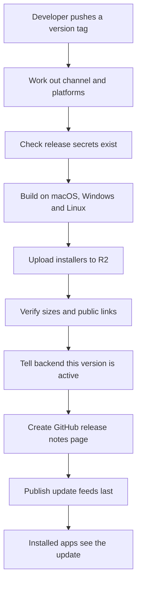
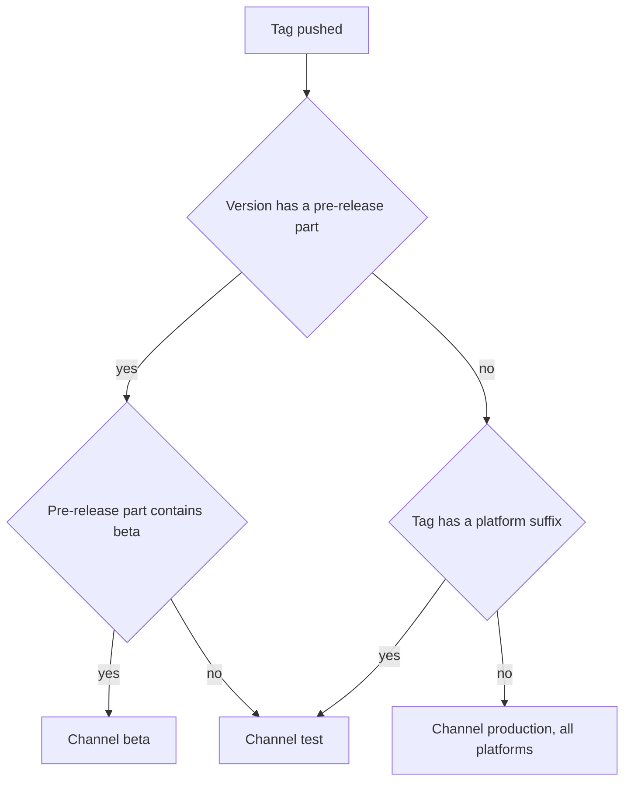
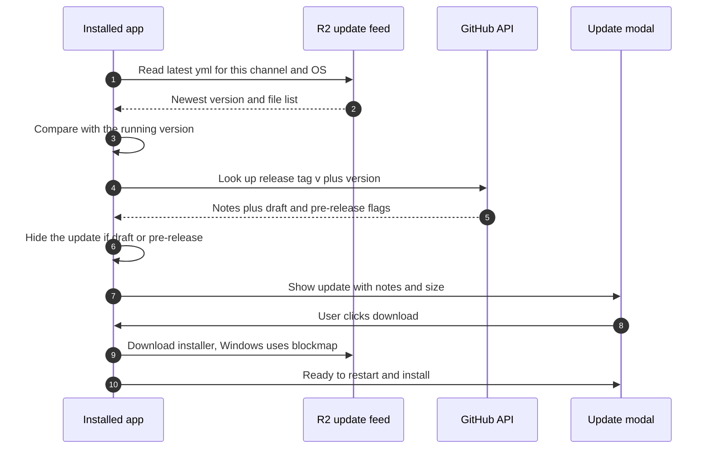
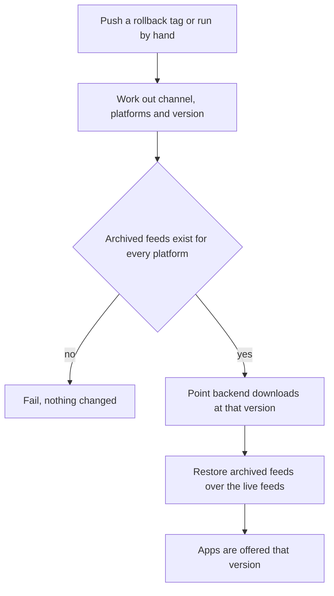

# Releasing GoDojo

This page explains how a new version of the GoDojo desktop app gets built, uploaded, announced and, if needed, rolled back. It is written for developers who are new to the project. For the rest of the platform, see [PLATFORM-INFRASTRUCTURE.md](./PLATFORM-INFRASTRUCTURE.md). For how to test the in-app update flow without publishing anything, see [TESTING-UPDATES.md](./TESTING-UPDATES.md).

In one sentence: **you push a git tag, GitHub Actions builds the app for each operating system, uploads the installers to Cloudflare R2, tells our backend about the new version, writes a GitHub release page with the notes, and finally publishes the update feeds that installed apps read.**

A few words you will see a lot:

| Term | What it means here |
| --- | --- |
| **Tag** | A named label on a git commit, like `v1.0.7`. Pushing a tag that starts with `v` starts a release. |
| **Channel** | Which audience a build is for: `production` (real users), `beta` (early testers) or `test` (internal only). Each channel has its own folder in R2 and its own update feed. |
| **R2 bucket** | Cloudflare's file storage. All installers and update feeds live in one public bucket. |
| **Update feed** (`latest.yml`) | A small text file next to the installers that says "the newest version is X, here is the file and its checksum". Installed apps read it to decide whether to offer an update. macOS and Linux use `latest-mac.yml` and `latest-linux.yml`. |
| **Blockmap** | A small index file next to an installer. It lets the Windows updater download only the parts of the installer that changed. |
| **Pre-release** | A tick-box on a GitHub release page meaning "not a final release". The workflow ticks it for test and beta builds. |
| **Rollback** | Pointing downloads and update feeds back at an older, known-good version without rebuilding anything. |
| **Code signing** | Stamping an app with a certificate so the operating system trusts who made it. |
| **Notarization** | Apple's extra online check of a signed Mac app. Without it, macOS shows a warning. |

---

## 1. The big picture



Where things live:

- **Installers and update feeds**: Cloudflare R2. The public address of the bucket comes from the `R2_PUBLIC_BASE_URL` secret (today an `r2.dev` address).
- **Release notes only**: GitHub Releases. No installers are attached to the GitHub release any more. It exists so the app can show "What's new", and so humans have a page with download links.
- **"Download GoDojo" links**: the backend's `/download/windows` and `/download/macos` addresses. They redirect to the active **production** installer on R2. The app only knows the backend address, never an R2 address or credential.

The whole thing is driven by one workflow: `.github/workflows/release.yml` (shown in GitHub as **Release — Build & Publish**), plus the helper scripts `.github/scripts/r2-release.sh` and `.github/scripts/render-release-notes.sh`.

---

## 2. Channels and platforms are decided by the tag

The workflow starts for any pushed tag that looks like `v*.*.*`. It then reads the tag name:

1. If the tag ends in `-mac`, `-windows`, `-linux` or `-all`, that ending is the **platform suffix**. `-mac`, `-windows` and `-linux` build only that one platform. `-all` (or no suffix) builds all three.
2. The platform suffix is removed and the leading `v` is dropped. What is left is the **app version** (the installed app never sees the suffix).
3. The channel is picked from that version:
   - The version has a pre-release part (anything after a dash) and it **contains the word `beta`**: channel `beta`.
   - The version has any other pre-release part, such as `-test.3` or `-rc1`: channel `test`.
   - The version is plain `X.Y.Z` but the tag had a platform suffix: channel `test`.
   - The version is plain `X.Y.Z` and there was no suffix: channel `production`.
4. Production is only allowed for a plain `X.Y.Z` version built for all platforms. Anything else is refused before any build starts.



Examples:

| Tag pushed | App version | Channel | Platforms built | R2 folder |
| --- | --- | --- | --- | --- |
| `v1.0.7` | 1.0.7 | production | all | `production/` (the **only** way to reach real users) |
| `v1.0.7-all` | 1.0.7 | test | all | `test/` |
| `v1.0.7-windows` | 1.0.7 | test | Windows only | `test/` |
| `v1.0.7-test.3` | 1.0.7-test.3 | test | all | `test/` |
| `v1.0.7-test.3-mac` | 1.0.7-test.3 | test | macOS only | `test/` |
| `v1.1.0-beta.1` | 1.1.0-beta.1 | beta | all | `beta/` |
| `v1.1.0-beta.1-linux` | 1.1.0-beta.1 | beta | Linux only | `beta/` |

### Manual runs

You can also start a release by hand: **Actions → Release — Build & Publish → Run workflow**. The form has three inputs:

- **tag**: the version to build, e.g. `v1.0.7-test.4`. It does not have to exist as a git tag. The code that is built is the branch you pick in the form.
- **platform**: `all`, `mac`, `windows` or `linux`.
- **channel**: `test` (default), `beta` or `production`. Production still needs `platform=all` and a plain `X.Y.Z` version.

A manual run uploads to R2, activates the backend and publishes the feeds exactly like a tag push, **but it does not create a GitHub release page**. That has a side effect on in-app update prompts, see section 8.

Only one release or rollback runs at a time. A second one waits in a queue instead of cancelling the first.

---

## 3. Cutting a release

### Before you tag

1. **Write the release notes.** The GitHub release body is `.github/RELEASE_TEMPLATE.md` from the tagged commit, used almost as-is. Replace the placeholder bullets under **Summary**, **What's New**, **Improvements**, **Fixes** and **Technical**. Those five headings are the only ones the app shows in its "What's new" view, and only lines starting with `- ` or `* ` count as items. Leave the `__VERSION__`, `__CHANNEL__` and `__DOWNLOADS__` placeholders alone, they are filled in automatically.
2. **Pick a new version number.** Files in R2 are never overwritten with different contents (section 6). Never reuse a version that was already published, bump it instead.
3. Make sure the commit you tag is the one you want. The workflow sets `package.json`'s version from the tag itself, so you do not need to edit `package.json`.

### Push the tag

```bash
# production (all platforms, real users)
git tag v1.0.7 && git push origin v1.0.7

# beta
git tag v1.1.0-beta.1 && git push origin v1.1.0-beta.1

# internal test, all platforms or one platform
git tag v1.0.7-test.1 && git push origin v1.0.7-test.1
git tag v1.0.7-test.2-windows && git push origin v1.0.7-test.2-windows
```

### After the run

The run's **Summary** lists the feed addresses for the channel. For production, smoke-test like this (`$API` is the backend address from the `VITE_API_BASE_URL` secret, `$R2` is `R2_PUBLIC_BASE_URL`):

```bash
curl -sI "$API/download/windows" | head -3              # expect a 302 to .../production/windows/GoDojo.AI-Setup-1.0.7.exe
curl -sI "$API/download/macos?arch=arm64" | head -3
curl -s  "$R2/production/windows/latest.yml" | head -3  # expect version: 1.0.7
```

The `/download` endpoints are served by the backend, which is not in this repository.

### If a step fails

- **Anything before "Activate release on the backend" fails**: nothing is active, users keep getting the previous release. Fix the problem and re-run.
- **A step after activation fails** (usually the feed upload): the download links already point at the new version, but installed apps are still offered the old one. Use **Re-run failed jobs**. Uploads are safe to repeat: a file already in R2 with the same size is skipped.
- **The GitHub release step fails**: the workflow carries on (that step is allowed to fail), so the feeds still go live, but the app will show the update without notes.

---

## 4. What the workflow does, step by step

### Stage 1: resolve and preflight

A small job works out the **version**, **channel** and **platform** (section 2) and passes them to every other job. In the same job, a **preflight check** confirms that the secrets needed to publish are set: `R2_ACCOUNT_ID`, `R2_ACCESS_KEY_ID`, `R2_SECRET_ACCESS_KEY`, `R2_BUCKET_NAME`, `R2_PUBLIC_BASE_URL`, `VITE_API_BASE_URL` and `ADMIN_CRON_KEY`. If any is missing, or `R2_PUBLIC_BASE_URL` does not start with `https://`, the run stops within seconds instead of after a 40-minute build.

### Stage 2: build, one job per operating system

Each build job (only the ones the platform asks for):

1. Sets `package.json`'s version to the resolved version.
2. Installs Node 22 and Rust, then the project's packages.
3. Writes a `.env` file from GitHub secrets. This file is copied into the installer and is how a release build gets its runtime configuration and fallback API keys. A check warns (it does not fail) if important keys came out empty. See **Known issues** for a security problem with this file.
4. Builds the screens and the main process, uploading source maps to PostHog.
5. Builds the Rust native audio module (details in section 5).
6. Packages the app with **electron-builder** (the tool that turns the app into installers). The update feed address for this channel and OS, `<R2_PUBLIC_BASE_URL>/<channel>/<windows|macos|linux>`, is passed in here and baked into the app. This is why a test build only ever looks for updates in `test/`, and a production build only in `production/`. There is no way to switch channel inside an installed app.
7. macOS only: opens the finished `.app` and fails the job if the `.env` file was not bundled.
8. Saves the installers, blockmaps and `latest*.yml` as build artifacts for the publish job.

### Stage 3: publish, in a fixed order

The publish job runs only if no build failed. Every step must succeed before the next one starts.

| # | Step | Why it is here |
| --- | --- | --- |
| 1 | **Check the files are complete.** Production must have both macOS DMGs, the macOS feed, the Windows setup `.exe` and the Windows feed. Other channels need at least one feed. | Never publish half a production release. |
| 2 | **Check feed file names match the real files.** Every file named inside each `latest*.yml` must exist. | A mismatch here once broke Windows auto-update (v1.0.1). Caught before anything is uploaded. |
| 3 | **Upload installers, zips and blockmaps to R2**, then **verify** each one: size in R2 matches, and the public address answers. | Files must be downloadable before anyone is pointed at them. |
| 4 | **Activate on the backend.** A call to the backend's internal releases endpoint, authenticated with `ADMIN_CRON_KEY`, records this version as the active one for the channel. | From now on the backend's `/download` links serve this version. |
| 5 | **Create the GitHub release page** (tag pushes only). | Installed apps fetch the notes the moment they see an update, so the page must exist first. |
| 6 | **Publish the update feeds** (`latest*.yml`) **last**, then download them again and compare. Each feed is also copied to an `archive/<version>/` folder for rollback. | Installed apps read the feeds straight from R2, without asking the backend. Publishing them earlier could push an update to users that the backend never activated. |

Before uploading a feed, the script also checks that the feed's own `version:` line matches the release version, so a mismatched feed can never go live.

---

## 5. What gets built

| OS | Files | Architectures | Signed? |
| --- | --- | --- | --- |
| **Windows** | NSIS installer `GoDojo.AI-Setup-<version>.exe` (self-updates) and portable `GoDojo.AI-<version>.exe` (runs without installing, cannot self-update), plus blockmaps | x64 only (32-bit Windows is no longer built) | **No.** No certificate is configured, so Windows SmartScreen shows "Windows protected your PC". Users click **More info → Run anyway**. |
| **macOS** | `GoDojo.AI-<version>-arm64.dmg`, `GoDojo.AI-<version>-x64.dmg`, and matching `.zip` files, plus blockmaps | Apple Silicon (arm64) and Intel (x64) | **Ad-hoc signed only, not notarized.** Gatekeeper says the app "is damaged and can't be opened". The release notes template tells users to run `xattr -cr` on the download and on the installed app, or to use **Privacy & Security → Open Anyway**. |
| **Linux** | `GoDojo.AI-<version>.AppImage` (self-updates) and `godojo-ai_<version>_amd64.deb` (does not self-update) | x64 | Not applicable |

Real example names: `GoDojo.AI-Setup-1.0.6-test-5.exe`, `GoDojo.AI-1.0.7-arm64.dmg`.

**Ad-hoc signing** means the Mac app gets a signature with no real identity. It is only there because Apple Silicon needs a signature to attach the permissions the app's JavaScript engine needs. It is done by `scripts/ad-hoc-sign.js`, called from `scripts/after-pack.js`.

**Windows: Visual C++ runtime is bundled.** The on-device AI library (onnxruntime) needs Microsoft's Visual C++ runtime, which many fresh Windows installs do not have. After packaging, `scripts/after-pack.js` copies `msvcp140.dll`, `vcruntime140.dll` and `vcruntime140_1.dll` from the build machine's Visual Studio installation into the same folder as onnxruntime. If those files cannot be found, **the build fails** on purpose. To build locally without Visual Studio's C++ tools, set `GODOJO_VC_REDIST_DIR` to a folder that contains the three files.

**macOS: Intel build of the native audio module.** The Mac job builds the Rust audio module twice, once per architecture. The build machine is Apple Silicon, so the Intel copy is cross-compiled. `scripts/build-native.js` points the C/C++ compiler at the Intel architecture so the bundled WebRTC echo-cancellation library is built for Intel too, and the workflow installs **Rosetta 2** so a small Intel test program can run during that build. After building, the script checks each `.node` file and **fails the build** if it has the wrong architecture or still has unresolved WebRTC symbols. (Before this fix, the Intel build "succeeded" with echo cancellation silently missing.) More on the audio module: [AUDIO-PIPELINE.md](./AUDIO-PIPELINE.md).

**Windows native module.** The WebRTC library is not used on Windows. `scripts/build-native.js` recompiles the Rust module whenever the committed `.node` file is older than the Rust sources, so stale binaries are not shipped.

---

## 6. Where files live in R2

```text
<bucket>/
  production/
    windows/  GoDojo.AI-Setup-<v>.exe  GoDojo.AI-<v>.exe  *.blockmap  latest.yml
              archive/<v>/latest.yml                     <- rollback copy, one per published version
    macos/    GoDojo.AI-<v>-arm64.dmg  GoDojo.AI-<v>-x64.dmg  *.zip  *.blockmap  latest-mac.yml
              archive/<v>/latest-mac.yml
    linux/    GoDojo.AI-<v>.AppImage  godojo-ai_<v>_amd64.deb  latest-linux.yml
              archive/<v>/latest-linux.yml
  beta/   ...same shape...
  test/   ...same shape...
```

Rules the upload script enforces:

- Installer file names include the version, and **they are never overwritten with different contents**. If a file with the same name but a different size already exists, the upload fails. Bump the version instead of re-tagging.
- Installers are cached by browsers forever (they never change). Feeds are served with "do not cache", so apps always see the current one.
- Old installers are never deleted, which is what makes rollback possible.

The R2 keys are only used inside the publish and rollback steps. They are never written into `.env`, `package.json` or the app.

---

## 7. Release notes

`.github/scripts/render-release-notes.sh` turns `.github/RELEASE_TEMPLATE.md` into the GitHub release body:

- `__VERSION__` becomes the app version (e.g. `1.0.6-test-4`), `__CHANNEL__` the channel.
- `__DOWNLOADS__` becomes a **Downloads** section built from the files this run actually produced. Each link points into this channel's own R2 folder (`<R2_PUBLIC_BASE_URL>/<channel>/<os>/<file>`), so a test release links test builds and a Windows-only tag lists only Windows.
- Test pages start with a "Test build, internal testing only" warning, beta pages with a "Beta build, not for general customers" warning.

The GitHub release is then created with that body plus GitHub's automatic list of changes. It is marked **pre-release** for test and beta, and a normal release for production. Manual runs skip this step entirely.

---

## 8. How an installed app finds and installs an update

The updater library is **electron-updater**. Each installed app has its feed address baked in at build time (section 4).



When checks happen: 10 seconds after the app starts, then every 6 hours. A failed background check is retried quietly (5 minutes, then doubling, up to 6 hours) and never shows an error. Users can also check by hand in **Settings → Updates**. Nothing downloads until the user asks.

What the user sees: an **update modal** pops up with the new version, the download size and the "What's new" notes. The same state also shows in **Settings → Updates**. Then, per platform:

- **Windows (installer)**: downloads inside the app with a progress bar, then **Restart & Install**. Install is refused while a meeting is running.
- **Windows (portable)**: told to download the installer instead. It cannot update itself.
- **macOS**: because the app is not properly signed, it cannot replace itself. Clicking update opens the browser at the backend's `/download/macos?arch=…` link for this Mac's chip, and the app shows install instructions. On the next launch, if the version matches, it shows "You're now on the latest version".
- **Linux AppImage**: downloads and installs inside the app. **Linux .deb**: told to download the new version manually.

### The pre-release announce gate

Before showing an update, the app looks up the GitHub release with the tag `v<new version>`. If that release is marked **draft** or **pre-release**, the app logs that it is "NOT announcing to users" and behaves as if there is no update. The gate only blocks when it positively finds a draft or pre-release. If the lookup fails or finds nothing, the update is shown (without notes).

What this means today:

| How the build was published | Does an installed app on that channel get an update prompt? |
| --- | --- |
| Production tag, e.g. `v1.0.7` | **Yes**, with notes |
| Test or beta tag without platform suffix, e.g. `v1.0.7-test.2`, `v1.1.0-beta.2` | **No.** The release page is a pre-release, so the gate hides it. |
| Tag with a platform suffix, e.g. `v1.0.7-test.2-windows` | **Yes**, without notes. The app looks up `v1.0.7-test.2`, which does not exist, so nothing blocks it. |
| Manual workflow run | **Yes**, without notes. No release page is created. |

This is listed under **Known issues**. Practical ways to test updates despite it are in [TESTING-UPDATES.md](./TESTING-UPDATES.md).

---

## 9. Rolling back (no rebuild)

A rollback makes an **older, already-published** version the current one again. It uses `.github/workflows/rollback-release.yml` (shown as **Rollback release**) and does two things for each chosen platform:

1. Tells the backend to point `/download/...` at that version again.
2. Copies that version's archived feed (`<channel>/<os>/archive/<version>/latest*.yml`) back over the live feed, so the updater offers that version again.

Installers are never touched or deleted. Before changing anything, it checks that an archived feed exists for every chosen platform, so a typo or a version that was never published by this pipeline fails without side effects.



### By tag

The version in the tag is the version to **make active again** (the last good one), not the bad one.

```bash
git tag rollback-v1.0.6 && git push origin rollback-v1.0.6
```

| Tag pushed | Channel | Platforms rolled back |
| --- | --- | --- |
| `rollback-v1.0.6` | production | Windows and macOS |
| `rollback-v1.0.6-windows` / `-mac` (or `-macos`) / `-linux` | production | that platform only |
| `rollback-v1.0.6-all` | production | Windows, macOS and Linux |
| `rollback-test-v1.0.7-test.1[-<os>]` | test | same suffixes as above |
| `rollback-beta-v1.1.0-beta.1[-<os>]` | beta | same suffixes as above |

Rollback tags start with `rollback-`, not `v`, on purpose, so they can never start a build. Production rollbacks must name a plain `X.Y.Z` version, which also catches a mistyped suffix like `-widnows`. Tag the latest commit of the default branch. To repeat the same rollback later, delete the old tag first:

```bash
git push origin :refs/tags/rollback-v1.0.6
```

### By hand

**Actions → Rollback release → Run workflow**, with version `1.0.6` (no `v`), channel `production`, platforms `windows macos`.

### What happens to users already on the bad version

Older text in this doc said installed apps are never downgraded. **That is not true with the current app.** The app sets the updater's channel in code, and electron-updater quietly turns on "allow downgrade" whenever the channel is set. So after a rollback, an app running the bad version reads the restored feed, sees a *different* (older) version, and offers it as an update. See **Known issues**. A fixed release with a higher version number is still the cleanest way to move everyone forward.

---

## 10. Secrets

Set in **GitHub → Settings → Secrets and variables → Actions**. Names only, never paste values into docs or tickets.

**Needed to publish** (checked by the preflight step, the run fails fast without them):

| Secret | Used for |
| --- | --- |
| `R2_ACCOUNT_ID`, `R2_ACCESS_KEY_ID`, `R2_SECRET_ACCESS_KEY`, `R2_BUCKET_NAME` | Uploading to R2 (a token limited to this bucket, read and write) |
| `R2_PUBLIC_BASE_URL` | Public bucket address. Must start with `https://`. Baked into each app's feed address and used for verification and release-note links. |
| `VITE_API_BASE_URL` | Backend address. Baked into the app and used to activate and roll back releases. |
| `ADMIN_CRON_KEY` | Same value as the backend's `ADMIN_CRON_KEY`. Authenticates the activate and rollback calls. |

**Written into the app's bundled `.env`** (missing ones only produce warnings): `VITE_POSTHOG_KEY`, `VITE_POSTHOG_HOST`, the `VITE_FIREBASE_*` set, `SUPABASE_URL`, `SUPABASE_KEY`, `SUPABASE_ANON_KEY`, `API_ENCRYPTION_KEY`, `DEEPGRAM_API_KEY`, `STT_PROVIDER`, `GEMINI_API_KEY`, `GROQ_API_KEY`, the `TAVILY_*` set, `GOOGLE_CLIENT_ID`, `GOOGLE_CLIENT_SECRET`, `ZOOM_CLIENT_ID`, `ZOOM_CLIENT_SECRET`, and `SUPABASE_SERVICE_KEY` (see Known issues).

**Build only**: `POSTHOG_CLI_TOKEN`, `POSTHOG_CLI_ENV_ID` (source map upload). `GITHUB_TOKEN` is provided automatically.

No Apple or Windows signing secrets are used.

---

## 11. Version numbers

- Use `MAJOR.MINOR.PATCH`, optionally with a pre-release part: `1.0.7`, `1.0.7-test.3`, `1.1.0-beta.2`.
- Prefer **dots** inside the pre-release part (`-test.10`, not `-test-10`). With dots, numbers are compared as numbers. With dashes, `test-10` is compared as text and counts as *lower* than `test-9`.
- A pre-release counts as lower than the plain version: `1.0.7-test.3` is older than `1.0.7`. This only matters within one channel, because each build only reads its own channel's feed.
- Never re-publish a version that already exists in R2. Bump it.

---

## 12. Everyday CI (not a release)

`.github/workflows/ci.yml` runs on pull requests and on pushes to `main`, `master`, `develop` and `dev`. It type-checks, runs the unit tests and does a quick build of the screens and main process. On pushes to the default branch it also pre-builds the Rust module on each OS when it changed, so release builds start from a warm cache. CI never publishes anything.

---

## 13. Known issues

These are real problems in the current release setup. They are listed so nobody is surprised, not because they are acceptable.

1. **Security: the Supabase service key ships inside every installer.** All three build jobs write `SUPABASE_SERVICE_KEY` into the `.env` file that is bundled, in plain text, into every Windows, macOS and Linux installer. That key bypasses Supabase's row-level security, and no app code reads it. Anyone who downloads an installer can extract it. **Fix: remove that line from the release workflow and rotate the key in Supabase.** (Other values in that `.env` are bundled on purpose as fallback keys, but are equally readable by anyone with an installer.)
2. **Downgrades are allowed, so rollback offers the older version as an update.** Setting the updater channel in code turns on electron-updater's "allow downgrade". After a rollback, apps on the bad version are offered the older one (section 9). The rollback workflow's own comment still says the opposite.
3. **Test and beta installs never get an update prompt from normal tag releases.** The pre-release gate (section 8) hides any update whose GitHub release is a pre-release, and every test and beta tag release is one. Meanwhile, platform-suffixed tags and manual runs slip past the gate only because the lookup misses, which is accidental, not designed. The gate also "fails open": if GitHub cannot be reached, any update is shown.
4. **macOS manual update always opens the production download.** The macOS update button opens the backend's `/download/macos` link, which (per the app's own description of that endpoint) serves the active production installer. A test or beta Mac install that is offered an update would therefore be sent to the production DMG. The backend itself is not in this repository, so this is not confirmed end to end.
5. **No code signing on Windows, no notarization on macOS.** Users see SmartScreen and Gatekeeper warnings, and macOS cannot update in place.

---

## Quick reference

- **Release**: `git tag v1.0.7 && git push origin v1.0.7`
- **Test build**: `git tag v1.0.7-test.1 && git push origin v1.0.7-test.1` (add `-windows`, `-mac` or `-linux` for one platform)
- **Beta build**: `git tag v1.1.0-beta.1 && git push origin v1.1.0-beta.1`
- **Rollback**: `git tag rollback-v1.0.6 && git push origin rollback-v1.0.6`
- **Publish order**: build → upload installers → verify → activate backend → GitHub notes → feeds last
- **Feed address per build**: `<R2_PUBLIC_BASE_URL>/<channel>/<windows|macos|linux>/latest*.yml`
- **Files**: `.github/workflows/release.yml`, `.github/workflows/rollback-release.yml`, `.github/scripts/r2-release.sh`, `.github/scripts/render-release-notes.sh`, `.github/RELEASE_TEMPLATE.md`, `package.json` (`build` section), `scripts/after-pack.js`, `scripts/ad-hoc-sign.js`, `scripts/build-native.js`
