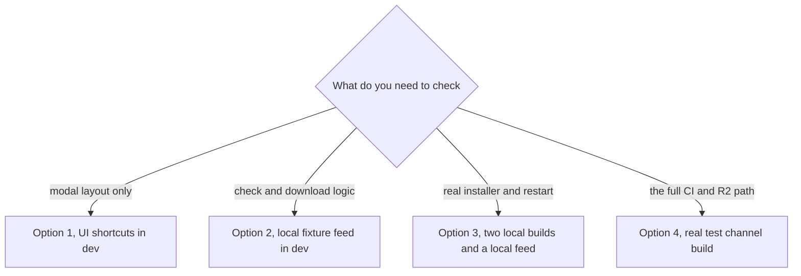

# Testing the Update Flow

This page shows how to test GoDojo's in-app updates (check → "update available" → download → install) without shipping anything to real users. For how releases are built and published, see [RELEASE.md](./RELEASE.md).

Quick background: an installed app reads a small **update feed** file (`latest.yml` on Windows, `latest-mac.yml` on macOS, `latest-linux.yml` on Linux) from a fixed address. If the feed names a different version than the one running, the app looks up that version's release notes on GitHub, then shows an **update modal**. In a normal development run (`npm run dev` / `npm start`) updates are switched off completely. The options below switch them on in controlled ways.

---

## Pick a testing option



| Option | Setup time | What runs for real | What is faked |
| --- | --- | --- | --- |
| 1. UI shortcuts | none | The modal (and, with Ctrl/Cmd+I, the real GitHub notes fetch) | The update itself |
| 2. Local fixture feed | one command | Check, "update available", download with real progress, checksum check | Installer is a dummy file, install is refused. Windows only. |
| 3. Two local builds | ~30 minutes | Everything, including differential download and the real restart and install | Feed is on localhost |
| 4. Test channel | a CI run | Everything, from R2 | Nothing, but see the pre-release gate below |

---

## Option 1: UI shortcuts (dev only)

In a dev run, with any app window focused:

- **Ctrl/Cmd + J** opens the update modal with fake data (version 2.0.8, one note). Good for layout and styling only. No check or download happens.
- **Ctrl/Cmd + I** fetches the newest **production** release notes from GitHub and opens the modal with them. Good for checking how real notes are parsed. It looks at the newest release first and, if that fails, the newest of the last 30 releases that is neither a draft nor a pre-release. If there is none, nothing opens and the log says so.

The app only shows the **Summary**, **What's New**, **Improvements**, **Fixes** and **Technical** sections of a release body, and only bullet lines starting with `- ` or `* `.

---

## Option 2: Local fixture feed (recommended for most work)

This runs the real update code path in a dev build against a fake release served from your own machine.

```bash
npm run dev:updates
```

That starts two things together:

1. `scripts/dev-update-server.mjs`, which creates a fake release in the `dev-update-feed/` folder (a dummy ~12.5 MB "installer", a `latest.yml` with a real checksum, plus small JSON files for the size and the notes) and serves it at `http://127.0.0.1:5178/`.
2. The normal dev app, with `GODOJO_DEV_UPDATES=1` set.

Then open **Settings → Updates → Check for Updates**.

### What you should see

1. The check runs, then the update modal opens for **v999.0.0** with a **12.5 MB** size and the fixture's "What's new" notes.
2. Click to update. The progress bar fills over about 13 seconds. The server deliberately slows the download to 1000 KB/s so you can watch it.
3. Status changes to ready to install.
4. Clicking install shows a message that this is dev test mode and the file is a fixture. That refusal is intentional. Everything before it is the production code path.

In the terminal (and in the debug log, see below) you should see lines like:

```text
[AutoUpdater] DEV UPDATES ENABLED — local feed: http://127.0.0.1:5178/
[AutoUpdater] Checking for update...
[AutoUpdater] Update available: 999.0.0
[AutoUpdater] Dev mode: cleared cached update — next download starts cold
[AutoUpdater] Download speed: ... - Downloaded ...%
[AutoUpdater] Update downloaded: 999.0.0
[AutoUpdater] quitAndInstall refused: dev update-testing mode (dummy installer)
```

### How it works

- `GODOJO_DEV_UPDATES=1` unlocks every update action in a dev run (check, download, install, and the "is this a packaged app" answer the UI uses). It has no effect in a packaged app.
- electron-updater refuses to run in dev unless `dev-app-update.yml` (repo root) exists. The app also forces the updater to use it and points it at the local server.
- The fixture version is 999.0.0, so it always differs from your local version.
- In this mode the app reads notes from the fixture server, not GitHub, so the pre-release gate (Option 4) does not apply.
- Before every download, dev mode clears the updater's cached download, so each click is a real download, not an instant "ready".

### Useful settings

| Setting | What it does |
| --- | --- |
| `node scripts/dev-update-server.mjs --regen --size-mb 25` | Rebuild the dummy installer at a different size (to check the size label) |
| `--throttle-kbps 500` | Slower download (about 25 seconds). `--throttle-kbps 0` turns slowing off. Default is 1000. |
| `GODOJO_DEV_UPDATE_FEED` | Point the dev app at a different feed address |
| `GODOJO_DEV_FEED_PORT` | Run the fixture server on another port. If you change it, also set `GODOJO_DEV_UPDATE_FEED` to match, because `npm run dev:updates` does not. |

The fixture's notes live in the `FIXTURE_NOTES` block of `scripts/dev-update-server.mjs` and are rewritten to `dev-update-feed/dev-feed-notes.json` on every start. `dev-update-feed/` is git-ignored.

### Limits

- **Windows only.** The fixture server only creates `latest.yml`. On macOS and Linux the updater asks for `latest-mac.yml` or `latest-linux.yml`, gets "not found", and reports "up to date". Also, on macOS the update button opens a browser download instead of downloading in the app.
- The install step is always refused.

---

## Option 3: Two local builds and a local feed (Windows)

Use this to test the real installer, the **differential download** (only changed parts are downloaded, using the `.blockmap` file) and the restart-and-install step.

You need the full build toolchain: Rust, and Visual Studio Build Tools with "Desktop development with C++" (the packaging step copies the Visual C++ runtime from there and fails without it; or set `GODOJO_VC_REDIST_DIR`). A `.env` file must exist in the repo root because it is bundled into the app.

1. Set an old version and build. Passing the feed address at build time bakes it into the app, so you do not have to edit anything after installing:
   ```bash
   npm version 0.0.1-test.1 --no-git-tag-version
   npm run build && npm run build:electron && npm run build:native
   npx electron-builder --win --publish never "-c.publish.url=http://localhost:3000/"
   ```
2. Install `release/GoDojo.AI-Setup-0.0.1-test.1.exe`. This is the "old" app.
3. Move the `release/` folder aside, set a newer version (`npm version 0.0.1-test.2 --no-git-tag-version`) and run the same build commands again.
4. Serve the new output as a feed on the port you baked in at step 1: `npx serve release -l 3000` (the folder holds `latest.yml`, the setup `.exe` and its `.blockmap`).
5. In the installed old app, open **Settings → Updates → Check for Updates**. It should offer 0.0.1-test.2 without notes (no GitHub release exists for it), download only the changed parts (the downloaded size shown is smaller than the full installer), and **Restart & Install** should install the new version.
6. Put `package.json`'s version back afterwards.

If you skip the `-c.publish.url` part, the app is built with a placeholder feed address and update checks fail. You can then edit `resources/app-update.yml` inside the installed app to `provider: generic` and `url: http://localhost:3000/`, and restart it.

---

## Option 4: A real test channel build

This tests the whole real path: CI build, R2 upload, the test feed, and the installed app.

### The pre-release gate, and why plain test tags never prompt

Before announcing an update, the app looks up the GitHub release whose tag is `v<new version>`. If that release is a **draft** or **pre-release**, the app treats it as "no update". CI marks every test and beta release as pre-release. So:

| How you publish the second build | What the installed test app does |
| --- | --- |
| Plain test tag, e.g. `v1.0.7-test.2` | **No prompt.** The log shows the gate hiding it. |
| Platform-suffixed tag, e.g. `v1.0.7-test.2-windows` | **Prompt, without notes.** The app looks up `v1.0.7-test.2`, which does not exist, so nothing blocks it. |
| Manual workflow run, channel `test` | **Prompt, without notes.** Manual runs create no GitHub release. |

This is a known issue (see RELEASE.md, Known issues). Until it is fixed, use a platform-suffixed tag or a manual run for the second build when you want to see the prompt.

### Steps (Windows example)

1. Publish the first build and install it from the links on its GitHub release page (they point at R2's `test/` folder):
   ```bash
   git tag v1.0.7-test.1-windows && git push origin v1.0.7-test.1-windows
   ```
2. Publish a second, higher build the same way:
   ```bash
   git tag v1.0.7-test.2-windows && git push origin v1.0.7-test.2-windows
   ```
   or run **Actions → Release — Build & Publish** by hand with tag `v1.0.7-test.2`, platform `windows`, channel `test`.
3. Wait for the run to finish (the feed is published last). Check it is live:
   ```bash
   curl -s "$R2/test/windows/latest.yml" | head -3   # $R2 = the R2_PUBLIC_BASE_URL value
   ```
4. In the installed app, use **Settings → Updates → Check for Updates**, or restart the app (it checks 10 seconds after start, then every 6 hours).
5. Expect the update modal, a download, and **Restart & Install**.

On macOS the update button opens the backend's `/download/macos` link in the browser instead of downloading in the app. According to the app code, that link serves the active **production** installer, so Option 4 is mainly useful on Windows and on Linux AppImage.

### Where to find the log

A packaged app writes all main-process log lines to **`godojo_debug.log` in your Documents folder** (rotated to `godojo_debug.log.1` at 10 MB). Useful lines:

| Log line contains | Meaning |
| --- | --- |
| `[AutoUpdater] Channel: latest` | Updater started |
| `[AutoUpdater] Checking for update...` | A check began |
| `[AutoUpdater] Update available: <version>` | The feed has a different version |
| `[ReleaseNotesManager] HTTP 404 for .../releases/tags/v<version>` | No GitHub release with that tag. Normal for platform tags and manual runs. |
| `is a pre-release (internal test build) — NOT announcing to users` | The gate hid the update |
| `[AutoUpdater] Update not available: <version>` | Feed version equals the running version |
| `No published release found on the update feed — treating as up to date` | The feed file returned 404 |
| `Background check failed — staying quiet` | Automatic check failed (offline, etc.), will retry |
| `[AutoUpdater] Update downloaded: <version>` | Ready to install |

---

## Troubleshooting

| Symptom | Likely cause | What to check |
| --- | --- | --- |
| Update never offered on a test or beta install | The pre-release gate | Look for "NOT announcing to users" in the log. Publish the next build with a platform-suffixed tag or a manual run (Option 4). |
| Update never offered, no gate line | Feed has the same version, or the feed was not published | Open `<R2_PUBLIC_BASE_URL>/<channel>/<os>/latest.yml` and compare `version:` with **Settings → Updates**. Check the publish job finished its last step. |
| Wrong channel | Each build only reads the feed for the channel it was built for | The channel comes from the tag (RELEASE.md, section 2). For example `v1.0.7-windows` is a **test** build, not production. Reinstall from the right channel. |
| "Up to date" but you expected an update, log says "No published release found" | The feed file is missing (404) | The feed address is `<R2_PUBLIC_BASE_URL>/<channel>/<windows or macos or linux>/latest*.yml`. A local build without `-c.publish.url` points at a placeholder address. |
| Feed 404 in dev with `npm run dev:updates` on macOS or Linux | The fixture only serves `latest.yml` | Use Windows for Option 2. |
| Version order looks wrong (e.g. `test-10` treated as older than `test-9`) | Dash-separated pre-release parts are compared as text | Use dots: `-test.10`. |
| An **older** version is offered after a rollback | The app allows downgrades (setting the updater channel turns it on) | Expected with today's code. See RELEASE.md, Known issues. Ship a higher version to move people forward. |
| "Check for Updates" spins in dev, log says `Skip checkForUpdates because application is not packed` | Dev run without `GODOJO_DEV_UPDATES=1` | Start with `npm run dev:updates`. |
| Dev download jumps straight to "ready" | Cached download reused | Should not happen any more: dev mode clears the cache before each download (look for "cleared cached update"). |
| Download button says the portable version or the .deb cannot update | Those packages cannot self-update | Expected. Use the NSIS installer or the AppImage. |
| Check shows an error after 20 seconds | No result came back from the updater | Look for `[AutoUpdater] Error:` in the log for the real cause. |
